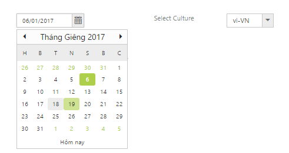

# Globalization

Syncfusion Components has been provided with the built-in globalization support, so that it will be able to adapt for the culture-specific number and date format based on the defined **locale** property. Globalization values will be automatically used when locale property is set with locale value (e.g.) en-US. By default, the **en-US** locale is currently being used in all the Syncfusion components.

To globalize the Syncfusion components into a particular culture, it is necessary to refer to the following specified scripts in your application.

* **ej.globalize.min.js** is mandatory for processing specific source-side actions globally, in this we are having methods to set the culture.
* Culture-specific script files (e.g., ej.culture.de-DE.min.js) contains specific culture that you need to adapt any of our Syncfusion control.

I> **ej.globalize.min.js** library avails as built-in within ej.web.all.min.js file, therefore it is not necessary to externally refer it in your application (applicable for version 13.4.0.53 and higher). For version lower than 13.4.0.53, refer to the jQuery.globalize.min.js along with ej.web.all.min.js.

<table>
<tr>
<td>
<b>(installed location)</b>\Syncfusion\Essential Studio\{{ site.releaseversion }}\JavaScript\assets\scripts\i18n
</td>
</tr>
<tr>
<td>
<b>For example,</b> If you have installed the Essential Studio package within <b>C:\Program Files (x86)</b>, navigate to the following location.
 
<b>C:\Program Files (x86)</b>\Syncfusion\Essential Studio\{{ site.releaseversion }}\JavaScript\assets\scripts\i18n
</td>
</tr>
</table>

N>   To translate our control content from default English to any of the culture like German language, you should refer to the **ej.culture.de-DE.min.js** file in your application, after the reference of ej.web.all.min.js file.
N>   Seven culture-specific script files are available in the following specified location. For all other culture files, please download from the [GitHub](https://github.com/syncfusion/ej-global/tree/master/i18n) location.

## Globalizing the Syncfusion components

Syncfusion components like DatePicker that supports globalization to display the day name, month name, and date format for each culture, based on the specified **locale** property. Usually, the culture codes are defined in short forms like **en-US** for English culture, **de-DE** for German culture, **fr-FR** for French culture, and so on. The following sample code shows how to define the locale property for **DatePicker** control.



    <ej:DatePicker ID="datelocalization" Value="05/28/2016" Locale="de-DE" ButtonText="heute" WatermarkText="Datum auswählen" runat="server"></ej:DatePicker>



## To change the locale property dynamically in DatePicker control

Define a dropdownlist control additionally in your HTML page along with the DatePicker control, to hold the required culture codes. When the user selects a particular culture code option from the dropdownlist, the datepicker will get localized appropriately based on the dynamic selection made that is depicted in the following code.

N> In the following example, copy the culture files of **vi-VN** and **fr-FR** into the **scripts** folder of your application and refer it in the head section along with the other CSS and script references, so that the **locale** of the datepicker switches between the selected culture appropriately.



    <ej:DatePicker ID="datelocalization" Value="05/28/2016" Locale="en-US" ButtonText="Today" HeaderFormat="MMMM yyyy" runat="server"></ej:DatePicker>



Rendered the DropDownList to showcase the different cultures as follows:



    <ej:DropDownList runat="server" ID="culture" TargetID="culturelist" ClientSideOnChange="onChange" Width="100px" SelectedItemIndex="0"></ej:DropDownList>
    

        <ul>
            <li>en-US</li>
            <li>vi-VN</li>
            <li>fr-FR</li>
        </ul>
    



Upon changing the cultures in DropDownList, the DatePicker control will be reflected based on the option in DropDownList.



    



N> Sever Culture-specific script files are available in the following specified location. For all other culture files, please download from the GitHub location.
N> <installed location>\ Syncfusion\Essential Studio\13.1.0.21\JavaScript\assets\external\cultures\minified
N> For example, If you have installed the Essential Studio package within C:\Program Files (x86), navigate to the following location.
N> C:\Program Files (x86)\Syncfusion\Essential Studio\13.1.0.21\JavaScript\assets\external\cultures\minified

Copy the required file globalize.culture.fr-FR.min.js into the Scripts folder of your application and then refer it along with the other script and CSS references in the head section of Site.Master page as shown in the following.



    

    

    



