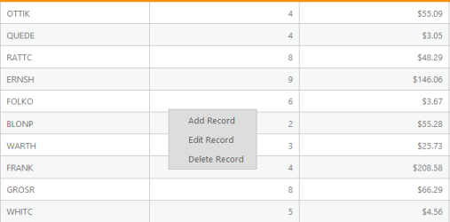
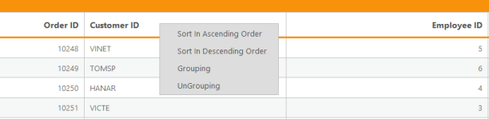
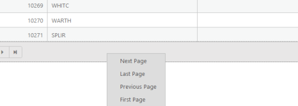

# Context Menu

Context Menu is one of the user interaction controls related with Grid. It is handy to use the Context Menu to trigger more actions. The default Context Menu items created for Grid are:

1. Header
1. Sort In Ascending Order
2. Sort In Descending Order
3. Grouping
4. UnGrouping
2. Content
1. Add Record
2. Edit Record
3. Delete Record                  
3. Footer 
1. Next Page     
2. Last Page
3. Previous Page
4. First Page

## Context Menu action

To enable Context Menu in Grid use EnableContextMenu property in ContextMenuSettings at Grid initialize. The following code example illustrates you on how to set Context Menu.


[ASPX]

        &lt;ej:Grid ID="Grid" runat="server" DataSourceID="ObjectData" AllowScrolling="True" AllowGrouping="True" AllowSorting="True" AllowPaging="True"  &gt;

            &lt;Columns&gt;

                &lt;ej:Column Field="OrderID" HeaderText="Order ID" TextAlign="Right"   /&gt;

                &lt;ej:Column Field="CustomerID" HeaderText="Customer ID" /&gt;

                &lt;ej:Column Field="EmployeeID" HeaderText="Employee ID " TextAlign="Right"   /&gt;

                &lt;ej:Column Field="ShipCity" HeaderText="Ship City" /&gt;

            &lt;/Columns&gt;

            &lt;ScrollSettings Height="300" Width="900" &gt;&lt;/ScrollSettings&gt;

            &lt;EditSettings RowPosition="Bottom” AllowAdding="True” AllowEditing="True” AllowDeleting="True” &gt;&lt;/EditSettings&gt;

&lt;ContextMenuSettings EnableContextMenu="true” &gt;&lt;/ContextMenuSettings&gt;

        &lt;/ej:Grid&gt;


[CS]

using System;

using System.Collections.Generic;

using System.Linq;

using System.Web;

using System.Web.UI;

using System.Web.UI.WebControls;

namespace WebSampleBrowser.Grid

{

    public partial class RowPosition: System.Web.UI.Page

    {

        List<Orders> order = new List<Orders>();

        protected void Page_Load(object sender, EventArgs e)

        {

            BindDataSource();

        }

        private void BindDataSource()

        {

            int code = 10000;

            for (int i = 1; i < 10; i++)

            {

                order.Add(new Orders(code + 1, i + 0, "Berlin", 2.3 * i));

                order.Add(new Orders(code + 2, i + 2, "Madrid", 3.3 * i));

                order.Add(new Orders(code + 3, i + 1, "Cholchester", 4.3 * i));

                order.Add(new Orders(code + 4, i + 3, "Marseille", 5.3 * i));

                order.Add(new Orders(code + 5, i + 4, "London", 6.3 * i));

                code += 5;

            }

            this.OrdersGrid.DataSource = order;

            this.OrdersGrid.DataBind();

        }

        [Serializable]

        public class Orders

        {

            public Orders()

            {

            }

            public Orders(long OrderId, int EmployeeId, string CustomerId, double Freight)

            {

                this.OrderID = OrderId;

                this.CustomerID = CustomerId;

                this.EmployeeID = EmployeeId;

                this.Freight = Freight;

            }

            public long OrderID { get; set; }

            public int CustomerID { get; set; }

            public string EmployeeID { get; set; }

            public double Freight { get; set; }

        }

    }

}


The following output is displayed as a result of the above code example.

Content

{:.image }

_Figure 112: Context Menu in content_

Header

{:.image }

_Figure 113: Context Menu in Header_

Footer

{:.image }

_Figure 114: Context Menu in Footer_

