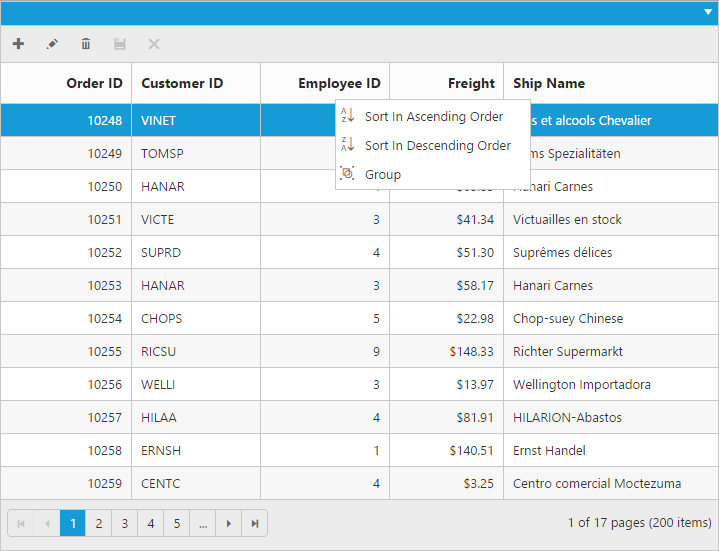
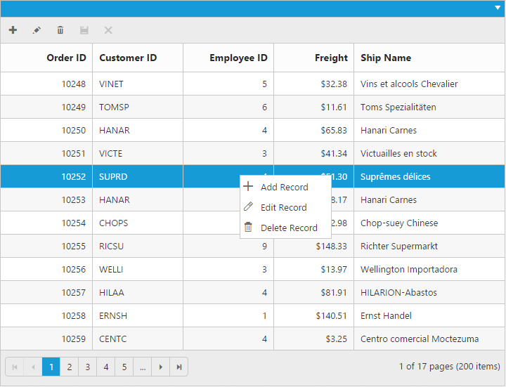
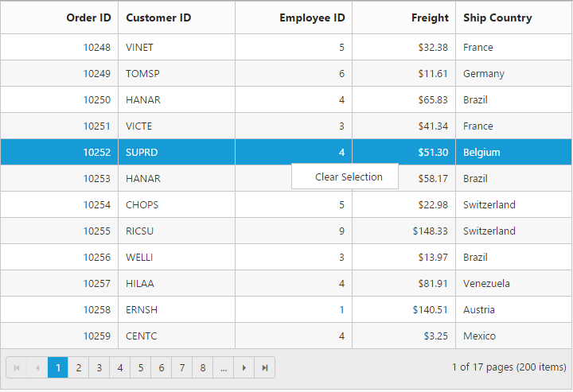
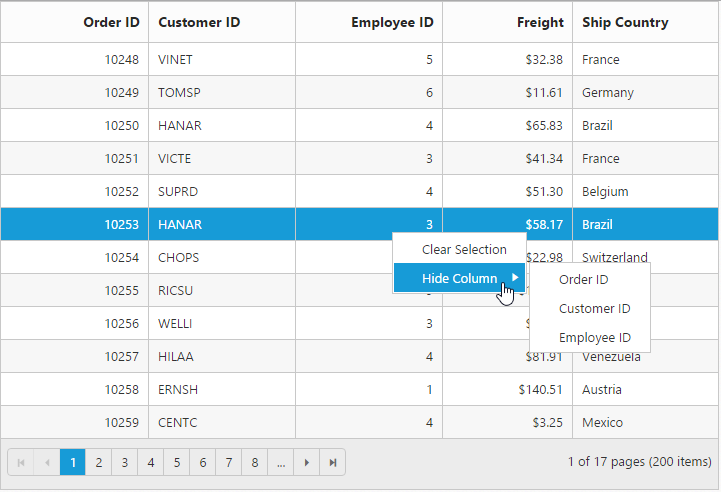

# Context Menu

Context menu is used to improve user action with Grid using popup menu. It can be shown by defining `EnableContextMenu` property of `ContextMenuSettings` as true. Context menu has option to add default items in `ContextMenuItems` property of `ContextMenuSettings` and customized items in `CustomContextMenuItems` property of `ContextMenuSettings`.

## Default Context Menu items

Please find the below table for default context menu items and its actions.

 <table>
        <tr>
            <th>
                Section
            </th>
            <th>
                Context menu items
            </th>
            <th>
                Action
            </th>
        </tr>
        <tr>
            <td rowspan="4">
                Header
            </td>
            <td>
                Sort in Ascending Order
            </td>
            <td>
                Sort column in Ascending order
            </td>
        </tr>
        <tr>
            <td>
                Sort in Descending Order
            </td>
            <td>
                Sort column in Descending order
            </td>
        </tr>
        <tr>
            <td>
                Group
            </td>
            <td>
                Group the current column
            </td>
        </tr>
        <tr>
            <td>
                Ungroup
            </td>
            <td>
                Ungroup the current column if already grouped
            </td>
        </tr>
        <tr>
            <td rowspan="5">
                Body
            </td>
            <td>
                Add Record
            </td>
            <td>
                Start Add new record
            </td>
        </tr>
        <tr>
            <td>
                Edit Record
            </td>
            <td>
                Start Edit in current record
            </td>
        </tr>
        <tr>
            <td>
                Delete Record
            </td>
            <td>
                Delete the current record
            </td>
        </tr>
        <tr>
            <td>
                Save
            </td>
            <td>
                Save the record if Add/Edit record is started
            </td>
        </tr>
        <tr>
            <td>
                Cancel
            </td>
            <td>
                Cancel Added/Edited state
            </td>
        </tr>
        <tr>
            <td rowspan="4">
                Pager
            </td>
            <td>
                Next Page
            </td>
            <td>
                Go to Next Page
            </td>
        </tr>
        <tr>            
            <td>
                Last Page
            </td>
            <td>
                Go to Last page
            </td>
        </tr>
        <tr>
            <td>
                Previous page
            </td>
            <td>
                Go to previous page
            </td>
        </tr>
        <tr>
            <td>
                First page
            </td>
            <td>
                Go to first page
            </td>
        </tr>
 </table>
 

  <ej:Grid ID="Grid" runat="server" AllowPaging="true" AllowSorting="true" AllowGrouping="true">
        <EditSettings AllowEditing="true" AllowAdding="true" AllowDeleting="true"></EditSettings>
          <ToolbarSettings ShowToolbar="true" ToolbarItems="add,edit,delete,update,cancel"></ToolbarSettings>
           <ContextMenuSettings EnableContextMenu="true"></ContextMenuSettings>
            <Columns>
                <ej:Column Field="OrderID" IsPrimaryKey="true" HeaderText="Order ID" Width="90" TextAlign="Right"/>
                <ej:Column Field="CustomerID" HeaderText="Customer ID" Width="90"/>
                <ej:Column Field="EmployeeID" HeaderText="Employee ID" Width="80" EditType="Dropdown" TextAlign="Right"/>
                <ej:Column Field="Freight" HeaderText="Freight" EditType="Numeric" Format="{0:C}" TextAlign="Right"  Width="80">
                    <NumericEditOptions DecimalPlaces="2"></NumericEditOptions>
                </ej:Column>    
                <ej:Column Field="ShipName" HeaderText="Ship Name" Width="150"/>
            </Columns>   
        </ej:Grid>          
         




    namespace WebSampleBrowser.Grid
        {
            public partial class Default : Page
              { 
                 List<Orders> order = new List<Orders>();
                 protected void Page_Load(object sender, EventArgs e)
                 {
                    BindDataSource();
                 }
                 private void BindDataSource()
                 {   
                    int orderId = 10643;
                    int empId = 0;
                    for (int i = 1; i < 10; i++)
                    {
                        order.Add(new Orders(orderId + 1, "ALFKI", empId + 1, 32.38, "Alfreds Futterkiste "));
                        order.Add(new Orders(orderId + 2, "ANATR", empId + 2, 11.61, "Ana Trujillo Emparedados y helados"));
                        order.Add(new Orders(orderId + 3, "ANTON", empId + 3, 45.34, "Antonio Moreno Taquería"));
                        order.Add(new Orders(orderId + 4, "AROUT", empId + 4, 37.28, "Around the Horn"));
                        order.Add(new Orders(orderId + 5, "BERGS", empId + 5, 67.00, "Berglunds snabbköp"));
                        order.Add(new Orders(orderId + 6, "BLONP", empId + 6, 23.32, "Blondel père et fils"));
                        orderId += 6;
                        empId += 6;
                    }
                    this.Grid.DataSource = order;
                    this.Grid.DataBind();
                 }
                 [Serializable]
                 public class Orders
                 {
                    public Orders()
                    {

                    }   
                    public Orders(long OrderId, string CustomerId, int EmployeeId ,int Freight,string ShipName)
                    {
                        this.OrderID = OrderId;
                        this.CustomerID = CustomerId;
                        this.EmployeeID = EmployeeId;
                        this.Freight= Freight;
                        this.ShipName = ShipName;
                    }
                    public long OrderID { get; set; }
                    public string CustomerID { get; set; }
                    public int EmployeeID { get; set; }
                    public string Freight{ get; set; }
                    public string ShipName{ get; set; }
                 }
              }
        } 

    
    
    

{:caption}

Context menu at header

{:caption}

Context menu at body

{:caption}

Context menu at pager

N> `AllowGrouping`, `AllowSorting` should be enabled to perform default context menu actions in Grid header. `AllowEditing`, `AllowDeleting` and `AllowAdding` should be enabled to perform default actions in body.

## Custom Context Menu

Custom context menu is used to create your own menu item and its action. To add customized context menu items, you need to use  `CustomContextMenuItems` property of `ContextMenuSettings` and to bind required actions for this, use `ContextClick` event.





    <asp:Content ID="ControlContent" runat="server" ContentPlaceHolderID="ControlsSection">
        

            <ej:Grid ID="Grid" runat="server" AllowPaging="true" AllowSorting="true" AllowGrouping="true">
                <ClientSideEvents ContextClick="contextClick" />
                <ContextMenuSettings EnableContextMenu="true" DisableDefaultItems="true">
                    <CustomContextMenuItem>
                        <ej:CustomContexMenuItems Id="clear" Text="Clear Selection" /> 
                    </CustomContextMenuItem>
                </ContextMenuSettings>
                <Columns>
                    <ej:Column Field="OrderID" IsPrimaryKey="true" HeaderText="Order ID" Width="90" TextAlign="Right"/>
                    <ej:Column Field="CustomerID" HeaderText="Customer ID" Width="90"/>
                    <ej:Column Field="EmployeeID" HeaderText="Employee ID" Width="80" EditType="Dropdown" TextAlign="Right"/>
                    <ej:Column Field="Freight" HeaderText="Freight" EditType="Numeric" Format="{0:C}" TextAlign="Right"  Width="80">
                        <NumericEditOptions DecimalPlaces="2"></NumericEditOptions>
                    </ej:Column>    
                    <ej:Column Field="ShipName" HeaderText="Ship Name" Width="150"/>
                </Columns>   
            </ej:Grid> 
        
  
    </asp:Content>
    
    <asp:Content ID="ScriptContent" runat="server" ContentPlaceHolderID="ScriptSection">    
         
    </asp:Content>      
         




    namespace WebSampleBrowser.Grid
        {
            public partial class Default : Page
              { 
                 List<Orders> order = new List<Orders>();
                 protected void Page_Load(object sender, EventArgs e)
                 {
                    BindDataSource();
                 }
                 private void BindDataSource()
                 {   
                    int orderId = 10643;
                    int empId = 0;
                    for (int i = 1; i < 10; i++)
                    {
                        order.Add(new Orders(orderId + 1, "ALFKI", empId + 1, 32.38,  "Germany"));
                        order.Add(new Orders(orderId + 2, "ANATR", empId + 2, 11.61,  "Mexico"));
                        order.Add(new Orders(orderId + 3, "ANTON", empId + 3, 45.34,  "Mexico"));
                        order.Add(new Orders(orderId + 4, "AROUT", empId + 4, 37.28,  "UK"));
                        order.Add(new Orders(orderId + 5, "BERGS", empId + 5, 67.00,  "Sweden"));
                        order.Add(new Orders(orderId + 6, "BLONP", empId + 6, 23.32,  "France"));
                        orderId += 6;
                        empId += 6;
                    }
                    this.Grid.DataSource = order;
                    this.Grid.DataBind();
                 }
                 [Serializable]
                 public class Orders
                 {
                    public Orders()
                    {

                    }   
                    public Orders(long OrderId, string CustomerId, int EmployeeId ,int Freight,string ShipName)
                    {
                        this.OrderID = OrderId;
                        this.CustomerID = CustomerId;
                        this.EmployeeID = EmployeeId;
                        this.Freight= Freight;
                        this.ShipName = ShipName;
                    }
                    public long OrderID { get; set; }
                    public string CustomerID { get; set; }
                    public int EmployeeID { get; set; }
                    public string Freight{ get; set; }
                    public string ShipName{ get; set; }
                 }
              }
        } 

    
    

## Sub Context Menu

Sub context menu is used to add customized sub menu to the custom context menu item. To add a sub context menu, you need to use `SubContextMenu` property of `ContextMenuSettings` and to bind required actions for this, use `ContextClick` event.





    <asp:Content ID="ControlContent" runat="server" ContentPlaceHolderID="ControlsSection">
        

            <ej:Grid ID="Grid" runat="server" AllowPaging="true" AllowSorting="true" AllowGrouping="true">
                <ClientSideEvents ContextClick="contextClick" />
                <ContextMenuSettings EnableContextMenu="true" DisableDefaultItems="true">
                <CustomContextMenuItem>
                    <ej:CustomContexMenuItems Id="clear" Text="Clear Selection" />
                    <ej:CustomContexMenuItems Id="hide" Text="Hide Column" />
                </CustomContextMenuItem>
                <SubContextMenu>
                    <ej:SubContextMenu ContextMenuItem="hide" SubMenu="Order ID,Customer ID,Employee ID"  />
                </SubContextMenu>
                </ContextMenuSettings>
                <Columns>
                    <ej:Column Field="OrderID" IsPrimaryKey="true" HeaderText="Order ID" Width="90" TextAlign="Right"/>
                    <ej:Column Field="CustomerID" HeaderText="Customer ID" Width="90"/>
                    <ej:Column Field="EmployeeID" HeaderText="Employee ID" Width="80" TextAlign="Right"/>
                    <ej:Column Field="Freight" HeaderText="Freight" Format="{0:C}" TextAlign="Right"  Width="80">
                        <NumericEditOptions DecimalPlaces="2"></NumericEditOptions>
                    </ej:Column>    
                    <ej:Column Field="ShipCountry" HeaderText="Ship Country" Width="90"/>
                </Columns>   
            </ej:Grid> 
        
  
    </asp:Content>
    
    <asp:Content ID="ScriptContent" runat="server" ContentPlaceHolderID="ScriptSection">    
           
    </asp:Content>    
         




    namespace WebSampleBrowser.Grid
        {
            public partial class Default : Page
              { 
                 List<Orders> order = new List<Orders>();
                 protected void Page_Load(object sender, EventArgs e)
                 {
                    BindDataSource();
                 }
                 private void BindDataSource()
                 {   
                    int orderId = 10643;
                    int empId = 0;
                    for (int i = 1; i < 10; i++)
                    {
                        order.Add(new Orders(orderId + 1, "ALFKI", empId + 1, 32.38, "Alfreds Futterkiste "));
                        order.Add(new Orders(orderId + 2, "ANATR", empId + 2, 11.61, "Ana Trujillo Emparedados y helados"));
                        order.Add(new Orders(orderId + 3, "ANTON", empId + 3, 45.34, "Antonio Moreno Taquería"));
                        order.Add(new Orders(orderId + 4, "AROUT", empId + 4, 37.28, "Around the Horn"));
                        order.Add(new Orders(orderId + 5, "BERGS", empId + 5, 67.00, "Berglunds snabbköp"));
                        order.Add(new Orders(orderId + 6, "BLONP", empId + 6, 23.32, "Blondel père et fils"));
                        orderId += 6;
                        empId += 6;
                    }
                    this.Grid.DataSource = order;
                    this.Grid.DataBind();
                 }
                 [Serializable]
                 public class Orders
                 {
                    public Orders()
                    {

                    }   
                    public Orders(long OrderId, string CustomerId, int EmployeeId ,int Freight,string ShipCountry)
                    {
                        this.OrderID = OrderId;
                        this.CustomerID = CustomerId;
                        this.EmployeeID = EmployeeId;
                        this.Freight= Freight;
                        this.ShipCountry = ShipCountry;
                    }
                    public long OrderID { get; set; }
                    public string CustomerID { get; set; }
                    public int EmployeeID { get; set; }
                    public string Freight{ get; set; }
                    public string ShipCountry{ get; set; }
                 }
              }
        } 

    
 

    

