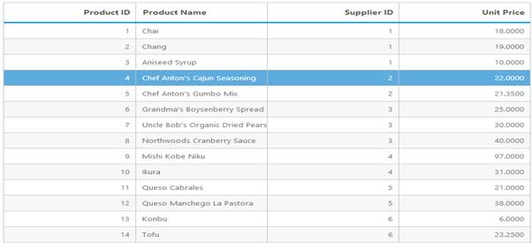

# Data Adaptors

DataManager consists of three concepts, commonly called as adaptors, that are used to manipulate data. There are four types of adaptors in DataManager. They are

* OData Adaptor
* Cache Adaptor

## OData Adaptor

Nowadays oData is a very useful technique in consuming data. You can use oData protocol through DataManager’s ODataadaptor. The following code example demonstrates how you can use oDataadaptor with Grid.



<ej:Grid ID="Grid" runat="server">

<DataManager URL="http://mvc.syncfusion.com/Services/Northwnd.svc/Products" />

    <Columns>

        <ej:Column Field="ProductID" HeaderText="Product ID" TextAlign="Right" />

        <ej:Column Field="ProductName" HeaderText="Product Name" />

        <ej:Column Field="SupplierID" HeaderText="Supplier ID" TextAlign="Right" />

        <ej:Column Field="UnitPrice" HeaderText="Unit Price" TextAlign="Right" />

    </Columns>

</ej:Grid>



The following screenshot is the result of the above code example.

 

## Cache Adaptor

Cache Adaptor is a technique used to cache multiple page data by using the property EnableCaching. You can provide the number of pages that is required to cache in single request using CachingPageSize property. It enables you to reduce multiple request to server. You can use any type of adaptor with multiple page caching by using cache adaptor. The following code illustrates how to create cache adaptor and use it with grid.



<ej:Grid ID="OrdersGrid" runat="server" AllowPaging="True">

            <DataManager URL="http://mvc.syncfusion.com/Services/Northwnd.svc/Orders/" EnableCaching="true" CachingPageSize="10" TimeTillExpiration="120000"></DataManager>

            <Columns>

                <ej:Column Field="OrderID" TextAlign="Right” HeaderText="Order ID"/>

                <ej:Column Field="CustomerID” HeaderText="Customer ID"/>

                <ej:Column Field="EmployeeID TextAlign="Right”HeaderText="Emplyee ID"/>

                <ej:Column Field="Freight" TextAlign="Right" />

                <ej:Column Field="ShipCity" HeaderText="Ship City"/>

                <ej:Column Field="OrderDate"HeaderText="Order Date"TextAlign="Right" />

             </Columns>

            <PageSettings PageSize="9" />

        </ej:Grid>    





public partial class CachingAdaptor : System.Web.UI.Page

    {

        protected void Page_Load(object sender, EventArgs e)

        {

        }

    }



The following screenshot is the result of the above code example.

