# Data Binding

The `DataSource` Grid property allows to bind datasource as the instance of one of the following types.

*	ASP.Net DataSource controls.
*	Collection that implements IEnumerable or IEnumerable<T>.
*	DataTable.
*	ITypedList.
*	REST Service URL as string.
*	Table – Allows to bind HTML Table and it accepts table template script “ID”.
*	ORM components such as Entity Framework/Linq to SQL.

We can bind datasource in one of the following two ways
*	Using `DataManager` nested property of Grid Control in View Page and code behind.
*	Using `DataSource` Grid property in Code behind.

N> 1. To update the dataSource after Grid rendered, use `dataSource` method of Grid. Refer to this [link](https://help.syncfusion.com/aspnet/grid/how-to/set-dynamic-datasource-to-grid) for more information.
N> 2. DateTime values, retrieved from server-end or database, will be converted based on the local time zone. To avoid the local time zone conversion, refer this knowledge base [link](https://www.syncfusion.com/kb/8613/how-to-convert-dates-to-utc-format).

In the following section, let us see on how to bind various datasources to Grid using `DataSource` and `DataManager` API.

## Binding with Datasource controls
 
 The Grid can be bound with major ASP.NET DataSource controls to display data from various data source. Some of the main datasource controls which works in conjunction with Grid are:

*	SqlDataSource
*	ObjectDataSource
*	XmlDataSource 
*	DataManager control

### SqlDataSource

The SqlDataSource enables you to access data that is located in a relational database. The SqlDataSource is intended to replace the ADO.NET code you would normally write in a page to create a connection and command to query a database. The Id of the SqlDataSource control should be assigned to the `DataSourceID` to bind with Grid control.

N> The Grid will fetch all data based on the SELECT command of the SqlDataSource control in read-only mode.
The following code example describes the above behavior.




<ej:Grid runat="server" ID="Grid" DataSourceID="SqlData" AllowPaging="true">
            <Columns>
                <ej:Column Field="OrderID" HeaderText="Order ID" TextAlign="Right" />
                <ej:Column Field="CustomerID" HeaderText="Customer ID" />
                <ej:Column Field="EmployeeID" HeaderText="Employee ID" TextAlign="Right"/>
                <ej:Column Field="Freight" HeaderText="Freight" Format="{0:C2}" TextAlign="Right" />
            </Columns>          
</ej:Grid>
<asp:SqlDataSource ID="SqlData" runat="server" ConnectionString="<%$ ConnectionStrings:NORTHWNDConnectionString %>" SelectCommand="SELECT * FROM [Orders]">
</asp:SqlDataSource>




The following output is displayed as a result of the above code example.

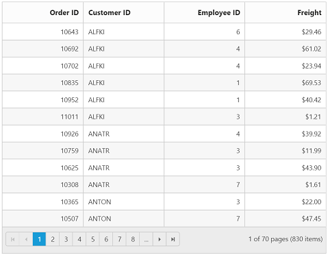

 
Refer to this [link](https://msdn.microsoft.com/en-us/library/dz12d98w.aspx) for more information on SqlDataSource.


### SqlDataSource with LoadOnDemand

SqlDataSource control support has been added with on-demand data loading for paging, sorting, and filtering in grid. Each of these grid actions is performed on the server side and the result is returned to the client. This has been achieved by enabling the property as `EnableLoadOnDemand` in grid.

N> The default value for `EnableLoadOnDemand` property will be false.
The following code example describes the above behavior.




<ej:Grid ID="FlatGrid" runat="server" DataSourceID="SqlData" EnableLoadonDemand="true" AllowSorting="True" AllowPaging="True">
    <Columns>
        <ej:Column Field="OrderID" HeaderText="Order ID" IsPrimaryKey="True" TextAlign="Right" Width="75" />
        <ej:Column Field="Freight" HeaderText="Freight" TextAlign="Right" Width="75" Format="{0:C}" />
        <ej:Column Field="EmployeeID" HeaderText="Employee ID" Width="110" />
        <ej:Column Field="CustomerID" HeaderText="Customer ID" Width="110" />
    </Columns>
</ej:Grid>
<asp:SqlDataSource ID="SqlData" runat="server" ConnectionString="<%$ ConnectionStrings:NORTHWNDConnectionString %>" SelectCommand="SELECT * FROM [Orders]">
</asp:SqlDataSource>




The following output is displayed as a result of the above code example.

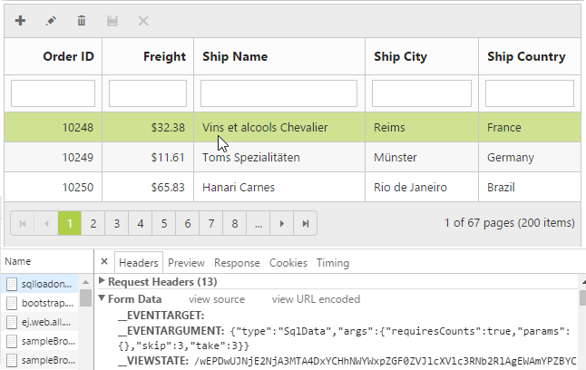
 

### ObjectDataSource

The Grid can be bound with ObjectDataSource control as the datasource interface. The ObjectDataSource control allows developers to structure their applications using this traditional three-tiered architecture and still take advantage of the ease-of-use benefits of the declarative data binding model in ASP.NET.

The Id of the ObjectDataSource control should be assigned to the `DataSourceID` to bind with Grid control and specify the `TypeName` and `SelectMethod` properties of the ObjectDataSource to fetch the data.

N> The Grid will fetch all data based on the `SelectMethod` of the ObjectDataSource control in read-only mode.

The following code example describes the above behavior.

 

<ej:Grid ID="EmployeesGrid" runat="server" DataSourceID="ObjectData" AllowSorting="true">
            <Columns>                
                <ej:Column Field="EmployeeID" HeaderText="Employee ID" TextAlign="Right" Width="100" />
                <ej:Column Field="FirstName" HeaderText="First Name" Width="100" />
                <ej:Column Field="LastName" HeaderText="Last Name" Width="100" />
                <ej:Column Field="Title" HeaderText="Title" Width="100" />
            </Columns>
 </ej:Grid>

<asp:ObjectDataSource runat="server" ID="ObjectData" TypeName="EmployeeDetails" SelectMethod="GetRecords">
</asp:ObjectDataSource>

 

        
public class EmployeeDetails
{
    [DataObjectMethod(DataObjectMethodType.Select)]
    public List<Employee> GetRecords()
    {

        List<Employee> list = new List<Employee>();
        list.Add(new Employee(001, "JohnDavid", "UK", "Nancy", "SalesRepresentative"));
        list.Add(new Employee(002, "Tom", "USA", "Andrew", "SalesManager"));
        list.Add(new Employee(003, "Bretney", "USA", "Janet", "SalesManager"));
        list.Add(new Employee(004, "Jessy", "UK", "Margaret", "SalesCoordinator"));
        list.Add(new Employee(005, "Bruch", "USA", "Peacock", "VicePresident"));
        list.Add(new Employee(006, "Johny", "USA", "Callahan", "SalesRepresentative"));
        return list;

    }
}

[Serializable]
public class Employee
{   
    public Employee(int _empID, string _firstName, string _country, string _lastname, string _title)
    {
        this.EmployeeID = _empID;
        this.FirstName = _firstName;
        this.LastName = _lastname;
        this.Title = _title;
    }

    public int EmployeeID { get; set; }
    public string FirstName { get; set; }
    public string LastName { get; set; }
    public string Title { get; set; }    
}

  

The following output is displayed as a result of the above code example.

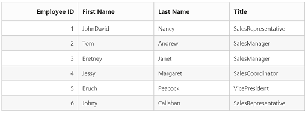

 
Refer to this [link](https://msdn.microsoft.com/en-us/library/9a4kyhcx.aspx) for more information on ObjectDataSource.


### XmlDataSource
	
The XmlDataSource can be bound with Grid control to display the complex XML file data.
To bind XmlDataSource in Grid, assign the Id of the data source control to the `DataSourceID` of the Grid and specify the XML file in the `DataFile` property of the XmlDataSource control.

The following code example describes the above behavior.

 

<ej:Grid runat="server" ID="Grid" DataSourceID="OrderData">
            <Columns>
                <ej:Column Field="OrderID" HeaderText="Order ID" TextAlign="Right" />
                <ej:Column Field="CustomerID" HeaderText="Customer ID" />
                <ej:Column Field="EmployeeID" HeaderText="Employee ID"/>
                <ej:Column Field="Freight" HeaderText="Freight" Format="{0:C2}" TextAlign="Right" />
            </Columns>          
</ej:Grid>

<asp:XmlDataSource DataFile="~/App_Data/Orders.xml" ID="OrderData" runat="server">
</asp:XmlDataSource>

<?xml version="1.0" encoding="utf-8" ?>
<Orders>
  <Order OrderID="10248" CustomerID="VINET" EmployeeID="5" Freight="32.38"/> 
  <Order OrderID="10249" CustomerID="TOMPS" EmployeeID="7" Freight="28.5"/>
  <Order OrderID="10250" CustomerID="HANAR" EmployeeID="8" Freight="54.4"/>
  <Order OrderID="10251" CustomerID="VICTE" EmployeeID="3" Freight="43"/>
  <Order OrderID="10252" CustomerID="BERGS" EmployeeID="1" Freight="99.34"/>
</Orders>

  

The following output is displayed as a result of the above code example.

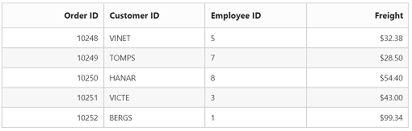

  
Refer to this [link](https://msdn.microsoft.com/en-us/library/494y92bs.aspx) for more information on XmlDataSource


### DataManager
	
Essential ASP.NET DataManager control can be used as interface between the data source and the Grid control. It can interact with both in-memory data and the remote service. The Id of the DataManager control should be assigned to the `DataManagerID` to bind with Grid control.

The following code example describes the above behavior.

 

<ej:DataManager runat="server" ID="DataManager" URL="Default.aspx/DataSource" Adaptor="UrlAdaptor">
</ej:DataManager>
        
<ej:Grid runat="server" ID="Grid" AllowPaging="true" DataManagerID="DataManager">
            <Columns>
                <ej:Column Field="OrderID" HeaderText="Order ID" TextAlign="Right" />
                <ej:Column Field="CustomerID" HeaderText="Customer ID" />
                <ej:Column Field="EmployeeID" HeaderText="Employee ID"/>
                <ej:Column Field="Freight" HeaderText="Freight" Format="{0:C2}" TextAlign="Right" />
            </Columns>          
</ej:Grid>
 

namespace Grid
{
    using Syncfusion.JavaScript;
    using Syncfusion.JavaScript.DataSources;
    
     public partial class _Default : Page
    { 

        protected void Page_Load(object sender, EventArgs e)
        {           
        }

        [WebMethod]
        [ScriptMethod(ResponseFormat = ResponseFormat.Json)]
        public static object DataSource(int skip, int take)
        {
            var db = new NorthwindDataContext().OrdersViews.ToList();
        
            var res = db.Skip(skip).Take(take).ToList();

            return new { result = res, count = db.Count };
        }
    }
}

 

The following output is displayed as a result of the above code example.

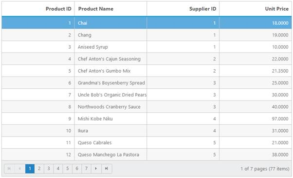

## IEnumerable
	
The Grid can be bound with either non-generic collection or generic collection that implements [IEnumerable](https://msdn.microsoft.com/en-us/library/system.collections.ienumerable%28v=vs.110%29.aspx) interface. It can be assigned to Grid’s `DataSource` property.

The following code example describes the above behavior.

 

<ej:Grid runat="server" ID="Grid">                        
           <Columns>
               <ej:Column Field="FirstName" HeaderText="First Name"></ej:Column>
               <ej:Column Field="LastName" HeaderText="Last Name"></ej:Column>
               <ej:Column Field="Email" HeaderText="Email"></ej:Column>
           </Columns>          
</ej:Grid>
 

namespace Grid
{
    public partial class _Default : Page
    { 

        protected void Page_Load(object sender, EventArgs e)
        {
            List<Person> Persons = new List<Person>();

            Persons.Add(new Person() { FirstName = "John", LastName = "Beckett", Email = "john@syncfusion.com" });

            Persons.Add(new Person() { FirstName = "Ben", LastName = "Beckett", Email = "ben@syncfusion.com" });

            Persons.Add(new Person() { FirstName = "Andrew", LastName = "Beckett", Email = "andrew@syncfusion.com" });

            this.Grid.DataSource = Persons;

        }
    }
}


 

The following output is displayed as a result of the above code example.

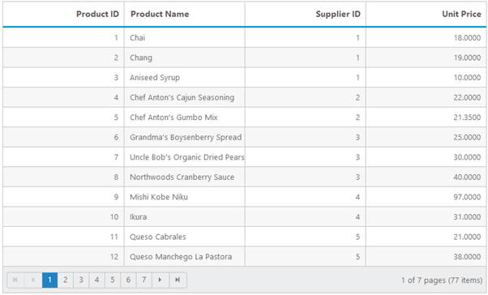

## Entity Framework
	
The collection of business objects generated from Entity Framework ORM can be used as Grid`s datasource. The Grid can be used with Entity Framework using either code first technique or Database first technique.

The following code example describes the above behavior.

 

<ej:Grid runat="server" ID="Grid" AllowPaging="true">                        
           <Columns>
               <ej:Column Field="OrderID" HeaderText="Order ID" TextAlign="Right"/>
               <ej:Column Field="CustomerID" HeaderText="Customer ID"/>
               <ej:Column Field="EmployeeID" HeaderText="Employee ID" TextAlign="Right"/>
               <ej:Column Field="Freight" HeaderText="Freight" Format="{0:C2}" TextAlign="Right"/>
           </Columns>          
</ej:Grid>
 

namespace Grid
{
    
    public partial class _Default : Page
    { 

        protected void Page_Load(object sender, EventArgs e)
        {
         
           this.Grid.DataSource = new NORTHWNDEntities().OrdersView.ToList();

        }
    }
}

 

The following output is displayed as a result of the above code example.

  
For more information on creating and consuming Entity Framework, please refer this [link]( http://www.asp.net/web-forms/overview/older-versions-getting-started/getting-started-with-ef/the-entity-framework-and-aspnet-getting-started-part-1)


## LINQ to SQL
	
The LINQ to SQL can be used as the data source of the Grid in which the data model of a relational database is mapped to an object model and allow us to use the LINQ technology to access SQL database.

The following code example describes the above behavior.

 

<ej:Grid runat="server" ID="Grid" AllowPaging="true">                        
           <Columns>
               <ej:Column Field="OrderID" HeaderText="Order ID" TextAlign="Right"/>
               <ej:Column Field="CustomerID" HeaderText="Customer ID"/>
               <ej:Column Field="EmployeeID" HeaderText="Employee ID" TextAlign="Right"/>
               <ej:Column Field="Freight" HeaderText="Freight" Format="{0:C2}" TextAlign="Right"/>
           </Columns>          
</ej:Grid>
 

        
namespace Grid.Controllers
{
    
    public partial class _Default : Page
    { 
        protected void Page_Load(object sender, EventArgs e)
        {
         
           this.Grid.DataSource = new NorthwindDataContext().OrdersViews.ToList();

        }
    }    
}


 

The following output is displayed as a result of the above code example.


For more information on using LINQ to SQL please refer to the [link](http://weblogs.asp.net/scottgu/using-linq-to-sql-part-1)


## DataTable

A DataTable, which represents one table of in-memory relational data that has in-built schema to work easily with data column and data row objects.

Binding DataTable to Grid is a very simpler way that you only need to set DataTable model to Grid `DataSource` Property in code behind.

The following code example describes the above behavior.

 


<ej:Grid ID="FlatGrid" runat="server" AllowPaging="true">
</ej:Grid>

 

        
namespace EJGrid.Controllers
{
    public partial class _Default : Page
    {
        protected void Page_Load(object sender, EventArgs e)
        {
            DataTable dt = new DataTable("Table1");
            DataColumn cl = new DataColumn("No");
            dt.Columns.Add(cl);
            cl = new DataColumn("Name");
            dt.Columns.Add(cl);

            DataRow dataRow = dt.NewRow();
            dataRow[0] = 1;
            dataRow[1] = "John";
            dt.Rows.Add(dataRow);

            dataRow = dt.NewRow();
            dataRow[0] = 2;
            dataRow[1] = "Smith";
            dt.Rows.Add(dataRow);

            dataRow = dt.NewRow();
            dataRow[0] = 3;
            dataRow[1] = "Tomps";
            dt.Rows.Add(dataRow);

            dataRow = dt.NewRow();
            dataRow[0] = 4;
            dataRow[1] = "Hanar";
            dt.Rows.Add(dataRow);

            dataRow = dt.NewRow();
            dataRow[0] = 5;
            dataRow[1] = "Reek";
            dt.Rows.Add(dataRow);
            this.FlatGrid.DataSource = dt;
        } 
    }
}


 

The following output is displayed as a result of the above code example.

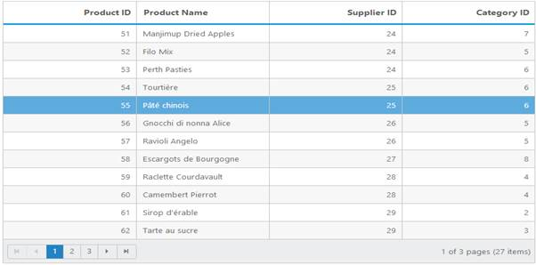

## ITypedList Binding

ITypedList provides functionality to discover the schema for a bind-able list, where the properties available to bind differ from the public properties of the object to bind.

To implement ITypedList binding, create a generic type named class that derives from ITypedList interface. Define the named class based on properties descriptor of the Grid Model class, to return list according to the custom implementation.

For more information on ITypedList interface you can refer [here](https://msdn.microsoft.com/en-us/library/System.ComponentModel.ITypedList%28v=vs.110%29.aspx)
Create a collection of ITypedList and bind it to Grid using `DataSource` property.

The following code example describes the above behavior.

 


<ej:Grid ID="FlatGrid" runat="server"  AllowGrouping="true" AllowPaging="true">
</ej:Grid>

 

[Serializable()]
    public class SortableBindingList<T> : BindingList<T>, ITypedList
    {
        [NonSerialized()]
        private PropertyDescriptorCollection properties;

        public SortableBindingList()
            : base()
        {
            // Get the 'shape' of the list. 
            // Only get the public properties marked with Browsable = true.
            PropertyDescriptorCollection propertyDescriptorCollection = TypeDescriptor.GetProperties(
                typeof(T),
                new Attribute[] { new BrowsableAttribute(true) });

            // Sort the properties.
            properties = propertyDescriptorCollection.Sort();
        }

        #region ITypedList Implementation

        public PropertyDescriptorCollection GetItemProperties(PropertyDescriptor[] listAccessors)
        {
            PropertyDescriptorCollection propertyDescriptorCollection;

            if (listAccessors != null && listAccessors.Length > 0)
            {
                // Return child list shape.
                propertyDescriptorCollection = ListBindingHelper.GetListItemProperties(listAccessors[0].PropertyType);
            }
            else
            {
                // Return properties in sort order.
                propertyDescriptorCollection = properties;
            }

            return propertyDescriptorCollection;
        }

        // This method is only used in the design-time framework 
        // and by the obsolete DataGrid control.
        public string GetListName(PropertyDescriptor[] listAccessors)
        {
            return typeof(T).Name;
        }

        #endregion
    }

namespace EJGrid.Controllers
{
    public partial class _Default : Page
    {
        protected void Page_Load(object sender, EventArgs e)
        {
            var data = OrderRepository.GetAllRecords();
            SortableBindingList<EditableOrder> ord = new SortableBindingList<EditableOrder>();
            
            foreach (var temp in data)
            {
                ord.Add(temp);
            }
            this.FlatGrid.DataSource = ord;
        }
    }
}


 

The following output is displayed as a result of the above code example.

## WebService 

Web Services are an integral part of the .NET Framework that provide a cross-platform solution for exchanging data between distributed systems. Refer here for the steps to create Web Service in a ASP.NET Web Form application.

Using WebMethod Adaptor, Grid can communicate and manipulate data with `WebService`.

N> You need to uncomment or include the "ScriptService" Attribute to WebService Class in order to enable request from client-side.

The following code example describes the above behavior.

 

<ej:Grid ID="EmployeesGrid2" runat="server" AllowPaging="true">
        <DataManager URL="WebService.asmx/Get" Adaptor="WebMethodAdaptor" />
        <Columns>
            <ej:Column Field="OrderID" />
            <ej:Column Field="EmployeeID" />
            <ej:Column Field="CustomerID" />
            <ej:Column Field="OrderDate" />
            <ej:Column Field="Freight" />
        </Columns>
</ej:Grid>
 
 

The following output is displayed as a result of the above code example.

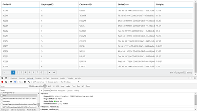

## WCF Data Service / OData Service

WCF Data Services is a component of the .NET Framework that enables you to create services that use the Open Data Protocol (OData) to expose and consume data over the Web or intranet by using the semantics of representational state transfer (REST).

To create WCF Data Service in your web application refer [here](https://msdn.microsoft.com/en-us/library/cc668184.aspx)

To consume OData service, set the service link to the `URL` property of `DataManager` which is a nested property of Grid Control.

We have an online OData Service "http://js.syncfusion.com/demos/ejServices/Wcf/Northwind.svc/Orders" created specifically for Syncfusion Controls.

The following code example describes the above behavior.

 

<ej:Grid ID="OrdersGrid" runat="server" AllowPaging="true">
 <DataManager URL="http://js.syncfusion.com/demos/ejServices/Wcf/Northwind.svc/Orders/"></DataManager>   
<Columns>
                <ej:Column Field="OrderID" />
                <ej:Column Field="EmployeeID" />
                <ej:Column Field="CustomerID" />
                <ej:Column Field="ShipCountry" />
                <ej:Column Field="Freight" />
</Columns>
</ej:Grid>
 
 

The following output is displayed as a result of the above code example.

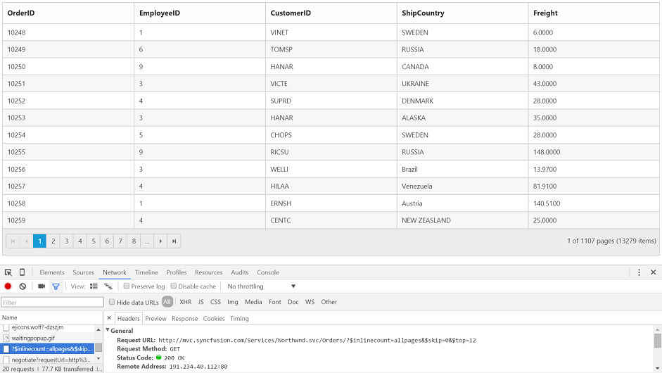

## ODataV4 Service

ODataV4Adaptor is used for consuming data from OData V4 Service. To consume OData service, set the service link to the `Url` property and set adaptor type as `ODataAdaptor` to the `Adaptor` Property of `DataManager`, which is a nested property of Grid Control. 

N> ODL supports to parse the `$search` query option, however, Web API OData doesn’t support it so far. 

The following code example describes the above behavior.

 

<ej:Grid ID="OrdersGrid" runat="server" AllowPaging="true">
<DataManager URL="http://js.syncfusion.com/demos/ejServices/Wcf/Northwind.svc/Orders/"  Adaptor="ODataV4Adaptor"></DataManager>   
<Columns>
                <ej:Column Field="OrderID" />
                <ej:Column Field="EmployeeID" />
                <ej:Column Field="CustomerID" />
                <ej:Column Field="ShipCountry" />
                <ej:Column Field="Freight" />
</Columns>
</ej:Grid>
 
 

The following output is displayed as a result of the above code example.

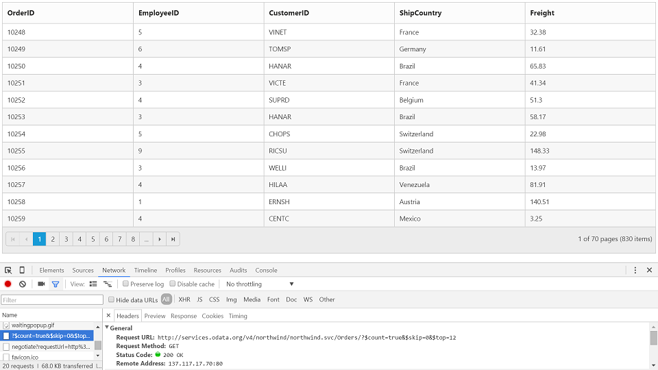

## Web API Service

Web API Adaptor is used for processing request and response messages from Web API Service. To consume Web API service, set the service link to the `Url` property and set adaptor type as `WebApiAdaptor` to the `Adaptor` Property of `DataManager`, which is a nested property of Grid Control. 

The datasource from Web API service must be returned as object that has property `Items` with its value as datasource and another property `Count` with its value as datasource’s total records count.

DataOperation queries such as sorting, filtering, etc., would be sent to Web API Service corresponding to Grid actions performed and they need to be handled manually as Web API Service does not process it by default. 

The following code example describes the above behavior.

 

<ej:Grid ID="OrdersGrid" runat="server" AllowPaging="true">
    <DataManager URL="/api/Orders/"  Adaptor="WebApiAdaptor"></DataManager>   
<Columns>
                <ej:Column Field="OrderID" />
                <ej:Column Field="EmployeeID" />
                <ej:Column Field="CustomerID" />
                <ej:Column Field="ShipCountry" />
                <ej:Column Field="Freight" />
</Columns>
</ej:Grid>
 

namespace EJGrid.Controllers {
    
    public class OrdersController: ApiController 
    { 
        // GET: api/Orders 
        NORTHWNDEntities db = new NORTHWNDEntities(); 
        public object Get() 
        { 
            var queryString = HttpContext.Current.Request.QueryString; 
            int skip = Convert.ToInt32(queryString["$skip"]); 
            int take = Convert.ToInt32(queryString["$top"]); 
            var data = db.Orders.Skip(skip).Take(take).ToList(); 
            return new { Items = data.Skip(skip).Take(take), Count = data.Count() }; 
        } 
    } 
}

 

The following output is displayed as a result of the above code example.

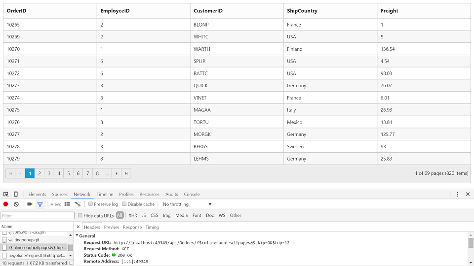

## HTML Table binding
	
HTML table can be set as a data source for grid. The ID of the HTML table should be assigned to the `Table` property of the `DataSource` API.

N> HTML table is the only valid element to use through `DataManager`.

The following code example describes the above behavior.

 


<ej:Grid runat="server" ID="Grid">                        
           <DataManager Table="#GridTable" />
           <Columns>
               <ej:Column Field="Laptop" HeaderText="Laptop"/>
               <ej:Column Field="Model" HeaderText="Model"/>
               <ej:Column Field="Price" HeaderText="Price" Format="{0:C2}"  TextAlign="Right"/>
               <ej:Column Field="OS" HeaderText="OS"/>
               <ej:Column Field="RAM" HeaderText="RAM"/>
               <ej:Column Field="Screensize" HeaderText="Screensize"/>
           </Columns>          
</ej:Grid>

 

The following output is displayed as a result of the above code example.

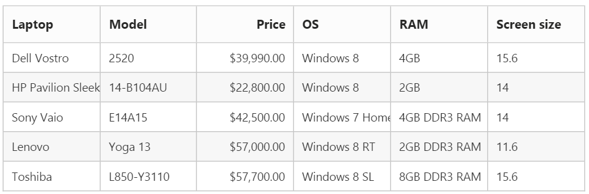

## Miscellaneous
### Load On Demand
	
By Default, Grid with remote data binding will work in “On-Demand” concept for which either `Paging` or `VirtualScrolling` feature should be enabled in Grid. It helps improving performance of loading a large data set.

The following code example describes the above behavior.

 


<ej:Grid ID="OrdersGrid" runat="server" AllowPaging="true">
            <DataManager URL="http://js.syncfusion.com/demos/ejServices/Wcf/Northwind.svc/Orders/"></DataManager>   
<Columns>
                <ej:Column Field="OrderID" />
                <ej:Column Field="EmployeeID" />
                <ej:Column Field="CustomerID" />
                <ej:Column Field="ShipCountry" />
                <ej:Column Field="Freight" />
</Columns>
</ej:Grid>



 

The following output is displayed as a result of the above code example.

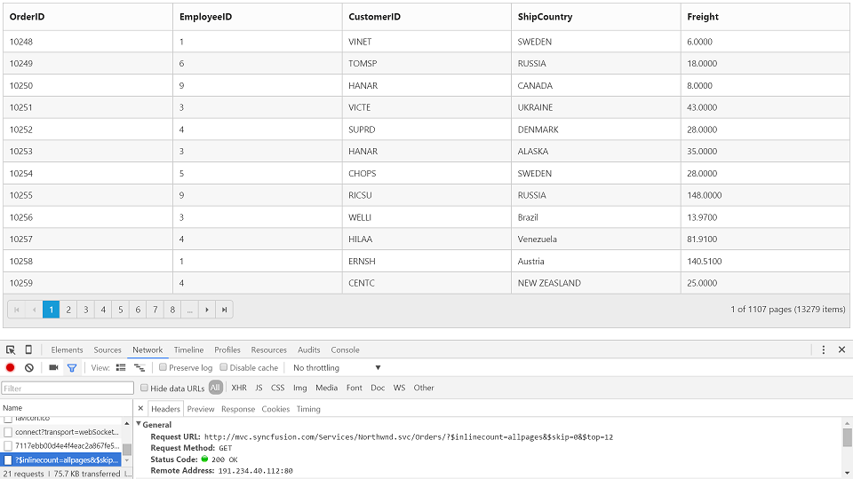

### Load at once

"Load at once" concept in Grid can be used to load all data from remote service at a single request and all further Grid action will be performed at client-side on the cached data.

`Offline` Property of Grid `DataManager` is used to enable “Load at once” in Grid control

The following code example describes the above behavior.

 


<ej:Grid ID="OrdersGrid" runat="server" AllowPaging="true">
            <DataManager URL="http://js.syncfusion.com/demos/ejServices/Wcf/Northwind.svc/Orders/" Offline="true"></DataManager>   
<Columns>
                <ej:Column Field="OrderID" />
                <ej:Column Field="EmployeeID" />
                <ej:Column Field="CustomerID" />
                <ej:Column Field="ShipCountry" />
                <ej:Column Field="Freight" />
</Columns>
</ej:Grid>



 

The following output is displayed as a result of the above code example.

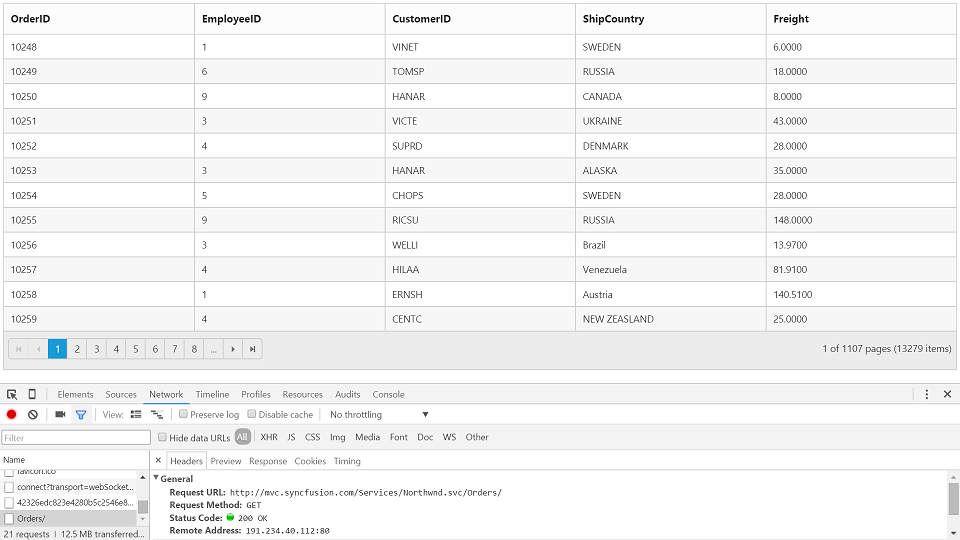

### Data caching

#### Load on demand	
	
The `DataManager` can cache on demand loaded data. The caching functionality can be enabled by setting the `EnableCaching` property in `DataManager`.

The `TimeTillExpiration` and `CachingPageSize` properties are used to control the expiration time of data and the cache page size settings respectively.

The Data caching using DataManager is not as same as the `DataSourceCachingMode` which is used to cache data on page postback.

N> window`s localStorage is used to cache the loaded data. 

The following code example describes the above behavior.

 

<ej:Grid runat="server" ID="Grid" AllowPaging="true">
            <DataManager URL="Default.aspx/DataSource" EnableCaching="true" CachingPageSize="4" TimeTillExpiration="120000" Adaptor="WebMethodAdaptor" />
            <Columns>
                <ej:Column Field="OrderID" HeaderText="Order ID" TextAlign="Right" />
                <ej:Column Field="CustomerID" HeaderText="Customer ID" />
                <ej:Column Field="EmployeeID" HeaderText="Employee ID" TextAlign="Right" />
                <ej:Column Field="Freight" HeaderText="Freight" Format="{0:C2}" TextAlign="Right" />
            </Columns>
</ej:Grid>

 

The following output is displayed as a result of the above code example.

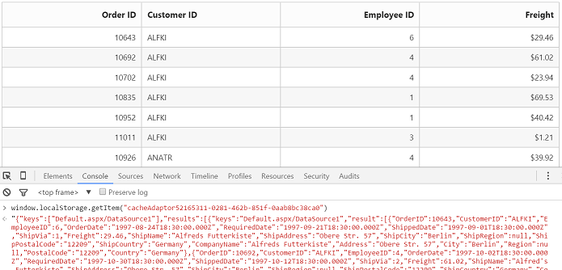

#### Load at once

DataSourceCachingMode can holds the datasource object and no need to initialize the datasource after each and every postback. It’s a enumeration type and it contains the following values.

##### ViewState:

The Data Source object will be serialized and added to the View State. So, no need to initialize the Data Source after each and every postback.

##### None:

This mode turns off data caching and the data source must be initialized for every postback.The default property of DataSourceCachingMode is None.

##### Session:

The reference to the Data Source object will be added to Session.

 

<ej:Grid ID="FlatGrid" runat="server"  AllowPaging="true"  DataSourceCachingMode="ViewState" >
    <Columns>
        <ej:Column Field="OrderID" HeaderText="Order ID" IsPrimaryKey="True" TextAlign="Right" Width="75" />
        <ej:Column Field="CustomerID" HeaderText="Customer ID" Width="80" />
        <ej:Column Field="EmployeeID" HeaderText="Employee ID" TextAlign="Right" Width="75" />
        <ej:Column Field="Freight" HeaderText="Freight" TextAlign="Right" Width="75" Format="{0:C}" />
        <ej:Column Field="OrderDate" HeaderText="Order Date" TextAlign="Right" Width="80" Format="{0:MM/dd/yyyy}" />
        <ej:Column Field="ShipCity" HeaderText="Ship City" Width="110" />
    </Columns>
</ej:Grid>
 

    public partial class _Default : Page
    {
        List<Orders> order = new List<Orders>();

        protected void Page_Load(object sender, EventArgs e)
        {
            if (!IsPostBack)
                BindDataSource();
        }
        private void BindDataSource()
        {
            int code = 10000;
            for (int i = 1; i < 10; i++)
            {
                order.Add(new Orders(code + 1, "ALFKI", i + 0, 2.3 * i, new DateTime(1991, 05, 15), "Berlin"));
                order.Add(new Orders(code + 2, "ANATR", i + 2, 3.3 * i, new DateTime(1990, 04, 04), "Madrid"));
                order.Add(new Orders(code + 3, "ANTON", i + 1, 4.3 * i, new DateTime(1957, 11, 30), "Cholchester"));
                order.Add(new Orders(code + 4, "BLONP", i + 3, 5.3 * i, new DateTime(1930, 10, 22), "Marseille"));
                order.Add(new Orders(code + 5, "BOLID", i + 4, 6.3 * i, new DateTime(1953, 02, 18), "Tsawassen"));
                code += 5;
            }
            this.FlatGrid.DataSource = order;
            this.FlatGrid.DataBind();
        }
        [Serializable]
        public class Orders
        {
            public Orders()
            {

            }
            public Orders(long OrderId, string CustomerId, int EmployeeId, double Freight, DateTime OrderDate, string ShipCity)
            {
                this.OrderID = OrderId;
                this.CustomerID = CustomerId;
                this.EmployeeID = EmployeeId;
                this.Freight = Freight;
                this.OrderDate = OrderDate;
                this.ShipCity = ShipCity;
            }
            public long OrderID { get; set; }
            public string CustomerID { get; set; }
            public int EmployeeID { get; set; }
            public double Freight { get; set; }
            public DateTime OrderDate { get; set; }
            public string ShipCity { get; set; }
        }
    }

 

The following output is displayed as a result of the above code example.

### Custom request parameters and HTTP Header

#### Adding request parameters

The `addParams` function in DataManager’s Query class can be used to add additional custom parameter in data requests. The Grid has an option to set default Query which can be used to add custom parameter.

The following code example describes the above behavior.

 

<ej:Grid runat="server" ID="Grid" AllowPaging="true" Query="new ej.Query().addParams('Syncfusion', true)">
            <DataManager URL="Default.aspx/DataSource" Adaptor="WebMethodAdaptor"/>              
            <Columns>
                <ej:Column Field="OrderID" HeaderText="Order ID" TextAlign="Right" />
                <ej:Column Field="CustomerID" HeaderText="Customer ID" />
                <ej:Column Field="EmployeeID" HeaderText="Employee ID" TextAlign="Right" />
                <ej:Column Field="Freight" HeaderText="Freight" Format="{0:C2}" TextAlign="Right" />
            </Columns>         
</ej:Grid>

 

N> Attempting to add custom parameters with key name same as any default AJAX parameters used by `DataManager` will results in error.

The following output is displayed as a result of the above code example.

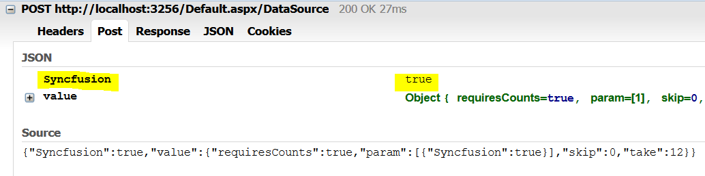

#### Adding custom HTTP headers

The Custom header can be added through `DataManager` `Headers` options. While performing, CRUD operations, the `addParams` cannot be used to send additional parameters to the server in such cases the parameters can be send as custom header.

The following code example describes the above behavior.

 

<ej:Grid runat="server" ID="Grid" AllowPaging="true">
 <DataManager URL="Default.aspx/DataSource" Adaptor="WebMethodAdaptor">
         <Header>
                <ej:KeyValue Key="Syncfusion" Value="false" />
         </Header>
   </DataManager>
         <Columns>
                <ej:Column Field="OrderID" HeaderText="Order ID" TextAlign="Right" />
                <ej:Column Field="CustomerID" HeaderText="Customer ID" />
                <ej:Column Field="EmployeeID" HeaderText="Employee ID" TextAlign="Right" />
                <ej:Column Field="Freight" HeaderText="Freight" Format="{0:C2}" TextAlign="Right" />
         </Columns>
     </ej:Grid>

 

N>  To add custom headers to the DataManager through JavaScript, refer to this [link](https://www.syncfusion.com/kb/5963)

The following output is displayed as a result of the above code example.

### Handling HTTP Errors
	
During server interaction from the Grid, there may occur some server-side exceptions and you can acquire those error messages or exception details in client-side using `ActionFailure` event of Grid Control.

The argument passed to the `ActionFailure` Grid event contains the Error details returned from server. Please refer the following table for some error details that would be acquired in client-side event arguments.

<table>
<tr>
<th>
Parameter </th><th>
Description</th></tr>
<tr>
<td>
arguments.error.status</td><td>
It returns the response error code.</td></tr>
<tr>
<td>
arguments.error.statusText</td><td>
It returns the error message.</td></tr>
</table>

The following code example describes the above behavior.

 

<ej:Grid runat="server" ID="Grid" AllowPaging="true">
            <DataManager URL="Default.aspx/DataSource" Adaptor="WebMethodAdaptor"/>              
            <Columns>
                <ej:Column Field="OrderID" HeaderText="Order ID" TextAlign="Right" />
                <ej:Column Field="CustomerID" HeaderText="Customer ID" />
                <ej:Column Field="EmployeeID" HeaderText="Employee ID" TextAlign="Right" />
                <ej:Column Field="Freight" HeaderText="Freight" Format="{0:C2}" TextAlign="Right" />
            </Columns>
            <ClientSideEvents ActionFailure="OnActionFailure" />
        </ej:Grid>




 

The following output is displayed as a result of the above code example.

