# Editing

The grid control has support for dynamic insertion, updating and deletion of records. You can start the edit action either by double clicking the particular row or by selecting the required row and clicking on Edit icon in toolbar. Similarly, you can add new record to grid either by clicking on insert icon in toolbar or on an external button which is bound to call `addRecord` method of grid.  `Save` and `Cancel` while on edit mode is possible using respective toolbar icon in grid.

Deletion of the record is possible by selecting the required row and clicking on Delete icon in toolbar. 

The primary key for the data source should be defined in `Columns` definition, for editing to work properly. In `Columns` definition, particular primary column's `IsPrimaryKey` property should be set to `true`. Refer the Knowledge base [link](http://www.syncfusion.com/kb/2675/cant-edit-any-row-except-the-first-row-in-grid# "link") for more information.

N> 1. In grid, the primary key column will be automatically set to read only while editing the row, but you can specify primary key column value while adding a new record.
N> 2. The column which is specified as `IsIdentity` will be in readonly mode both while editing and adding a record. Also, auto incremented value is assigned to that `IsIdentity` column.

## Toolbar with edit option

Using toolbar which is rendered at the top of the grid header, you can show all the CRUD related action. To enable toolbar and toolbar items, set `ShowToolbar` property as true and `ToolbarItems`. The default toolbar items are `add`, `edit`, `delete`, `update` and `cancel`.

The following code example describes the above behavior.




    
           <ej:Grid ID="FlatGrid" runat="server" AllowPaging="true">
           <EditSettings AllowEditing="true" AllowAdding="true" AllowDeleting="true"></EditSettings>
           <ToolbarSettings ShowToolbar="true" ToolbarItems="add,edit,delete,update,cancel"></ToolbarSettings>
           <Columns>
                <ej:Column Field="OrderID" IsPrimaryKey="true"/>
                <ej:Column Field="CustomerID" />
                <ej:Column Field="EmployeeID"/>
                <ej:Column Field="ShipCity"/>
                <ej:Column Field="ShipCountry"/>
           </Columns> 
           </ej:Grid>           
         




    namespace WebSampleBrowser.Grid
        {
            public partial class _Default : Page
              { 
                 List<Orders> order = new List<Orders>();
                 protected void Page_Load(object sender, EventArgs e)
                 {
                   BindDataSource();
                  }
                 private void BindDataSource()
                  {   
                     int code = 10000;
                     for (int i = 1; i < 10; i++)
                     {
                      order.Add(new Orders(code + 1, "ALFKI", i + 0,"Reims","France"));
                      order.Add(new Orders(code + 2, "ANATR", i + 2,"Munster","Germany"));
                      order.Add(new Orders(code + 3, "ANTON", i + 1,"Berlin","Brazil"));
                      order.Add(new Orders(code + 4, "BLONP", i + 3,"Mexico","Italy" ));
                      order.Add(new Orders(code + 5, "BOLID", i + 4,"Bern","Mexico"));
                      code += 5;
                     }
                    this.FlatGrid.DataSource = order;
                    this.FlatGrid.DataBind();
                  }
                  [Serializable]
                  public class Orders
                   {
                     public Orders()
                      {

                      }
                     public Orders(long OrderId, string CustomerId, int EmployeeId ,string ShipCity,string ShipCountry)
                      {
                        this.OrderID = OrderId;
                        this.CustomerID = CustomerId;
                        this.EmployeeID = EmployeeId;
                        this.ShipCity= ShipCity;
                        this.ShipCountry = ShipCountry;
                      }
                     public long OrderID { get; set; }
                     public string CustomerID { get; set; }
                     public int EmployeeID { get; set; }
                     public string ShipCity{ get; set; }
                     public string ShipCountry{ get; set; }
                   }
              }
        } 

    
  

The following output is displayed as a result of the above code example.

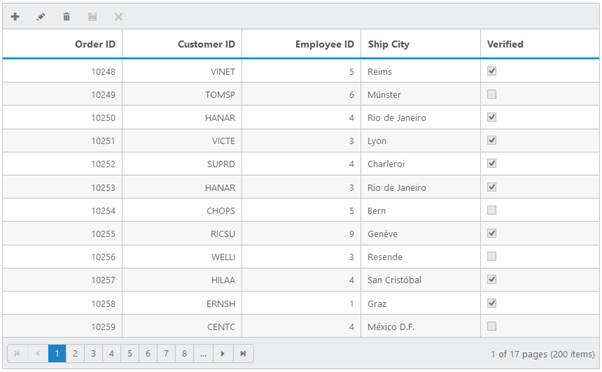

## Cell edit type and its edit options

The edit type of bound column can be customized using `EditType` property of `Columns`. The following Essential JavaScript controls are supported built-in by `EditType`. You can set the `EditType` based on specific data type of the column. 

* `NumericTextBox` control for integers, double, and decimal data types.
* `DatePicker` control for date data type.
* `DateTimePicker` control for date-time data type.
* `DropDownList` control for list of data type.

And also you can define the model for all the editTypes controls while editing through EditOptions.

The following table describes `EditType` and their corresponding EditOptions of the specific data type of the column.

<table>
<tr>
<th>
EditType</th><th>
EditParams</th><th>
Example</th></tr>
<tr>
<td>
NumericTextBox </td><td>
{{ '[TextBoxes](https://help.syncfusion.com/cr/aspnet/Syncfusion.JavaScript.Models.EditorProperties.html)'  | markdownify }} </td><td>
&lt;NumericEditOptions DecimalPlaces="2"/&gt;</td></tr>
<tr>
<td>
DatePicker </td><td>
{{ '[DatePicker](https://help.syncfusion.com/cr/aspnet/Syncfusion.JavaScript.Models.DatePickerProperties.html)' | markdownify }} </td><td>
&lt;DateEditOptions ButtonText="now"/&gt;</td></tr>
<tr>
<td>
DateTimePicker</td><td>
{{ '[DateTimePicker](https://help.syncfusion.com/cr/aspnet/Syncfusion.JavaScript.Models.DateTimePickerProperties.html)' | markdownify }} </td><td>
&lt;DateTimeEditOptions Enabled="true"/&gt;</td></tr>
<tr>
<td>
DropDownList</td><td>
{{ '[DropDownList](https://help.syncfusion.com/cr/aspnet/Syncfusion.JavaScript.Models.DropDownListProperties.html)' | markdownify }} </td><td>
&lt;DropDownEditOptions ShowCheckbox="true"/&gt;</td></tr>
</table>

N> 1. If `EditType` is not set, then by default it will display the input element ("string") while editing a column.

The following code example describes the above behavior 



    
          <ej:Grid ID="FlatGrid" runat="server" AllowPaging="true">
           <EditSettings AllowEditing="true" AllowAdding="true" AllowDeleting="true" EditMode="Normal"></EditSettings>
           <ToolbarSettings ShowToolbar="true" ToolbarItems="add,edit,delete,update,cancel"></ToolbarSettings>
           <Columns>
                <ej:Column Field="OrderID" IsPrimaryKey="true"/>
                <ej:Column Field="CustomerID" EditType="StringEdit"/>
                <ej:Column Field="Freight" EditType="NumericEdit"><NumericEditOptions DecimalPlaces="2"></NumericEditOptions></ej:Column>
                <ej:Column Field="ShipCountry" EditType="DropdownEdit"/>
                <ej:Column Field="OrderDate" Format="{0:MM/dd/yyyy}" EditType="DatePicker"><DateEditOptions ButtonText="now"/></ej:Column>
                <ej:column Field="Verified" EditType="BooleanEdit"/>
          </Columns> 
          </ej:Grid>                  
         




    namespace WebSampleBrowser.Grid
        {
            public partial class _Default : Page
              { 
                 List<Orders> order = new List<Orders>();
                 protected void Page_Load(object sender, EventArgs e)
                 {
                   BindDataSource();
                  }
                 private void BindDataSource()
                  {   
                     int code = 10000;
                     for (int i = 1; i < 10; i++)
                     {
                      order.Add(new Orders(code + 1, "ALFKI", 34.3 * i, "France",new DateTime(1991, 05, 15),false);
                      order.Add(new Orders(code + 2, "ANATR", 35.3 * i, "Germany",new DateTime(1990, 04, 04),true);
                      order.Add(new Orders(code + 3, "ANTON", 325.3 * i, "Brazil",new DateTime(1957, 11, 30),false);
                      order.Add(new Orders(code + 4, "BLONP", 435.3 * i, "Italy", new DateTime(1930, 10, 22),true);
                      order.Add(new Orders(code + 5, "BOLID", 46.3 * i, "Mexico",new DateTime(1953, 02, 18),false);
                      code += 5;
                     }
                    this.FlatGrid.DataSource = order;
                    this.FlatGrid.DataBind();
                  }
                  [Serializable]
                  public class Orders
                   {
                     public Orders()
                      {

                      }
                     public Orders(long OrderId, string CustomerId,double Freight,string ShipCountry,DateTime OrderDate,bool verified )
                      {
                        this.OrderID = OrderId;
                        this.CustomerID = CustomerId;
                        this.Freight = Freight;
                        this.ShipCountry = ShipCountry;
                        this.OrderDate = OrderDate;
                        this.Verified=verified;
                     }
                     public long OrderID { get; set; }
                     public string CustomerID { get; set; }
                     public double Freight { get; set; }
                     public string ShipCountry { get; set; }
                     public DateTime OrderDate { get; set; }
                     public bool Verified { get; set; }
                   }
              }
        } 

    
  

The following output is displayed as a result of the above code example.

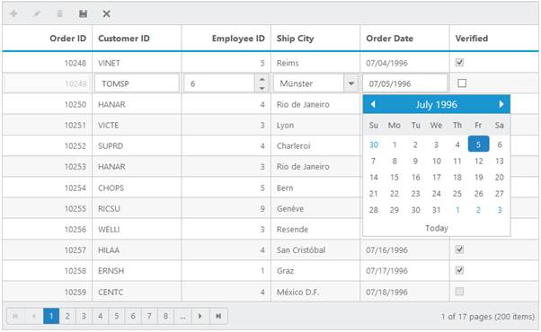

## Cell Edit Template

On editing the column values, custom editor can be created by using `EditTemplate` property of `Columns`. It has three functions, they are

1. `Create` - It is used to create the control at time of initialize.
2. `Read` - It is used to read the input value at time of save.
3. `Write` - It is used to assign the value to control at time of editing.

The following code example describes the above behavior.




    
           <ej:Grid ID="FlatGrid" runat="server" AllowPaging="true">
           <EditSettings AllowEditing="true" AllowAdding="true" AllowDeleting="true"></EditSettings>
           <ToolbarSettings ShowToolbar="true" ToolbarItems="add,edit,delete,update,cancel"></ToolbarSettings>
           <Columns>
                <ej:Column Field="OrderID" IsPrimaryKey="true"/>
                <ej:Column Field="CustomerID"/>
                <ej:Column Field="Freight"/>
                <ej:Column Field="ShipCountry"/>
                <ej:Column Field="ShipPostalCode">
                <EditTemplate Create="create" Read="read" Write="write"/></ej:Column>
           </Columns>
           </ej:Grid>              
         




     
    




    namespace WebSampleBrowser.Grid
        {
            public partial class _Default : Page
              { 
                 List<Orders> order = new List<Orders>();
                 protected void Page_Load(object sender, EventArgs e)
                 {
                   BindDataSource();
                  }
                 private void BindDataSource()
                  {   
                     int code = 10000;
                     for (int i = 1; i < 10; i++)
                     {
                      order.Add(new Orders(code + 1, "ALFKI",34.3 * i, "France",51110);
                      order.Add(new Orders(code + 2, "ANATR",35.3 * i ,"Germany",44087);
                      order.Add(new Orders(code + 3, "ANTON",325.3 * i ,"Brazil",69004 );
                      order.Add(new Orders(code + 4, "BLONP",435.3 * i ,"Italy",B6000 );
                      order.Add(new Orders(code + 5, "BOLID",46.3 * i,"Mexico", 3012);
                      code += 5;
                     }
                    this.FlatGrid.DataSource = order;
                    this.FlatGrid.DataBind();
                  }
                  [Serializable]
                  public class Orders
                   {
                     public Orders()
                      {

                      }
                     public Orders(long OrderId, string CustomerId,double Freight, string ShipCountry,int ShipPostalCode )
                      {
                        this.OrderID = OrderId;
                        this.CustomerID = CustomerId;
                        this.Freight = Freight;
                        this.ShipCountry = ShipCountry;
                        this.ShipPostalCode =ShipPostalCode;
                     }
                     public long OrderID { get; set; }
                     public string CustomerID { get; set; }
                     public int EmployeeID { get; set; }
                     public string ShipCountry { get; set; }
                     public int ShipPostalCode{ get; set; }
                   }
              }
        } 


    
  
The following output is displayed as a result of the above code example.

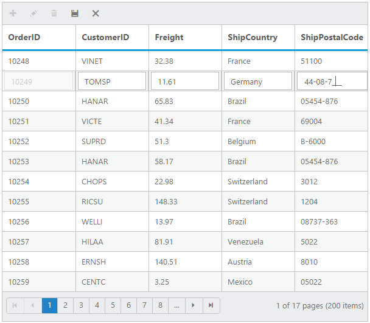

## Edit Modes

### Inline 

Set `EditMode` as `Normal`, then the row itself is changed as edited row.

The following code example describes the above behavior.




    
        <ej:Grid ID="FlatGrid" runat="server" AllowPaging="true">
           <EditSettings AllowEditing="true" AllowAdding="true" AllowDeleting="true" EditMode="Normal"></EditSettings>
           <ToolbarSettings ShowToolbar="true" ToolbarItems="add,edit,delete,update,cancel"></ToolbarSettings>
           <Columns>
                <ej:Column Field="OrderID" IsPrimaryKey="true"/>
                <ej:Column Field="CustomerID" EditType="StringEdit"/>
                <ej:Column Field="Freight" EditType="NumericEdit"/>
                <ej:Column Field="ShipCountry" EditType="DropdownEdit"/>
                <ej:Column Field="OrderDate"  EditType="DatePicker" Format="{0:MM/dd/yyyy}"/>
           </Columns>
        </ej:Grid >                    
         




    namespace WebSampleBrowser.Grid
        {
            public partial class _Default : Page
              { 
                 List<Orders> order = new List<Orders>();
                 protected void Page_Load(object sender, EventArgs e)
                 {
                   BindDataSource();
                  }
                 private void BindDataSource()
                  {   
                     int code = 10000;
                     for (int i = 1; i < 10; i++)
                     {
                      order.Add(new Orders(code + 1, "ALFKI", 34.3 * i, "France",new DateTime(1991, 05, 15));
                      order.Add(new Orders(code + 2, "ANATR", 35.3 * i, "Germany",new DateTime(1990, 04, 04));
                      order.Add(new Orders(code + 3, "ANTON", 325.3 * i, "Brazil",new DateTime(1957, 11, 30));
                      order.Add(new Orders(code + 4, "BLONP", 435.3 * i, "Italy", new DateTime(1930, 10, 22));
                      order.Add(new Orders(code + 5, "BOLID", ,46.3 * i, "Mexico",new DateTime(1953, 02, 18));
                      code += 5;
                     }
                    this.FlatGrid.DataSource = order;
                    this.FlatGrid.DataBind();
                  }
                  [Serializable]
                  public class Orders
                   {
                     public Orders()
                      {

                      }
                     public Orders(long OrderId, string CustomerId,double Freight,string ShipCountry,DateTime OrderDate)
                      {
                        this.OrderID = OrderId;
                        this.CustomerID = CustomerId;
                        this.Freight = Freight;
                        this.ShipCountry = ShipCountry;
                        this.OrderDate = orderDate;
                        
                      }
                     public long OrderID { get; set; }
                     public string CustomerID { get; set; }
                     public double Freight { get; set; }
                     public string ShipCountry { get; set; }
                     public DateTime OrderDate { get; set; }
                    
                   }
              }
        } 

    
  

The following output is displayed as a result of the above code example.

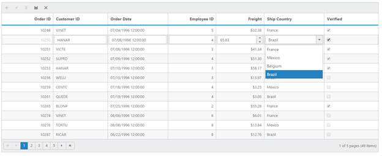

### Inline Form

Set `EditMode` as `InlineForm`, then edit form will be inserted next to the row which is to be edited.

The following code example describes the above behavior.




    
         <ej:Grid ID="FlatGrid" runat="server" AllowPaging="true">
           <EditSettings AllowEditing="true" AllowAdding="true" AllowDeleting="true" EditMode="InlineForm"></EditSettings>
           <ToolbarSettings ShowToolbar="true" ToolbarItems="add,edit,delete,update,cancel"></ToolbarSettings>
           <Columns>
                <ej:Column Field="OrderID" IsPrimaryKey="true"/>
                <ej:Column Field="CustomerID" EditType="StringEdit"/>
                <ej:Column Field="Freight" EditType="NumericEdit"/>
                <ej:Column Field="ShipCountry" EditType="DropdownEdit" />
                <ej:Column Field="OrderDate" EditType="DatePicker" Format="{0:MM/dd/yyyy}"/>
           </Columns>
         </ej:Grid >                   
         




    namespace WebSampleBrowser.Grid
        {
            public partial class _Default : Page
              { 
                 List<Orders> order = new List<Orders>();
                 protected void Page_Load(object sender, EventArgs e)
                 {
                   BindDataSource();
                  }
                 private void BindDataSource()
                  {   
                     int code = 10000;
                     for (int i = 1; i < 10; i++)
                     {
                      order.Add(new Orders(code + 1, "ALFKI", 34.3 * i, "France",new DateTime(1991, 05, 15));
                      order.Add(new Orders(code + 2, "ANATR", 35.3 * i, "Germany",new DateTime(1990, 04, 04));
                      order.Add(new Orders(code + 3, "ANTON", 325.3 * i, "Brazil",new DateTime(1957, 11, 30));
                      order.Add(new Orders(code + 4, "BLONP", 435.3 * i, "Italy", new DateTime(1930, 10, 22));
                      order.Add(new Orders(code + 5, "BOLID", ,46.3 * i, "Mexico",new DateTime(1953, 02, 18));
                      code += 5;
                     }
                    this.FlatGrid.DataSource = order;
                    this.FlatGrid.DataBind();
                  }
                  [Serializable]
                  public class Orders
                   {
                     public Orders()
                      {

                      }
                     public Orders(long OrderId, string CustomerId,double Freight,string ShipCountry,DateTime OrderDate)
                      {
                        this.OrderID = OrderId;
                        this.CustomerID = CustomerId;
                        this.Freight = Freight;
                        this.ShipCountry = ShipCountry;
                        this.OrderDate = orderDate;
                        
                      }
                     public long OrderID { get; set; }
                     public string CustomerID { get; set; }
                     public double Freight { get; set; }
                     public string ShipCountry { get; set; }
                     public DateTime OrderDate { get; set; }
                    
                   }
              }
        } 

    
  

The following output is displayed as a result of the above code example.

### Inline Template Form

You can edit any of the fields pertaining to a single record of data and apply it to a template so that the same format is applied to all the other records that you may edit later.

Using this template support, you can edit the fields that are not bound to grid columns.

To edit the records using Inline template form, set `EditMode` as `InlineFormTemplate` and specify the template ID to `InlineFormTemplateID` property of `EditSettings`.

While using template form, you can change the HTML elements to appropriate JS controls based on the column type. This can be achieved by using `ActionComplete` event of grid.

N> 1. `value` attribute is used to bind the corresponding field value while editing.
N> 2. `name` attribute is used to get the changed field values while saving the edited record.
N> 3.  It's a standard way to enclose the `Template` within the `script` tag with `type` as "text/x-jsrender".

The following code example describes the above behavior.




    
          <ej:Grid ID="FlatGrid" runat="server" AllowPaging="true">
           <EditSettings AllowEditing="true" AllowAdding="true" AllowDeleting="true" EditMode="InlineFormTemplate" InlineFormTemplateID="#template" ></EditSettings>
           <ClientSideEvents ActionComplete ="complete" />
           <ToolbarSettings ShowToolbar="true" ToolbarItems="add,edit,delete,update,cancel"></ToolbarSettings>
           <Columns>
                <ej:Column Field="OrderID"  IsPrimaryKey="true" />
                <ej:Column Field="CustomerID"/>
                <ej:Column Field="ShipCity" />
          </Columns> 
          </ej:Grid>                  
         


			  
    

	    
			  




    namespace WebSampleBrowser.Grid
        {
            public partial class _Default : Page
              { 
                 List<Orders> order = new List<Orders>();
                 protected void Page_Load(object sender, EventArgs e)
                 {
                   BindDataSource();
                  }
                 private void BindDataSource()
                  {   
                     int code = 10000;
                     for (int i = 1; i < 10; i++)
                     {
                      order.Add(new Orders(code + 1, "ALFKI","Reims");
                      order.Add(new Orders(code + 2, "ANATR","Munster" );
                      order.Add(new Orders(code + 3, "ANTON","Berlin");
                      order.Add(new Orders(code + 4, "BLONP","Mexico" );
                      order.Add(new Orders(code + 5, "BOLID","Bern");
                      code += 5;
                     }
                    this.FlatGrid.DataSource = order;
                    this.FlatGrid.DataBind();
                  }
                  [Serializable]
                  public class Orders
                   {
                     public Orders()
                      {

                      }
                     public Orders(long OrderId, string CustomerId,string ShipCity)
                      {
                        this.OrderID = OrderId;
                        this.CustomerID = CustomerId;
                        this.ShipCity = ShipCity;
                      }
                     public long OrderID { get; set; }
                     public string CustomerID { get; set; }
                     public string ShipCity { get; set; }
                   }
              }
        } 

    
  

The following output is displayed as a result of the above code example.

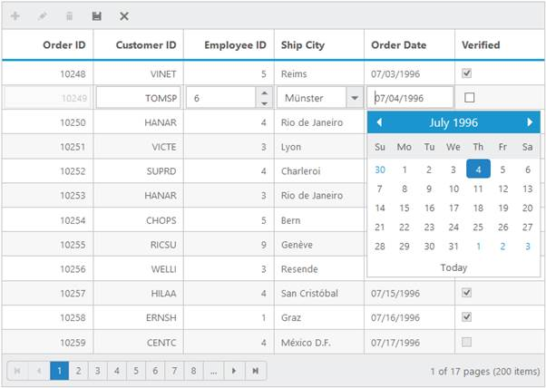

Before the template elements are converted to JS controls

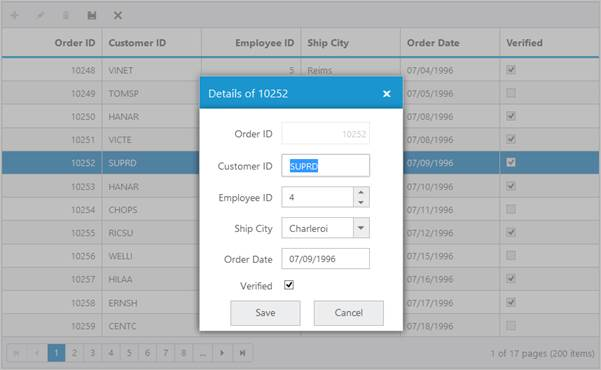

After the template elements are converted to JS controls using ActionComplete event.

### Dialog

Set `EditMode` as `Dialog` to edit data using a dialog box, which displays the fields associated with the data record being edited.

The following code example describes the above behavior.




    
          <ej:Grid ID="FlatGrid" runat="server" AllowPaging="true" >
           <EditSettings AllowEditing="true" AllowAdding="true" AllowDeleting="true" EditMode="Dialog"></EditSettings>
           <ToolbarSettings ShowToolbar="true" ToolbarItems="add,edit,delete,update,cancel"></ToolbarSettings>
           <Columns>
                <ej:Column Field="OrderID" IsPrimaryKey="true"/>
                <ej:Column Field="CustomerID" EditType="StringEdit"/>
                <ej:Column Field="Freight" EditType="NumericEdit"/>
                <ej:Column Field="ShipCountry" EditType="DropdownEdit"/>
                <ej:Column Field="OrderDate" EditType="DatePicker" Format="{0:MM/dd/yyyy}"/>
           </Columns>
           </ej:Grid >  




    namespace WebSampleBrowser.Grid
        {
            public partial class _Default : Page
              { 
                 List<Orders> order = new List<Orders>();
                 protected void Page_Load(object sender, EventArgs e)
                 {
                   BindDataSource();
                  }
                 private void BindDataSource()
                  {   
                     int code = 10000;
                     for (int i = 1; i < 10; i++)
                     {
                      order.Add(new Orders(code + 1, "ALFKI", 34.3 * i, "France",new DateTime(1991, 05, 15));
                      order.Add(new Orders(code + 2, "ANATR", 35.3 * i, "Germany",new DateTime(1990, 04, 04));
                      order.Add(new Orders(code + 3, "ANTON", 325.3 * i, "Brazil",new DateTime(1957, 11, 30));
                      order.Add(new Orders(code + 4, "BLONP", 435.3 * i, "Italy", new DateTime(1930, 10, 22));
                      order.Add(new Orders(code + 5, "BOLID", ,46.3 * i, "Mexico",new DateTime(1953, 02, 18));
                      code += 5;
                     }
                    this.FlatGrid.DataSource = order;
                    this.FlatGrid.DataBind();
                  }
                  [Serializable]
                  public class Orders
                   {
                     public Orders()
                      {

                      }
                     public Orders(long OrderId, string CustomerId,double Freight,string ShipCountry,DateTime OrderDate)
                      {
                        this.OrderID = OrderId;
                        this.CustomerID = CustomerId;
                        this.Freight = Freight;
                        this.ShipCountry = ShipCountry;
                        this.OrderDate = orderDate;
                        
                      }
                     public long OrderID { get; set; }
                     public string CustomerID { get; set; }
                     public double Freight { get; set; }
                     public string ShipCountry { get; set; }
                     public DateTime OrderDate { get; set; }
                   }
              }
        } 

    
  

The following output is displayed as a result of the above code example.

### Dialog Template Form

You can edit any of the fields pertaining to a single record of data and apply it to a template so that the same format is applied to all the other records that you may edit later.

Using this template support, you can edit the fields that are not bound to grid columns.

To edit the records using Dialog template form, set `EditMode` as `DialogTemplate` and specify the template id to `DialogEditorTemplateID` property of `EditSettings`.

While using template, you can change the elements that are defined in the `Template`, to appropriate JS controls based on the column type. This can be achieved by using `ActionComplete` event of grid.

N> 1. `value` attribute is used to bind the corresponding field value while editing.
N> 2. `name` attribute is used to get the changed field values while save the edited record. 

The following code example describes the above behavior.




    
          <ej:Grid ID="FlatGrid" runat="server" AllowPaging="true" >
           <EditSettings AllowEditing="true" AllowAdding="true" AllowDeleting="true" EditMode="DialogTemplate" DialogEditorTemplateID="#template"></EditSettings>
           <ClientSideEvents ActionComplete ="complete"/>
           <ToolbarSettings ShowToolbar="true" ToolbarItems="add,edit,delete,update,cancel"></ToolbarSettings>
           <Columns>
                <ej:Column Field="OrderID"  IsPrimaryKey="true"/>
                <ej:Column Field="CustomerID"/>
                <ej:Column Field="ShipCity" />
          </Columns>
          </ej:Grid>                   
         


			  
    

	    
			  




    namespace WebSampleBrowser.Grid
        {
            public partial class _Default : Page
              { 
                 List<Orders> order = new List<Orders>();
                 protected void Page_Load(object sender, EventArgs e)
                 {
                   BindDataSource();
                  }
                 private void BindDataSource()
                  {   
                     int code = 10000;
                     for (int i = 1; i < 10; i++)
                     {
                      order.Add(new Orders(code + 1, "ALFKI","Reims");
                      order.Add(new Orders(code + 2, "ANATR","Munster" );
                      order.Add(new Orders(code + 3, "ANTON","Berlin");
                      order.Add(new Orders(code + 4, "BLONP","Mexico" );
                      order.Add(new Orders(code + 5, "BOLID","Bern");
                      code += 5;
                     }
                    this.FlatGrid.DataSource = order;
                    this.FlatGrid.DataBind();
                  }
                  [Serializable]
                  public class Orders
                   {
                     public Orders()
                      {

                      }
                     public Orders(long OrderId, string CustomerId,string ShipCity)
                      {
                        this.OrderID = OrderId;
                        this.CustomerID = CustomerId;
                        this.ShipCity = ShipCity;
                      }
                     public long OrderID { get; set; }
                     public string CustomerID { get; set; }
                     public string ShipCity { get; set; }
                   }
              }
        } 

    
  

The following output is displayed as a result of the above code example.

Before the template elements are converted to JS controls

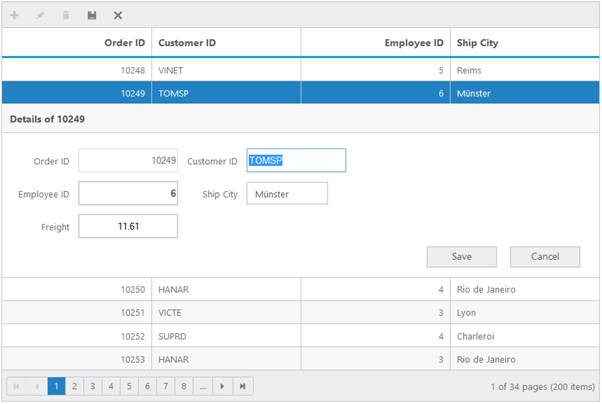

After the template elements are converted to JS controls using ActionComplete event.

### External Form

By setting the `EditMode` as `ExternalForm`, the edit form is opened outside the grid content.

The following code example describes the above behavior.




    
           <ej:Grid ID="FlatGrid" runat="server"  AllowPaging="true" >
           <EditSettings AllowEditing="true" AllowAdding="true" AllowDeleting="true" EditMode="ExternalForm"></EditSettings>
           <ToolbarSettings ShowToolbar="true" ToolbarItems="add,edit,delete,update,cancel"></ToolbarSettings>
           <Columns>
                <ej:Column Field="OrderID" IsPrimaryKey="true" />
                <ej:Column Field="CustomerID" EditType="StringEdit"/>
                <ej:Column Field="Freight" EditType="NumericEdit">
                <ej:Column Field="ShipCountry" EditType="DropdownEdit"/>
                <ej:Column Field="OrderDate" EditType="DatePicker" Format="{0:MM/dd/yyyy}"/>
           </Columns>
           </ej:Grid >  




    namespace WebSampleBrowser.Grid
        {
            public partial class _Default : Page
              { 
                 List<Orders> order = new List<Orders>();
                 protected void Page_Load(object sender, EventArgs e)
                 {
                   BindDataSource();
                  }
                 private void BindDataSource()
                  {   
                     int code = 10000;
                     for (int i = 1; i < 10; i++)
                     {
                      order.Add(new Orders(code + 1, "ALFKI", 34.3 * i, "France",new DateTime(1991, 05, 15));
                      order.Add(new Orders(code + 2, "ANATR", 35.3 * i, "Germany",new DateTime(1990, 04, 04));
                      order.Add(new Orders(code + 3, "ANTON", 325.3 * i, "Brazil",new DateTime(1957, 11, 30));
                      order.Add(new Orders(code + 4, "BLONP", 435.3 * i, "Italy", new DateTime(1930, 10, 22));
                      order.Add(new Orders(code + 5, "BOLID", ,46.3 * i, "Mexico",new DateTime(1953, 02, 18));
                      code += 5;
                     }
                    this.FlatGrid.DataSource = order;
                    this.FlatGrid.DataBind();
                  }
                  [Serializable]
                  public class Orders
                   {
                     public Orders()
                      {

                      }
                     public Orders(long OrderId, string CustomerId,double Freight,string ShipCountry,DateTime OrderDate)
                      {
                        this.OrderID = OrderId;
                        this.CustomerID = CustomerId;
                        this.Freight = Freight;
                        this.ShipCountry = ShipCountry;
                        this.OrderDate = orderDate;
                        
                      }
                     public long OrderID { get; set; }
                     public string CustomerID { get; set; }
                     public double Freight { get; set; }
                     public string ShipCountry { get; set; }
                     public DateTime OrderDate { get; set; }
                    
                   }
              }
        } 

    
  

The following output is displayed as a result of the above code example.

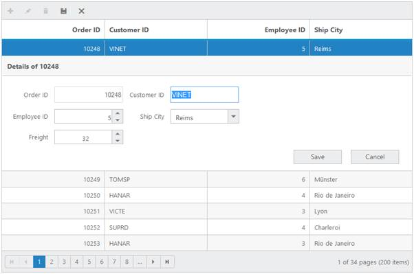

Form Position:

You can position an External edit form in the following two ways. 

1. Top-right
2. Bottom left

This can be achieved by setting the `FormPosition` property of `EditSettings` as 'TopRight' or 'BottomLeft'.

The following code example describes the above behavior.




    
         <ej:Grid ID="FlatGrid" runat="server"  AllowPaging="true" >
           <EditSettings AllowEditing="true" AllowAdding="true" AllowDeleting="true" EditMode="ExternalForm" FormPosition="TopRight"></EditSettings>
           <ToolbarSettings ShowToolbar="true" ToolbarItems="add,edit,delete,update,cancel"></ToolbarSettings>
           <Columns>
                <ej:Column Field="OrderID" IsPrimaryKey="true" />
                <ej:Column Field="CustomerID" EditType="StringEdit"/>
                <ej:Column Field="Freight" EditType="NumericEdit"/>
                <ej:Column Field="ShipCountry" EditType="DropdownEdit"/>
           </Columns>
         </ej:Grid >             
         




    namespace WebSampleBrowser.Grid
        {
            public partial class _Default : Page
              { 
                 List<Orders> order = new List<Orders>();
                 protected void Page_Load(object sender, EventArgs e)
                 {
                   BindDataSource();
                  }
                 private void BindDataSource()
                  {   
                     int code = 10000;
                     for (int i = 1; i < 10; i++)
                     {
                      order.Add(new Orders(code + 1, "ALFKI", 34.3 * i, "France");
                      order.Add(new Orders(code + 2, "ANATR", 35.3 * i, "Germany");
                      order.Add(new Orders(code + 3, "ANTON", 325.3 * i, "Brazil");
                      order.Add(new Orders(code + 4, "BLONP", 435.3 * i, "Italy");
                      order.Add(new Orders(code + 5, "BOLID", ,46.3 * i, "Mexico");
                      code += 5;
                     }
                    this.FlatGrid.DataSource = order;
                    this.FlatGrid.DataBind();
                  }
                  [Serializable]
                  public class Orders
                   {
                     public Orders()
                      {

                      }
                     public Orders(long OrderId, string CustomerId,double Freight,string ShipCountry)
                      {
                        this.OrderID = OrderId;
                        this.CustomerID = CustomerId;
                        this.Freight = Freight;
                        this.ShipCountry = ShipCountry;
                      }
                     public long OrderID { get; set; }
                     public string CustomerID { get; set; }
                     public double Freight { get; set; }
                     public string ShipCountry { get; set; }
                    }
              }
        } 

    
  

The following output is displayed as a result of the above code example.

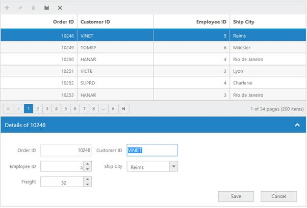

### External Template Form

You can edit any of the fields pertaining to a single record of data and apply it to a template so that the same format is applied to all the other records that you may edit later.

Using this template support, you can edit the fields that are not bound to grid columns.

To edit the records using External template form, set `EditMode` as `ExternalFormTemplate` and specify the template id to `ExternalFormTemplateID` property of `EditSettings`.

While using template, you can change the elements that are defined in the template, to appropriate JS controls based on the column type. This can be achieved by using `ActionComplete` event of grid.

N> 1. `value` attribute is used to bind the corresponding field value while editing. 
N> 2. `name` attribute is used to get the changed field values while save the edited record. 

The following code example describes the above behavior.




    
          <ej:Grid ID="FlatGrid" runat="server" AllowPaging="true" >
           <EditSettings AllowEditing="true" AllowAdding="true" AllowDeleting="true" EditMode="ExternalFormTemplate" ExternalFormTemplateID="#template"></EditSettings>
           <ClientSideEvents ActionComplete ="complete"/>
           <ToolbarSettings ShowToolbar="true" ToolbarItems="add,edit,delete,update,cancel"></ToolbarSettings>
           <Columns>
                <ej:Column Field="OrderID" IsPrimaryKey="true"/>
                <ej:Column Field="CustomerID" />
                <ej:Column Field="ShipCity"/>
          </Columns>
          </ej:Grid >                 
         


			  
    

	    
			  




    namespace WebSampleBrowser.Grid
        {
            public partial class _Default : Page
              { 
                 List<Orders> order = new List<Orders>();
                 protected void Page_Load(object sender, EventArgs e)
                 {
                   BindDataSource();
                  }
                 private void BindDataSource()
                  {   
                     int code = 10000;
                     for (int i = 1; i < 10; i++)
                     {
                      order.Add(new Orders(code + 1, "ALFKI","Reims");
                      order.Add(new Orders(code + 2, "ANATR","Munster" );
                      order.Add(new Orders(code + 3, "ANTON","Berlin");
                      order.Add(new Orders(code + 4, "BLONP","Mexico" );
                      order.Add(new Orders(code + 5, "BOLID","Bern");
                      code += 5;
                     }
                    this.FlatGrid.DataSource = order;
                    this.FlatGrid.DataBind();
                  }
                  [Serializable]
                  public class Orders
                   {
                     public Orders()
                      {

                      }
                     public Orders(long OrderId, string CustomerId,string ShipCity)
                      {
                        this.OrderID = OrderId;
                        this.CustomerID = CustomerId;
                        this.ShipCity = ShipCity;
                      }
                     public long OrderID { get; set; }
                     public string CustomerID { get; set; }
                     public string ShipCity { get; set; }
                    }
              }
        } 

    
  

The following output is displayed as a result of the above code example.

Before the template elements are converted to JS controls

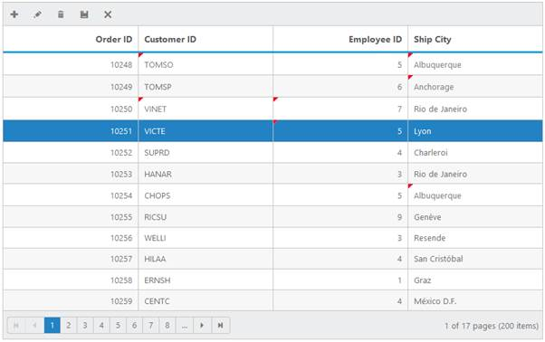

After the template elements are converted to JS controls using ActionComplete event.

### Batch / Excel-like

Users can start editing by clicking a cell and typing data into it. Edited cell will be marked while navigating to next cell or any other row, so that you know which fields or cells has been edited. Set `EditMode` as `Batch` to enable batch editing.

N> `getBatchChanges` method of grid holds the unsaved record changes.
N> Refer the KB [link](http://www.syncfusion.com/kb/3016/how-to-suppress-grid-confirmation-messages# "link") for "How to suppress grid confirmation messages" in batch mode.

The following code example describes the above behavior.




    
          <ej:Grid ID="FlatGrid" runat="server"  AllowPaging="true">
           <EditSettings AllowEditing="true" AllowAdding="true" AllowDeleting="true" EditMode="Batch"></EditSettings>
           <ToolbarSettings ShowToolbar="true" ToolbarItems="add,edit,delete,update,cancel"></ToolbarSettings>
             <Columns>
                <ej:Column Field="OrderID" IsPrimaryKey="true" />
                <ej:Column Field="CustomerID" EditType="StringEdit" />
                <ej:Column Field="Freight"  EditType="NumericEdit"/>
                <ej:Column Field="ShipCountry" EditType="DropdownEdit"/>
                <ej:Column Field="OrderDate" EditType="DatePicker"  Format="{0:MM/dd/yyyy}"/>
             </Columns>
          </ej:Grid >              
         




    namespace WebSampleBrowser.Grid
        {
            public partial class _Default : Page
              { 
                 List<Orders> order = new List<Orders>();
                 protected void Page_Load(object sender, EventArgs e)
                 {
                   BindDataSource();
                  }
                 private void BindDataSource()
                  {   
                     int code = 10000;
                     for (int i = 1; i < 10; i++)
                     {
                      order.Add(new Orders(code + 1, "ALFKI", 34.3 * i, "France",new DateTime(1991, 05, 15));
                      order.Add(new Orders(code + 2, "ANATR", 35.3 * i, "Germany",new DateTime(1990, 04, 04));
                      order.Add(new Orders(code + 3, "ANTON", 325.3 * i, "Brazil",new DateTime(1957, 11, 30));
                      order.Add(new Orders(code + 4, "BLONP", 435.3 * i, "Italy", new DateTime(1930, 10, 22));
                      order.Add(new Orders(code + 5, "BOLID", ,46.3 * i, "Mexico",new DateTime(1953, 02, 18));
                      code += 5;
                     }
                    this.FlatGrid.DataSource = order;
                    this.FlatGrid.DataBind();
                  }
                  [Serializable]
                  public class Orders
                   {
                     public Orders()
                      {

                      }
                     public Orders(long OrderId, string CustomerId,double Freight,string ShipCountry,DateTime orderDate)
                      {
                        this.OrderID = OrderId;
                        this.CustomerID = CustomerId;
                        this.Freight = Freight;
                        this.ShipCountry = ShipCountry;
                        this.OrderDate = orderDate;
                        
                      }
                     public long OrderID { get; set; }
                     public string CustomerID { get; set; }
                     public double Freight { get; set; }
                     public string ShipCountry { get; set; }
                     public DateTime OrderDate { get; set; }
                    
                   }
              }
        } 

    
  
The following output is displayed as a result of the above code example.

## Confirmation messages

To show the confirm dialog while saving or discarding the Batch changes (discarding during the grid action like filtering, sorting and paging), set `ShowConfirmDialog` as `true`.

N> `ShowConfirmDialog` property is only for Batch editing mode.

The following code example describes the above behavior.




    
         <ej:Grid ID="FlatGrid" runat="server" AllowPaging="true">
           <EditSettings AllowEditing="true" AllowAdding="true" AllowDeleting="true" EditMode="Batch" ShowConfirmDialog="true"></EditSettings>
           <ToolbarSettings ShowToolbar="true" ToolbarItems="add,edit,delete,update,cancel"></ToolbarSettings>
            <Columns>
                <ej:Column Field="OrderID" IsPrimaryKey="true" />
                <ej:Column Field="CustomerID" EditType="StringEdit"/>
                <ej:Column Field="Freight"  EditType="NumericEdit"/>
                <ej:Column Field="ShipCountry" EditType="DropdownEdit"/>
                <ej:Column Field="OrderDate" EditType="DatePicker" Format="{0:MM/dd/yyyy}"/>
            </Columns>
          </ej:Grid >                    
         




    namespace WebSampleBrowser.Grid
        {
            public partial class _Default : Page
              { 
                 List<Orders> order = new List<Orders>();
                 protected void Page_Load(object sender, EventArgs e)
                 {
                   BindDataSource();
                  }
                 private void BindDataSource()
                  {   
                     int code = 10000;
                     for (int i = 1; i < 10; i++)
                     {
                      order.Add(new Orders(code + 1, "ALFKI", 34.3 * i, "France",new DateTime(1991, 05, 15));
                      order.Add(new Orders(code + 2, "ANATR", 35.3 * i, "Germany",new DateTime(1990, 04, 04));
                      order.Add(new Orders(code + 3, "ANTON", 325.3 * i, "Brazil",new DateTime(1957, 11, 30));
                      order.Add(new Orders(code + 4, "BLONP", 435.3 * i, "Italy", new DateTime(1930, 10, 22));
                      order.Add(new Orders(code + 5, "BOLID", ,46.3 * i, "Mexico",new DateTime(1953, 02, 18));
                      code += 5;
                     }
                    this.FlatGrid.DataSource = order;
                    this.FlatGrid.DataBind();
                  }
                  [Serializable]
                  public class Orders
                   {
                     public Orders()
                      {

                      }
                     public Orders(long OrderId, string CustomerId,double Freight,string ShipCountry,DateTime OrderDate)
                      {
                        this.OrderID = OrderId;
                        this.CustomerID = CustomerId;
                        this.Freight = Freight;
                        this.ShipCountry = ShipCountry;
                        this.OrderDate = orderDate;
                      }
                     public long OrderID { get; set; }
                     public string CustomerID { get; set; }
                     public double Freight { get; set; }
                     public string ShipCountry { get; set; }
                     public DateTime OrderDate { get; set; }
                    
                   }
              }
        } 

    
  

The following output is displayed as a result of the above code example.

To show delete confirm dialog while deleting a record, set `ShowDeleteConfirmDialog` as true.

N> `ShowDeleteConfirmDialog` property is for all type of `EditMode`.

The following code example describes the above behavior.




    
           <ej:Grid ID="FlatGrid" runat="server"  AllowPaging="true">
           <EditSettings AllowEditing="true" AllowAdding="true" AllowDeleting="true" EditMode="Batch"  ShowDeleteConfirmDialog="true"  ></EditSettings>
           <ToolbarSettings ShowToolbar="true" ToolbarItems="add,edit,delete,update,cancel"></ToolbarSettings>
            <Columns>
                <ej:Column Field="OrderID" IsPrimaryKey="true"/>
                <ej:Column Field="CustomerID" EditType="StringEdit"/>
                <ej:Column Field="Freight"  EditType="NumericEdit"/>
                <ej:Column Field="ShipCountry" EditType="DropdownEdit"/>
                <ej:Column Field="OrderDate"  EditType="DatePicker"  Format="{0:MM/dd/yyyy}"/>
            </Columns>
           </ej:Grid >   




    namespace WebSampleBrowser.Grid
        {
            public partial class _Default : Page
              { 
                 List<Orders> order = new List<Orders>();
                 protected void Page_Load(object sender, EventArgs e)
                 {
                   BindDataSource();
                  }
                 private void BindDataSource()
                  {   
                     int code = 10000;
                     for (int i = 1; i < 10; i++)
                     {
                      order.Add(new Orders(code + 1, "ALFKI", 34.3 * i, "France",new DateTime(1991, 05, 15));
                      order.Add(new Orders(code + 2, "ANATR", 35.3 * i, "Germany",new DateTime(1990, 04, 04));
                      order.Add(new Orders(code + 3, "ANTON", 325.3 * i, "Brazil",new DateTime(1957, 11, 30));
                      order.Add(new Orders(code + 4, "BLONP", 435.3 * i, "Italy", new DateTime(1930, 10, 22));
                      order.Add(new Orders(code + 5, "BOLID", ,46.3 * i, "Mexico",new DateTime(1953, 02, 18));
                      code += 5;
                     }
                    this.FlatGrid.DataSource = order;
                    this.FlatGrid.DataBind();
                  }
                  [Serializable]
                  public class Orders
                   {
                     public Orders()
                      {

                      }
                     public Orders(long OrderId, string CustomerId,double Freight,string ShipCountry,DateTime OrderDate)
                      {
                        this.OrderID = OrderId;
                        this.CustomerID = CustomerId;
                        this.Freight = Freight;
                        this.ShipCountry = ShipCountry;
                        this.OrderDate = orderDate;
                        
                      }
                     public long OrderID { get; set; }
                     public string CustomerID { get; set; }
                     public double Freight { get; set; }
                     public string ShipCountry { get; set; }
                     public DateTime OrderDate { get; set; }
                    
                   }
              }
        } 

    
  

The following output is displayed as a result of the above code example.

## Column Validation

We can validate the value of the added or edited record cell before saving.

The below validation script files are needed when editing is enabled with validation.

1. jquery.validate.min.js
2. jquery.validate.unobtrusive.min.js
 
 
### jQuery Validation

You can set validation rules using ` ValidationRule` property of `Columns`. The following are jQuery validation methods.

__List__ __of__ __Jquery__ __validation__ __methods__

<table>
<tr>
<th>
Rules</th><th>
Description</th></tr>
<tr>
<td>
required</td><td>
Requires an element.</td></tr>
<tr>
<td>
remote</td><td>
Requests a resource to check the element for validity.</td></tr>
<tr>
<td>
minlength</td><td>
Requires the element to be of given minimum length.</td></tr>
<tr>
<td>
maxlength</td><td>
Requires the element to be of given maximum length.</td></tr>
<tr>
<td>
rangelength</td><td>
Requires the element to be in given value range.</td></tr>
<tr>
<td>
min</td><td>
The element requires a given minimum.</td></tr>
<tr>
<td>
max</td><td>
The element requires a given maximum.</td></tr>
<tr>
<td>
range</td><td>
Requires the element to be in a given value range.</td></tr>
<tr>
<td>
email</td><td>
The element requires a valid email.</td></tr>
<tr>
<td>
url</td><td>
The element requires a valid URL</td></tr>
<tr>
<td>
date</td><td>
Requires the element to be a date.</td></tr>
<tr>
<td>
dateISO</td><td>
The element requires an ISO date.</td></tr>
<tr>
<td>
number</td><td>
The element requires a decimal number.</td></tr>
<tr>
<td>
digits</td><td>
The element requires digits only.</td></tr>
<tr>
<td>
creditcard</td><td>
Requires the element to be a credit card number.</td></tr>
<tr>
<td>
equalTo</td><td>
Requires the element to be the same as another.</td></tr>
</table>

Grid supports all the standard validation methods of jQuery, please refer the jQuery validation documentation [link](http://jqueryvalidation.org/documentation/# "link") for more information.

The following code example describes the above behavior.




    
          <ej:Grid ID="FlatGrid" runat="server" AllowPaging="true">
           <EditSettings AllowEditing="true" AllowAdding="true" AllowDeleting="true"></EditSettings>
           <ToolbarSettings ShowToolbar="true" ToolbarItems="add,edit,delete,update,cancel"></ToolbarSettings>
           <Columns>
                <ej:Column Field="OrderID" IsPrimaryKey="true">
                   <ValidationRule>
                       <ej:KeyValue Key="required" Value="true"/>
                       <ej:KeyValue Key="number" Value="true"/>
                   </ValidationRule>
                </ej:Column>
                <ej:Column Field="CustomerID"  EditType="StringEdit" >
                    <ValidationRule>
                       <ej:KeyValue Key="required" Value="true" />
                       <ej:KeyValue Key="minlength" Value="true"/>
                    </ValidationRule>
                </ej:Column>
                <ej:Column Field="ShipCity" EditType="DropdownEdit"/>
                <ej:Column Field="Freight" EditType="NumericEdit">
                    <ValidationRule>
                      <ej:KeyValue Key="required" Value="true" />
                      <ej:KeyValue Key="range" Value="[0,1000]" />
                    </ValidationRule>
                </ej:Column>
                <ej:Column Field="ShipCountry" EditType="DropdownEdit"/>
            </Columns> 
            </ej:Grid>                 
         
 



    namespace WebSampleBrowser.Grid
        {
            public partial class _Default : Page
              { 
                 List<Orders> order = new List<Orders>();
                 protected void Page_Load(object sender, EventArgs e)
                 {
                   BindDataSource();
                  }
                 private void BindDataSource()
                  {   
                     int code = 10000;
                     for (int i = 1; i < 10; i++)
                     {
                      order.Add(new Orders(code + 1, "ALFKI", 34.3 * i,"Reims", "France");
                      order.Add(new Orders(code + 2, "ANATR", 35.3 * i, "Munster","Germany");
                      order.Add(new Orders(code + 3, "ANTON", 325.3 * i,"Mexico","Brazil");
                      order.Add(new Orders(code + 4, "BLONP", 435.3 * i,"Berlin","Italy");
                      order.Add(new Orders(code + 5, "BOLID", ,46.3 * i,"Bern","Mexico");
                      code += 5;
                     }
                    this.FlatGrid.DataSource = order;
                    this.FlatGrid.DataBind();
                  }
                  [Serializable]
                  public class Orders
                   {
                     public Orders()
                      {

                      }
                     public Orders(long OrderId, string CustomerId,double Freight,string ShipCity,string ShipCountry)
                      {
                        this.OrderID = OrderId;
                        this.CustomerID = CustomerId;
                        this.Freight = Freight;
                        this.ShipCity = ShipCity;
                        this.ShipCountry = ShipCountry;
                      }
                     public long OrderID { get; set; }
                     public string CustomerID { get; set; }
                     public double Freight { get; set; }
                     public string ShipCity{ get; set; }
                     public string ShipCountry { get; set; }
                    
                   }
              }
        } 

    
  

The following output is displayed as a result of the above code example.

N> 1. Refer this [Knowledge Base link](https://www.syncfusion.com/kb/6817/how-to-perform-server-side-validation-in-grid) to perform server side validation in Grid.

### Custom Validation

In addition to jQuery validation methods, you can also add your own custom validation methods for a specific column. Function call to custom validator function to be mentioned within `ValidationRule` property of `Columns`. 

Using `messages` property of `ValidationRule` you can specify the error message for that column.

The following code example describes the above behavior.




    
         <ej:Grid ID="FlatGrid" runat="server" AllowPaging="true" >
           <EditSettings AllowEditing="true" AllowAdding="true" AllowDeleting="true"></EditSettings>
           <ToolbarSettings ShowToolbar="true" ToolbarItems="add,edit,delete,update,cancel"></ToolbarSettings>
           <Columns>
                <ej:Column Field="OrderID" IsPrimaryKey="true" />
                <ej:Column Field="CustomerID" EditType="StringEdit" >
                   <ValidationRule>
                     <ej:KeyValue Key="customRegex" Value="5" />
                   </ValidationRule>
                </ej:Column>
                <ej:Column Field="Freight" EditType="NumericEdit">
                   <ValidationRule>
                     <ej:KeyValue Key="customCompare" Value="[0,1000]"/>
                   </ValidationRule>
                </ej:Column>
                <ej:Column Field="ShipCity" EditType="DropdownEdit" />
                <ej:Column Field="ShipCountry" EditType="DropdownEdit"/>
           </Columns> 
           </ej:Grid>                 
         


           
          
          
     




    namespace WebSampleBrowser.Grid
        {
            public partial class _Default : Page
              { 
                 List<Orders> order = new List<Orders>();
                 protected void Page_Load(object sender, EventArgs e)
                 {
                   BindDataSource();
                  }
                 private void BindDataSource()
                  {   
                     int code = 10000;
                     for (int i = 1; i < 10; i++)
                     {
                      order.Add(new Orders(code + 1, "ALFKI", 34.3 * i,"Reims", "France");
                      order.Add(new Orders(code + 2, "ANATR", 35.3 * i, "Munster","Germany");
                      order.Add(new Orders(code + 3, "ANTON", 325.3 * i,"Mexico","Brazil");
                      order.Add(new Orders(code + 4, "BLONP", 435.3 * i,"Berlin","Italy");
                      order.Add(new Orders(code + 5, "BOLID", ,46.3 * i,"Bern","Mexico");
                      code += 5;
                     }
                    this.FlatGrid.DataSource = order;
                    this.FlatGrid.DataBind();
                  }
                  [Serializable]
                  public class Orders
                   {
                     public Orders()
                      {

                      }
                     public Orders(long OrderId, string CustomerId,double Freight,string ShipCity,string ShipCountry)
                      {
                        this.OrderID = OrderId;
                        this.CustomerID = CustomerId;
                        this.Freight = Freight;
                        this.ShipCity = ShipCity;
                        this.ShipCountry = ShipCountry;
                      }
                     public long OrderID { get; set; }
                     public string CustomerID { get; set; }
                     public double Freight { get; set; }
                     public string ShipCity{ get; set; }
                     public string ShipCountry { get; set; }
                    
                   }
              }
        } 

    
  

The following output is displayed as a result of the above code example.

## Persisting data in Server

Edited data can be persisted in database using RESTful web services. 

All the CRUD operations in grid are done through DataManager. DataManager have an option to bind all the CRUD related data in server side. Please refer the ['link'] to know about the DataManager.

In the below section, we have explained how to get the edited data details at the server side using WebMethodAdaptor. 

### WebMethod Adaptor

You can use the `WebMethodAdaptor` of `DataManger` when binding datasource from remote data. At initial load of Grid, using URL property of DataManager, data are fetched from remote data and bound to Grid. You can map CRUD operation in Grid to Server-Side Controller action using the properties `InsertURL`, `RemoveURL`, `UpdateURL`, `CrudURL` and `BatchURL`.

The following code example describes the above behavior.




    
    <ej:DataManager runat="server"  ID="Data" URL="Default.aspx/Data"  Adaptor="WebMethodAdaptor" UpdateURL="Default.aspx/Update" InsertURL="Default.aspx/Insert" RemoveURL="Default.aspx/Remove" />
        <ej:Grid ID="FlatGrid" DataManagerID="Data" runat="server" AllowPaging="true" >
          <EditSettings AllowEditing="true" AllowAdding="true" AllowDeleting="true" ></EditSettings>
           <ToolbarSettings ShowToolbar="true" ToolbarItems="add,edit,delete,update,cancel"></ToolbarSettings>
            <Columns>
                <ej:Column Field="OrderID" IsPrimaryKey="true"/>
                <ej:Column Field="CustomerID" />
                <ej:Column Field="EmployeeID"/>
                <ej:Column Field="Freight" EditType="NumericEdit"><NumericEditOptions DecimalPlaces="2"></NumericEditOptions></ej:Column>
                <ej:Column Field="ShipName" />
                <ej:Column Field="ShipCountry"/>
            </Columns>
        </ej:Grid >                    
         


Also when you use `WebMethodAdaptor`, you need to return the data as `JSON` and the JSON object must contain a property as `result` with dataSource as its value and one more property `count` with the dataSource total records count as its value.

The following code example describes the above behavior.



    public partial class _Default : Page
       {
         protected void Page_Load(object sender, EventArgs e)
           {

           }
         [WebMethod]
         [ScriptMethod(ResponseFormat = ResponseFormat.Json)]
         public static object Data(Syncfusion.JavaScript.DataManager value)
           { 
              IEnumerable DataSource = OrderRepository.GetAllRecords();
              DataResult result = new DataResult();
              DataOperations operation = new DataOperations();
              result.result = DataSource;
              result.count = result.result.AsQueryable().Count();
              if (value.Skip > 0)
               result.result = operation.PerformSkip(result.result, value.Skip);
              if (value.Take > 0)
               result.result = operation.PerformTake(result.result, value.Take);
              return result;    
          }
            
          public class DataResult
              {
                public IEnumerable result { get; set; }
                public int count { get; set; }
              }
          }
      

    
 

The grid actions (sorting, filtering, paging, searching, and aggregates) details are obtained in the `DataManager` class. While initializing the grid, paging only enabled hence in the below screen shot paging details are bound to the DataManager class.

Please refer the below screen shot.

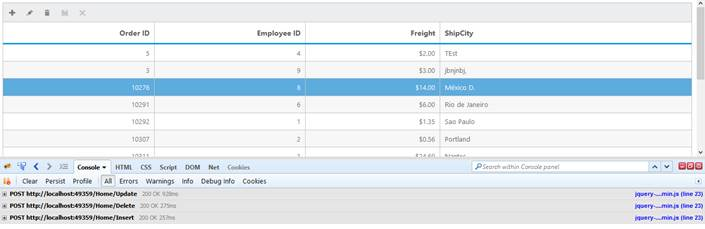

Also, using 'DataOperations' helper class you can perform grid action at server side. The in-built methods that we have provided in the DataOperations class are listed below.

1. PerformSorting
2. PerformFiltering
3. PerformSearching
4. PerformSkip
5. PerformTake
6. PerformWhereFilter
7. PerformSelect
8. Execute

### Accessing CRUD action request details in server side:

The 'Server-Side' function must be declared with the following parameter name for each editing functionality.

__Parameters__ __Table__

<table>
        <tr>
            <th>
                Action
            </th>
            <th>
                Parameter Name</th>
            <th>
                Example
            </th>
        </tr>
        <tr>
            <td rowspan="2">
                Update,Insert
            </td>
            <td>
                value
            </td>
            <td rowspan="2">
               public static object Update(EditableOrder value){ }
            </td>
        </tr>
        <tr>
           
            <td>
                public static object Insert(EditableOrder value){ }
            </td>
        </tr>
        <tr>
            <td>
                Remove
            </td>
            <td>
                key
            </td>
            <td>
               public static object Remove(int key){ }
            </td>
        </tr>
        <tr>
            <td>
                Batch Add
            </td>
            <td>
                added
            </td>
            <td rowspan="3">
                 public static object BatchUpdate(string action, List &lt;EditableOrder&gt; added, List &lt;EditableOrder&gt; changed, List &lt;EditableOrder&gt; deleted, int? key){ }
            </td>
        </tr>
        <tr>
            <td>
                Batch Update
            </td>
            <td>
                changed
            </td>
            
        </tr>
        <tr>
            <td>
                Batch Delete
            </td>
            <td>
                deleted
            </td>
           
        </tr>
        <tr>
            <td>
                Crud Update,Crud Insert
            </td>
            <td>
                value, action
            </td>
            <td>
                 public static object CrudUrl(EditableOrder value, string action){ }
            </td>
        </tr>
        <tr>
            <td>
                Crud Remove
            </td>
            <td>
                action, key, keyColumn
            </td>
            <td>
                 public static object CrudUrl(string action, int? key, string keyColumn){ }
            </td>
        </tr>
        <tr>
            <td>
                Crud Remove - Multi Delete
            </td>
            <td>
                action, key, deleted
            </td>
            <td>
                 public static object CrudUrl(string action, string key, List &lt;EditableOrder&gt; deleted){ }
            </td>
        </tr>
 </table>

	
### Insert Record:

Using `InsertURL` property, you can specify the controller action mapping URL to perform insert operation at server side.

The following code example describes the above behavior.


     
      [WebMethod]
      [ScriptMethod(ResponseFormat = ResponseFormat.Json)]
      public static object Insert(Order value)
        {
           OrderRepository.Add(value);
            var data = OrderRepository.GetAllRecords();
        }



The newly added record details are bound to the 'value' parameter. Please refer the below image.

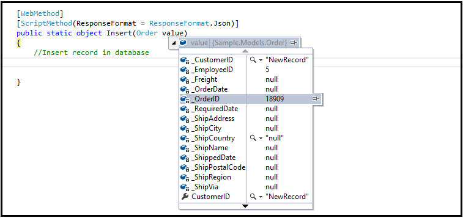

### Update Record:

Using `UpdateURL` property, you can specify the controller action mapping URL to perform save/update operation at server side.

The following code example describes the above behavior.


      
      [WebMethod]
      [ScriptMethod(ResponseFormat = ResponseFormat.Json)]
      public static object Update(Order value)
        {
            OrderRepository.Update(value);
            var data = OrderRepository.GetAllRecords();
        }    
         


The updated record details are bound to the 'value' parameter. Please refer the below image.

### Delete Record:

Using `RemoveURL` property, you can specify the controller action mapping URL to perform delete operation at server side.

The following code example describes the above behavior.



      [WebMethod]
      [ScriptMethod(ResponseFormat = ResponseFormat.Json)]
      public static object Remove(Order value)
        {
            OrderRepository.Delete(key);
            var data = OrderRepository.GetAllRecords();
        }    
     


The deleted record primary key value is bound to the 'key' parameter. Please refer the below image.

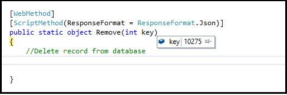

### CRUD URL:

Instead of specifying separate controller action method for CRUD (insert, update and delete)operation, using `CrudURL` property you can specify the controller action mapping URL to perform all the CRUD operation at server side using single method.

The action parameter of `CrudURL` is used to get the corresponding CRUD action.

The following code example describes the above behavior.




        
      <ej:DataManager runat="server" ID="Data"  Adaptor="WebMethodAdaptor" URL="Default.aspx/Data" CrudURL="Default.aspx/CrudUpdate"/>
         <ej:Grid ID="FlatGrid" DataManagerID="Data" runat="server" AllowPaging="true" >
           <EditSettings AllowEditing="true"  AllowAdding="true" AllowDeleting="true" ></EditSettings>
           <ToolbarSettings ShowToolbar="true" ToolbarItems="add,edit,delete,update,cancel"></ToolbarSettings>
            <Columns>
                <ej:Column Field="OrderID" IsPrimaryKey="true"/>
                <ej:Column Field="CustomerID" />
                <ej:Column Field="EmployeeID"/>
                <ej:Column Field="Freight"  EditType="NumericEdit"><NumericEditOptions DecimalPlaces="2"></NumericEditOptions></ej:Column>
                <ej:Column Field="ShipName" />
                <ej:Column Field="ShipCountry"/>
            </Columns>
          </ej:Grid >                   
         



      
      
       
        [WebMethod]
        [ScriptMethod(ResponseFormat = ResponseFormat.Json)]
        public static void CrudUpdate(EditableOrder value ,string action, int key)
        {
            if (action == "update")
            {
                OrderRepository.Update(value);
                var data = OrderRepository.GetAllRecords();               
            }
            if (action == "insert")
            {
                OrderRepository.Add(value);
                var data = OrderRepository.GetAllRecords();
            }
            if (action == "remove")
            {
                OrderRepository.Delete(key);
                var data = OrderRepository.GetAllRecords();
            }
        }


 

Please refer the below image to know about the action parameter

N> If you specify `InsertURL` along with `CrudURL` then while adding `InsertURL` only called.

### Batch URL:

The `BatchURL` property supports only for batch editing mode. You can specify the controller action mapping URL to perform Batch operation at server side.

The following code example describes the above behavior.




         
       <ej:DataManager runat="server"  Adaptor="WebMethodAdaptor" URL="Default.aspx/Data" BatchURL="Default.aspx/BatchUpdate"/>
         <ej:Grid ID="FlatGrid" DataManagerID="Data" runat="server" AllowPaging="true">
           <EditSettings AllowEditing="true" AllowAdding="true" AllowDeleting="true" EditMode="Batch"></EditSettings>
            <ToolbarSettings ShowToolbar="true" ToolbarItems="add,edit,delete,update,cancel"></ToolbarSettings>
              <Columns>
                <ej:Column Field="OrderID" IsPrimaryKey="true"/>
                <ej:Column Field="CustomerID"/>
                <ej:Column Field="EmployeeID"/>
                <ej:Column Field="Freight" EditType="NumericEdit"><NumericEditOptions DecimalPlaces="2"></NumericEditOptions></ej:Column>
                <ej:Column Field="ShipName" />
                <ej:Column Field="ShipCountry"/>
            </Columns>
         </ej:Grid >
              




         [WebMethod]
        [ScriptMethod(ResponseFormat = ResponseFormat.Json)]
        public static void BatchUpdate(List<EditableOrder> added, List<EditableOrder> changed, List<EditableOrder> deleted, int key)
        {
            if (changed != null)
                OrderRepository.Update(changed);
            if (deleted != null)
                OrderRepository.Delete(deleted);
            if (added != null)
                OrderRepository.Add(added);
        }





Please refer the below image for more information about batch parameters

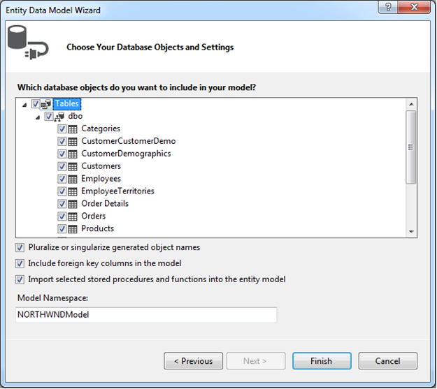

## Adding New Row Position

To add new row in the top or bottom position of grid content, set `RowPosition` property of `EditSettings` depending on the requirement.

The following code example describes the above behavior.




    
         <ej:Grid ID="FlatGrid" runat="server" AllowPaging="true" >
           <EditSettings AllowEditing="true" AllowAdding="true" AllowDeleting="true" RowPosition="Bottom"></EditSettings>
           <ToolbarSettings ShowToolbar="true" ToolbarItems="add,edit,delete,update,cancel"></ToolbarSettings>
            <Columns>
                <ej:Column Field="OrderID" IsPrimaryKey="true"/>
                <ej:Column Field="CustomerID" />
                <ej:Column Field="ShipCity"/>
                <ej:Column Field="Freight" EditType="NumericEdit"><NumericEditOptions DecimalPlaces="2"></NumericEditOptions></ej:Column>
                <ej:Column Field="ShipCountry"/>
            </Columns>
         </ej:Grid >                      
         




    namespace WebSampleBrowser.Grid
        {
            public partial class _Default : Page
              { 
                 List<Orders> order = new List<Orders>();
                 protected void Page_Load(object sender, EventArgs e)
                 {
                   BindDataSource();
                  }
                 private void BindDataSource()
                  {   
                     int code = 10000;
                     for (int i = 1; i < 10; i++)
                     {
                      order.Add(new Orders(code + 1, "ALFKI","Reims",34.3 * i,"France");
                      order.Add(new Orders(code + 2, "ANATR","Munster", 35.3 * i, "Germany");
                      order.Add(new Orders(code + 3, "ANTON","Berlin", 325.3 * i,"Brazil");
                      order.Add(new Orders(code + 4, "BLONP","Mexico", 435.3 * i, "Italy");
                      order.Add(new Orders(code + 5, "BOLID","Bern",46.3 * i, "Mexico");
                      code += 5;
                     }
                    this.FlatGrid.DataSource = order;
                    this.FlatGrid.DataBind();
                  }
                  [Serializable]
                  public class Orders
                   {
                     public Orders()
                      {

                      }
                     public Orders(long OrderId, string CustomerId,string ShipCity,double Freight,string ShipCountry)
                      {
                        this.OrderID = OrderId;
                        this.CustomerID = CustomerId;
                        this.ShipCity = ShipCity;
                        this.Freight = Freight;
                        this.ShipCountry = ShipCountry;
                      }
                     public long OrderID { get; set; }
                     public string CustomerID { get; set; }
                     public string ShipCity { get; set; }
                     public double Freight { get; set; }
                     public string ShipCountry { get; set; }
                   }
              }
        } 

    
  

The following output is displayed as a result of the above code example.

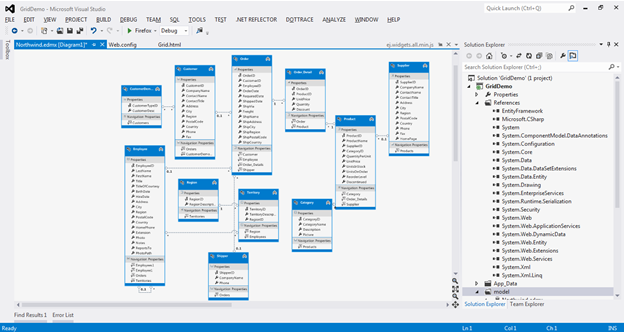

## Render with blank row for easy add new

The blank add new row is displayed in the grid content during grid initialization itself to add a new record easily. To enable show add new row by default, set `ShowAddNewRow` property of `EditSettings` as `true`.

The blank add new row is displayed either in the top or bottom of the corresponding page, its position is based on the `RowPosition` property of `EditSettings`.

The following code example describes the above behavior.




    
         <ej:Grid ID="FlatGrid" runat="server" AllowPaging="true" >
           <EditSettings AllowEditing="true" AllowAdding="true" AllowDeleting="true" ShowAddNewRow="true"></EditSettings>
           <ToolbarSettings ShowToolbar="true" ToolbarItems="add,edit,delete,update,cancel"></ToolbarSettings>
               <Columns>
                <ej:Column Field="OrderID" IsPrimaryKey="true"/>
                <ej:Column Field="CustomerID" />
                <ej:Column Field="ShipCity"/>
                <ej:Column Field="Freight" EditType="NumericEdit"><NumericEditOptions DecimalPlaces="2"></NumericEditOptions></ej:Column>
                <ej:Column Field="ShipCountry"/>
            </Columns>
         </ej:Grid >                   
         




     namespace WebSampleBrowser.Grid
        {
            public partial class _Default : Page
              { 
                 List<Orders> order = new List<Orders>();
                 protected void Page_Load(object sender, EventArgs e)
                 {
                   BindDataSource();
                  }
                 private void BindDataSource()
                  {   
                     int code = 10000;
                     for (int i = 1; i < 10; i++)
                     {
                      order.Add(new Orders(code + 1, "ALFKI","Reims",34.3 * i,"France");
                      order.Add(new Orders(code + 2, "ANATR","Munster", 35.3 * i, "Germany");
                      order.Add(new Orders(code + 3, "ANTON","Berlin", 325.3 * i,"Brazil");
                      order.Add(new Orders(code + 4, "BLONP","Mexico", 435.3 * i, "Italy");
                      order.Add(new Orders(code + 5, "BOLID","Bern",46.3 * i, "Mexico");
                      code += 5;
                     }
                    this.FlatGrid.DataSource = order;
                    this.FlatGrid.DataBind();
                  }
                  [Serializable]
                  public class Orders
                   {
                     public Orders()
                      {

                      }
                     public Orders(long OrderId, string CustomerId,string ShipCity,double Freight,string ShipCountry)
                      {
                        this.OrderID = OrderId;
                        this.CustomerID = CustomerId;
                        this.ShipCity = ShipCity;
                        this.Freight = Freight;
                        this.ShipCountry = ShipCountry;
                      }
                     public long OrderID { get; set; }
                     public string CustomerID { get; set; }
                     public string ShipCity { get; set; }
                     public double Freight { get; set; }
                     public string ShipCountry { get; set; }
                   }
              }
        } 

    
  

The following output is displayed as a result of the above code example.

N> 1. If it is remote, then the newly added record is placed based on the index from current view data. 
N> 2. If it is local, then the newly added record is added at the top of the page even if the added new `RowPosition` is mentioned as "Bottom".

## Default column values on add new

While adding new record in grid, there is an option to set the default value for the columns. Using `DefaultValue` property of `Columns` you can set the default values for that particular column while editing or adding a new row.

The following code example describes the above behavior.




    
        <ej:Grid ID="FlatGrid" runat="server" AllowPaging="true" >
           <EditSettings AllowEditing="true" AllowAdding="true" AllowDeleting="true" ShowAddNewRow="true"></EditSettings>
           <ToolbarSettings ShowToolbar="true" ToolbarItems="add,edit,delete,update,cancel"></ToolbarSettings>
           <Columns>
                <ej:Column Field="OrderID" IsPrimaryKey="true"/>
                <ej:Column Field="CustomerID" />
                <ej:Column Field="ShipCity" DefaultValue="Bern" />
                <ej:Column Field="Freight" EditType="NumericEdit" DefaultValue="45" />
                <ej:Column Field="ShipCountry" DefaultValue="Brazil" />
           </Columns>                   
         </ej:Grid>




    namespace WebSampleBrowser.Grid
        {
            public partial class _Default : Page
              { 
                 List<Orders> order = new List<Orders>();
                 protected void Page_Load(object sender, EventArgs e)
                 {
                   BindDataSource();
                  }
                 private void BindDataSource()
                  {   
                     int code = 10000;
                     for (int i = 1; i < 10; i++)
                     {
                      order.Add(new Orders(code + 1, "ALFKI","Reims",34.3 * i,"France");
                      order.Add(new Orders(code + 2, "ANATR","Munster", 35.3 * i, "Germany");
                      order.Add(new Orders(code + 3, "ANTON","Berlin", 325.3 * i,"Brazil");
                      order.Add(new Orders(code + 4, "BLONP","Mexico", 435.3 * i, "Italy");
                      order.Add(new Orders(code + 5, "BOLID","Bern",46.3 * i, "Mexico");
                      code += 5;
                     }
                    this.FlatGrid.DataSource = order;
                    this.FlatGrid.DataBind();
                  }
                  [Serializable]
                  public class Orders
                   {
                     public Orders()
                      {

                      }
                     public Orders(long OrderId, string CustomerId,string ShipCity,double Freight,string ShipCountry)
                      {
                        this.OrderID = OrderId;
                        this.CustomerID = CustomerId;
                        this.ShipCity = ShipCity;
                        this.Freight = Freight;
                        this.ShipCountry = ShipCountry;
                      }
                     public long OrderID { get; set; }
                     public string CustomerID { get; set; }
                     public string ShipCity { get; set; }
                     public double Freight { get; set; }
                     public string ShipCountry { get; set; }
                   }
              }
        } 

    
  

The following output is displayed as a result of the above code example.

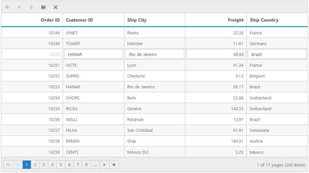

