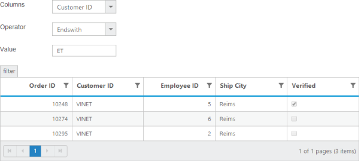
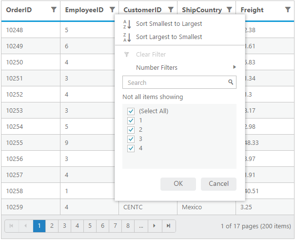
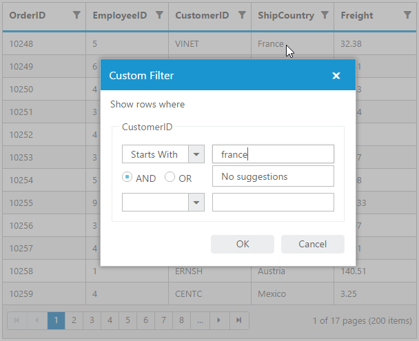
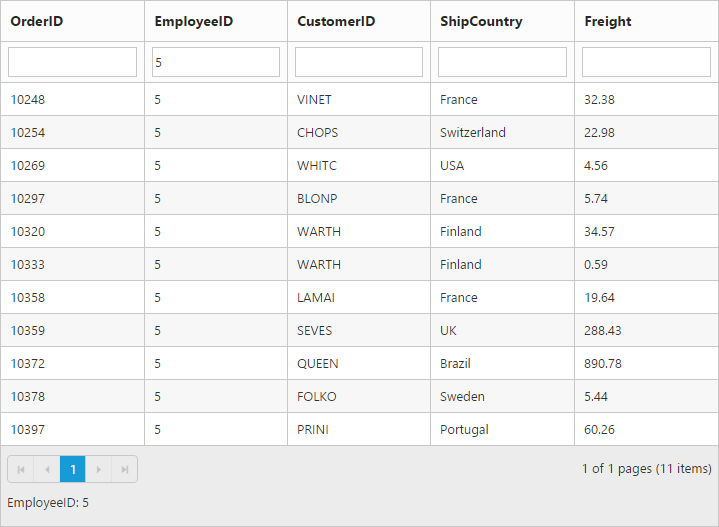

# Filtering

Filtering helps to view particular or related records from dataSource which meets a given filtering criteria. To enable filter, set `AllowFiltering` property as`true`.   

The Grid supports three types of filter, they are

1. Filter Bar
2. Menu 
3. Excel

And also four types of filter menu is available in all filter types, they are

1. String 
2. Numeric 
3. Date 
4. Boolean

The corresponding filter menu is opened based on the column type.

N>  1. Need to specify the `Type` of column, when first record data value is empty or null otherwise the filter menu is not opened. 
N>  2. The default filter type is Filter bar, when `AllowFiltering` is enabled and `FilterType` is not set.

The following code example describes the above behavior.




    
           <ej:Grid ID="FlatGrid" runat="server" AllowFiltering="true" AllowPaging="true" >
           <Columns>
                <ej:Column Field="OrderID" />
                <ej:Column Field="EmployeeID"  />
                <ej:Column Field="CustomerID"  />
                <ej:Column Field="ShipCountry"  />
                <ej:Column Field="Freight"  />
           </Columns>             
           </ej:Grid>
           




    namespace WebSampleBrowser.Grid
        {
            public partial class _Default : Page
              { 
                 List<Orders> order = new List<Orders>();
                 protected void Page_Load(object sender, EventArgs e)
                 {
                   BindDataSource();
                  }
                 private void BindDataSource()
                  {   
                     int code = 10000;
                     for (int i = 1; i < 10; i++)
                     {
                      order.Add(new Orders(code + 1, "ALFKI", i + 0, "France",34.3 * i));
                      order.Add(new Orders(code + 2, "ANATR", i + 2, "Germany",35.3 * i));
                      order.Add(new Orders(code + 3, "ANTON", i + 1, "Brazil" ,325.3 * i));
                      order.Add(new Orders(code + 4, "BLONP", i + 3, "Italy",435.3 * i, ));
                      order.Add(new Orders(code + 5, "BOLID", i + 4, "Mexico",46.3 * i));
                      code += 5;
                     }
                    this.FlatGrid.DataSource = order;
                    this.FlatGrid.DataBind();
                  }
                  [Serializable]
                  public class Orders
                   {
                     public Orders()
                      {

                      }
                     public Orders(long OrderId, int EmployeeId, string CustomerId, string ShipCountry,double Freight)
                      {
                        this.OrderID = OrderId;
                        this.EmployeeID = EmployeeId;
                        this.CustomerID = CustomerId;
                        this.Freight = Freight;
                        this.ShipCountry = ShipCountry;
                      }
                     public long OrderID { get; set; }
                     public int EmployeeID { get; set; }
                     public string CustomerID { get; set; }
                     public string ShipCountry { get; set; }
                     public double Freight { get; set; }
                   }
              }
        } 

    
  

The following output is displayed as a result of the above code example.

## Menu Filter

You can enable menu filter by setting `FilterType` as `Menu` in `FilterSettings`

There is an option to show or hide the additional filter options in the Menu by setting `ShowPredicate` as `true` or `false` in `FilterSettings` respectively.

We can also filter a specified range of values by using the `between` operator for the column type `number`, `date` and `datetime`.

The following code example describes the above behavior.




    
           <ej:Grid ID="FlatGrid" runat="server" AllowFiltering="true" AllowPaging="true" >
           <FilterSettings FilterType="Menu" />  
           <Columns>
                <ej:Column Field="OrderID" />
                <ej:Column Field="EmployeeID"  />
                <ej:Column Field="CustomerID"  />
                <ej:Column Field="OrderDate" Format="{0:MM/dd/yyyy}" />
                <ej:Column Field="Verified"  />
           </Columns>             
           </ej:Grid>            
         




    namespace WebSampleBrowser.Grid
        {
            public partial class _Default : Page
              { 
                 List<Orders> order = new List<Orders>();
                 protected void Page_Load(object sender, EventArgs e)
                 {
                   BindDataSource();
                  }
                 private void BindDataSource()
                  {   
                     int code = 10000;
                     for (int i = 1; i < 10; i++)
                     {
                      order.Add(new Orders(code + 1, "ALFKI", i + 0,new DateTime(1991, 05, 15),false)));
                      order.Add(new Orders(code + 2, "ANATR", i + 2,new DateTime(1991, 05, 15),false)));
                      order.Add(new Orders(code + 3, "ANTON", i + 1,new DateTime(1957, 11, 30),true)));
                      order.Add(new Orders(code + 4, "BLONP", i + 3,new DateTime(1930, 10, 22),false)));
                      order.Add(new Orders(code + 5, "BOLID", i + 4,new DateTime(1953, 02, 18),true)));
                      code += 5;
                     }
                    this.FlatGrid.DataSource = order;
                    this.FlatGrid.DataBind();
                  }
                  [Serializable]
                  public class Orders
                   {
                     public Orders()
                      {

                      }
                     public Orders(long OrderId, int EmployeeId, string CustomerId, string ShipCountry,double Freight)
                      {
                        this.OrderID = OrderId;
                        this.EmployeeID = EmployeeId;
                        this.CustomerID = CustomerId;
                        this.Freight = Freight;
                        this.ShipCountry = ShipCountry;
                      }
                     public long OrderID { get; set; }
                     public int EmployeeID { get; set; }
                     public string CustomerID { get; set; }
                     public string ShipCountry { get; set; }
                     public double Freight { get; set; }
                   }
              }
        } 

    
  

The following output is displayed as a result of the above code example.

Numeric Filter

String Filter

Date Filter

Boolean Filter

## Excel-like filter

You can enable excel menu by setting  `FilterType` as` Excel` in `FilterSettings` . The excel menu contains an option such as Sorting, Clear filter, submenu for advanced filtering.

The following code example describes the above behavior.




    
           <ej:Grid ID="FlatGrid" runat="server" AllowFiltering="true" AllowPaging="true" >
           <FilterSettings FilterType="Excel" />  
           <Columns>
                <ej:Column Field="OrderID" />
                <ej:Column Field="EmployeeID"  />
                <ej:Column Field="CustomerID"  />
                <ej:Column Field="ShipCountry"  />
                <ej:Column Field="Freight"  />
           </Columns>             
           </ej:Grid>           
         




    namespace WebSampleBrowser.Grid
        {
            public partial class _Default : Page
              { 
                 List<Orders> order = new List<Orders>();
                 protected void Page_Load(object sender, EventArgs e)
                 {
                   BindDataSource();
                  }
                 private void BindDataSource()
                  {   
                     int code = 10000;
                     for (int i = 1; i < 10; i++)
                     {
                      order.Add(new Orders(code + 1, "ALFKI", i + 0, "France",34.3 * i,));
                      order.Add(new Orders(code + 2, "ANATR", i + 2, "Germany",35.3 * i));
                      order.Add(new Orders(code + 3, "ANTON", i + 1, "Brazil" ,325.3 * i));
                      order.Add(new Orders(code + 4, "BLONP", i + 3, "Italy",435.3 * i, ));
                      order.Add(new Orders(code + 5, "BOLID", i + 4, "Mexico",46.3 * i));
                      code += 5;
                     }
                    this.FlatGrid.DataSource = order;
                    this.FlatGrid.DataBind();
                  }
                  [Serializable]
                  public class Orders
                   {
                     public Orders()
                      {

                      }
                     public Orders(long OrderId, int EmployeeId, string CustomerId, string ShipCountry,double Freight)
                      {
                        this.OrderID = OrderId;
                        this.EmployeeID = EmployeeId;
                        this.CustomerID = CustomerId;
                        this.Freight = Freight;
                        this.ShipCountry = ShipCountry;
                      }
                     public long OrderID { get; set; }
                     public int EmployeeID { get; set; }
                     public string CustomerID { get; set; }
                     public string ShipCountry { get; set; }
                     public double Freight { get; set; }
                   }
              }
        } 

    
  

The following output is displayed as a result of the above code example.

### Checkbox list generation:

By default, the checkbox list is generated from distinct values of the filter column from dataSource which gives an option to search and select the required items.

Also on checkbox list generation, if the number of distinct values are greater than 1000, then the excel filter will display only first 1000 values and show "Not all items shown" label to ensure the best performance on rendering and searching. However this limit has been customized according to your requirement by setting `MaxFilterChoices` with required limit in integer.

N> 1. Using excel filter events you can change the dataSource of the checkbox list. 
N> 2. `Query` of checkbox list can also be changed using excel filter events.

The following code example describes the above behavior.




    
           <ej:Grid ID="FlatGrid" runat="server" AllowFiltering="true" AllowPaging="true" >
           <FilterSettings FilterType="Excel" MaxFilterChoices="4" /> 
            <Columns>
                <ej:Column Field="OrderID" />
                <ej:Column Field="EmployeeID"  />
                <ej:Column Field="CustomerID"  />
                <ej:Column Field="ShipCountry"  />
                <ej:Column Field="Freight"  />
           </Columns>             
           </ej:Grid> 




    namespace WebSampleBrowser.Grid
        {
            public partial class _Default : Page
              { 
                 List<Orders> order = new List<Orders>();
                 protected void Page_Load(object sender, EventArgs e)
                 {
                   BindDataSource();
                  }
                 private void BindDataSource()
                  {   
                     int code = 10000;
                     for (int i = 1; i < 10; i++)
                     {
                      order.Add(new Orders(code + 1, "ALFKI", i + 0, "France",34.3 * i,));
                      order.Add(new Orders(code + 2, "ANATR", i + 2, "Germany",35.3 * i));
                      order.Add(new Orders(code + 3, "ANTON", i + 1, "Brazil" ,325.3 * i));
                      order.Add(new Orders(code + 4, "BLONP", i + 3, "Italy",435.3 * i, ));
                      order.Add(new Orders(code + 5, "BOLID", i + 4, "Mexico",46.3 * i));
                      code += 5;
                     }
                    this.FlatGrid.DataSource = order;
                    this.FlatGrid.DataBind();
                  }
                  [Serializable]
                  public class Orders
                   {
                     public Orders()
                      {

                      }
                     public Orders(long OrderId, int EmployeeId, string CustomerId, string ShipCountry,double Freight)
                      {
                        this.OrderID = OrderId;
                        this.EmployeeID = EmployeeId;
                        this.CustomerID = CustomerId;
                        this.Freight = Freight;
                        this.ShipCountry = ShipCountry;
                      }
                     public long OrderID { get; set; }
                     public int EmployeeID { get; set; }
                     public string CustomerID { get; set; }
                     public string ShipCountry { get; set; }
                     public double Freight { get; set; }
                   }
              }
        } 

    
  

The following output is displayed as a result of the above code example.

### Add current selection to filter checkbox:

When filtering is done multiple times on the same column then the previously filtered values on the column will be cleared. So, to retain the old values `Add current selection to filter` checkbox can be used which is displayed when data is searched in the search bar.

The following image describes the above mentioned behavior.

### Case Sensitivity

To perform filter operation with case sensitive in excel styled filter menu mode by setting `EnableCaseSensitivity` as `true`.

The following code example describes the above behavior.




    
           <ej:Grid ID="FlatGrid" runat="server" AllowFiltering="true" AllowPaging="true" >
           <FilterSettings FilterType="Excel" EnableCaseSensitivity="true" /> 
            <Columns>
                <ej:Column Field="OrderID" />
                <ej:Column Field="EmployeeID"  />
                <ej:Column Field="CustomerID"  />
                <ej:Column Field="ShipCountry"  />
                <ej:Column Field="Freight"  />
           </Columns>             
           </ej:Grid>            
         




    namespace WebSampleBrowser.Grid
        {
            public partial class _Default : Page
              { 
                 List<Orders> order = new List<Orders>();
                 protected void Page_Load(object sender, EventArgs e)
                 {
                   BindDataSource();
                  }
                 private void BindDataSource()
                  {   
                     int code = 10000;
                     for (int i = 1; i < 10; i++)
                     {
                      order.Add(new Orders(code + 1, "ALFKI", i + 0, "France",34.3 * i,));
                      order.Add(new Orders(code + 2, "ANATR", i + 2, "Germany",35.3 * i));
                      order.Add(new Orders(code + 3, "ANTON", i + 1, "Brazil" ,325.3 * i));
                      order.Add(new Orders(code + 4, "BLONP", i + 3, "Italy",435.3 * i, ));
                      order.Add(new Orders(code + 5, "BOLID", i + 4, "Mexico",46.3 * i));
                      code += 5;
                     }
                    this.FlatGrid.DataSource = order;
                    this.FlatGrid.DataBind();
                  }
                  [Serializable]
                  public class Orders
                   {
                     public Orders()
                      {

                      }
                     public Orders(long OrderId, int EmployeeId, string CustomerId, string ShipCountry,double Freight)
                      {
                        this.OrderID = OrderId;
                        this.EmployeeID = EmployeeId;
                        this.CustomerID = CustomerId;
                        this.Freight = Freight;
                        this.ShipCountry = ShipCountry;
                      }
                     public long OrderID { get; set; }
                     public int EmployeeID { get; set; }
                     public string CustomerID { get; set; }
                     public string ShipCountry { get; set; }
                     public double Freight { get; set; }
                   }
              }
        } 

    
  

The following output is displayed as a result of the above code example.

## Filter Bar

`Filter bar` row is located next to column header of grid. You can filter the records with different expressions depending upon the column type. To show the filter bar row, set the `FilterType` as `FilterBar`.

List of Filter bar Expressions:

You can enter the below filter expressions manually in the filter bar.

 <table>
        <tr>
            <th>
                Expression
            </th>
            <th>
                Example
            </th>
            <th>
                Description
            </th>
            <th>
                Column Type
            </th>
        </tr>
        <tr>
            <td>
                =
            </td>
            <td>
                = value
            </td>
            <td>
                Equal
            </td>
            <td rowspan="5">
                Numeric
            </td>
        </tr>
        <tr>
            <td>
                != 
            </td>
            <td>
                != value
            </td>
            <td>
                NotEqual
            </td>
           
        </tr>
        <tr>
            <td>
                >
            </td>
            <td>
                > value
            </td>
            <td>
                GreaterThan
            </td>
          
        </tr>
        <tr>
            <td>
                <
            </td>
            <td>
                < value
            </td>
            <td>
                LessThan
            </td>
          
        </tr>
        <tr>
            <td>
                >=
            </td>
            <td>
                >= value
            </td>
            <td>
                GreaterThanOrEqual
            </td>
           >
        </tr>
        <tr>
            <td>
                <=
            </td>
            <td>
                <= value
            </td>
            <td>
                LessThanOrEqual
            </td>
           
        </tr>
        <tr>
            <td>
                N/A
            </td>
            <td>
                N/A
            </td>
            <td>
                Always `StartsWith` operator will be used for string filter
            </td>
            <td>
                String
            </td>
        </tr>
        <tr>
            <td>
                N/A
            </td>
            <td>
                N/A
            </td>
            <td>
                Always `Equal` operator will be used for Date filter 
            </td>
            <td>
                Date
            </td>
        </tr>
        <tr>
            <td>
                N/A
            </td>
            <td>
                N/A
            </td>
            <td>
                Always `Equal` operator will be used for Boolean filter
            </td>
            <td>
                Boolean
            </td>
        </tr>
    </table>
	
	
The following code example describes the above behavior.




    
           <ej:Grid ID="FlatGrid" runat="server" AllowFiltering="true" AllowPaging="true" >
           <FilterSettings FilterType="FilterBar"  /> 
             <Columns>
                <ej:Column Field="OrderID" />
                <ej:Column Field="EmployeeID"  />
                <ej:Column Field="CustomerID"  />
                <ej:Column Field="ShipCountry"  />
                <ej:Column Field="Freight"  />
           </Columns>             
           </ej:Grid>            
         




    namespace WebSampleBrowser.Grid
        {
            public partial class _Default : Page
              { 
                 List<Orders> order = new List<Orders>();
                 protected void Page_Load(object sender, EventArgs e)
                 {
                   BindDataSource();
                  }
                 private void BindDataSource()
                  {   
                     int code = 10000;
                     for (int i = 1; i < 10; i++)
                     {
                      order.Add(new Orders(code + 1, "ALFKI", i + 0, "France",34.3 * i,));
                      order.Add(new Orders(code + 2, "ANATR", i + 2, "Germany",35.3 * i));
                      order.Add(new Orders(code + 3, "ANTON", i + 1, "Brazil" ,325.3 * i));
                      order.Add(new Orders(code + 4, "BLONP", i + 3, "Italy",435.3 * i, ));
                      order.Add(new Orders(code + 5, "BOLID", i + 4, "Mexico",46.3 * i));
                      code += 5;
                     }
                    this.FlatGrid.DataSource = order;
                    this.FlatGrid.DataBind();
                  }
                  [Serializable]
                  public class Orders
                   {
                     public Orders()
                      {

                      }
                     public Orders(long OrderId, int EmployeeId, string CustomerId, string ShipCountry,double Freight)
                      {
                        this.OrderID = OrderId;
                        this.EmployeeID = EmployeeId;
                        this.CustomerID = CustomerId;
                        this.Freight = Freight;
                        this.ShipCountry = ShipCountry;
                      }
                     public long OrderID { get; set; }
                     public int EmployeeID { get; set; }
                     public string CustomerID { get; set; }
                     public string ShipCountry { get; set; }
                     public double Freight { get; set; }
                   }
              }
        } 

    
  

The following output is displayed as a result of the above code example.

Filter bar modes:

This specifies the grid to start the filter action while typing in the filter bar or after pressing the enter key based on `FilterBarMode`.There are two types of `FilterBarMode`, they are

1. OnEnter
2. Immediate

Filter bar message:

The filter bar message is supported only for the `FilterType` as 'FilterBar'. The filtered data with column name is displayed in the grid pager itself. By default `ShowFilterBarStatus` is 'true'.

The following code example describes the above behavior.




    
           <ej:Grid ID="FlatGrid" runat="server" AllowFiltering="true" AllowPaging="true" >
            <FilterSettings ShowFilterBarStatus="true"  /> 
              <Columns>
                <ej:Column Field="OrderID" />
                <ej:Column Field="EmployeeID"  />
                <ej:Column Field="CustomerID"  />
                <ej:Column Field="ShipCountry"  />
                <ej:Column Field="Freight"  />
              </Columns>             
          </ej:Grid>         
         




    namespace WebSampleBrowser.Grid
        {
            public partial class _Default : Page
              { 
                 List<Orders> order = new List<Orders>();
                 protected void Page_Load(object sender, EventArgs e)
                 {
                   BindDataSource();
                  }
                 private void BindDataSource()
                  {   
                     int code = 10000;
                     for (int i = 1; i < 10; i++)
                     {
                      order.Add(new Orders(code + 1, "ALFKI", i + 0, "France",34.3 * i,));
                      order.Add(new Orders(code + 2, "ANATR", i + 2, "Germany",35.3 * i));
                      order.Add(new Orders(code + 3, "ANTON", i + 1, "Brazil" ,325.3 * i));
                      order.Add(new Orders(code + 4, "BLONP", i + 3, "Italy",435.3 * i, ));
                      order.Add(new Orders(code + 5, "BOLID", i + 4, "Mexico",46.3 * i));
                      code += 5;
                     }
                    this.FlatGrid.DataSource = order;
                    this.FlatGrid.DataBind();
                  }
                  [Serializable]
                  public class Orders
                    {
                     public Orders()
                      {

                      }
                     public Orders(long OrderId, int EmployeeId, string CustomerId, string ShipCountry,double Freight)
                      {
                        this.OrderID = OrderId;
                        this.EmployeeID = EmployeeId;
                        this.CustomerID = CustomerId;
                        this.Freight = Freight;
                        this.ShipCountry = ShipCountry;
                      }
                     public long OrderID { get; set; }
                     public int EmployeeID { get; set; }
                     public string CustomerID { get; set; }
                     public string ShipCountry { get; set; }
                     public double Freight { get; set; }
                   }
              }
        } 


    
  

The following output is displayed as a result of the above code example.

## Filter Operators

The grid controls uses filter operators from `DataManager`, which are used at the time of filtering.

List of Column type and Filter operators

<table>
        <tr>
            <th>
                Column Type
            </th>
            <th>
                Filter Operators
            </th>
        </tr>
        <tr>
            <td rowspan="6">
                Number
            </td>
            <td>
                GreaterThan
            </td>
        </tr>
        <tr>
           
            <td>
                GreaterThanOrEqual
            </td>
        </tr>
        <tr>
       
            <td>
                LessThan
            </td>
        </tr>
        <tr>
            
            <td>
                LessThanOrEqual
            </td>
        </tr>
        <tr>
           
            <td>
                Equal
            </td>
        </tr>
        <tr>
          >
            <td>
                NotEqual
            </td>
        </tr>
        <tr>
            <td rowspan="5">
                String
            </td>
            <td>
                StartsWith
            </td>
        </tr>
        <tr>
          
            <td>
                EndsWith
            </td>
        </tr>
        <tr>
           
            <td>
                Contains
            </td>
        </tr>
        <tr>
           
            <td>
                Equal
            </td>
        </tr>
        <tr>
           
            <td>
                NotEqual
            </td>
        </tr>
        <tr>
            <td rowspan="2">
                Boolean
            </td>
            <td>
                Equal
            </td>
        </tr>
        <tr>
            
            <td>
                NotEqual
            </td>
        </tr>
        <tr>
            <td rowspan="6">
                Date
            </td>
            <td>
                GreaterThan
            </td>
        </tr>
        <tr>
            
            <td>
                GreaterThanOrEqual
            </td>
        </tr>
        <tr>
           
            <td>
                LessThan
            </td>
        </tr>
        <tr>
           
            <td>
                LessThanOrEqual
            </td>
        </tr>
        <tr>
           
            <td>
                Equal
            </td>
        </tr>
        <tr>
          
            <td>
                NotEqual
            </td>
        </tr>
    </table>

## FilterBar Template

Usually enabling AllowFiltering, will create default textbox in Grid FilterBar. So, Using [`FilterBarTemplate`] property of `Columns` we can render any other controls like AutoComplete, DropDownList etc in filterbar to filter the grid data for the particular column.  It has three functions. They are    

1. `create` - It is used to create the control at time of initialize.
2. `read`   - It is used to read the Filter value selected.
3. `write`  - It is used to render the control and assign the value selected for filtering.

The following code example describes the above behavior.



    
        <ej:Grid ID="FlatGrid" runat="server" AllowFiltering="true" AllowPaging="true">
            <Columns>
                <ej:Column Field="OrderID" HeaderText="Order ID" IsPrimaryKey="true" TextAlign="Right" Width="75" />
                <ej:Column Field="CustomerID" HeaderText="CustomerID" Width="80" >
                    <FilterBarTemplate Create="autoComplete_create" Write="autoComplete_write" Read ="autoComplete_read" />
                </ej:Column>
                <ej:Column Field="EmployeeID" HeaderText="EmployeeID" TextAlign="Right" Width="75">
                    <FilterBarTemplate Write="dropdown_write" Read="dropdown_read" />
                </ej:Column>
                <ej:Column Field="Freight" HeaderText="Freight" TextAlign="Right" Width="75" Format="{0:C}">
                    <FilterBarTemplate Write="numeric_write" Read ="numeric_read" />
                </ej:Column>
                <ej:Column Field="ShipCountry" HeaderText="Ship Country" Width="110" />  
                <ej:column Field="Verified" HeaderText="Verified" width="75"/>                            
            </Columns>            
         </ej:Grid>




     



namespace WebSampleBrowser.Grid
  {
    public partial class DefaultFiltering : System.Web.UI.Page
     {
        protected void Page_Load(object sender, EventArgs e)
        {
           var data = new NorthWndDataContext().Orders.ToList();
            FlatGrid.DataSource = data;
            FlatGrid.DataBind();
        }
     }
 }

    


The following output is displayed as a result of the above code example.

{:caption}
After Filtering
