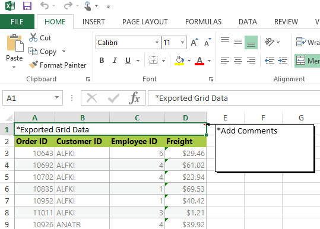
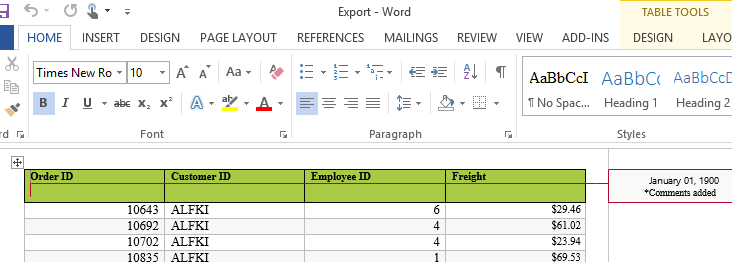
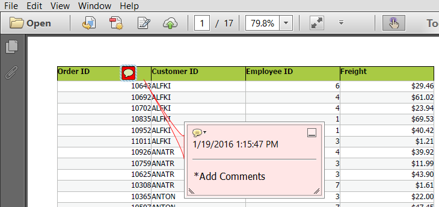

# Adding comments in the Exported file (Excel, Word or PDF)

We can add comments in the exported file while exporting the grid control.

## Adding comments in Excel sheet

Using the Range property and AddComment method of the XlsIO IRange Class, we will add comments to any cell of particular range in Excel sheet. 





    <ej:Grid ID="FlatGrid" runat="server" AllowSorting="True" OnServerExcelExporting="FlatGrid_ServerExcelExporting" AllowPaging="True">
            <ToolbarSettings ShowToolbar="true" ToolbarItems="excelExport"></ToolbarSettings>
            <Columns>
                <ej:Column Field="OrderID" HeaderText="Order ID" TextAlign="Right"/>
                <ej:Column Field="CustomerID" HeaderText="Customer ID" />
                <ej:Column Field="EmployeeID" HeaderText="Employee ID" TextAlign="Right" />
                <ej:Column Field="Freight" HeaderText="Freight" TextAlign="Right" />
            </Columns>
    </ej:Grid>
 
        



    public partial class GridExporting : System.Web.UI.Page
    { 
        protected void Page_Load(object sender, EventArgs e)
        {
            this.FlatGrid.DataSource = OrderRepository.GetAllRecords().ToList();
            this.FlatGrid.DataBind();
        }        

        protected void FlatGrid_ServerExcelExporting(object sender, Syncfusion.JavaScript.Web.GridEventArgs e)
        {
            ExcelExport exp = new ExcelExport();
            IWorkbook book = exp.Export(FlatGrid.Model, (IEnumerable)FlatGrid.DataSource, "Export.xlsx", ExcelVersion.Excel2010, false, false, "flat-lime", true);
            book.ActiveSheet.Range["A1:D1"].Merge();
            book.ActiveSheet.Range["A1"].Text = "*Exported Grid Data";//Adding text to the cells of particular range
            book.ActiveSheet.Range["A1"].AddComment().Text = "*Add Comments";//Adding comments to cells of particular range
            book.SaveAs("Export.xlsx", ExcelSaveType.SaveAsXLS, System.Web.HttpContext.Current.Response, ExcelDownloadType.Open);
        }
    }




The following screenshot displays the exported grid with comments added to cells

## Adding Comments in Exported Word document

We can add comments to the word document using the AppendComment method in the WComment class of the DocIO namespace. We can traverse through the required row/cell with the help of WTable class and thus can append the comment to the table cell.





    <ej:Grid ID="FlatGrid" runat="server" AllowSorting="True" OnServerWordExporting="FlatGrid_ServerWordExporting" AllowPaging="True">
            <ToolbarSettings ShowToolbar="true" ToolbarItems="wordExport"></ToolbarSettings>
            <Columns>
                <ej:Column Field="OrderID" HeaderText="Order ID" TextAlign="Right"/>
                <ej:Column Field="CustomerID" HeaderText="Customer ID" />
                <ej:Column Field="EmployeeID" HeaderText="Employee ID" TextAlign="Right" />
                <ej:Column Field="Freight" HeaderText="Freight" TextAlign="Right" />
            </Columns>
    </ej:Grid> 




    public partial class GridExporting : System.Web.UI.Page
    { 
        protected void Page_Load(object sender, EventArgs e)
        {
            this.FlatGrid.DataSource = OrderRepository.GetAllRecords().ToList();
            this.FlatGrid.DataBind();
        }        

        protected void FlatGrid_ServerWordExporting(object sender, Syncfusion.JavaScript.Web.GridEventArgs e)
        {
            WordExport exp = new WordExport();
            IWordDocument document = exp.Export(FlatGrid.Model, (IEnumerable)FlatGrid.DataSource, "Export.docx", false, false, "flat-lime", true);
            var table = document.Sections[0].Tables[0];
            table.AddRow();//Add new row to the grid table                    
            var para = table.Rows[0].Cells[0].AddParagraph().AppendComment("*Add Comments");
            document.Save("Export.docx", FormatType.Docx, System.Web.HttpContext.Current.Response, HttpContentDisposition.Attachment);
        }

    }
    



The following screenshot shows the exported grid with comments added to the document.

## Adding Comments in Exported PDF document

We can add comments to a PDF documents using the annotation support provided in the PDF namespace. The Annotation added can be of any format such as freeTextAnnotation, popUpAnnotation, LineAnnotation etc., Based on our requirement, we can add annotation which is available under Syncfusion.Pdf.Interactive namespace.





   <ej:Grid ID="FlatGrid" runat="server" AllowSorting="True" OnServerPdfExporting="FlatGrid_ServerPdfExporting" AllowPaging="True">
            <ToolbarSettings ShowToolbar="true" ToolbarItems="pdfExport"></ToolbarSettings>
            <Columns>
                <ej:Column Field="OrderID" HeaderText="Order ID" TextAlign="Right"/>
                <ej:Column Field="CustomerID" HeaderText="Customer ID" />
                <ej:Column Field="EmployeeID" HeaderText="Employee ID" TextAlign="Right" />
                <ej:Column Field="Freight" HeaderText="Freight" TextAlign="Right" />
            </Columns>
    </ej:Grid>  
        



    public partial class GridExporting : System.Web.UI.Page
    { 
        protected void Page_Load(object sender, EventArgs e)
        {
            this.FlatGrid.DataSource = OrderRepository.GetAllRecords().ToList();
            this.FlatGrid.DataBind();
        }        

        protected void FlatGrid_ServerPdfExporting(object sender, Syncfusion.JavaScript.Web.GridEventArgs e)
        {
         PdfExport exp = new PdfExport();
            PdfDocument pdfDocument = exp.Export(FlatGrid.Model, (IEnumerable)FlatGrid.DataSource, "Export.pdf", false, false, "flat-lime", true);
            RectangleF rectangle = new RectangleF(100, 0, 5, 80);
            //Creates a new pop-up annotation.
            PdfPopupAnnotation popupAnnotation = new PdfPopupAnnotation(rectangle, "*Add Comments");
            popupAnnotation.Border.Width = 2;
            popupAnnotation.Border.HorizontalRadius = 10;
            popupAnnotation.Border.VerticalRadius = 20;
            popupAnnotation.Color = Color.Red;

            //Sets the PDF pop-up icon.
            popupAnnotation.Icon = PdfPopupIcon.Comment;            

            //Adds the annotation to page.
            pdfDocument.Pages[0].Annotations.Add(popupAnnotation);
            pdfDocument.Save("Export.pdf", Response, HttpReadType.Save);
        }

    }
    



The following screenshot displays the exported grid with comments added to cells

