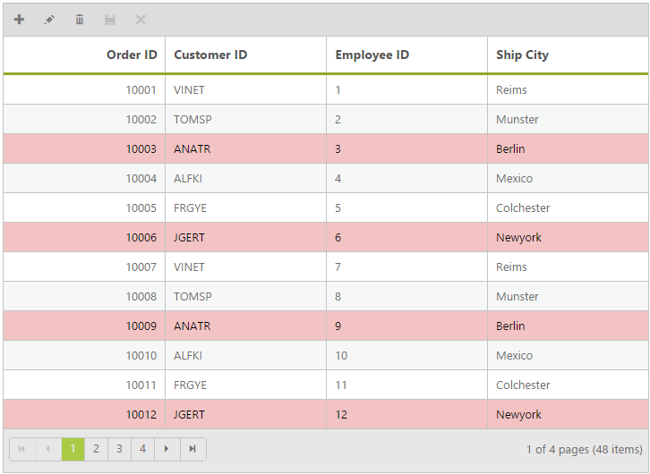

# Change background color of a row using rowDataBound event

The following section explains how you can change the background color of a row. The rowDataBound event is triggered every time an access is made to any of the row or record inside the grid.

So based on the value in the record, you can set the background color of the row accordingly.





    

    





    @(Html.EJ().Grid<object>("Editing")

        .Datasource((IEnumerable<object>)ViewBag.dataSource)

        .AllowPaging()        

        .AllowGrouping()

        .EditSettings(edit => { edit.AllowDeleting().AllowEditing().AllowAdding(); })

        .ToolbarSettings(toolbar => { toolbar.ShowToolbar().ToolbarItems(items =>

              {

              items.AddTool(ToolBarItems.Add);

              items.AddTool(ToolBarItems.Edit);

              items.AddTool(ToolBarItems.Delete);

              });

        })

        .Columns(col =>

        {

            col.Field("OrderID").HeaderText("Order ID").IsPrimaryKey(true).TextAlign(TextAlign.Right).Width(90).Add();

            col.Field("CustomerID").HeaderText("Customer ID").Width(90).Add();

            col.Field("EmployeeID").HeaderText("Employee ID").TextAlign(TextAlign.Right).Width(80).Add();

            col.Field("Freight").HeaderText("Freight").TextAlign(TextAlign.Right).Width(80).Add();

            col.Field("ShipName").HeaderText("ShipName").Width(150).Add();

        })

        .ClientSideEvents(eve => eve.RowDataBound("rowDataBound"))

    )

    ;





    namespace Sample.Controllers

   {

    public class HomeController : Controller

    {

        public ActionResult Index()

        {            

            ViewBag.datasource = new NorthwindDataContext().OrdersViews.ToList();

            return View();

        } 

    }

    }




    <ej:Grid ID="OrdersGrid" runat="server" AllowPaging="true"> 

       <ClientSideEvents RowDataBound="rowDataBound" />

       <EditSettings AllowEditing="true" AllowAdding="true" AllowDeleting="True"></EditSettings>

       <Columns>                                   

           <ej:Column Field="OrderID" HeaderText="Order ID" IsPrimaryKey="True" TextAlign="Right" Width="75" />

           <ej:Column Field="CustomerID" HeaderText="Customer ID" Width="75" />

           <ej:Column Field="EmployeeID" HeaderText="Employee ID" Width="75" />

           <ej:Column Field="ShipCity" HeaderText="Ship City" Width="75" />                        

       </Columns>

       <ToolbarSettings ShowToolbar="True" ToolbarItems="add,edit,delete,update,cancel"></ToolbarSettings>

    </ej:Grid> 

    





    public partial class _Default : System.Web.UI.Page

    {

        List<Orders> order = new List<Orders>();

        protected void Page_Load(object sender, EventArgs e)

        {

            BindDataSource();

        }

        private void BindDataSource()

        {

            int orderId = 10000;

            int empId = 0;

            for (int i = 1; i < 9; i++)

            {

                order.Add(new Orders(orderId + 1, "VINET", empId + 1, 32.38, new DateTime(2014, 12, 25), "Reims"));

                order.Add(new Orders(orderId + 2, "TOMSP", empId + 2, 11.61, new DateTime(2014, 12, 21), "Munster"));

                order.Add(new Orders(orderId + 3, "ANATR", empId + 3, 45.34, new DateTime(2014, 10, 18), "Berlin"));

                order.Add(new Orders(orderId + 4, "ALFKI", empId + 4, 37.28, new DateTime(2014, 11, 23), "Mexico"));

                order.Add(new Orders(orderId + 5, "FRGYE", empId + 5, 67.00, new DateTime(2014, 05, 05), "Colchester"));

                order.Add(new Orders(orderId + 6, "JGERT", empId + 6, 23.32, new DateTime(2014, 10, 18), "Newyork"));

                orderId += 6;

                empId += 6;

            }

            this.OrdersGrid.DataSource = order;

            this.OrdersGrid.DataBind();

        }

        [Serializable]

        public class Orders

        {

            public Orders()

            {

            }

            public Orders(int orderId, string customerId, int empId, double freight, DateTime orderDate, string shipCity)

            {

                this.OrderID = orderId;

                this.CustomerID = customerId;

                this.EmployeeID = empId;

                this.Freight = freight;

                this.OrderDate = orderDate;

                this.ShipCity = shipCity;

            }

            public int OrderID { get; set; }

            public string CustomerID { get; set; }

            public int EmployeeID { get; set; }

            public double Freight { get; set; }

            public DateTime OrderDate { get; set; }

            public string ShipCity { get; set; }

        }

    }





The following screenshot displays the grid with background color changed for few records

