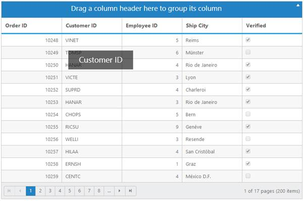

## Customize Drag and Drop element while grouping

In this section, you can learn how to customize drag and drop element. This drag and drop element is framed by using CSS classes with default values. When you want to change or customize drag and drop element, then just override default values of CSS class values. e-cloneproperties is the name of drag and drop element in CSS class.



<ej:Grid ID="OrdersGrid" runat="server" AllowGrouping="True">

<DataManager URL="http://mvc.syncfusion.com/Services/Northwnd.svc/Orders/" Offline="true"></DataManager>

 </ej:Grid>



The following output is displayed as a result of the above code example.

 

