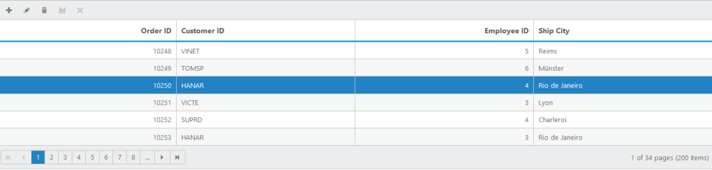

## Disable double-click edit

The AllowEditOnDblClick property can be set as True to enable editing the record by double-clicking it. When it is set as False, it cannot be edited by double-clicking it. In that case, you can edit the record by using the Toolbar option only.



  <ej:Grid ID="OrdersGrid" runat="server" AllowPaging="True" >

<DataManager URL="http://mvc.syncfusion.com/Services/Northwnd.svc/Orders/" Offline="true"></DataManager>

            <Columns>

                <ej:Column Field="OrderID" HeaderText="Order ID" IsPrimaryKey="true" TextAlign="Right" Width="75" />

                <ej:Column Field="CustomerID" HeaderText="Customer ID" Width="80" />

                <ej:Column Field="EmployeeID" HeaderText="Employee ID" TextAlign="Right" Width="70" EditType=" Numeric" />

                <ej:Column Field="ShipCity" HeaderText="Ship City" Width="100" EditType="DropdownEdit" />

            </Columns>

            <EditSettings AllowEditing="True" AllowEditOnDblClick="False" AllowAdding="True" AllowDeleting="True" EditMode="Normal"></EditSettings>

            <ToolbarSettings ShowToolbar="True" ToolbarItems="add,edit,delete,update,cancel"></ToolbarSettings>

        </ej:Grid>

 

The following output is displayed as a result of the above code example.

 

