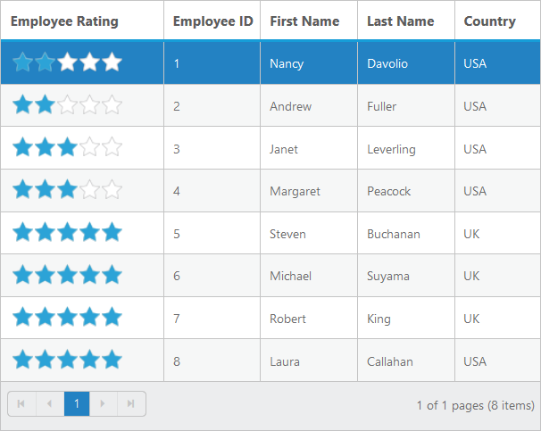

# Display other Syncfusion controls in Grid columns

We can display the other Syncfusion controls using `Template` property of Grid columns and `TemplateRefresh` event of Grid control.







    <ej:Grid ID="Grid" runat="server" AllowPaging="True">  
            <ClientSideEvents TemplateRefresh="template" />
            <Columns>
                <ej:Column HeaderText="Employee Rating" Template="#columnTemplate" Width="150" />                
                <ej:Column Field="EmployeeID" HeaderText="Employee ID" Width="90"/>
                <ej:Column Field="FirstName" HeaderText="First Name" Width="90"/>
                <ej:Column Field="LastName" HeaderText="Last Name" Width="90"/>  
                <ej:Column Field="Country" HeaderText="Country" Width="80"/>
            </Columns>
    </ej:Grid> 
        



    public partial class GridExporting : System.Web.UI.Page
    { 
        protected void Page_Load(object sender, EventArgs e)
        {
            this.Grid.DataSource = new NorthwindDataContext().EmployeeView.ToList();
            this.Grid.DataBind();
        }        
    }




The following screenshot displays the exported grid with comments added to cells

