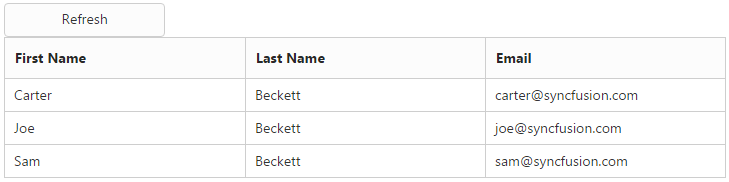

### Refresh datasource

Grid allows you to refresh datasource dynamically after Gridinitialization. It is useful to refresh Griddatasource.

[ASP]

[aspx]

&lt;ej:Button ID="refresh" runat="server" Type="Button" Text="Refresh" ClientSideOnClick="refresh"&gt;

&lt;/ej:Button&gt;

&lt;ej:Grid ID="Grid" runat="server"&gt;

    &lt;Columns&gt;

        &lt;ej:Column Field="FirstName" HeaderText="First Name" /&gt;

        &lt;ej:Column Field="LastName" HeaderText="Last Name" /&gt;

        &lt;ej:Column Field="Email" HeaderText="Email" /&gt;

    &lt;/Columns&gt;

&lt;/ej:Grid&gt;

[javascript]

&lt;script type="text/javascript"&gt;

    var newData = [

        { FirstName: "Carter", LastName: "Beckett", Email: "carter@syncfusion.com" },

        { FirstName: "Joe", LastName: "Beckett", Email: "joe@syncfusion.com" },

        { FirstName: "Sam", LastName: "Beckett", Email: "sam@syncfusion.com" }

    ];

    function refresh() {

$("#Grid").ejGrid("dataSource", newData);

    }

&lt;/script&gt;

[cs]

public partial class _Default : System.Web.UI.Page

{

    List<Person> Persons = new List<Person>();

    protected void Page_Load(object sender, EventArgs e)

    {

        BindDataSource();

    }

    private void BindDataSource()

    {       

        Persons.Add(new Person() { FirstName = "John", LastName = "Beckett", Email = "john@syncfusion.com" });

        Persons.Add(new Person() { FirstName = "Ben", LastName = "Beckett", Email = "ben@syncfusion.com" });

        Persons.Add(new Person() { FirstName = "Andrew", LastName = "Beckett", Email = "andrew@syncfusion.com" });

        this.Grid.DataSource = Persons;

        this.Grid.DataBind();

    }

    [Serializable]

    public class Person

    {

        public Person()

        {

        }

        public Person(string firstName, string lastName, string email)

        {

            this.FirstName = firstName;

            this.LastName = lastName;

            this.Email = email;          

        }       

        public string FirstName { get; set; }

        public string LastName { get; set; }

        public string Email { get; set; }       

    }

}

The following screenshot displays the Grid data source before refreshing.

{  | markdownify }
{:.image }

The following screenshot displays the Grid data source after refreshing.

{  | markdownify }
{:.image }

