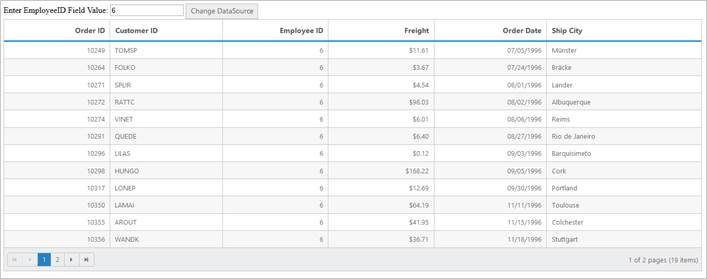

# Set Dynamic DataSource to Grid

Grid control is capable of updating its dataSource as and when required. Grid method “dataSource” helps in achieving this and in this method parameter, you have to pass the new dataSource as JSON array.

For instance, consider a textbox above Grid and depending on its value, you can update a new datasource to Grid dynamically.



 

<asp:Content ID="ControlContent" runat="server" ContentPlaceHolderID="ControlsSection">

    

        Enter EmployeeID Field Value:

        <input type="text" id="colValue" />

        <ej:Button ID="customButton" runat="server" Size="Normal" ClientSideOnClick="btnClick" Text="Change DataSource"></ej:Button>

        <ej:Grid ID="FlatGrid" runat="server" AllowSorting="True" AllowPaging="True">

            <Columns>

                <ej:Column Field="OrderID" HeaderText="Order ID" IsPrimaryKey="True" TextAlign="Right" Width="75" />

                <ej:Column Field="CustomerID" HeaderText="Customer ID" Width="80" />

                <ej:Column Field="EmployeeID" HeaderText="Employee ID" TextAlign="Right" Width="75" />

                <ej:Column Field="Freight" HeaderText="Freight" TextAlign="Right" Width="75" Format="{0:C}" />

                <ej:Column Field="OrderDate" HeaderText="Order Date" TextAlign="Right" Width="80" Format="{0:MM/dd/yyyy}" />

                <ej:Column Field="ShipCity" HeaderText="Ship City" Width="110" />

            </Columns>

        </ej:Grid>

    

</asp:Content>



 

[ASPX.CS]

public partial class GridSample : System.Web.UI.Page

    {

        protected void Page_Load(object sender, EventArgs e)

        {

            this.FlatGrid.DataSource = new DataClasses1DataContext().Orders.ToList();   

            this.FlatGrid.DataBind();

        }

[WebMethod]
[ScriptMethod(ResponseFormat = ResponseFormat.Json)]
public static object GetData(int EmployeeID)

        {

            var data = new DataClasses1DataContext().Orders.Where(ds => ds.EmployeeID ==  EmployeeID).ToList();

            return Json(data, JsonRequestBehavior.AllowGet);

        }

    }




	
The following screenshot illustrates the output.

 

