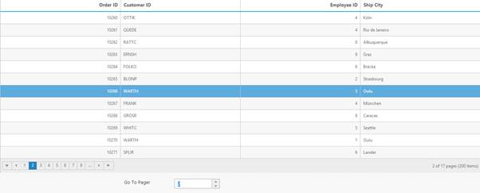
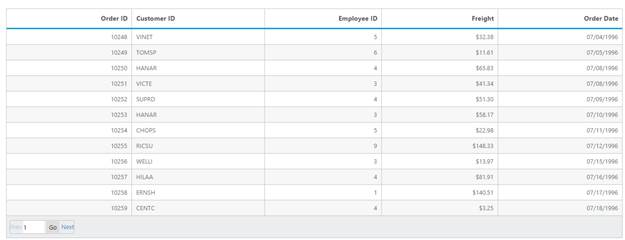

# Paging

 You can display the grid records in paged view, by setting `AllowPaging` property as `true`.

The code snippet to enable paging is follows.




        <ej:Grid id="OrdersGrid" runat="server" AllowPaging="true">   
            <Columns>                
                <ej:Column Field="OrderID" />
                <ej:Column Field="EmployeeID"/>
                <ej:Column Field="CustomerID"/>                
                <ej:Column Field="ShipCountry"/>
                <ej:Column Field="Freight"/>
             </Columns>
         </ej:Grid>
 
 

      namespace WebSampleBrowser.Grid
       {
        public partial class Paging : System.Web.UI.Page
         {
          List<Orders> order = new List<Orders>();
          protected void Page_Load(object sender, EventArgs e)
          {
           BindDataSource();
          }
          private void BindDataSource()
          {
            int orderId = 10000;
            int empId = 0;
            for (int i = 0; i < 9; i++)
            {
                order.Add(new Orders(orderId + 1, empId + 1, "VINET", "France", 32.38));
                order.Add(new Orders(orderId + 2, empId + 2, "TRADH", "Brazil", 11.61));
                order.Add(new Orders(orderId + 3, empId + 3, "VICTE", "France", 45.34));
                order.Add(new Orders(orderId + 4, empId + 4, "FRANK", "Germany", 37.28));
                order.Add(new Orders(orderId + 5, empId + 5, "DRACD", "Germany", 67.00));
                order.Add(new Orders(orderId + 6, empId + 6, "RATTC", "USA", 23.32));
                orderId += 6;
                empId += 6;
            }
            this.OrdersGrid.DataSource = order;
            this.OrdersGrid.DataBind();
        }
        [Serializable]
        public class Orders
        {
            public Orders()
            {

            }
            public Orders(int OrderId, int empId, string CustomerId, string shipCountry, double freight)
            {
                this.OrderID = OrderId;
                this.EmployeeID = empId;
                this.CustomerID = CustomerId;
                this.ShipCountry = shipCountry;
                this.Freight = freight;
            }
            public int OrderID { get; set; }
            public int EmployeeID { get; set; }
            public string CustomerID { get; set; }
            public string ShipCountry { get; set; }
            public double Freight { get; set; }
          }
        }
      }   
 
  
 
 The following output is displayed as a result of the above code example.
 
 

## Pager with query string

You can pass the current page information as a query string while navigating to other page. To enable query string, set the `EnableQueryString` property of `PageSettings` as `true`.

The following code example describes the above behavior.


 

       <ej:Grid id="OrdersGrid" runat="server" AllowPaging="true">   
          <PageSettings EnableQueryString="true"/>
            <Columns>                
                <ej:Column Field="OrderID" />
                <ej:Column Field="EmployeeID"/>
                <ej:Column Field="CustomerID"/>                
                <ej:Column Field="ShipCountry"/>
                <ej:Column Field="Freight"/>
             </Columns>
         </ej:Grid> 
  
   

      namespace WebSampleBrowser.Grid
       {
        public partial class Paging : System.Web.UI.Page
         {
          List<Orders> order = new List<Orders>();
          protected void Page_Load(object sender, EventArgs e)
          {
           BindDataSource();
          }
          private void BindDataSource()
          {
            int orderId = 10000;
            int empId = 0;
            for (int i = 0; i < 9; i++)
            {
                order.Add(new Orders(orderId + 1, empId + 1, "VINET", "France", 32.38));
                order.Add(new Orders(orderId + 2, empId + 2, "TRADH", "Brazil", 11.61));
                order.Add(new Orders(orderId + 3, empId + 3, "VICTE", "France", 45.34));
                order.Add(new Orders(orderId + 4, empId + 4, "FRANK", "Germany", 37.28));
                order.Add(new Orders(orderId + 5, empId + 5, "DRACD", "Germany", 67.00));
                order.Add(new Orders(orderId + 6, empId + 6, "RATTC", "USA", 23.32));
                orderId += 6;
                empId += 6;
            }
            this.OrdersGrid.DataSource = order;
            this.OrdersGrid.DataBind();
        }
        [Serializable]
        public class Orders
        {
            public Orders()
            {

            }
            public Orders(int OrderId, int empId, string CustomerId, string shipCountry, double freight)
            {
                this.OrderID = OrderId;
                this.EmployeeID = empId;
                this.CustomerID = CustomerId;
                this.ShipCountry = shipCountry;
                this.Freight = freight;
            }
            public int OrderID { get; set; }
            public int EmployeeID { get; set; }
            public string CustomerID { get; set; }
            public string ShipCountry { get; set; }
            public double Freight { get; set; }
          }
        }
      }
 
  

The following output is displayed as a result of the above code example.

 

## Pager template

Apart from default pager, there is an option to render a specific custom template in a grid pager. To render template in pager, set `EnableTemplates`  as true and `Template`  properties of `PageSettings`.

 Prevent to show the default pager while enabling the pager `Template`  by setting `ShowDefaults`  property of `PageSettings`  as `false`.

 N> It's a standard way to enclose the `Template`  within the `script` tag with `type` as "text/x-jsrender".

The following code example describes the above behavior.

 


         
          



     .e-grid .e-pager .e-pagercontainer {
	       border-width: 0px;
	       overflow: visible;
         }         
 


         <ej:Grid id="OrdersGrid" runat="server" AllowPaging="true">   
            <ClientSideEvents ActionComplete="complete" />
            <PageSettings EnableTemplates="true" Template="#template" ShowDefaults="false" />
            <Columns>                
                <ej:Column Field="OrderID" TextAlign="Right" />
                <ej:Column Field="EmployeeID" TextAlign="Left"/>
                <ej:Column Field="CustomerID" TextAlign="Left"/>                
                <ej:Column Field="ShipCountry" TextAlign="Left"/>
                <ej:Column Field="Freight" />
             </Columns>
         </ej:Grid>            


 
     namespace WebSampleBrowser.Grid
     {
        public partial class Paging : System.Web.UI.Page
          {
           List<Orders> order = new List<Orders>();
           protected void Page_Load(object sender, EventArgs e)
           {
               BindDataSource();
            }
           private void BindDataSource()
           {
            int orderId = 10000;
            int empId = 0;
            for (int i = 0; i < 9; i++)
            {
                order.Add(new Orders(orderId + 1, empId + 1, "VINET", "France", 32.38));
                order.Add(new Orders(orderId + 2, empId + 2, "TRADH", "Brazil", 11.61));
                order.Add(new Orders(orderId + 3, empId + 3, "VICTE", "France", 45.34));
                order.Add(new Orders(orderId + 4, empId + 4, "FRANK", "Germany", 37.28));
                order.Add(new Orders(orderId + 5, empId + 5, "DRACD", "Germany", 67.00));
                order.Add(new Orders(orderId + 6, empId + 6, "RATTC", "USA", 23.32));
                orderId += 6;
                empId += 6;
            }
            this.OrdersGrid.DataSource = order;
            this.OrdersGrid.DataBind();
        }
        [Serializable]
        public class Orders
        {
            public Orders()
            {

            }
            public Orders(int OrderId, int empId, string CustomerId, string shipCountry, double freight)
            {
                this.OrderID = OrderId;
                this.EmployeeID = empId;
                this.CustomerID = CustomerId;
                this.ShipCountry = shipCountry;
                this.Freight = freight;
            }
            public int OrderID { get; set; }
            public int EmployeeID { get; set; }
            public string CustomerID { get; set; }
            public string ShipCountry { get; set; }
            public double Freight { get; set; }
        }
      }
     }

   
 
 The following output is displayed as a result of the above code example.

## Pager with pageSettings

We can customize the default page settings, such as [`pageCount`](https://help.syncfusion.com/api/js/ejgrid#members:pagesettings-pagecount "pageCount"), [`pageSize`](https://help.syncfusion.com/api/js/ejgrid#members:pagesettings-pagesize "pageSize")  of the Grid's pager by using [`pageSettings`](https://help.syncfusion.com/api/js/ejgrid#members:pagesettings "pageSettings") property of Grid control. 

The following code example describes the above behavior.






$(function () {
	$("#Grid").ejGrid({
		//The datasource "window.gridData" is referred from 'http://js.syncfusion.com/demos/web/scripts/jsondata.min.js'
        dataSource: window.gridData,
        allowPaging: true,
        pageSettings: { pageSize: 8, pageCount:3}
    });
});


The following output is displayed as a result of the above code example.

 