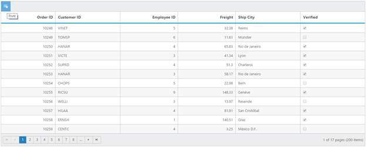

# Print Grid

Printing is easy with Grid control by using Print Grid feature. Toolbar has the Print icon, it allows to print the Grid records. When you click the Print icon, it internally calls the public print() method of Grid object to print the Grid. You can also use print() method manually to print.





<ej:Grid ID="FlatGrid" runat="server" AllowSorting="true" AllowPaging="true">

            <ToolbarSettings ShowToolbar="true" ToolbarItems="printGrid"></ToolbarSettings>

            <Columns>

                <ej:Column Field="OrderID" HeaderText="Order ID” TextAlign="Right"/>

                <ej:Column Field="CustomerID" HeaderText="Customer ID" />

                <ej:Column Field="EmployeeID" HeaderText="Employee ID" TextAlign="Right" />

                <ej:Column Field="Freight" HeaderText="Freight" TextAlign="Right" />

                <ej:Column Field="OrderDate" HeaderText="Order Date" TextAlign="Right"/>

                <ej:Column Field="ShipCity" HeaderText="Ship City" Width="110" />

            </Columns>

        </ej:Grid>




public partial class PrintGrid : System.Web.UI.Page

    {

        List<Orders> order = new List<Orders>();

        protected void Page_Load(object sender, EventArgs e)

        {

            BindDataSource();

        }

        private void BindDataSource()

        {

            int code = 10000;

            for (int i = 1; i < 10; i++)

            {

                order.Add(new Orders(code + 1, "ALFKI", i + 0, 2.3 * i, new DateTime(1991, 05, 15), "Berlin"));

                order.Add(new Orders(code + 2, "ANATR", i + 2, 3.3 * i, new DateTime(1990, 04, 04), "Madrid"));

                order.Add(new Orders(code + 3, "ANTON", i + 1, 4.3 * i, new DateTime(1957, 11, 30), "Cholchester"));

                order.Add(new Orders(code + 4, "BLONP", i + 3, 5.3 * i, new DateTime(1930, 10, 22), "Marseille"));

                order.Add(new Orders(code + 5, "BOLID", i + 4, 6.3 * i, new DateTime(1953, 02, 18), "Tsawassen"));

                code += 5;

            }

            this.FlatGrid.DataSource = order;

            this.FlatGrid.DataBind();

        }

        [Serializable]

        public class Orders

        {

            public Orders()

            {

            }

            public Orders(long OrderId, string CustomerId, int EmployeeId, double Freight, DateTime OrderDate, string ShipCity)

            {

                this.OrderID = OrderId;

                this.CustomerID = CustomerId;

                this.EmployeeID = EmployeeId;

                this.Freight = Freight;

                this.OrderDate = OrderDate;

                this.ShipCity = ShipCity;

            }

            public long OrderID { get; set; }

            public string CustomerID { get; set; }

            public int EmployeeID { get; set; }

            public double Freight { get; set; }

            public DateTime OrderDate { get; set; }

            public string ShipCity { get; set; }

        }

    }




The following output is displayed as a result of the above code example.

