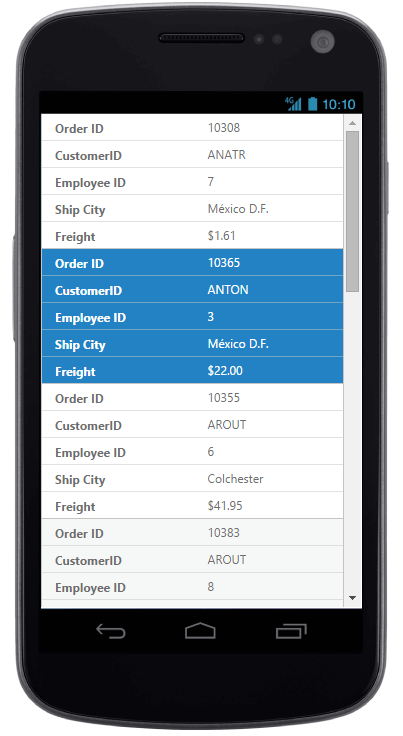
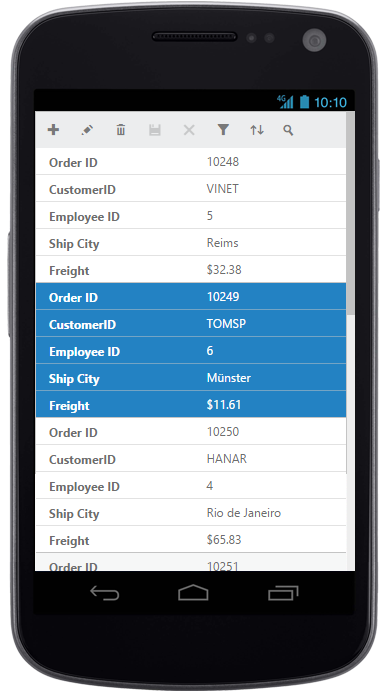
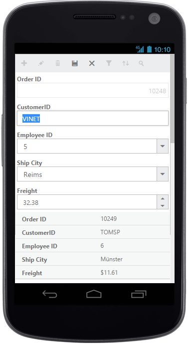
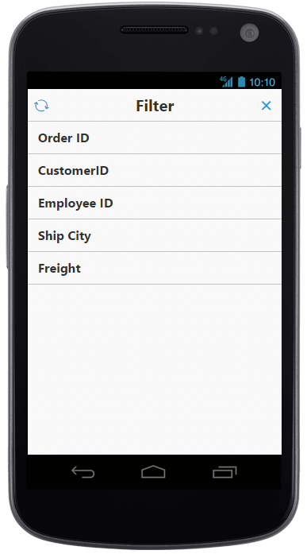
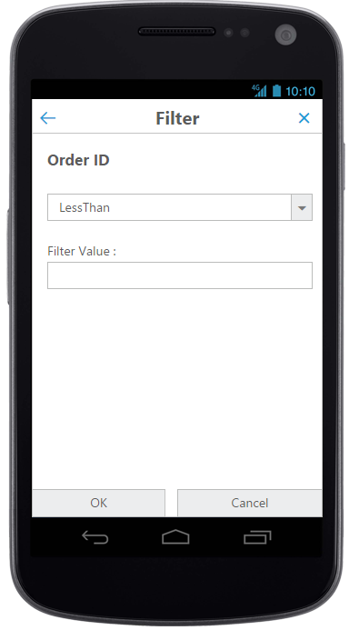
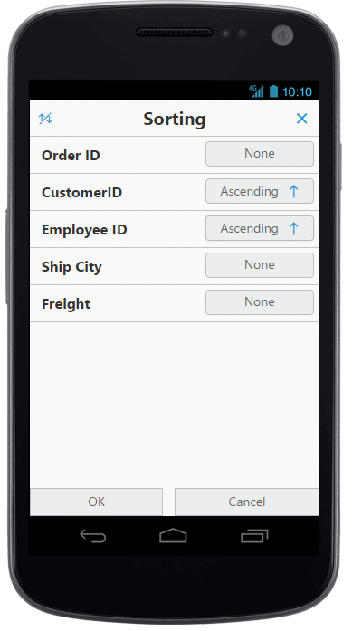
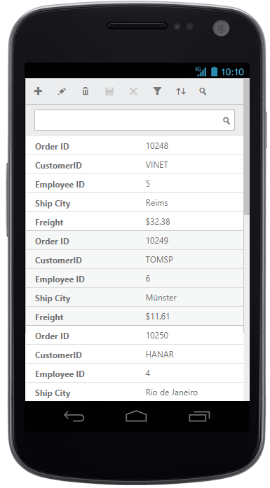
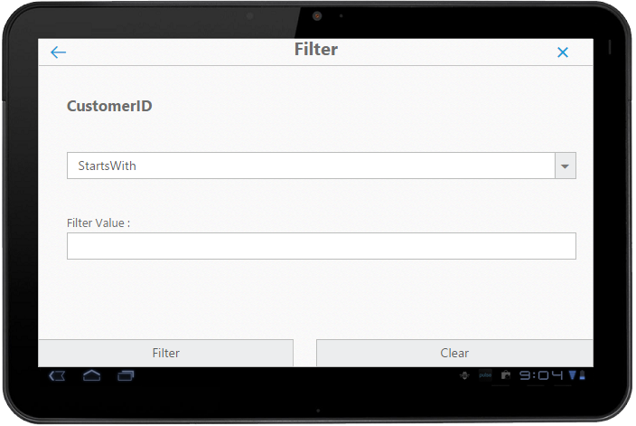

# Responsive

The Grid control has support for responsive behavior based on the client browser's width and height. To enable responsive, the `IsResponsive` property should be true. In Desktop and Tablet mode, to render scroller set `MinWidth` property. There are three modes of responsive layout is available in grid based on client width. They are.

* Mobile(<321px)
* Tablet (321px to 800px)
* Desktop(>800px)

N> The following features are not supported by grid's responsive:
N> 1. Virtual Scrolling 
N> 2. Frozen Rows and Frozen Columns 
N> 3. Hierarchy
N> 4. Detail template 

## Mobile layout

If client width is less than 321px, the grid will render in mobile mode. In which, you can see that grid user interface is customized and redesigned for best view in small screens. The customized features includes responsive row rendering, filtering, sorting, searching and editing.

### Responsive row

Enabling responsive row makes the grid to render the record values in vertical order which removes the need for horizontal scrolling to view complete record details. It can be enabled by defining the `EnableResponsiveRow` property as `true`.





    <ej:Grid ID="FlatGrid" runat="server"  MinWidth="600" IsResponsive="true" AllowPaging="True" EnableResponsiveRow="true">
        <PageSettings PageCount="3" PageSize="7" />
        <Columns>
            <ej:Column Field="OrderID" HeaderText="Order ID" IsPrimaryKey="True"></ej:Column>
            <ej:Column Field="CustomerID" HeaderText="Customer ID" ></ej:Column>
			<ej:Column Field="EmployeeID" HeaderText="Employee ID" />
			<ej:Column Field="ShipCity" Width="120" HeaderText="Ship City" />
            <ej:Column Field="Freight" HeaderText="Freight" Format="{0:C}"></ej:Column>
        </Columns>
    </ej:Grid>




   namespace WebSampleBrowser.Grid
   {
        public partial class _Default : Page
        {
            List<Orders> order = new List<Orders>();
            protected void Page_Load(object sender, EventArgs e)
            { 
                this.FlatGrid.DataSource = order;
                this.FlatGrid.DataBind();
    		}
        }
    }


 

W> IE8 and IE9 does not support responsive row. The `ejgrid.responsive.css` should be referred to display responsive row.

### Customized features

The customized layout for filtering, sorting, searching and CRUD operations in mobile device can be seen in the following screen shots.

{:caption}
Responsive row with filtering , sorting and searching

{:caption}
CRUD in mobile layout

{:caption}
Filtering in mobile layout

{:caption}

Filtering in mobile layout

{:caption}
Sorting in mobile layout

{:caption}

Searching in mobile layout





<ej:Grid ID="FlatGrid" runat="server"  MinWidth="600" IsResponsive="true" AllowPaging="True" EnableResponsiveRow="true" AllowSorting="true" AllowMultiSortig="true" AllowFiltering="true">
        <ClientSideEvents  ActionComplete="actionComplete"/>
        <PageSettings PageCount="3" PageSize="7" />
        <FilterSettings FilterType="Menu" />
        <EditSettings AllowEditing="True" AllowAdding="True" AllowDeleting="True"></EditSettings>
        <ToolbarSettings ShowToolbar="True" ToolbarItems="add,edit,delete,update,cancel,search"></ToolbarSettings>
        <FilterSettings FilterType="Menu"></FilterSettings>
        <Columns>
            <ej:Column Field="OrderID" HeaderText="Order ID" Width="90" IsPrimaryKey="True" TextAlign="Right">
                <ValidationRule>
                    <ej:KeyValue Key="required" Value="true" />
                    <ej:KeyValue Key="number" Value="true" />
                </ValidationRule>
            </ej:Column>
            <ej:Column Field="CustomerID" HeaderText="Customer ID" Width="100" >
                <ValidationRule>
                    <ej:KeyValue Key="required" Value="true" />
                </ValidationRule>
            </ej:Column>
			<ej:Column Field="EmployeeID" HeaderText="Employee ID"  Width="90" EditType="Dropdown" TextAlign="Right" />
			<ej:Column Field="ShipCity" Width="120" HeaderText="Ship City" EditType="Dropdown" />
            <ej:Column Field="Freight" HeaderText="Freight" Width="80" EditType="Numeric" TextAlign="Right" Format="{0:C}">
                <NumericEditOptions DecimalPlaces="2"></NumericEditOptions>
            </ej:Column>
        </Columns>
    </ej:Grid>
    



    namespace WebSampleBrowser.Grid
    {
        public partial class _Default : Page
        {
            List<Orders> order = new List<Orders>();
            protected void Page_Load(object sender, EventArgs e)
            { 
                this.FlatGrid.DataSource = order;
                this.FlatGrid.DataBind();
    		}
        }
    }


 

## Tablet layout

If the client width is between 321px and 800px, then the grid will render in tablet mode. Also, it has customized filtering design to match tablet screen size.





    <ej:Grid ID="FlatGrid" runat="server"  MinWidth="600" IsResponsive="true" AllowPaging="True" AllowFiltering="true">
        <PageSettings PageCount="3" PageSize="8" />
        <FilterSettings FilterType="Menu"></FilterSettings>
        <Columns>
            <ej:Column Field="OrderID" HeaderText="Order ID" Width="90" IsPrimaryKey="True" TextAlign="Right"></ej:Column>
            <ej:Column Field="CustomerID" HeaderText="Customer ID" Width="100" ></ej:Column>
			<ej:Column Field="EmployeeID" HeaderText="Employee ID"  Width="90" TextAlign="Right" />
			<ej:Column Field="ShipCity" Width="120" HeaderText="Ship City" />
            <ej:Column Field="Freight" HeaderText="Freight" Width="80" TextAlign="Right" Format="{0:C}"></ej:Column>
        </Columns>
    </ej:Grid>




    namespace WebSampleBrowser.Grid
    {
        public partial class _Default : Page
        {
            List<Orders> order = new List<Orders>();
            protected void Page_Load(object sender, EventArgs e)
            { 
                this.FlatGrid.DataSource = order;
                this.FlatGrid.DataBind();
    		}
        }
    }


 

{:caption}

Default tab layout

{:caption}
Filtering design in tab layout.

## Width

By default, the grid is adaptable to its parent container. It can adjust its width of columns based on parent container width. You can also assign the `Width` of `Columns` in percentage. 




     
    <ej:Grid ID="FlatGrid" runat="server"  MinWidth="600" IsResponsive="true">
        <Columns>
            <ej:Column Field="OrderID" HeaderText="Order ID" Width="10%" IsPrimaryKey="True" TextAlign="Right"></ej:Column>
            <ej:Column Field="CustomerID" HeaderText="Customer ID" Width="15%" ></ej:Column>
			<ej:Column Field="EmployeeID" HeaderText="Employee ID"  Width="10%" TextAlign="Right" />
        </Columns>
    </ej:Grid>




    namespace WebSampleBrowser.Grid
    {
        public partial class _Default : Page
        {
            List<Orders> order = new List<Orders>();
            protected void Page_Load(object sender, EventArgs e)
            { 
                this.FlatGrid.DataSource = order;
                this.FlatGrid.DataBind();
    		}
        }
    }


 

I>  The `AllowScrolling` should be false while defining Width in percentage.

## Min width

Min width is used to maintain minimum width for the grid. To enable min width, `MinWidth` should be defined. If the grid width is less than `MinWidth` then the scrollbar will be displayed to maintain minimum width.




    <ej:Grid ID="FlatGrid" runat="server"  MinWidth="700" IsResponsive="true" AllowPaging="True" AllowFiltering="true">
        <Columns>
            <ej:Column Field="OrderID" HeaderText="Order ID" Width="90" IsPrimaryKey="True" TextAlign="Right"></ej:Column>
            <ej:Column Field="CustomerID" HeaderText="Customer ID" Width="100" ></ej:Column>
			<ej:Column Field="EmployeeID" HeaderText="Employee ID"  Width="90" TextAlign="Right" />
			<ej:Column Field="ShipCity" Width="120" HeaderText="Ship City" />
            <ej:Column Field="Freight" HeaderText="Freight" Width="110" TextAlign="Right" Format="{0:C}"></ej:Column>
        </Columns>
    </ej:Grid>




    namespace WebSampleBrowser.Grid
    {
        public partial class _Default : Page
        {
            List<Orders> order = new List<Orders>();
            protected void Page_Load(object sender, EventArgs e)
            { 
                this.FlatGrid.DataSource = order;
                this.FlatGrid.DataBind();
    		}
        }
    }


 

MinWidth set to grid

N> We can render the grid with height responsive by setting the scrollSettings `height`as `100%`. If the grid height is greater than its parent container's height then the vertical scrollbar will be displayed to view the content.

## Priority for columns

Priority makes column to be visible or hidden based on the `Priority` value and browser's width to best accommodate the possible columns. To enable `Priority` for `Columns`, `Priority` needs to be defined in columns collection. These Priority values are from one to six.




    <ej:Grid ID="FlatGrid" runat="server"  AllowPaging="True">
        <Columns>
            <ej:Column Field="OrderID" HeaderText="Order ID" Width="90" Priority="1" IsPrimaryKey="True" TextAlign="Right"></ej:Column>
            <ej:Column Field="CustomerID" HeaderText="Customer ID" Width="100" Priority="2" ></ej:Column>
			<ej:Column Field="EmployeeID" HeaderText="Employee ID"  Width="90" Priority="1" TextAlign="Right" />
			<ej:Column Field="ShipCity" Width="120" HeaderText="Ship City" Priority="3" />
            <ej:Column Field="Freight" HeaderText="Freight" Width="80" TextAlign="Right" Priority="4" Format="{0:C}"></ej:Column>
        </Columns>
    </ej:Grid>




    namespace WebSampleBrowser.Grid
    {
        public partial class _Default : Page
        {
            List<Orders> order = new List<Orders>();
            protected void Page_Load(object sender, EventArgs e)
            { 
                this.FlatGrid.DataSource = order;
                this.FlatGrid.DataBind();
    		}
        }
    }


 

I> The `ejgrid.responsive.css` should be referred.