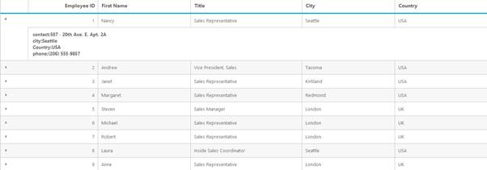
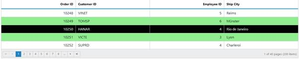
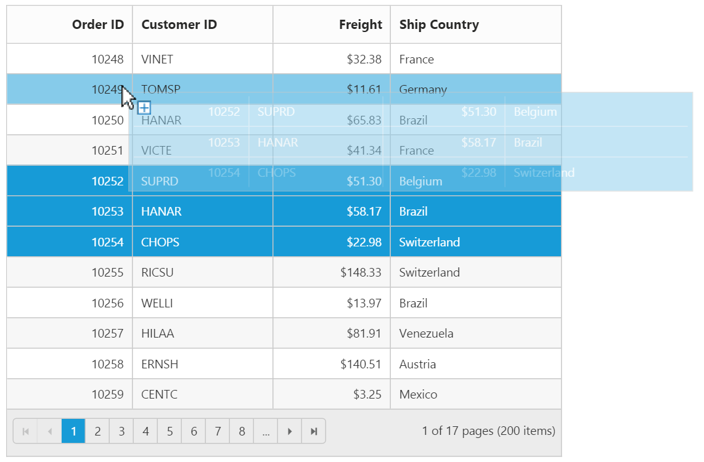
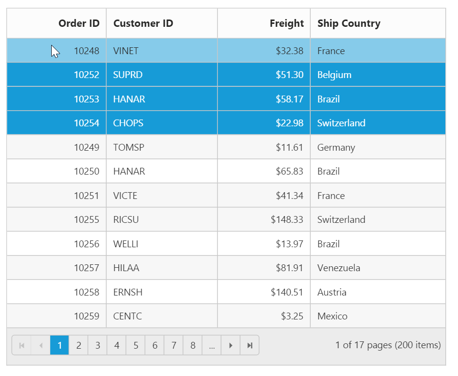
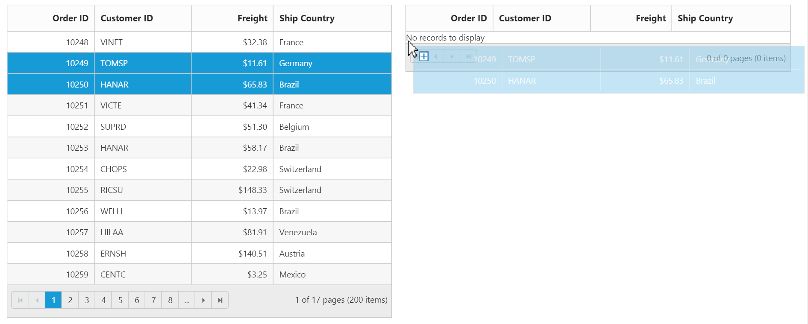
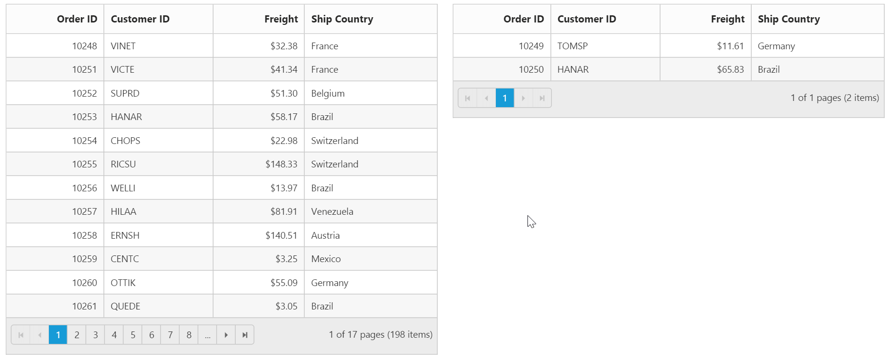
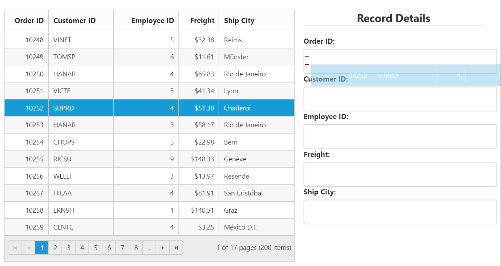
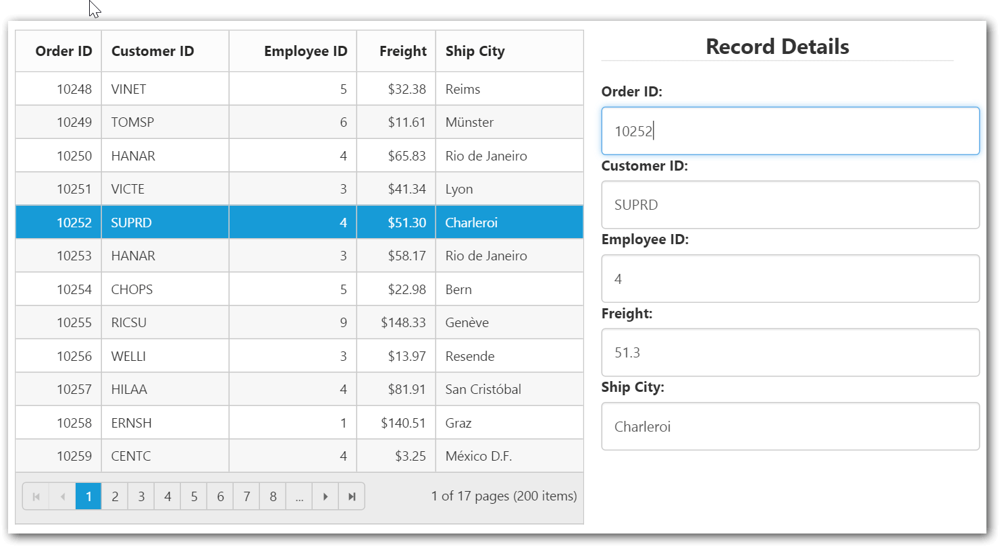

# Row

## Details Template

Details Template feature provides a detailed view about additional information of each row. If you want to view the detailed information, you can expand a row. Using DetailsTemplate property to achieve detail template feature.





<asp:Content runat="server" ID="BodyContent" ContentPlaceHolderID="MainContent">

    

<ej:Grid ID="DetailTemplate" runat="server" DetailsTemplate="#tabGridContents">

    <Columns>

        <ej:Column Field="EmployeeID" HeaderText="Employee ID" />

        <ej:Column Field="FirstName" HeaderText="First Name" />

        <ej:Column Field="Title" HeaderText="Title" />

        <ej:Column Field="City" HeaderText="City" />

        <ej:Column Field="Country" HeaderText="Country" />

    </Columns>

</ej:Grid>



protected void Page_Load(object sender, EventArgs e)

    {

        this.DetailTemplate.DataSource = new NorthwindDataContext().Employees.Take(9).ToList();

        this.DetailTemplate.DataBind();

    }




The following output is displayed as a result of the above code example.

## Hierarchy

In this section, you can learn how to use the Hierarchy in GridView. The following code example is of HierarchyGrid.





<ej:Grid ID="DetailTemplate" runat="server" DetailsTemplate="#tabGridContents" >

  <ClientSideEvents DetailsDataBound="detailGridData" />

    <Columns>

        <ej:Column Field="EmployeeID" HeaderText="Employee ID" />

        <ej:Column Field="FirstName" HeaderText="First Name" />

        <ej:Column Field="Title" HeaderText="Title" />

        <ej:Column Field="City" HeaderText="City" />

        <ej:Column Field="Country" HeaderText="Country" />

    </Columns>

</ej:Grid>




public partial class DetailTemplate : System.Web.UI.Page

    {

        List<Orders> order = new List<Orders>();

        protected void Page_Load(object sender, EventArgs e)

        {

            BindDataSource();

        }

        private void BindDataSource()

        {

            order.Add(new Orders(1, "Nancy", "Sales Representative", "Seattle", "USA"));

            order.Add(new Orders(2, "Andrew", "Vice President, Sales", "Tacoma", "USA"));

            order.Add(new Orders(3, "Janet", "Sales Representative", "Kirkland", "USA"));

            order.Add(new Orders(4, "Margaret", "Sales Representative", "Redmond", "USA"));

            order.Add(new Orders(5, "Steven", "Sales Manager", "London", "UK"));

            order.Add(new Orders(6, "Michael", "Sales Representative", "London", "UK"));

            order.Add(new Orders(7, "Robert", "Sales Representative", "London", "UK"));

            order.Add(new Orders(8, "Laura", "Inside Sales Coordinator", "Seattle", "USA"));

            order.Add(new Orders(9, "Anne", "Sales Representative", "London", "UK"));

            this.EmployeesGrid.DataSource = order;

            this.EmployeesGrid.DataBind();

        }

        [Serializable]

        public class Orders

        {

            public Orders()

            {

            }

            public Orders(int EmployeeId, string FirstName, string Title, string City, string Country)

            {

                this.EmployeeID = EmployeeId;

                this.FirstName = FirstName;

                this.Title = Title;

                this.City = City;

                this.Country = Country;

            }

            public int EmployeeID { get; set; }

            public string FirstName { get; set; }

            public string Title { get; set; }

            public string City { get; set; }

            public string Country { get; set; }

        }

    }




The following output is displayed as a result of the above code example.

## Row Template

Row template is used to render your template in every row. It is used to place elements inside Grid rows. This feature makes it easier to customize Grid rows with HTML elements. Using RowTemplate property achieve row template feature.












<ej:Grid ID="Grid" runat="server" AllowScrolling="true" RowTemplate="#templateData">

    <ScrollSettings Height="480" Width="500" />

    <Columns>

        <ej:Column HeaderText="Photo" Width="30" />

        <ej:Column HeaderText="Employee Details" Width="70" />

    </Columns>

</ej:Grid>



public partial class RowTemplate : System.Web.UI.Page

    {

        List<Orders> order = new List<Orders>();

        protected void Page_Load(object sender, EventArgs e)

        {

            BindDataSource();

        }

        private void BindDataSource()

        {

            order.Add(new Orders(1, "Nancy", "Davolio","Sales Representative", new DateTime(1948, 12, 08),new DateTime(1992,05,01)));

            order.Add(new Orders(2, "Andrew", "Fuller","Vice President, Sales", new DateTime(1952, 02, 19),new DateTime(1992,08,14) ));

            order.Add(new Orders(3, "Janet", "Leverling","Sales Representative", new DateTime(1963, 08, 30),new DateTime(1992,04,01)));

            order.Add(new Orders(4, "Margaret", "Peacock",	"Sales Representative", new DateTime(1937, 09, 19),new DateTime(1993,05,03)));

            order.Add(new Orders(5, "Steven", "Buchanan",	"Sales Manager", new DateTime(1955, 03, 04),new DateTime(1993,10,17)));

            order.Add(new Orders(6, "Michael", "Suyama", "Sales Representative", new DateTime(1963, 07, 02), new DateTime(1993, 10, 17)));

            order.Add(new Orders(7, "Robert", "King", "Sales Representative",new DateTime(1960, 05, 29),new DateTime(1994,01,02)));

            order.Add(new Orders(8, "Laura", "Callahan", "Inside Sales Coordinator", new DateTime(1958, 01, 09),new DateTime(1994,03,05)));

            order.Add(new Orders(9, "Anne", "Dodsworth", "Sales Representative", new DateTime(1966, 01, 27), new DateTime(1994, 11, 15)));

            this.EmployeesGrid.DataSource = order;

            this.EmployeesGrid.DataBind();

        }

        [Serializable]

        public class Orders

        {

            public Orders()

            {

            }

            public Orders(int EmployeeID, string FirstName, string LastName, string Title, DateTime BirthDate, DateTime HireDate)

            {

                this.EmployeeID = EmployeeID;

                this.FirstName = FirstName;

                this.LastName = LastName;

                this.Title = Title;

                this.BirthDate = BirthDate;

                this.HireDate = HireDate;

            }

            public int EmployeeID { get; set; }

            public string FirstName { get; set; }

            public string LastName { get; set; }

            public string Title { get; set; }

            public DateTime BirthDate { get; set; }

            public DateTime HireDate { get; set; }

        }

    }





The following output is displayed as a result of the above code example.

## Customize Hover and AltRow 

EnableAltRow and EnableRowHover are graphical features in Grid that are used to enable alternate row color in Grid and enable hover effects while hovering over row cells. By default, these two features are enabled in Grid. In this section, you can learn how to customize alternative rows color and hover color in the Grid controls.







<ej:Grid ID="Grid" runat="server" AllowPaging="true" EnableAltRow="true" EnableRowHover="true">

    <PageSettings PageSize="5"></PageSettings>

</ej:Grid>




protected void Page_Load(object sender, EventArgs e)

    {

        this.Grid.DataSource = new NorthwindDataContext().Orders.ToList();

        this.Grid.DataBind();

    }





The following output is displayed as a result of the above code example.

## Drag-and-Drop

Grid rows can be reordered, dropped to another Grid or custom control by enabling `AllowRowDragAndDrop` Grid property.

N> To enable selection of multiple rows by mouse dragging on Grid rows, `SelectionType` property of Grid must be set to “multiple”.

### Reorder

By simply enabling the property `AllowRowDragAndDrop`, Grid rows can be reordered within the same Grid.

The following code example describes the above behavior.



<ej:Grid ID="OrdersGrid" runat="server" AllowPaging="true" AllowRowDragAndDrop="true" Selectiontype="Multiple">
            <RowDropSettings DropMapper="DragAndDrop.aspx/Reordering"/>
            <Columns>
                <ej:Column Field="OrderID" HeaderText="Order ID" IsPrimaryKey="true" TextAlign="Right" Width="75" />
                <ej:Column Field="CustomerID" HeaderText="Customer ID" Width="80" />
                <ej:Column Field="EmployeeID" HeaderText="Employee ID" TextAlign="Right" Width="75" />
                <ej:Column Field="Freight" HeaderText="Freight" TextAlign="Right" Width="75" Format="{0:C}" />
                <ej:Column Field="ShipCity" HeaderText="Ship City" Width="110" />
            </Columns>
</ej:Grid>


public partial class RowTemplate : System.Web.UI.Page
{
           
        protected void Page_Load(object sender, EventArgs e)
        {
            var data = OrderRepository.GetAllRecords();                          
            this.OrdersGrid.DataManager = new DataSource() { Json = data, Adaptor = "remoteSaveAdaptor" };
        }

        [WebMethod]
        [ScriptMethod(ResponseFormat = ResponseFormat.Json)]
        public static object Reordering(List<Orders> changed)
        {
            JavaScriptSerializer ser = new JavaScriptSerializer();
            HttpContext context = HttpContext.Current;
            RowDropModel dropDetails = (RowDropModel)ser.Deserialize(context.Request.Headers["rowDropDetails"], typeof(RowDropModel));
            var count = 0;
            foreach (var item in added)
                {
                EditableOrder result = OrderRepository.GetAllRecords().Where(o => o.OrderID == item.OrderID).FirstOrDefault();
                OrderRepository.GetAllRecords().Remove(result);
                OrderRepository.GetAllRecords().Insert(dropDetails.DestinationRowIndex + count, item);
                count++;

            }
            return changes;
        }

    }
}

 

The following output is displayed before reordering rows. 

{:Before Drop}

The following output is displayed after reordering rows.

{:After Drop}

### Grid-to-Grid

To drag and drop rows between two Grid, enable the Grid property `AllowRowDragAndDrop` and specify the target Grid ID in `DropTargetID` property of Grid `RowDropSettings`.

Dragged and Dropped rows can be mapped to server-side using `RowDragMapper` and `RowDropMapper` property of Grid `RowDropSettings`.

The following code example describes the above behavior.




        <ej:Grid ID="OrdersGrid" runat="server" AllowPaging="true" AllowRowDragAndDrop="true" Selectiontype="Multiple">
            <RowDropSettings DragMapper="DragAndDrop.aspx/GridDragHandler" DropMapper="DragAndDrop.aspx/GridDropHandler"/>
            <EditSettings AllowEditing="true"/>
            <Columns>
                <ej:Column Field="OrderID" HeaderText="Order ID" IsPrimaryKey="true" TextAlign="Right" Width="75" />
                <ej:Column Field="CustomerID" HeaderText="Customer ID" Width="80" />
                <ej:Column Field="EmployeeID" HeaderText="Employee ID" TextAlign="Right" Width="75" />
                <ej:Column Field="Freight" HeaderText="Freight" TextAlign="Right" Width="75" Format="{0:C}" />
                <ej:Column Field="ShipCity" HeaderText="Ship City" Width="110" />
            </Columns>
        </ej:Grid>
            

        

            <ej:Grid ID="EmployeeGrid" runat="server" AllowPaging="true" AllowRowDragAndDrop="true" Selectiontype="Multiple">
                <RowDropSettings DragMapper="DragAndDrop.aspx/EmployeeGridDragHandler" DropMapper="DragAndDrop.aspx/EmployeeGridDropHandler"/>
            <Columns>
                <ej:Column Field="OrderID" HeaderText="Order ID" IsPrimaryKey="true" TextAlign="Right" Width="75" />
                <ej:Column Field="CustomerID" HeaderText="Customer ID" Width="80" />
                <ej:Column Field="EmployeeID" HeaderText="Employee ID" TextAlign="Right" Width="75" />
                <ej:Column Field="Freight" HeaderText="Freight" TextAlign="Right" Width="75" Format="{0:C}" />
                <ej:Column Field="ShipCity" HeaderText="Ship City" Width="110" />
            </Columns>
                </ej:Grid>



public partial class RowTemplate : System.Web.UI.Page
{
        JavaScriptSerializer ser = new JavaScriptSerializer();
        protected void Page_Load(object sender, EventArgs e)
        {
            var data = OrderRepository.GetAllRecords();
            var data2 = OrderRepository.GetAllRecords2();
                          
            this.OrdersGrid.DataManager = new DataSource() { Json = data, Adaptor = "remoteSaveAdaptor" };
            this.EmployeeGrid.DataManager = new DataSource() { Json = data2, Adaptor = "remoteSaveAdaptor" };

        }

        [WebMethod]
        [ScriptMethod(ResponseFormat = ResponseFormat.Json)]
        public static object GridDragHandler(List<Orders> deleted)
        {
            OrderRepository.Delete(deleted);
            return deleted;
        }
        
        [WebMethod]
        [ScriptMethod(ResponseFormat = ResponseFormat.Json)]
        public static object EmployeeGridDragHandler(List<Orders> deleted)
        {
            OrderRepository.Delete2(deleted);
            return deleted;
        }

        [WebMethod]
        [ScriptMethod(ResponseFormat = ResponseFormat.Json)]
        public static object GridDropHandler(List<Orders> added)
        {
            RowDropModel dropDetails = (RowDropModel)ser.Deserialize(Request.Headers["rowDropDetails"], typeof(RowDropModel));
            var count = 0;
            var data = OrderRepository.GetAllRecords();
            if (added != null)
            {
                foreach (var item in added)
                {
                    data.Insert(dropDetails.DestinationRowIndex + count, item);
                    count++;
                }
            }
            return added;
        }
      
        [WebMethod]
        [ScriptMethod(ResponseFormat = ResponseFormat.Json)]
        public static object EmployeeGridDropHandler(List<Orders> added)
        {
            RowDropModel dropDetails = (RowDropModel)ser.Deserialize(Request.Headers["rowDropDetails"], typeof(RowDropModel));
            var count = 0;
            var data = OrderRepository.GetAllRecords2();
            if (added != null)
            {
                foreach (var item in added)
                {
                    data.Insert(dropDetails.DestinationRowIndex + count, item);
                    count++;
                }
            }
            return added;
        }

    }
}


 

The following output is displayed before dropping Grid rows.

{:Before Drop}

The following output is displayed after dropping Grid rows.

{:After Drop}

### Grid-to-Custom control

You can also drag and drop grid rows to any custom control. For instance, let it be a form.

Enable the Grid property `AllowRowDragAndDrop` and specify the target form element ID in `DropTargetID` property of Grid `RowDropSettings`.

On dropping the Grid records on Form element, Grid event “RowDrop” would be triggered by which we can populate input elements in Form.

The following code example describes the above behavior.




<ej:Grid ID="OrdersGrid" runat="server" AllowPaging="true" AllowRowDragAndDrop="true" Selectiontype="Multiple">
            <ClientSideEvents RowDrop="rowDropHandler"/>
            <Columns>
                <ej:Column Field="OrderID" HeaderText="Order ID" IsPrimaryKey="true" TextAlign="Right" Width="75" />
                <ej:Column Field="CustomerID" HeaderText="Customer ID" Width="80" />
                <ej:Column Field="EmployeeID" HeaderText="Employee ID" TextAlign="Right" Width="75" />
                <ej:Column Field="Freight" HeaderText="Freight" TextAlign="Right" Width="75" Format="{0:C}" />
                <ej:Column Field="ShipCity" HeaderText="Ship City" Width="110" />
            </Columns>
        </ej:Grid>    

    <form role="form" id="dropForm" style="width:98%">
        <fieldset style="text-align:center; font-weight:700"><legend>Record Details</legend></fieldset>
        

            <label for="OrderID">Order ID:</label>
            <input class="form-control" name="OrderID">
        

        

            <label for="CustomerID">Customer ID:</label>
            <input name="CustomerID" class="form-control">
        

        

            <label for="EmployeeID">Employee ID:</label>
            <input name="EmployeeID" class="form-control">
        

        

            <label for="Freight">Freight:</label>
            <input name="Freight" class="form-control">
        

        

            <label for="ShipCity">Ship City:</label>
            <input name="ShipCity" class="form-control">
        

         
    </form>



public partial class RowTemplate : System.Web.UI.Page
{
           
        protected void Page_Load(object sender, EventArgs e)
        {
            this.OrdersGrid.DataSource = OrderRepository.GetAllRecords();
        }
}




 

The following output is displayed before dropping the rows on Form.

{:Before Drop}

The following output is displayed after dropping the rows on Form.

{:After Drop}

N>   The default behavior of drag and drop between Grid or any other controls is as cut and paste. For copy and paste behavior specify the drag behavior in `DragBehavior` property of `RowDropSettings` as "Copy".