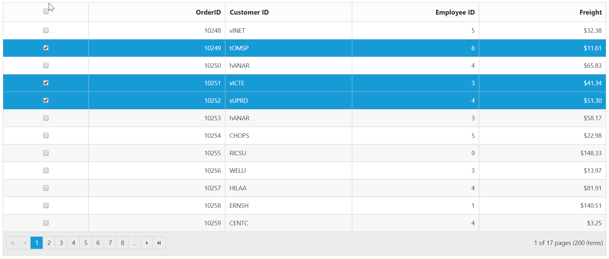
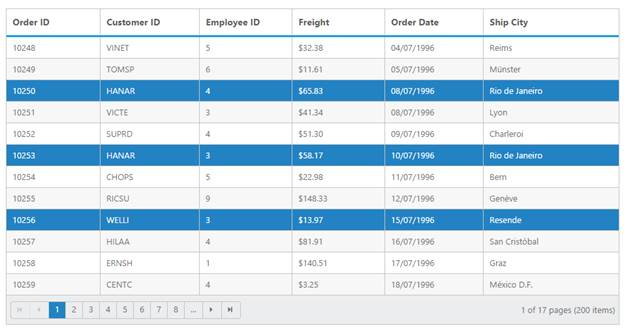
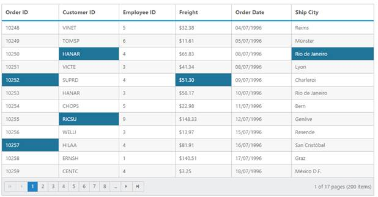

# Selection

Selection provides an interactive support to highlight the row, cell or column that you select. Selection can be done through simple Mouse down or Keyboard interaction. To enable selection, set `AllowSelection` as `true`. 

## Types of Selection

There are two types of selections available in grid. They are

1. Single 
2. Multiple 

### Single Selection

Single selection is an interactive support to select a specific row, cell or column in grid by mouse or keyboard interactions. To enable single selection by setting `SelectionType` property as `Single` and also set `AllowSelection` property as `true`.

### Multiple Selections

Multiple selections is an interactive support to select a group of rows, cells or columns in grid by mouse or keyboard interactions. To enable multiple selections by set `SelectionType`  property as `Multiple` and also set `AllowSelection` property as `true`.

## Row Selection

Row selection is enabled by set `SelectionMode` property of `SelectionSettings` as `row`. For random row selection, press **"Ctrl + mouse left"** click and for continuous row selection press **"Shift + mouse left"** click on the grid rows. To unselect selected rows, by press **"Ctrl + mouse left"** click on selected row.

The following code example describes the above behavior.

 
  

        <ej:Grid ID="OrdersGrid" runat="server" AllowPaging="true" AllowSelection="true" Selectiontype="Multiple">
          <SelectionSettings SelectionMode="row"/> 
              <Columns>                
                  <ej:Column Field="OrderID"/>
                  <ej:Column Field="EmployeeID"/>
                   <ej:Column Field="ShipCity"/>                
                  <ej:Column Field="ShipCountry"/>
                  <ej:Column Field="Freight" />
             </Columns> 
        </ej:Grid>  

 

      namespace WebSampleBrowser.Grid
       {
        public partial class Selection : System.Web.UI.Page
        {
         List<Orders> order = new List<Orders>();
         protected void Page_Load(object sender, EventArgs e)
          {
             BindDataSource();
          }
          private void BindDataSource()
           {
            int orderId = 10000;
            int empId = 0;
            for (int i = 0; i < 9; i++)
            {
                order.Add(new Orders(orderId + 1, empId + 1, "Reims", "France", 32.38));
                order.Add(new Orders(orderId + 2, empId + 2, "Rio de Janeiro", "Brazil", 11.61));
                order.Add(new Orders(orderId + 3, empId + 3, "Lyon", "France", 45.34));
                order.Add(new Orders(orderId + 4, empId + 4, "Charlerio", "Germany", 37.28));
                order.Add(new Orders(orderId + 5, empId + 5,"Bern", "Germany", 67.00));
                order.Add(new Orders(orderId + 6, empId + 6, "Graz", "USA", 23.32));
                orderId += 6;
                empId += 6;
            }
            this.OrdersGrid.DataSource = order;
            this.OrdersGrid.DataBind();
        }
        [Serializable]
        public class Orders
        {
            public Orders()
            {

            }
            public Orders(int OrderId, int empId, string  shipCity, string shipCountry, double freight)
            {
                this.OrderID = OrderId;
                this.EmployeeID = empId;
                this.ShipCity =  shipCity
                this.ShipCountry = shipCountry;
                this.Freight = freight;
            }
            public int OrderID { get; set; }
            public int EmployeeID { get; set; }
            public string ShipCity{ get; set; }
            public string ShipCountry { get; set; }
            public double Freight { get; set; }
          }
        }
      }



The following output is displayed as a result of the above code example

## Multiple Row Selection using Checkbox Column

Select multiple rows in grid by using Checkbox column and it can be enabled by set column `Type` as `checkbox`. It also provides the option to select/deselect all the rows in Grid using a checkbox in the corresponding column header.

If the `Field` property of Checkbox column is not defined, then it acts as a template column. So `Field` property is necessary to perform grid actions like sorting, editing, etc., for the corresponding Checkbox column.

The following code example describes the above behavior.

 
  

        <ej:Grid ID="OrdersGrid" runat="server" AllowPaging="true" AllowSelection="true">
               <Columns>                
                  <ej:Column Type="checkbox" Width="50"/>
                  <ej:Column Field="OrderID" HeaderText="Order ID" IsPrimaryKey="true" TextAlign="Right" Width="75" />
                  <ej:Column Field="CustomerID" HeaderText="Customer ID" Width="80" />
                  <ej:Column Field="EmployeeID" HeaderText="Employee ID" TextAlign="Right" Width="75" />
                  <ej:Column Field="Freight" HeaderText="Freight" TextAlign="Right" Width="75" Format="{0:C}"/>
             </Columns> 
        </ej:Grid>  

 

      namespace WebSampleBrowser.Grid
       {
        public partial class Selection : System.Web.UI.Page
        {
          protected void Page_Load(object sender, EventArgs e)
          {
              this.OrdersGrid.DataSource = new NorthwindDataContext().OrdersViews.ToList();
              this.OrdersGrid.DataBind();
          }
        }
      }



The following output is displayed as a result of the above code example

## Cell Selection

Cell selection is enabled by set `SelectionMode` property of `SelectionSettings` as `cell`. For random cell selection, press **"Ctrl + mouse left"** click and for continuous cell selection, press **"Shift + mouse left"** click on the grid cells. To unselect selected cells, press **"Ctrl + mouse left"** on selected cell click.

The following code example describes the above behavior.

 


        <ej:Grid ID="OrdersGrid" runat="server" AllowPaging="true" AllowSelection="true" Selectiontype="Multiple">
             <SelectionSettings SelectionMode="cell"/> 
              <Columns>                
                 <ej:Column Field="OrderID"/>
                 <ej:Column Field="EmployeeID"/>
                 <ej:Column Field="ShipCity"/>                
                 <ej:Column Field="ShipCountry"/>
                 <ej:Column Field="Freight" />
              </Columns>
        </ej:Grid>

 

        namespace WebSampleBrowser.Grid
         {
             public partial class Selection : System.Web.UI.Page
              {
                 List<Orders> order = new List<Orders>();
                 protected void Page_Load(object sender, EventArgs e)
                  {
                     BindDataSource();
                  }
                private void BindDataSource()
                {
                 int orderId = 10000;
                 int empId = 0;
                 for (int i = 0; i < 9; i++)
                 {
                    order.Add(new Orders(orderId + 1, empId + 1, "Reims", "France", 32.38));
                    order.Add(new Orders(orderId + 2, empId + 2, "Rio de Janeiro", "Brazil", 11.61));
                    order.Add(new Orders(orderId + 3, empId + 3, "Lyon", "France", 45.34));
                    order.Add(new Orders(orderId + 4, empId + 4, "Charlerio", "Germany", 37.28));
                    order.Add(new Orders(orderId + 5, empId + 5,"Bern", "Germany", 67.00));
                    order.Add(new Orders(orderId + 6, empId + 6, "Graz", "USA", 23.32));
                    orderId += 6;
                    empId += 6;
                 }
                this.OrdersGrid.DataSource = order;
                this.OrdersGrid.DataBind();
              }
             [Serializable]
             public class Orders
             {
              public Orders()
               {

               }
              public Orders(int OrderId, int empId, string  shipCity, string shipCountry, double freight)
               {
                 this.OrderID = OrderId;
                 this.EmployeeID = empId;
                 this.ShipCity =  shipCity
                 this.ShipCountry = shipCountry;
                 this.Freight = freight;
               }
               public int OrderID { get; set; }
               public int EmployeeID { get; set; }
               public string ShipCity{ get; set; }
               public string ShipCountry { get; set; }
               public double Freight { get; set; }
              }
            }
           }



The following output is displayed as a result of the above code example

### Cell Selection Mode

There are two types of cell selection available in grid. They are

1. Continuous Selection
2. Box Selection

Box cell selection is to select multiple cells vertically based on the initial column index selection.  

The following code example describes the above behavior.

 


        <ej:Grid ID="OrdersGrid" runat="server" AllowPaging="true" AllowSelection="true" Selectiontype="Multiple">
             <SelectionSettings SelectionMode="cell" CellSelectionMode="Box"/> 
              <Columns>                
                 <ej:Column Field="OrderID"/>
                 <ej:Column Field="EmployeeID"/>
                 <ej:Column Field="ShipCity"/>                
                 <ej:Column Field="ShipCountry"/>
                 <ej:Column Field="Freight" />
              </Columns>
        </ej:Grid>



        namespace WebSampleBrowser.Grid
         {
             public partial class Selection : System.Web.UI.Page
              {
                 List<Orders> order = new List<Orders>();
                 protected void Page_Load(object sender, EventArgs e)
                  {
                     BindDataSource();
                  }
                private void BindDataSource()
                {
                 int orderId = 10000;
                 int empId = 0;
                 for (int i = 0; i < 9; i++)
                 {
                    order.Add(new Orders(orderId + 1, empId + 1, "Reims", "France", 32.38));
                    order.Add(new Orders(orderId + 2, empId + 2, "Rio de Janeiro", "Brazil", 11.61));
                    order.Add(new Orders(orderId + 3, empId + 3, "Lyon", "France", 45.34));
                    order.Add(new Orders(orderId + 4, empId + 4, "Charlerio", "Germany", 37.28));
                    order.Add(new Orders(orderId + 5, empId + 5,"Bern", "Germany", 67.00));
                    order.Add(new Orders(orderId + 6, empId + 6, "Graz", "USA", 23.32));
                    orderId += 6;
                    empId += 6;
                 }
                this.OrdersGrid.DataSource = order;
                this.OrdersGrid.DataBind();
              }
             [Serializable]
             public class Orders
             {
              public Orders()
               {

               }
              public Orders(int OrderId, int empId, string  shipCity, string shipCountry, double freight)
               {
                 this.OrderID = OrderId;
                 this.EmployeeID = empId;
                 this.ShipCity =  shipCity
                 this.ShipCountry = shipCountry;
                 this.Freight = freight;
               }
               public int OrderID { get; set; }
               public int EmployeeID { get; set; }
               public string ShipCity{ get; set; }
               public string ShipCountry { get; set; }
               public double Freight { get; set; }
              }
            }
           }



 The following output is displayed as a result of the above code example

## Column Selection

Column selection can be enabled by setting `SelectionMode` property of `SelectionSettings` as `column`. For random column selection, press **"Ctrl + mouse left click"** and for continuous column selection, press **"Shift + mouse left click"** on the top of the column header. To unselect selected columns, press **"Ctrl + mouse left click"** on top of the selected column header.

The following code example describes the above behavior.

 


        <ej:Grid ID="OrdersGrid" runat="server" AllowPaging="true" AllowSelection="true" Selectiontype="Multiple">
             <SelectionSettings SelectionMode="column"/> 
              <Columns>                
                 <ej:Column Field="OrderID"/>
                 <ej:Column Field="EmployeeID"/>
                  <ej:Column Field="ShipCity"/>                
                 <ej:Column Field="ShipCountry"/>
                 <ej:Column Field="Freight" />
              </Columns>
        </ej:Grid>


		
        namespace WebSampleBrowser.Grid
         {
             public partial class Selection : System.Web.UI.Page
              {
                 List<Orders> order = new List<Orders>();
                 protected void Page_Load(object sender, EventArgs e)
                  {
                     BindDataSource();
                  }
                private void BindDataSource()
                {
                 int orderId = 10000;
                 int empId = 0;
                 for (int i = 0; i < 9; i++)
                 {
                    order.Add(new Orders(orderId + 1, empId + 1, "Reims", "France", 32.38));
                    order.Add(new Orders(orderId + 2, empId + 2, "Rio de Janeiro", "Brazil", 11.61));
                    order.Add(new Orders(orderId + 3, empId + 3, "Lyon", "France", 45.34));
                    order.Add(new Orders(orderId + 4, empId + 4, "Charlerio", "Germany", 37.28));
                    order.Add(new Orders(orderId + 5, empId + 5,"Bern", "Germany", 67.00));
                    order.Add(new Orders(orderId + 6, empId + 6, "Graz", "USA", 23.32));
                    orderId += 6;
                    empId += 6;
                 }
                this.OrdersGrid.DataSource = order;
                this.OrdersGrid.DataBind();
              }
             [Serializable]
             public class Orders
             {
              public Orders()
               {

               }
              public Orders(int OrderId, int empId, string  shipCity, string shipCountry, double freight)
               {
                 this.OrderID = OrderId;
                 this.EmployeeID = empId;
                 this.ShipCity =  shipCity
                 this.ShipCountry = shipCountry;
                 this.Freight = freight;
               }
               public int OrderID { get; set; }
               public int EmployeeID { get; set; }
               public string ShipCity{ get; set; }
               public string ShipCountry { get; set; }
               public double Freight { get; set; }
              }
            }
           }



The following output is displayed as a result of the above code example

## Touch options

While using grid in a touch device environment, there is an option for multi selection through single tap on the row and it will shows a popup with multi-selection symbol. Tap the icon to enable multi selection in a single tap.

The following code example describes the above behavior. 

 


        <ej:Grid ID="OrdersGrid" runat="server" AllowPaging="true" AllowSelection="true" Selectiontype="Multiple"> 
              <Columns>                
                 <ej:Column Field="OrderID"/>
                 <ej:Column Field="EmployeeID"/>
                 <ej:Column Field="ShipCity"/>                
                 <ej:Column Field="ShipCountry"/>
                 <ej:Column Field="Freight" />
              </Columns>
        </ej:Grid>


		
        namespace WebSampleBrowser.Grid
         {
             public partial class Selection : System.Web.UI.Page
              {
                 List<Orders> order = new List<Orders>();
                 protected void Page_Load(object sender, EventArgs e)
                  {
                     BindDataSource();
                  }
                private void BindDataSource()
                {
                 int orderId = 10000;
                 int empId = 0;
                 for (int i = 0; i < 9; i++)
                 {
                    order.Add(new Orders(orderId + 1, empId + 1, "Reims", "France", 32.38));
                    order.Add(new Orders(orderId + 2, empId + 2, "Rio de Janeiro", "Brazil", 11.61));
                    order.Add(new Orders(orderId + 3, empId + 3, "Lyon", "France", 45.34));
                    order.Add(new Orders(orderId + 4, empId + 4, "Charlerio", "Germany", 37.28));
                    order.Add(new Orders(orderId + 5, empId + 5,"Bern", "Germany", 67.00));
                    order.Add(new Orders(orderId + 6, empId + 6, "Graz", "USA", 23.32));
                    orderId += 6;
                    empId += 6;
                 }
                this.OrdersGrid.DataSource = order;
                this.OrdersGrid.DataBind();
              }
             [Serializable]
             public class Orders
             {
              public Orders()
               {

               }
              public Orders(int OrderId, int empId, string  shipCity, string shipCountry, double freight)
               {
                 this.OrderID = OrderId;
                 this.EmployeeID = empId;
                 this.ShipCity =  shipCity
                 this.ShipCountry = shipCountry;
                 this.Freight = freight;
               }
               public int OrderID { get; set; }
               public int EmployeeID { get; set; }
               public string ShipCity{ get; set; }
               public string ShipCountry { get; set; }
               public double Freight { get; set; }
              }
            }
           }



The following output is displayed as a result of the above code example.

## Toggle Selection

The Toggle selection allows to perform selection and unselect of the particular row, cell or column.  To enable toggle selection, set `EnableToggle` property of `SelectionSettings`  as `true`. If you click on the selected row, cell or column then it will be unselected and vice versa. 

N> If multi selection is enabled, then in first click on any selected row (without pressing Ctrl key), it will clear multi selection and in second click on the same row, it will be unselected. 

The following code example describes the above behavior. 

 


       <ej:Grid ID="OrdersGrid" runat="server" AllowPaging="true" EnableRowHover="false">
            <SelectionSettings EnableToggle="true"/> 
             <Columns>                
                <ej:Column Field="OrderID" />
                <ej:Column Field="EmployeeID"/>
                <ej:Column Field="ShipCity"/>                
                <ej:Column Field="ShipCountry"/>
                <ej:Column Field="Freight"/>
              </Columns>
       </ej:Grid>


		
        namespace WebSampleBrowser.Grid
         {
             public partial class Selection : System.Web.UI.Page
              {
                 List<Orders> order = new List<Orders>();
                 protected void Page_Load(object sender, EventArgs e)
                  {
                     BindDataSource();
                  }
                private void BindDataSource()
                {
                 int orderId = 10000;
                 int empId = 0;
                 for (int i = 0; i < 9; i++)
                 {
                    order.Add(new Orders(orderId + 1, empId + 1, "Reims", "France", 32.38));
                    order.Add(new Orders(orderId + 2, empId + 2, "Rio de Janeiro", "Brazil", 11.61));
                    order.Add(new Orders(orderId + 3, empId + 3, "Lyon", "France", 45.34));
                    order.Add(new Orders(orderId + 4, empId + 4, "Charlerio", "Germany", 37.28));
                    order.Add(new Orders(orderId + 5, empId + 5,"Bern", "Germany", 67.00));
                    order.Add(new Orders(orderId + 6, empId + 6, "Graz", "USA", 23.32));
                    orderId += 6;
                    empId += 6;
                 }
                this.OrdersGrid.DataSource = order;
                this.OrdersGrid.DataBind();
              }
             [Serializable]
             public class Orders
             {
              public Orders()
               {

               }
              public Orders(int OrderId, int empId, string  shipCity, string shipCountry, double freight)
               {
                 this.OrderID = OrderId;
                 this.EmployeeID = empId;
                 this.ShipCity =  shipCity
                 this.ShipCountry = shipCountry;
                 this.Freight = freight;
               }
               public int OrderID { get; set; }
               public int EmployeeID { get; set; }
               public string ShipCity{ get; set; }
               public string ShipCountry { get; set; }
               public double Freight { get; set; }
              }
            }
           }

  