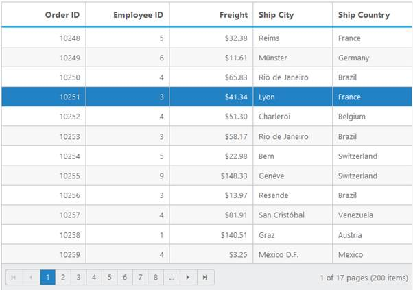

# Selection

The Selection property is used to highlight a row that you select. 

## Types of selection

 There are two types of Selections. 

* Single
* Multiple

Single selection is used to select a single row, cell or column in Grid. In Multiple selection you can select more than one row, cell or column. Refer to the following code examples of Selection types.

### Single Selection

By default, the selection type is “Single”.

#### Selection Modes

##### Row

By default, the selection mode of the grid is “Row”. This enables you to select the row in the grid. Refer to the following code example. Using SelectionMode property in SelectionSettings used to avhieve row selection mode.


<ej:Grid ID="OrdersGrid" runat="server" AllowPaging="True" AllowSelection="True" EnableRowHover = "False">

            <Columns>

                <ej:Column Field="OrderID" HeaderText="Order ID" IsPrimaryKey="true" TextAlign="Right" Width="90" />

                <ej:Column Field="CustomerID" HeaderText="Customer ID" Width="100" />

                <ej:Column Field="EmployeeID" HeaderText="Employee ID" TextAlign="Right" Width="110" />

                <ej:Column Field="Freight" HeaderText="Freight" TextAlign="Right" Width="90" Format="{0:C}" />

                <ej:Column Field="OrderDate" HeaderText="Order Date" Width="100" TextAlign="Right" Format="{0:MM/dd/yyyy}" />

                <ej:Column Field="ShipCity" HeaderText="Ship City" Width="100" />

            </Columns>

<SelectionSettings SelectionMode="Row" />

</ej:Grid>



public partial class BasicSelection : System.Web.UI.Page

    {

        List<Orders> order = new List<Orders>();

        protected void Page_Load(object sender, EventArgs e)

        {

            BindDataSource();

        }

        private void BindDataSource()

        {

            int orderId = 10000;

            int empId = 0;

            for (int i = 1; i < 9; i++)

            {

                order.Add(new Orders(orderId + 1, "VINET", empId + 1, 32.38, new DateTime(2014, 12, 25), "Reims"));

                order.Add(new Orders(orderId + 2, "TOMSP", empId + 2, 11.61, new DateTime(2014, 12, 21), "Munster"));

                order.Add(new Orders(orderId + 3, "ANATER", empId + 3, 45.34, new DateTime(2014, 10, 18), "Berlin"));

                order.Add(new Orders(orderId + 4, "ALFKI", empId + 4, 37.28, new DateTime(2014, 11, 23), "Mexico"));

                order.Add(new Orders(orderId + 5, "FRGYE", empId + 5, 67.00, new DateTime(2014, 05, 05), "Colchester"));

                order.Add(new Orders(orderId + 6, "JGERT", empId + 6, 23.32, new DateTime(2014, 10, 18), "Newyork"));

                orderId += 6;

                empId += 6;

            }

            this.OrdersGrid.DataSource = order;

            this.OrdersGrid.DataBind();

        }

        [Serializable]

        public class Orders

        {

            public Orders()

            {

            }

            public Orders(int orderId, string customerId, int empId, double freight, DateTime orderDate, string shipCity)

            {

                this.OrderID = orderId;

                this.CustomerID = customerId;

                this.EmployeeID = empId;

                this.Freight = freight;

                this.OrderDate = orderDate;

                this.ShipCity = shipCity;

            }

            public int OrderID { get; set; }

            public string CustomerID { get; set; }

            public int EmployeeID { get; set; }

            public double Freight { get; set; }

            public DateTime OrderDate { get; set; }

            public string ShipCity { get; set; }

        }



The following screenshot displays the result of the above code.

 

##### Cell

Cell selection can be enabled using the SelectionMode property. This enables you to select a cell in the grid. Refer to the following code example.



<ej:Grid ID="OrdersGrid" runat="server" AllowPaging="True" AllowSelection="True" EnableRowHover = "False">

            <Columns>

                <ej:Column Field="OrderID" HeaderText="Order ID" IsPrimaryKey="true" TextAlign="Right" Width="90" />

                <ej:Column Field="CustomerID" HeaderText="Customer ID" Width="100" />

                <ej:Column Field="EmployeeID" HeaderText="Employee ID" TextAlign="Right" Width="110" />

                <ej:Column Field="Freight" HeaderText="Freight" TextAlign="Right" Width="90" Format="{0:C}" />

                <ej:Column Field="OrderDate" HeaderText="Order Date" Width="100" TextAlign="Right" Format="{0:MM/dd/yyyy}" />

                <ej:Column Field="ShipCity" HeaderText="Ship City" Width="100" />

            </Columns>

<SelectionSettings SelectionMode="Cell" />

</ej:Grid>



public partial class BasicSelection : System.Web.UI.Page

    {

        List<Orders> order = new List<Orders>();

        protected void Page_Load(object sender, EventArgs e)

        {

            BindDataSource();

        }

        private void BindDataSource()

        {

            int orderId = 10000;

            int empId = 0;

            for (int i = 1; i < 9; i++)

            {

                order.Add(new Orders(orderId + 1, "VINET", empId + 1, 32.38, new DateTime(2014, 12, 25), "Reims"));

                order.Add(new Orders(orderId + 2, "TOMSP", empId + 2, 11.61, new DateTime(2014, 12, 21), "Munster"));

                order.Add(new Orders(orderId + 3, "ANATER", empId + 3, 45.34, new DateTime(2014, 10, 18), "Berlin"));

                order.Add(new Orders(orderId + 4, "ALFKI", empId + 4, 37.28, new DateTime(2014, 11, 23), "Mexico"));

                order.Add(new Orders(orderId + 5, "FRGYE", empId + 5, 67.00, new DateTime(2014, 05, 05), "Colchester"));

                order.Add(new Orders(orderId + 6, "JGERT", empId + 6, 23.32, new DateTime(2014, 10, 18), "Newyork"));

                orderId += 6;

                empId += 6;

            }

            this.OrdersGrid.DataSource = order;

            this.OrdersGrid.DataBind();

        }

        [Serializable]

        public class Orders

        {

            public Orders()

            {

            }

            public Orders(int orderId, string customerId, int empId, double freight, DateTime orderDate, string shipCity)

            {

                this.OrderID = orderId;

                this.CustomerID = customerId;

                this.EmployeeID = empId;

                this.Freight = freight;

                this.OrderDate = orderDate;

                this.ShipCity = shipCity;

            }

            public int OrderID { get; set; }

            public string CustomerID { get; set; }

            public int EmployeeID { get; set; }

            public double Freight { get; set; }

            public DateTime OrderDate { get; set; }

            public string ShipCity { get; set; }

        }



The following screenshot displays the result of the above code.

##### Column

Column selection can be enabled using the SelectionMode property. This enables you to select a particular column in the grid. Refer to the following code example.


<ej:Grid ID="OrdersGrid" runat="server" AllowPaging="True" AllowSelection="True" EnableRowHover = "False">

            <Columns>

                <ej:Column Field="OrderID" HeaderText="Order ID" IsPrimaryKey="true" TextAlign="Right" Width="90" />

                <ej:Column Field="CustomerID" HeaderText="Customer ID" Width="100" />

                <ej:Column Field="EmployeeID" HeaderText="Employee ID" TextAlign="Right" Width="110" />

                <ej:Column Field="Freight" HeaderText="Freight" TextAlign="Right" Width="90" Format="{0:C}" />

                <ej:Column Field="OrderDate" HeaderText="Order Date" Width="100" TextAlign="Right" Format="{0:MM/dd/yyyy}" />

                <ej:Column Field="ShipCity" HeaderText="Ship City" Width="100" />

            </Columns>

<SelectionSettings SelectionMode="Column" />

</ej:Grid>



public partial class BasicSelection : System.Web.UI.Page

    {

        List<Orders> order = new List<Orders>();

        protected void Page_Load(object sender, EventArgs e)

        {

            BindDataSource();

        }

        private void BindDataSource()

        {

            int orderId = 10000;

            int empId = 0;

            for (int i = 1; i < 9; i++)

            {

                order.Add(new Orders(orderId + 1, "VINET", empId + 1, 32.38, new DateTime(2014, 12, 25), "Reims"));

                order.Add(new Orders(orderId + 2, "TOMSP", empId + 2, 11.61, new DateTime(2014, 12, 21), "Munster"));

                order.Add(new Orders(orderId + 3, "ANATER", empId + 3, 45.34, new DateTime(2014, 10, 18), "Berlin"));

                order.Add(new Orders(orderId + 4, "ALFKI", empId + 4, 37.28, new DateTime(2014, 11, 23), "Mexico"));

                order.Add(new Orders(orderId + 5, "FRGYE", empId + 5, 67.00, new DateTime(2014, 05, 05), "Colchester"));

                order.Add(new Orders(orderId + 6, "JGERT", empId + 6, 23.32, new DateTime(2014, 10, 18), "Newyork"));

                orderId += 6;

                empId += 6;

            }

            this.OrdersGrid.DataSource = order;

            this.OrdersGrid.DataBind();

        }

        [Serializable]

        public class Orders

        {

            public Orders()

            {

            }

            public Orders(int orderId, string customerId, int empId, double freight, DateTime orderDate, string shipCity)

            {

                this.OrderID = orderId;

                this.CustomerID = customerId;

                this.EmployeeID = empId;

                this.Freight = freight;

                this.OrderDate = orderDate;

                this.ShipCity = shipCity;

            }

            public int OrderID { get; set; }

            public string CustomerID { get; set; }

            public int EmployeeID { get; set; }

            public double Freight { get; set; }

            public DateTime OrderDate { get; set; }

            public string ShipCity { get; set; }

        }



The following screenshot displays the result of the above code.

### Multiple Selection

Multiple selection can be enabled using SelectionType property. This allows you to select more than one row, cell and column at a time.

#### Selection Modes

##### Row

By default, the selection mode of the grid is “Row”. This enable you to select the row in the grid. Refer to the following code example.



<ej:Grid ID="OrdersGrid" runat="server" AllowPaging="True" AllowSelection="True" Selectiontype="Multiple" EnableRowHover = "False">

            <Columns>

                <ej:Column Field="OrderID" HeaderText="Order ID" IsPrimaryKey="true" TextAlign="Right" Width="90" />

                <ej:Column Field="CustomerID" HeaderText="Customer ID" Width="100" />

                <ej:Column Field="EmployeeID" HeaderText="Employee ID" TextAlign="Right" Width="110" />

                <ej:Column Field="Freight" HeaderText="Freight" TextAlign="Right" Width="90" Format="{0:C}" />

                <ej:Column Field="OrderDate" HeaderText="Order Date" Width="100" TextAlign="Right" Format="{0:MM/dd/yyyy}" />

                <ej:Column Field="ShipCity" HeaderText="Ship City" Width="100" />

            </Columns>

<SelectionSettings SelectionMode="Row" />

</ej:Grid>



public partial class BasicSelection : System.Web.UI.Page

    {

        List<Orders> order = new List<Orders>();

        protected void Page_Load(object sender, EventArgs e)

        {

            BindDataSource();

        }

        private void BindDataSource()

        {

            int orderId = 10000;

            int empId = 0;

            for (int i = 1; i < 9; i++)

            {

                order.Add(new Orders(orderId + 1, "VINET", empId + 1, 32.38, new DateTime(2014, 12, 25), "Reims"));

                order.Add(new Orders(orderId + 2, "TOMSP", empId + 2, 11.61, new DateTime(2014, 12, 21), "Munster"));

                order.Add(new Orders(orderId + 3, "ANATER", empId + 3, 45.34, new DateTime(2014, 10, 18), "Berlin"));

                order.Add(new Orders(orderId + 4, "ALFKI", empId + 4, 37.28, new DateTime(2014, 11, 23), "Mexico"));

                order.Add(new Orders(orderId + 5, "FRGYE", empId + 5, 67.00, new DateTime(2014, 05, 05), "Colchester"));

                order.Add(new Orders(orderId + 6, "JGERT", empId + 6, 23.32, new DateTime(2014, 10, 18), "Newyork"));

                orderId += 6;

                empId += 6;

            }

            this.OrdersGrid.DataSource = order;

            this.OrdersGrid.DataBind();

        }

        [Serializable]

        public class Orders

        {

            public Orders()

            {

            }

            public Orders(int orderId, string customerId, int empId, double freight, DateTime orderDate, string shipCity)

            {

                this.OrderID = orderId;

                this.CustomerID = customerId;

                this.EmployeeID = empId;

                this.Freight = freight;

                this.OrderDate = orderDate;

                this.ShipCity = shipCity;

            }

            public int OrderID { get; set; }

            public string CustomerID { get; set; }

            public int EmployeeID { get; set; }

            public double Freight { get; set; }

            public DateTime OrderDate { get; set; }

            public string ShipCity { get; set; }

        }



The following screenshot displays the result of the above code.

##### Cell

Cell selection can be enabled using the SelectionMode property. This enables you to select a cell in the grid. Refer to the following code example.



<ej:Grid ID="OrdersGrid" runat="server" AllowPaging="True" AllowSelection="True" Selectiontype="Multiple" EnableRowHover = "False">

            <Columns>

                <ej:Column Field="OrderID" HeaderText="Order ID" IsPrimaryKey="true" TextAlign="Right" Width="90" />

                <ej:Column Field="CustomerID" HeaderText="Customer ID" Width="100" />

                <ej:Column Field="EmployeeID" HeaderText="Employee ID" TextAlign="Right" Width="110" />

                <ej:Column Field="Freight" HeaderText="Freight" TextAlign="Right" Width="90" Format="{0:C}" />

                <ej:Column Field="OrderDate" HeaderText="Order Date" Width="100" TextAlign="Right" Format="{0:MM/dd/yyyy}" />

                <ej:Column Field="ShipCity" HeaderText="Ship City" Width="100" />

            </Columns>

<SelectionSettings SelectionMode="Cell" />

</ej:Grid>



public partial class BasicSelection : System.Web.UI.Page

    {

        List<Orders> order = new List<Orders>();

        protected void Page_Load(object sender, EventArgs e)

        {

            BindDataSource();

        }

        private void BindDataSource()

        {

            int orderId = 10000;

            int empId = 0;

            for (int i = 1; i < 9; i++)

            {

                order.Add(new Orders(orderId + 1, "VINET", empId + 1, 32.38, new DateTime(2014, 12, 25), "Reims"));

                order.Add(new Orders(orderId + 2, "TOMSP", empId + 2, 11.61, new DateTime(2014, 12, 21), "Munster"));

                order.Add(new Orders(orderId + 3, "ANATER", empId + 3, 45.34, new DateTime(2014, 10, 18), "Berlin"));

                order.Add(new Orders(orderId + 4, "ALFKI", empId + 4, 37.28, new DateTime(2014, 11, 23), "Mexico"));

                order.Add(new Orders(orderId + 5, "FRGYE", empId + 5, 67.00, new DateTime(2014, 05, 05), "Colchester"));

                order.Add(new Orders(orderId + 6, "JGERT", empId + 6, 23.32, new DateTime(2014, 10, 18), "Newyork"));

                orderId += 6;

                empId += 6;

            }

            this.OrdersGrid.DataSource = order;

            this.OrdersGrid.DataBind();

        }

        [Serializable]

        public class Orders

        {

            public Orders()

            {

            }

            public Orders(int orderId, string customerId, int empId, double freight, DateTime orderDate, string shipCity)

            {

                this.OrderID = orderId;

                this.CustomerID = customerId;

                this.EmployeeID = empId;

                this.Freight = freight;

                this.OrderDate = orderDate;

                this.ShipCity = shipCity;

            }

            public int OrderID { get; set; }

            public string CustomerID { get; set; }

            public int EmployeeID { get; set; }

            public double Freight { get; set; }

            public DateTime OrderDate { get; set; }

            public string ShipCity { get; set; }

        }


The following screenshot displays the result of the above code.

##### Column

Column selection can be enabled using the SelectionMode property. This enables you to select a particular column in the grid. Refer to the following code example.



<ej:Grid ID="OrdersGrid" runat="server" AllowPaging="True" AllowSelection="True" Selectiontype="Multiple" EnableRowHover = "False">

            <Columns>

                <ej:Column Field="OrderID" HeaderText="Order ID" IsPrimaryKey="true" TextAlign="Right" Width="90" />

                <ej:Column Field="CustomerID" HeaderText="Customer ID" Width="100" />

                <ej:Column Field="EmployeeID" HeaderText="Employee ID" TextAlign="Right" Width="110" />

                <ej:Column Field="Freight" HeaderText="Freight" TextAlign="Right" Width="90" Format="{0:C}" />

                <ej:Column Field="OrderDate" HeaderText="Order Date" Width="100" TextAlign="Right" Format="{0:MM/dd/yyyy}" />

                <ej:Column Field="ShipCity" HeaderText="Ship City" Width="100" />

            </Columns>

<SelectionSettings SelectionMode="Column" />

</ej:Grid>



public partial class BasicSelection : System.Web.UI.Page

    {

        List<Orders> order = new List<Orders>();

        protected void Page_Load(object sender, EventArgs e)

        {

            BindDataSource();

        }

        private void BindDataSource()

        {

            int orderId = 10000;

            int empId = 0;

            for (int i = 1; i < 9; i++)

            {

                order.Add(new Orders(orderId + 1, "VINET", empId + 1, 32.38, new DateTime(2014, 12, 25), "Reims"));

                order.Add(new Orders(orderId + 2, "TOMSP", empId + 2, 11.61, new DateTime(2014, 12, 21), "Munster"));

                order.Add(new Orders(orderId + 3, "ANATER", empId + 3, 45.34, new DateTime(2014, 10, 18), "Berlin"));

                order.Add(new Orders(orderId + 4, "ALFKI", empId + 4, 37.28, new DateTime(2014, 11, 23), "Mexico"));

                order.Add(new Orders(orderId + 5, "FRGYE", empId + 5, 67.00, new DateTime(2014, 05, 05), "Colchester"));

                order.Add(new Orders(orderId + 6, "JGERT", empId + 6, 23.32, new DateTime(2014, 10, 18), "Newyork"));

                orderId += 6;

                empId += 6;

            }

            this.OrdersGrid.DataSource = order;

            this.OrdersGrid.DataBind();

        }

        [Serializable]

        public class Orders

        {

            public Orders()

            {

            }

            public Orders(int orderId, string customerId, int empId, double freight, DateTime orderDate, string shipCity)

            {

                this.OrderID = orderId;

                this.CustomerID = customerId;

                this.EmployeeID = empId;

                this.Freight = freight;

                this.OrderDate = orderDate;

                this.ShipCity = shipCity;

            }

            public int OrderID { get; set; }

            public string CustomerID { get; set; }

            public int EmployeeID { get; set; }

            public double Freight { get; set; }

            public DateTime OrderDate { get; set; }

            public string ShipCity { get; set; }

        }


The following screenshot displays the result of the above code.

## Enable All Modes of selection

You can also enable all the three modes of selection. Refer to the following code example. . Using SelectionMode property in SelectionSettings used to enable all modes of selection.



<ej:Grid ID="OrdersGrid" runat="server" AllowPaging="True" AllowSelection="True" Selectiontype="Multiple" EnableRowHover = "False">

            <Columns>

                <ej:Column Field="OrderID" HeaderText="Order ID" IsPrimaryKey="true" TextAlign="Right" Width="90" />

                <ej:Column Field="CustomerID" HeaderText="Customer ID" Width="100" />

                <ej:Column Field="EmployeeID" HeaderText="Employee ID" TextAlign="Right" Width="110" />

                <ej:Column Field="Freight" HeaderText="Freight" TextAlign="Right" Width="90" Format="{0:C}" />

                <ej:Column Field="OrderDate" HeaderText="Order Date" Width="100" TextAlign="Right" Format="{0:MM/dd/yyyy}" />

                <ej:Column Field="ShipCity" HeaderText="Ship City" Width="100" />

            </Columns>

<SelectionSettings SelectionMode="Row" SelectionMode="Cell" SelectionMode="Column"/>

</ej:Grid>



public partial class BasicSelection : System.Web.UI.Page

    {

        List<Orders> order = new List<Orders>();

        protected void Page_Load(object sender, EventArgs e)

        {

            BindDataSource();

        }

        private void BindDataSource()

        {

            int orderId = 10000;

            int empId = 0;

            for (int i = 1; i < 9; i++)

            {

                order.Add(new Orders(orderId + 1, "VINET", empId + 1, 32.38, new DateTime(2014, 12, 25), "Reims"));

                order.Add(new Orders(orderId + 2, "TOMSP", empId + 2, 11.61, new DateTime(2014, 12, 21), "Munster"));

                order.Add(new Orders(orderId + 3, "ANATER", empId + 3, 45.34, new DateTime(2014, 10, 18), "Berlin"));

                order.Add(new Orders(orderId + 4, "ALFKI", empId + 4, 37.28, new DateTime(2014, 11, 23), "Mexico"));

                order.Add(new Orders(orderId + 5, "FRGYE", empId + 5, 67.00, new DateTime(2014, 05, 05), "Colchester"));

                order.Add(new Orders(orderId + 6, "JGERT", empId + 6, 23.32, new DateTime(2014, 10, 18), "Newyork"));

                orderId += 6;

                empId += 6;

            }

            this.OrdersGrid.DataSource = order;

            this.OrdersGrid.DataBind();

        }

        [Serializable]

        public class Orders

        {

            public Orders()

            {

            }

            public Orders(int orderId, string customerId, int empId, double freight, DateTime orderDate, string shipCity)

            {

                this.OrderID = orderId;

                this.CustomerID = customerId;

                this.EmployeeID = empId;

                this.Freight = freight;

                this.OrderDate = orderDate;

                this.ShipCity = shipCity;

            }

            public int OrderID { get; set; }

            public string CustomerID { get; set; }

            public int EmployeeID { get; set; }

            public double Freight { get; set; }

            public DateTime OrderDate { get; set; }

            public string ShipCity { get; set; }

        }


The following screenshot displays the result of the above code.

## Enable toggle

You can toggle the selection using the EnableToggle property. This provides support to toggle selection based on the Boolean value specified to the property. By default the EnableToggle property is set to disabled. Refer to the following code example.



<ej:Grid ID="OrdersGrid" runat="server" AllowPaging="True" AllowSelection="True" Selectiontype="Multiple" EnableRowHover = "False">

            <Columns>

                <ej:Column Field="OrderID" HeaderText="Order ID" IsPrimaryKey="true" TextAlign="Right" Width="90" />

                <ej:Column Field="CustomerID" HeaderText="Customer ID" Width="100" />

                <ej:Column Field="EmployeeID" HeaderText="Employee ID" TextAlign="Right" Width="110" />

                <ej:Column Field="Freight" HeaderText="Freight" TextAlign="Right" Width="90" Format="{0:C}" />

                <ej:Column Field="OrderDate" HeaderText="Order Date" Width="100" TextAlign="Right" Format="{0:MM/dd/yyyy}" />

                <ej:Column Field="ShipCity" HeaderText="Ship City" Width="100" />

            </Columns>

<SelectionSettings SelectionMode="Row" EnableToggle="true" />

</ej:Grid>



public partial class BasicSelection : System.Web.UI.Page

    {

        List<Orders> order = new List<Orders>();

        protected void Page_Load(object sender, EventArgs e)

        {

            BindDataSource();

        }

        private void BindDataSource()

        {

            int orderId = 10000;

            int empId = 0;

            for (int i = 1; i < 9; i++)

            {

                order.Add(new Orders(orderId + 1, "VINET", empId + 1, 32.38, new DateTime(2014, 12, 25), "Reims"));

                order.Add(new Orders(orderId + 2, "TOMSP", empId + 2, 11.61, new DateTime(2014, 12, 21), "Munster"));

                order.Add(new Orders(orderId + 3, "ANATER", empId + 3, 45.34, new DateTime(2014, 10, 18), "Berlin"));

                order.Add(new Orders(orderId + 4, "ALFKI", empId + 4, 37.28, new DateTime(2014, 11, 23), "Mexico"));

                order.Add(new Orders(orderId + 5, "FRGYE", empId + 5, 67.00, new DateTime(2014, 05, 05), "Colchester"));

                order.Add(new Orders(orderId + 6, "JGERT", empId + 6, 23.32, new DateTime(2014, 10, 18), "Newyork"));

                orderId += 6;

                empId += 6;

            }

            this.OrdersGrid.DataSource = order;

            this.OrdersGrid.DataBind();

        }

        [Serializable]

        public class Orders

        {

            public Orders()

            {

            }

            public Orders(int orderId, string customerId, int empId, double freight, DateTime orderDate, string shipCity)

            {

                this.OrderID = orderId;

                this.CustomerID = customerId;

                this.EmployeeID = empId;

                this.Freight = freight;

                this.OrderDate = orderDate;

                this.ShipCity = shipCity;

            }

            public int OrderID { get; set; }

            public string CustomerID { get; set; }

            public int EmployeeID { get; set; }

            public double Freight { get; set; }

            public DateTime OrderDate { get; set; }

            public string ShipCity { get; set; }

        }


The following screenshot displays the result of the above code.

## Customize Selection Color

In this section, you can learn how to customize or override selection background color through css. The following code example is for Selection color customization.



<ej:Grid ID="OrdersGrid" runat="server" AllowPaging="True" AllowSelection="True" Selectiontype="Multiple">

</ej:Grid>



The following output is displayed as a result of the above code example.

## Get selected record data

In this section, you can learn how to get selected records from one Grid and how this selected record is used to update datasource of another Grid. 


<ej:Grid ID="EmployeesGrid" runat="server" AllowSelection="True">

            <Columns>

                <ej:Column Field="EmployeeID" HeaderText="Employee ID" IsPrimaryKey="true" TextAlign="Right" Width="125" />

                <ej:Column Field="FirstName" HeaderText="First Name" Width="100" />

                <ej:Column Field="LastName" HeaderText="Last Name" Width="100" />

                <ej:Column Field="Title" HeaderText="Title" Width="150" />

                <ej:Column Field="BirthDate" HeaderText="Birth Date" Width="100" TextAlign="Right" Format="{0:MM/dd/yyyy}" />

                <ej:Column Field="Country" HeaderText="Country" Width="100" />

            </Columns>

        </ej:Grid>   

<ej:Grid ID="OrdersGrid" runat="server" AllowPaging="False">

            <Columns>

                <ej:Column Field="OrderID" HeaderText="Order ID" IsPrimaryKey="true" TextAlign="Right" Width="75" />

                <ej:Column Field="CustomerID" HeaderText="Customer ID" Width="80" />

                <ej:Column Field="EmployeeID" HeaderText="Employee ID" TextAlign="Right" Width="75" />

                <ej:Column Field="Freight" HeaderText="Freight" TextAlign="Right" Width="75" Format="{0:C}" />

                <ej:Column Field="OrderDate" HeaderText="Order Date" Width="80" TextAlign="Right" Format="{0:MM/dd/yyyy}" />

                <ej:Column Field="ShipCity" HeaderText="Ship City" Width="110" />

            </Columns>

        </ej:Grid> 






public partial class MasterDetails : System.Web.UI.Page

    {

        private List<Orders> order = new List<Orders>();

        private List<Employee> employee = new List<Employee>();

        protected void Page_Load(object sender, EventArgs e)

        {

            OrderDetails();

            EmployeeDetails();

        }

        private void EmployeeDetails()

        {

            employee.Add(new Employee(1, "Nancy", "Davolia", "Sales Representative", new DateTime(1970, 12, 24), "USA"));

            employee.Add(new Employee(2, "Andrew", "Fuller", "Sales Representative", new DateTime(1974, 1, 4), "USA"));

            employee.Add(new Employee(3, "Janet", "Leverling", "Sales Representative", new DateTime(1977, 2, 7), "USA"));

            employee.Add(new Employee(4, "Margaret", "peacock", "Sales Representative", new DateTime(1979, 8, 16), "USA"));

            employee.Add(new Employee(5, "Stevan", "Bhuchanan", "Sales Representative", new DateTime(1980, 5, 20), "USA"));

            this.EmployeesGrid.DataSource = employee;

            this.EmployeesGrid.DataBind();

        }

        private void OrderDetails()

        {

            int orderId = 10000;

            for (int i = 1; i < 6; i++)

            {

                order.Add(new Orders(orderId + 1, "VINET", 1, 32.38, new DateTime(2014, 12, 25), "Reims"));

                order.Add(new Orders(orderId + 2, "TOMSP", 2, 11.61, new DateTime(2014, 12, 21), "Munster"));

                order.Add(new Orders(orderId + 3, "ANATER", 3, 45.34, new DateTime(2014, 10, 18), "Berlin"));

                order.Add(new Orders(orderId + 4, "ALFKI", 4, 37.28, new DateTime(2014, 11, 23), "Mexico"));

                order.Add(new Orders(orderId + 5, "FRGYE", 5, 67.00, new DateTime(2014, 05, 05), "Colchester"));

                orderId += 5;

            }

            this.OrdersGrid.DataSource = order;

            this.OrdersGrid.DataBind();

        }

        [Serializable]

        public class Employee

        {

            public Employee()

            {

            }

            public Employee(int employeeId, string firstName, string lastName, string title, DateTime dob,

                string country)

            {

                this.EmployeeID = employeeId;

                this.FirstName = firstName;

                this.LastName = lastName;

                this.Title = title;

                this.BirthDate = dob;

                this.Country = country;

            }

            public int EmployeeID { get; set; }

            public string FirstName { get; set; }

            public string LastName { get; set; }

            public string Title { get; set; }

            public DateTime BirthDate { get; set; }

            public string Country { get; set; }

        }

        [Serializable]

        public class Orders

        {

            public Orders()

            {

            }

            public Orders(int orderId, string customerId, int empId, double freight, DateTime orderDate, string shipCity)

            {

                this.OrderID = orderId;

                this.CustomerID = customerId;

                this.EmployeeID = empId;

                this.Freight = freight;

                this.OrderDate = orderDate;

                this.ShipCity = shipCity;

            }

            public int OrderID { get; set; }

            public string CustomerID { get; set; }

            public int EmployeeID { get; set; }

            public double Freight { get; set; }

            public DateTime OrderDate { get; set; }

            public string ShipCity { get; set; }

        }

    }



The following output is displayed as a result of the above code example.

