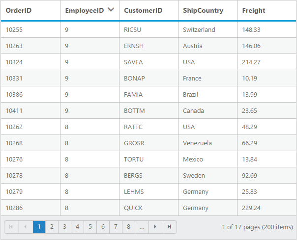
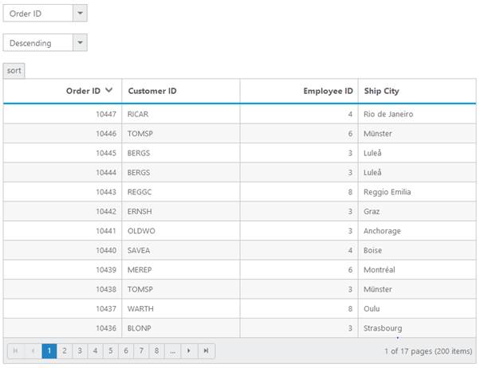

# Sorting
The Grid control has support to sort data bound columns in ascending or descending order. This can be achieved by setting `AllowSorting` property as `true`. 

To dynamically sort a particular column, click on its column header. The order switch between ascending and descending each time you click a column header for sorting.

The following code example describes the above behavior.




    
           <ej:Grid ID="FlatGrid" runat="server" AllowSorting="true" AllowPaging="true" >
           <Columns>
                <ej:Column Field="OrderID" />
                <ej:Column Field="EmployeeID" />
                <ej:Column Field="ShipCity" />
                <ej:Column Field="ShipCountry" />
                <ej:Column Field="Freight" />
           </Columns>             
           </ej:Grid>
           




    namespace WebSampleBrowser.Grid
        {
            public partial class _Default : Page
              { 
                 List<Orders> order = new List<Orders>();
                 protected void Page_Load(object sender, EventArgs e)
                 {
                   BindDataSource();
                  }
                 private void BindDataSource()
                  {   
                     int code = 10000;
                     for (int i = 1; i < 10; i++)
                     {
                      order.Add(new Orders(code + 1, i + 0,"Reims","France",34.3 * i));
                      order.Add(new Orders(code + 2, i + 2,"Munster","Germany",35.3 * i));
                      order.Add(new Orders(code + 3, i + 1,"Berlin","Brazil" ,325.3 * i));
                      order.Add(new Orders(code + 4, i + 3, "Mexico","Italy",435.3 * i, ));
                      order.Add(new Orders(code + 5, i + 4, "Bern","Mexico",46.3 * i));
                      code += 5;
                     }
                    this.FlatGrid.DataSource = order;
                    this.FlatGrid.DataBind();
                  }
                  [Serializable]
                  public class Orders
                   {
                     public Orders()
                      {

                      }
                     public Orders(long OrderId, int EmployeeId, string ShipCity, string ShipCountry,double Freight)
                      {
                        this.OrderID = OrderId;
                        this.EmployeeID = EmployeeId;
                        this.ShipCity = ShipCity;
                        this.ShipCountry = ShipCountry;
                        this.Freight = Freight;
                        
                      }
                     public long OrderID { get; set; }
                     public int EmployeeID { get; set; }
                     public string ShipCity { get; set; }
                     public string ShipCountry { get; set; }
                     public double Freight { get; set; }
                   }
              }
        } 

    
  

The following output is displayed as a result of the above code example.

## Initial Sorting
Through `SortedColumns` property of `SortSettings`, you can sort the columns while initializing the grid itself. You need to specify the `Field` (Columns) name and `Direction` in the `SortedColumns`.

N> You can add multiple columns in `SortedColumns` for multi column sorting while initializing the grid itself.

The following code example describes the above behavior.




    
           <ej:Grid ID="FlatGrid" runat="server" AllowSorting="true" AllowPaging="true" >
           <SortedColumns><ej:SortedColumn Field="EmployeeID" Direction="Descending" /></SortedColumns>
           <Columns>
                <ej:Column Field="OrderID" />
                <ej:Column Field="EmployeeID" />
                <ej:Column Field="ShipCity" />
                <ej:Column Field="ShipCountry" />
                <ej:Column Field="Freight" />
           </Columns>             
           </ej:Grid>
                 




    namespace WebSampleBrowser.Grid
        {
            public partial class _Default : Page
              { 
                 List<Orders> order = new List<Orders>();
                 protected void Page_Load(object sender, EventArgs e)
                 {
                   BindDataSource();
                  }
                 private void BindDataSource()
                  {   
                     int code = 10000;
                     for (int i = 1; i < 10; i++)
                     {
                      order.Add(new Orders(code + 1, i + 0,"Reims","France",34.3 * i));
                      order.Add(new Orders(code + 2, i + 2,"Munster","Germany",35.3 * i));
                      order.Add(new Orders(code + 3, i + 1,"Berlin","Brazil" ,325.3 * i));
                      order.Add(new Orders(code + 4, i + 3, "Mexico","Italy",435.3 * i, ));
                      order.Add(new Orders(code + 5, i + 4, "Bern","Mexico",46.3 * i));
                      code += 5;
                     }
                    this.FlatGrid.DataSource = order;
                    this.FlatGrid.DataBind();
                  }
                  [Serializable]
                  public class Orders
                   {
                     public Orders()
                      {

                      }
                     public Orders(long OrderId, int EmployeeId, string ShipCity, string ShipCountry,double Freight)
                      {
                        this.OrderID = OrderId;
                        this.EmployeeID = EmployeeId;
                        this.ShipCity = ShipCity;
                        this.ShipCountry = ShipCountry;
                        this.Freight = Freight;
                        
                      }
                     public long OrderID { get; set; }
                     public int EmployeeID { get; set; }
                     public string ShipCity{ get; set; }
                     public string ShipCountry { get; set; }
                     public double Freight { get; set; }
                   }
              }
        } 

    
  

The following output is displayed as a result of the above code example.

## Multi-Column Sorting
Sort multiple columns in grid by setting `AllowMultiSorting` property as true. The sorting order is displayed in the header while doing multi sorting.

You can sort more than one column by pressing "Ctrl key + mouse left click" on the column header. To clear sorting for particular column, press "Shift + mouse left click". 

N> `AllowSorting` must be true while enabling multi sort.

The following code example describes the above behavior.




    
           <ej:Grid ID="FlatGrid" runat="server" AllowSorting="true" AllowMultiSorting="true" AllowPaging="true" >
           <SortedColumns><ej:SortedColumn Field="EmployeeID" Direction="Descending" />
           <ej:SortedColumn Field="CustomerID" />
           </SortedColumns>
           <Columns>
                <ej:Column Field="OrderID" />
                <ej:Column Field="EmployeeID" />
                <ej:Column Field="ShipCity" />
                <ej:Column Field="ShipCountry" />
                <ej:Column Field="Freight" />
           </Columns>             
           </ej:Grid>
           




    namespace WebSampleBrowser.Grid
        {
            public partial class _Default : Page
              { 
                 List<Orders> order = new List<Orders>();
                 protected void Page_Load(object sender, EventArgs e)
                 {
                   BindDataSource();
                  }
                 private void BindDataSource()
                  {   
                     int code = 10000;
                     for (int i = 1; i < 10; i++)
                     {
                      order.Add(new Orders(code + 1, i + 0,"Reims","France",34.3 * i));
                      order.Add(new Orders(code + 2, i + 2,"Munster","Germany",35.3 * i));
                      order.Add(new Orders(code + 3, i + 1,"Berlin","Brazil" ,325.3 * i));
                      order.Add(new Orders(code + 4, i + 3, "Mexico","Italy",435.3 * i, ));
                      order.Add(new Orders(code + 5, i + 4, "Bern","Mexico",46.3 * i));
                      code += 5;
                     }
                    this.FlatGrid.DataSource = order;
                    this.FlatGrid.DataBind();
                  }
                  [Serializable]
                  public class Orders
                   {
                     public Orders()
                      {

                      }
                     public Orders(long OrderId, int EmployeeId, string ShipCity, string ShipCountry,double Freight)
                      {
                        this.OrderID = OrderId;
                        this.EmployeeID = EmployeeId;
                        this.ShipCity = ShipCity;
                        this.ShipCountry = ShipCountry;
                        this.Freight = Freight;
                        
                      }
                     public long OrderID { get; set; }
                     public int EmployeeID { get; set; }
                     public string ShipCity{ get; set; }
                     public string ShipCountry { get; set; }
                     public double Freight { get; set; }
                   }
              }
        } 

    
  

The following output is displayed as a result of the above code example.

## Stable sorting
For sorting, grid uses default browser's sort function for better performance. On multi column sorting in some browsers like chrome, the records order will be different due to unstable implementation of sorting algorithm in it. 

To resolve this, you need to set `ej.support.stableSort` as `false`.

This will tell the "DataManager" to use custom sort function for sorting data. 

Please refer the [link](https://en.wikipedia.org/wiki/Category:Stable_sorts# "link"), to know more information about stable sort.

The following code example describes the above behavior.




    
           <ej:Grid ID="FlatGrid" runat="server" AllowSorting="true" AllowPaging="true" >
           <Columns>
                <ej:Column Field="OrderID" />
                <ej:Column Field="EmployeeID" />
                <ej:Column Field="ShipCity" />
                <ej:Column Field="ShipCountry" />
                <ej:Column Field="Freight" />
           </Columns>             
           </ej:Grid>
           



  
         
    




    namespace WebSampleBrowser.Grid
        {
            public partial class _Default : Page
              { 
                 List<Orders> order = new List<Orders>();
                 protected void Page_Load(object sender, EventArgs e)
                 {
                   BindDataSource();
                  }
                 private void BindDataSource()
                  {   
                     int code = 10000;
                     for (int i = 1; i < 10; i++)
                     {
                      order.Add(new Orders(code + 1, i + 0,"Reims","France",34.3 * i));
                      order.Add(new Orders(code + 2, i + 2,"Munster","Germany",35.3 * i));
                      order.Add(new Orders(code + 3, i + 1,"Berlin","Brazil" ,325.3 * i));
                      order.Add(new Orders(code + 4, i + 3, "Mexico","Italy",435.3 * i, ));
                      order.Add(new Orders(code + 5, i + 4, "Bern","Mexico",46.3 * i));
                      code += 5;
                     }
                    this.FlatGrid.DataSource = order;
                    this.FlatGrid.DataBind();
                  }
                  [Serializable]
                  public class Orders
                   {
                     public Orders()
                      {

                      }
                     public Orders(long OrderId, int EmployeeId, string ShipCity, string ShipCountry,double Freight)
                      {
                        this.OrderID = OrderId;
                        this.EmployeeID = EmployeeId;
                        this.ShipCity = ShipCity;
                        this.ShipCountry = ShipCountry;
                        this.Freight = Freight;
                        
                      }
                     public long OrderID { get; set; }
                     public int EmployeeID { get; set; }
                     public string ShipCity{ get; set; }
                     public string ShipCountry { get; set; }
                     public double Freight { get; set; }
                   }
              }
        } 

    
  

The following output is displayed as a result of the above code example.

## Touch options
While using Grid in a touch device, you have an option for multi sorting in single tap on the grid header. By tapping on the grid header, it will show the toggle button in small popup with sort icon. Now tap the button to enable multi sorting in single tap.

Again if you tap the popup symbol, then the single tap multi sorting will be disabled. 

N> `AllowMultiSorting` and `AllowSorting` should be `true` then only the popup will be shown.

The following code example describes the above behavior.




    
           <ej:Grid ID="FlatGrid" runat="server" AllowSorting="true" AllowMultiSorting="true" AllowPaging="true" >
           <Columns>
                <ej:Column Field="OrderID" />
                <ej:Column Field="EmployeeID" />
                <ej:Column Field="ShipCity" />
                <ej:Column Field="ShipCountry" />
                <ej:Column Field="Freight" />
           </Columns>             
           </ej:Grid>
                 




    namespace WebSampleBrowser.Grid
        {
            public partial class _Default : Page
              { 
                 List<Orders> order = new List<Orders>();
                 protected void Page_Load(object sender, EventArgs e)
                 {
                   BindDataSource();
                  }
                 private void BindDataSource()
                  {   
                     int code = 10000;
                     for (int i = 1; i < 10; i++)
                     {
                      order.Add(new Orders(code + 1, i + 0,"Reims","France",34.3 * i));
                      order.Add(new Orders(code + 2, i + 2,"Munster","Germany",35.3 * i));
                      order.Add(new Orders(code + 3, i + 1,"Berlin","Brazil" ,325.3 * i));
                      order.Add(new Orders(code + 4, i + 3, "Mexico","Italy",435.3 * i, ));
                      order.Add(new Orders(code + 5, i + 4, "Bern","Mexico",46.3 * i));
                      code += 5;
                     }
                    this.FlatGrid.DataSource = order;
                    this.FlatGrid.DataBind();
                  }
                  [Serializable]
                  public class Orders
                   {
                     public Orders()
                      {

                      }
                     public Orders(long OrderId, int EmployeeId, string ShipCity, string ShipCountry,double Freight)
                      {
                        this.OrderID = OrderId;
                        this.EmployeeID = EmployeeId;
                        this.ShipCity = ShipCity;
                        this.ShipCountry = ShipCountry;
                        this.Freight = Freight;
                        
                      }
                     public long OrderID { get; set; }
                     public int EmployeeID { get; set; }
                     public string ShipCity{ get; set; }
                     public string ShipCountry { get; set; }
                     public double Freight { get; set; }
                   }
              }
        } 

    
  

The following output is displayed as a result of the above code example.

N> To get the sorted data of the grid after sorting a column you can refer the [`How To`](https://help.syncfusion.com/aspnet/grid/how-to "Getting Datasource of Grid in Sorted Order").

