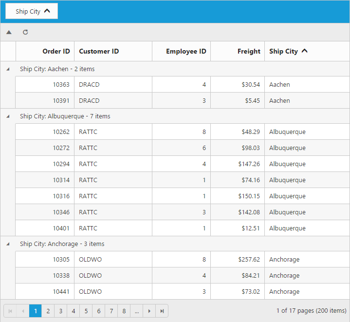

# Toolbar 

Toolbar can be shown by defining the `ShowToolbar` property of `ToolbarSettings` should be true. Toolbar has option to add default items in `ToolbarItems` property of `ToolbarSettings.` and customized items in `CustomToolbarItem` property of `ToolbarSettings`.

## Default Toolbar items

The following table shows default toolbar items and its action. 

<table>
<tr>
<th>
Default toolbar items</th><th>
Action</th></tr>
<tr>
<td>
Add</td><td>
Add a new row</td></tr>
<tr>
<td>
Edit</td><td>
Edit an existing</td></tr>
<tr>
<td>
Delete</td><td>
Delete a row</td></tr>
<tr>
<td>
Update</td><td>
Update edited or added row</td></tr>
<tr>
<td>
Cancel</td><td>
Cancel edited or added row</td></tr>
<tr>
<td>
Search</td><td>
Search text in records</td></tr>
</table>




     
        <ej:Grid ID="Grid" runat="server" AllowPaging="true" >
             <EditSettings AllowEditing="true" AllowAdding="true" AllowDeleting="true"></EditSettings>
             <ToolbarSettings ShowToolbar="true" ToolbarItems="add,edit,delete,update,cancel"></ToolbarSettings>
            <Columns>
                <ej:Column Field="OrderID" IsPrimaryKey="true" HeaderText="Order ID" Width="90" TextAlign="Right"/>
                <ej:Column Field="CustomerID" HeaderText="Customer ID" Width="90"/>
                <ej:Column Field="EmployeeID" HeaderText="Employee ID" Width="80" EditType="Dropdown" TextAlign="Right"/>
                <ej:Column Field="Freight" HeaderText="Freight" EditType="Numeric" Format="{0:C}" TextAlign="Right"  Width="80">
                    <NumericEditOptions DecimalPlaces="2"></NumericEditOptions>
                </ej:Column>    
                <ej:Column Field="ShipName" HeaderText="Ship Name" Width="150"/>
            </Columns>   
        </ej:Grid>          
         




    namespace WebSampleBrowser.Grid
        {
            public partial class Default : Page
              { 
                 List<Orders> order = new List<Orders>();
                 protected void Page_Load(object sender, EventArgs e)
                 {
                    BindDataSource();
                 }
                 private void BindDataSource()
                 {   
                    int orderId = 10643;
                    int empId = 0;
                    for (int i = 1; i < 10; i++)
                    {
                        order.Add(new Orders(orderId + 1, "ALFKI", empId + 1, 32.38, "Alfreds Futterkiste "));
                        order.Add(new Orders(orderId + 2, "ANATR", empId + 2, 11.61, "Ana Trujillo Emparedados y helados"));
                        order.Add(new Orders(orderId + 3, "ANTON", empId + 3, 45.34, "Antonio Moreno Taquería"));
                        order.Add(new Orders(orderId + 4, "AROUT", empId + 4, 37.28, "Around the Horn"));
                        order.Add(new Orders(orderId + 5, "BERGS", empId + 5, 67.00, "Berglunds snabbköp"));
                        order.Add(new Orders(orderId + 6, "BLONP", empId + 6, 23.32, "Blondel père et fils"));
                        orderId += 6;
                        empId += 6;
                    }
                    this.Grid.DataSource = order;
                    this.Grid.DataBind();
                 }
                 [Serializable]
                 public class Orders
                 {
                    public Orders()
                    {

                    }   
                    public Orders(long OrderId, string CustomerId, int EmployeeId ,int Freight,string ShipName)
                    {
                        this.OrderID = OrderId;
                        this.CustomerID = CustomerId;
                        this.EmployeeID = EmployeeId;
                        this.Freight= Freight;
                        this.ShipName = ShipName;
                    }
                    public long OrderID { get; set; }
                    public string CustomerID { get; set; }
                    public int EmployeeID { get; set; }
                    public string Freight{ get; set; }
                    public string ShipName{ get; set; }
                 }
              }
        } 

    
  

I>  `AllowAdding`, `AllowEditing`, `AllowDeleting`  property of `EditSettings` need to be enabled for add, edit, delete, save & cancel and `AllowSearching` property of `ToolbarItems` to be enabled while adding Search in toolbar to perform search action.

## Custom Toolbar items

Custom toolbar is used to create your own toolbar items in toolbar. It can add by defining `CustomToolbarItems` property of `ToolbarSettings`.  Actions for this customized toolbar is defined in `ToolbarClick` event.





    <asp:Content ID="ControlContent" runat="server" ContentPlaceHolderID="ControlsSection">
        

            <ej:Grid ID="OrdersGrid" runat="server" AllowPaging="true" AllowGrouping="true">
                <ClientSideEvents ToolbarClick="onToolBarClick" />
                <EditSettings AllowAdding="True" AllowDeleting="true" AllowEditing="true"></EditSettings>
                <GroupSettings ShowGroupedColumn="true" GroupedColumns="ShipCity"></GroupSettings>
                <ToolbarSettings ShowToolbar="true">
                    <CustomToolbarItem>
                        <ej:CustomToolbarItem Text="Expand" />
                        <ej:CustomToolbarItem Text="Collapse" />
                        <ej:CustomToolbarItem TemplateID="#Refresh" />
                    </CustomToolbarItem>
                </ToolbarSettings>
                <Columns>
                    <ej:Column Field="OrderID" HeaderText="Order ID" IsPrimaryKey="true" TextAlign="Right" Width="75" />
                    <ej:Column Field="CustomerID" HeaderText="Customer ID" Width="100" />
                    <ej:Column Field="EmployeeID" HeaderText="Employee ID" TextAlign="Right" Width="75" />
                    <ej:Column Field="Freight" HeaderText="Freight" TextAlign="Right" Width="70" Format="{0:C}" />
                    <ej:Column Field="ShipCity" HeaderText="Ship City" Width="110" />
                </Columns>
            </ej:Grid>
        

    </asp:Content>

    <asp:Content ID="ScriptContent" runat="server" ContentPlaceHolderID="ScriptSection">
        
        
    </asp:Content>

    <asp:Content ID="Content3" ContentPlaceHolderID="StyleSection" runat="server">
        
    </asp:Content>
    




    namespace WebSampleBrowser.Grid
    {
        public partial class Default : System.Web.UI.Page
        {
            List<Orders> order = new List<Orders>();
            protected void Page_Load(object sender, EventArgs e)
            {
                BindDataSource();
            }
            private void BindDataSource()
            {
                int orderId = 10643;
                int empId = 0;
                for (int i = 1; i < 10; i++)
                {
                    order.Add(new Orders(orderId + 1, "ALFKI", empId + 1, 32.38, "Germany"));
                    order.Add(new Orders(orderId + 2, "ANATR", empId + 2, 11.61, "Mexico"));
                    order.Add(new Orders(orderId + 3, "ANTON", empId + 3, 45.34, "Mexico"));
                    order.Add(new Orders(orderId + 4, "AROUT", empId + 4, 37.28, "UK"));
                    order.Add(new Orders(orderId + 5, "BERGS", empId + 5, 67.00, "Sweden"));
                    order.Add(new Orders(orderId + 6, "BLONP", empId + 6, 23.32, "France"));
                    orderId += 6;
                    empId += 6;
                }
                this.OrdersGrid.DataSource = order;
                this.OrdersGrid.DataBind();
            }
            
            [Serializable]
            public class Orders
            {
                public Orders()
                {

                }
                public Orders(int orderId, string customerId, int empId, double freight, string ShipCity)
                {
                    this.OrderID = orderId;
                    this.CustomerID = customerId;
                    this.EmployeeID = empId;
                    this.Freight = freight;
                    this.ShipCity = ShipCity;
                }
                public int OrderID { get; set; }
                public string CustomerID { get; set; }
                public int EmployeeID { get; set; }
                public double Freight { get; set; }
                public string ShipCity { get; set; }
            }
          
        }
       
    }
    




