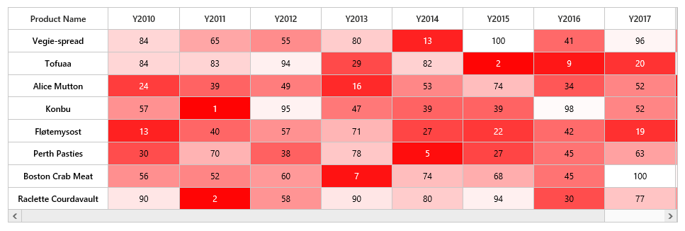

# Color Mapping

Color mapping is used to indicate values as colors instead of numerical values. For example, if a HeatMap represents a data from 0 to 100. `ColorMapping` is used to specify a color for lower value and higher value. For any value between two values, a medium color will be automatically be chosen.

In color mapping, when white color is set to value 0 and red color is set for value 30, as shown below.



<ej:HeatMap runat="server" ID="heatmap" IsResponsive="true" Width="830">
    <ColorMappingCollection>
        <ej:HeatMapColorMapping Color="#8ec8f8" Value="0">
            <label text="0"></label>
        </ej:HeatMapColorMapping>
        <ej:HeatMapColorMapping Color="#0d47a1" Value="100">
            <label text="100"></label>
        </ej:HeatMapColorMapping>
    </ColorMappingCollection>
</ej:HeatMap>



Resultant HeatMap will be as shown below.

 