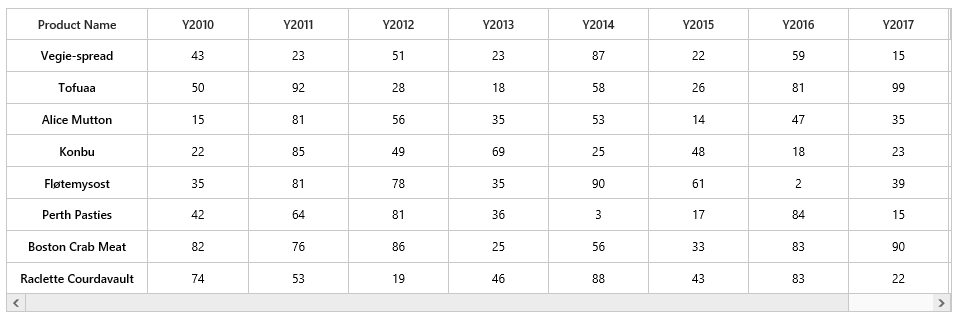
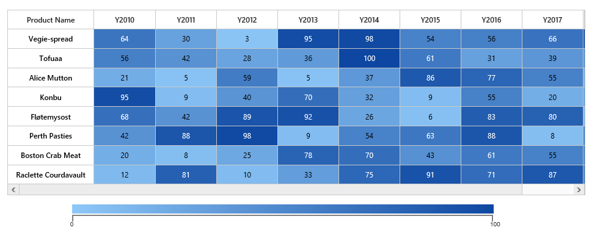

# Getting Started

This section explains briefly you on how to create a HeatMap control in your application with ASP.NET. Getting started with your ASP.NET HeatMap is very easy.

## Initialize the HeatMap

1\. Create an ASP.NET Application and add necessary assemblies and Scripts by referring [ASP-Getting Started](http://help.syncfusion.com/aspnet/getting-started) Documentation.

2\. Create a Web Form named as HeatMap and add the following template.



<%@ Page Language="C#" AutoEventWireup="true" CodeBehind="Diagram.aspx.cs" Inherits="WebApplication2.Diagram" %>

<!DOCTYPE html>
<html>
<head runat="server">
    <title>Getting started for ASP.NET HeatMap Control</title>
    <link href="Content/ej/web/default-theme/ej.web.all.min.css" rel="stylesheet" />
    
    
    
    
    
    
</head>
<body>
    <form runat="server">
        <ej:HeatMap runat="server" ID="heatmap" IsResponsive="true" Width="830">
        </ej:HeatMap>
    </form>
</body>
</html>

} 
 

## Prepare and Populate data

Populate product information in a collection




<ej:HeatMap runat="server" ID="heatmap" IsResponsive="true" Width="830">
</ej:HeatMap>




 
CellMapping CellMapping = new CellMapping();
CellMapping.Column = new PropertyMapping() { PropertyName = "ProductName", DisplayName = "Product Name" };
CellMapping.Row = new PropertyMapping() { PropertyName = "Year", DisplayName = "Year" };
CellMapping.Value = new PropertyMapping() { PropertyName = "Value" };
Collection columnMapping = new Collection();
columnMapping.Add(new HeaderMapping() { PropertyName = "Veggie-spread", DisplayName = "Veggie-spread" });
columnMapping.Add(new HeaderMapping() { PropertyName = "Tofu", DisplayName = "Tofu" });
columnMapping.Add(new HeaderMapping() { PropertyName = "Alice Mutton", DisplayName = "Alice Mutton" });
columnMapping.Add(new HeaderMapping() { PropertyName = "Donut", DisplayName = "Donut" });
columnMapping.Add(new HeaderMapping() { PropertyName = "Burger", DisplayName = "Burger" });
columnMapping.Add(new HeaderMapping() { PropertyName = "Perth Pasties", DisplayName = "Perth Pasties" });
CellMapping.ColumnMapping = columnMapping;
HeaderMapping headerMapping = new HeaderMapping() { PropertyName = "Year", DisplayName = "Year", ColumnStyle = new ColumnStyle() { Width = 105, TextAlign = HeatMapTextAlign.Right } };
CellMapping.HeaderMapping = headerMapping;




## Map data into HeatMap

Now data is ready, next we need to configure data source and map rows and columns to visualize.

* Prepare `ItemsMapping` add it in resource.



CellMapping CellMapping = new CellMapping();
CellMapping.Column = new PropertyMapping() { PropertyName = "ProductName", DisplayName = "Product Name" };
CellMapping.Row = new PropertyMapping() { PropertyName = "Year", DisplayName = "Year" };
CellMapping.Value = new PropertyMapping() { PropertyName = "Value" };
Collection columnMapping = new Collection();
columnMapping.Add(new HeaderMapping() { PropertyName = "Veggie-spread", DisplayName = "Veggie-spread" });
columnMapping.Add(new HeaderMapping() { PropertyName = "Tofu", DisplayName = "Tofu" });
columnMapping.Add(new HeaderMapping() { PropertyName = "Alice Mutton", DisplayName = "Alice Mutton" });
columnMapping.Add(new HeaderMapping() { PropertyName = "Donut", DisplayName = "Donut" });
columnMapping.Add(new HeaderMapping() { PropertyName = "Burger", DisplayName = "Burger" });
columnMapping.Add(new HeaderMapping() { PropertyName = "Perth Pasties", DisplayName = "Perth Pasties" });
CellMapping.ColumnMapping = columnMapping;
HeaderMapping headerMapping = new HeaderMapping() { PropertyName = "Year", DisplayName = "Year", ColumnStyle = new ColumnStyle() { Width = 105, TextAlign = HeatMapTextAlign.Right } };
CellMapping.HeaderMapping = headerMapping;



* Set items source and mapping



public partial class CellMapBinding : System.Web.UI.Page
{
    protected void Page_Load(object sender, EventArgs e)
    {
        if (!IsPostBack)
        {
        heatmap.ItemsSource = GetCellSource();
        heatmap.ItemsMapping = CellMapping;
        }
    }

    public Collection GetCellSource()
    {
        Collection collection = new Collection();
        string[] name = { "Veggie-spread", "Tofu", "Alice Mutton", "Donut", "Burger", "Perth Pasties" };
        Random random = new Random();

        foreach (string item in name)
        {
            for (int i = 0; i < 6; i++)
            {
                double value = random.Next(0, random.Next(0, 100));
                collection.Add(new SampleCellData() { ProductName = item, Year = "Y" + (2011 + i), Value = value });
            }
        }
        return collection;
    }
}

[Serializable]
public class SampleCellData
{
    private string productName;

    [JsonProperty("ProductName")]
    [DefaultValue("")]
    public string ProductName
    {
        get { return productName; }
        set { productName = value; }
    }

    private string year;
    [JsonProperty("Year")]
    [DefaultValue("")]
    public string Year
    {
        get { return year; }
        set { year = value; }
    }

    private Double valuex;
    [JsonProperty("Value")]
    [DefaultValue("")]
    public Double Value
    {
        get { return valuex; }
        set { valuex = value; }
    }

}



 
## Color Mapping
  
Next we can configure color range for these values using color mapping
 
* Configure items mapping based on items source.
 

       
<ej:HeatMap runat="server" ID="heatmap" IsResponsive="true" Width="830">
    <ColorMappingCollection>
        <ej:HeatMapColorMapping Color="#8ec8f8" Value="0">
            <label text="0"></label>
        </ej:HeatMapColorMapping>
        <ej:HeatMapColorMapping Color="#0d47a1" Value="100">
            <label text="100"></label>
        </ej:HeatMapColorMapping>
    </ColorMappingCollection>
</ej:HeatMap>

  
 
* This will show the grid data with color based on the range given.

 
# Legend

A legend control is used to represent range value in a gradient, create a legend with the same color mapping as shown below.
  


<ej:HeatMapLegend runat="server" ID="heatmapLegend" Height="50px" Width="75%" legendmode="Gradient" orientation="Horizontal" IsResponsive="true"> 
</ej:HeatMapLegend>
            
 
 

* Final code files looks like this.




    <ej:HeatMap runat="server" ID="heatmap" IsResponsive="true" Width="830">
        <ColorMappingCollection>
            <ej:HeatMapColorMapping Color="#8ec8f8" Value="0">
                <label text="0"></label>
            </ej:HeatMapColorMapping>
            <ej:HeatMapColorMapping Color="#0d47a1" Value="100">
                <label text="100"></label>
            </ej:HeatMapColorMapping>
        </ColorMappingCollection>
    </ej:HeatMap>
    

    <ej:HeatMapLegend runat="server" ID="heatmapLegend" Height="50px" Width="75%" ClientIDMode="static" legendmode="Gradient" orientation="Horizontal" IsResponsive="true">
        <ColorMappingCollection>
            <ej:HeatMapColorMapping Color="#8ec8f8" Value="0">
                <label text="0"></label>
            </ej:HeatMapColorMapping>
            <ej:HeatMapColorMapping Color="#0d47a1" Value="100">
                <label text="100"></label>
            </ej:HeatMapColorMapping>
        </ColorMappingCollection>
    </ej:HeatMapLegend>





public partial class CellMapBinding : System.Web.UI.Page
{

    protected void Page_Load(object sender, EventArgs e)
    {
        if (!IsPostBack)
        {
            CreateHeatmap();

        }
    }
    public void CreateHeatmap()
    {
        heatmap.LegendCollection.Add("heatmapLegend");
        CellMapping CellMapping = new CellMapping();
        CellMapping.Column = new PropertyMapping() { PropertyName = "ProductName", DisplayName = "Product Name" };
        CellMapping.Row = new PropertyMapping() { PropertyName = "Year", DisplayName = "Year" };
        CellMapping.Value = new PropertyMapping() { PropertyName = "Value" };
        Collection columnMapping = new Collection();
        columnMapping.Add(new HeaderMapping() { PropertyName = "Veggie-spread", DisplayName = "Veggie-spread" });
        columnMapping.Add(new HeaderMapping() { PropertyName = "Tofu", DisplayName = "Tofu" });
        columnMapping.Add(new HeaderMapping() { PropertyName = "Alice Mutton", DisplayName = "Alice Mutton" });
        columnMapping.Add(new HeaderMapping() { PropertyName = "Donut", DisplayName = "Donut" });
        columnMapping.Add(new HeaderMapping() { PropertyName = "Burger", DisplayName = "Burger" });
        columnMapping.Add(new HeaderMapping() { PropertyName = "Perth Pasties", DisplayName = "Perth Pasties" });
        CellMapping.ColumnMapping = columnMapping;
        HeaderMapping headerMapping = new HeaderMapping() { PropertyName = "Year", DisplayName = "Year", ColumnStyle = new ColumnStyle() { Width = 105, TextAlign = HeatMapTextAlign.Right } };
        CellMapping.HeaderMapping = headerMapping;
        heatmap.ItemsSource = GetCellSource();
        heatmap.ItemsMapping = CellMapping;
    }
    public Collection GetCellSource()
    {
        Collection collection = new Collection();
        string[] name = { "Veggie-spread", "Tofu", "Alice Mutton", "Donut", "Burger", "Perth Pasties" };
        Random random = new Random();

        foreach (string item in name)
        {
            for (int i = 0; i < 6; i++)
            {
                double value = random.Next(0, random.Next(0, 100));
                collection.Add(new SampleCellData() { ProductName = item, Year = "Y" + (2011 + i), Value = value });
            }
        }
        return collection;
    }
}
[Serializable]
public class SampleCellData
{
    private string productName;

    [JsonProperty("ProductName")]
    [DefaultValue("")]
    public string ProductName
    {
        get { return productName; }
        set { productName = value; }
    }

    private string year;
    [JsonProperty("Year")]
    [DefaultValue("")]
    public string Year
    {
        get { return year; }
        set { year = value; }
    }

    private Double valuex;
    [JsonProperty("Value")]
    [DefaultValue("")]
    public Double Value
    {
        get { return valuex; }
        set { valuex = value; }
    }
}



 
