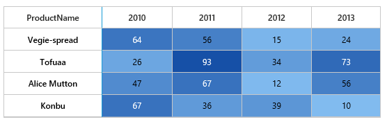

# Items Mapping

External data source can be mapped with HeatMap using `ItemsMapping` property. It supports 2 kind of data source.

* In `TableMapping` rows represents an objects in collection, columns represents numerical properties of that object.
* In `CellMapping` each cell represent an object in collection, this collection is grouped based on specific property to form as rows and columns.

Let us see the difference between two types of mapping. Following table represents two different data structure to represent the same HeatMap.

<table>
<tr>
 <th>CellMapping</th>
<th>TableMapping</th>
</tr>
<tr>
<td>
      


public partial class CellMapBinding : System.Web.UI.Page
{
    protected void Page_Load(object sender, EventArgs e)
    {
        if (!IsPostBack)
        {
            CreateHeatmap();
        }
    }

    public void CreateHeatmap()
    {
        heatmap.LegendCollection.Add("heatmapLegend");
        CellMapping CellMapping = new CellMapping();
        CellMapping.Column = new PropertyMapping() { PropertyName = "ProductName", DisplayName = "Product Name" };
        CellMapping.Row = new PropertyMapping() { PropertyName = "Year", DisplayName = "Year" };
        CellMapping.Value = new PropertyMapping() { PropertyName = "Value" };
        Collection columnMapping = new Collection();
        columnMapping.Add(new HeaderMapping() { PropertyName = "Veggie-spread", DisplayName = "Veggie-spread" });
        columnMapping.Add(new HeaderMapping() { PropertyName = "Tofu", DisplayName = "Tofu" });
        columnMapping.Add(new HeaderMapping() { PropertyName = "Alice Mutton", DisplayName = "Alice Mutton" });
        columnMapping.Add(new HeaderMapping() { PropertyName = "Donut", DisplayName = "Donut" });
        columnMapping.Add(new HeaderMapping() { PropertyName = "Burger", DisplayName = "Burger" });
        columnMapping.Add(new HeaderMapping() { PropertyName = "Perth Pasties", DisplayName = "Perth Pasties" });
        CellMapping.ColumnMapping = columnMapping;
        HeaderMapping headerMapping = new HeaderMapping() { PropertyName = "Year", DisplayName = "Year", ColumnStyle = new ColumnStyle() { Width = 105, TextAlign = HeatMapTextAlign.Right } };
        CellMapping.HeaderMapping = headerMapping;
        heatmap.ItemsSource = GetCellSource();
        heatmap.ItemsMapping = CellMapping;
    }

    public Collection GetCellSource()
    {
        Collection collection = new Collection();
        string[] name = { "Veggie-spread", "Tofu", "Alice Mutton", "Donut", "Burger", "Perth Pasties" };
        Random random = new Random();

        foreach (string item in name)
        {
            for (int i = 0; i < 6; i++)
            {
                double value = random.Next(0, random.Next(0, 100));
                collection.Add(new SampleCellData() { ProductName = item, Year = "Y" + (2011 + i), Value = value });
            }
        }
        return collection;
    }
}
[Serializable]
public class SampleCellData
{
    private string productName;
    [JsonProperty("ProductName")]
    [DefaultValue("")]
    public string ProductName
    {
        get { return productName; }
        set { productName = value; }
    }

    private string year;
    [JsonProperty("Year")]
    [DefaultValue("")]
    public string Year
    {
        get { return year; }
        set { year = value; }
    }

    private Double valuex;
    [JsonProperty("Value")]
    [DefaultValue("")]
    public Double Value
    {
        get { return valuex; }
        set { valuex = value; }
    }
}


</td>
<td>


protected void Page_Load(object sender, EventArgs e)
{
    if (!IsPostBack)
    {
        CreateTableHeatmap();
    }
    
    public void CreateTableHeatmap()
    {
        TableHeatmap.LegendCollection.Add("TableHeatmapLegend");
        TableMapping TableMapping = new TableMapping();
        TableMapping.HeaderMapping = new HeaderMapping() { PropertyName = "ProductName", DisplayName = "Product Name", ColumnStyle = new ColumnStyle() { Width = 140, TextAlign = HeatMapTextAlign.Right } };
        TableMapping.ColumnMapping.Add(new HeaderMapping() { PropertyName = "Y2010", DisplayName = "Y2010" });
        TableMapping.ColumnMapping.Add(new HeaderMapping() { PropertyName = "Y2011", DisplayName = "Y2011" });
        TableMapping.ColumnMapping.Add(new HeaderMapping() { PropertyName = "Y2012", DisplayName = "Y2012" });
        TableMapping.ColumnMapping.Add(new HeaderMapping() { PropertyName = "Y2013", DisplayName = "Y2013" });
        TableMapping.ColumnMapping.Add(new HeaderMapping() { PropertyName = "Y2014", DisplayName = "Y2014" });
        TableMapping.ColumnMapping.Add(new HeaderMapping() { PropertyName = "Y2015", DisplayName = "Y2015" });
        TableHeatmap.ItemsMapping = TableMapping;
        TableHeatmap.ItemsSource = GetTableSource();
    }
    
    public Collection GetTableSource()
    {
        Collection collection = new Collection();
        Random random = new Random();
        string[] rows = { "Veggie-spread", "Tofu", "Alice Mutton", "Donut", "Burger", "Perth Pasties", "Boston Crab Meat", "Rachele Burger" };
        for (int i = 0; i < 8; i++)
        {
            collection.Add(new SampleTableData()
            {
                ProductName = rows[i],
                Y2010 = random.Next(0, 100),
                Y2011 = random.Next(0, 100),
                Y2012 = random.Next(0, 100),
                Y2013 = random.Next(0, 100),
                Y2014 = random.Next(0, 100),
                Y2015 = random.Next(0, 100)
            });
        }
        return collection;
    }
}

[Serializable]
public class SampleTableData
{
    private string productName;
    [JsonProperty("ProductName")]
    [DefaultValue("")]
    public string ProductName
    {
        get { return productName; }
        set { productName = value; }
    }

    private double y2010;
    [JsonProperty("Y2010")]
    [DefaultValue("")]
    public double Y2010
    {
        get { return y2010; }
        set { y2010 = value; }
    }

    private double y2011;
    [JsonProperty("Y2011")]
    [DefaultValue("")]
    public double Y2011
    {
        get { return y2011; }
        set { y2011 = value; }
    }

    private double y2012;
    [JsonProperty("Y2012")]
    [DefaultValue("")]
    public double Y2012
    {
        get { return y2012; }
        set { y2012 = value; }
    }

    private double y2013;
    [JsonProperty("Y2013")]
    [DefaultValue("")]
    public double Y2013
    {
        get { return y2013; }
        set { y2013 = value; }
    }

    private double y2014;
    [JsonProperty("Y2014")]
    [DefaultValue("")]
    public double Y2014
    {
        get { return y2014; }
        set { y2014 = value; }
    }

    private double y2015;
    [JsonProperty("Y2015")]
    [DefaultValue("")]
    public double Y2015
    {
        get { return y2015; }
        set { y2015 = value; }
    }
}


</td>
</tr>
<tr>
<td>
Here, a single `ProductInfo` object represent a value for a particular product in a particular year
</td>
<td>
Here, a single `ProductInfo` object represents value for a particular product from year 2010 to 2015.	
</td>
</tr>
 
<tr>
<td>

</td>
<td>

</td>
</tr>
</table>