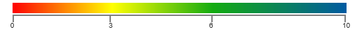
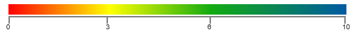
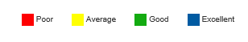
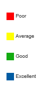

# Legend

Legend is a control used to summarize the range of colors in HeatMap. This gives visual guideline for mapping between value and color.

## Create Legend

Legend can be created with color mapping as shown below.



<ej:HeatMapLegend runat="server" ID="LegendHeatmapLegend" Height="50px" Width="75%" legendmode="Gradient" orientation="Horizontal" IsResponsive="true">
    <ColorMappingCollection>
        <ej:HeatMapColorMapping Color="#fe0002" Value="0">
            <label text="Poor"></label>
        </ej:HeatMapColorMapping>
        <ej:HeatMapColorMapping Color="#ffff01" Value="3">
            <label text="Average"></label>
        </ej:HeatMapColorMapping>
        <ej:HeatMapColorMapping Color="#13ab11" Value="6">
            <label text="Good"></label>
        </ej:HeatMapColorMapping>
        <ej:HeatMapColorMapping Color="#005ba2" Value="10">
            <label text="Excellent"></label>
        </ej:HeatMapColorMapping>
    </ColorMappingCollection>
</ej:HeatMapLegend>



Resultant legend will be like following image.

 
## Legend Mode

There are two modes for Legend
* Gradient
* List

### Gradient:



<ej:HeatMapLegend runat="server" ID="LegendHeatmapLegend" Height="50px" Width="75%" legendmode="Gradient" orientation="Horizontal" IsResponsive="true">
</ej:HeatMapLegend>



### List:



<ej:HeatMapLegend runat="server" ID="LegendHeatmapLegend" Height="50px" Width="75%" legendmode="List" orientation="Horizontal" IsResponsive="true">
</ej:HeatMapLegend>
        


## Orientation

There are 2 types of Orientation, applicable for Gradient and List Mode 

* Horizontal
* Vertical

### Horizontal:



<ej:HeatMapLegend runat="server" ID="LegendHeatmapLegend" Height="50px" Width="75%" legendmode="List" orientation="Horizontal" IsResponsive="true">
</ej:HeatMapLegend>
        


### Vertical:

 

<ej:HeatMapLegend runat="server" ID="LegendHeatmapLegend" Height="50px" Width="75%" legendmode="List" orientation="Vertical" IsResponsive="true">
</ej:HeatMapLegend>
        


