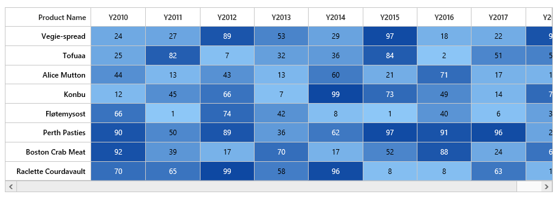

# Overview

**Essential HeatMap ASP.NET** represents tabular data values as gradient colors instead of numbers. Low and high values are different colors with different gradients.
 

## Key features:

 * 2 types of data source mapping (TableMapping, CellMapping)
 * Color mapping
 * Legend
 * Virtualization