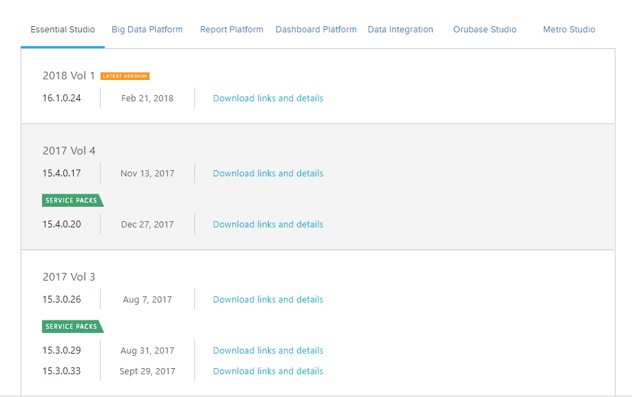
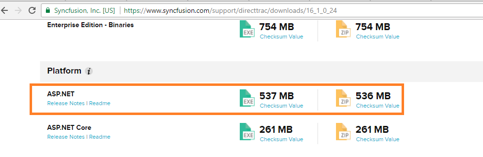

# Download

To download the Syncfusion ASP.NET platform, follow the below steps.

1. Log into your [Syncfusion account](https://www.syncfusion.com/support/directtrac/downloads)

2. Click on the Essential Studio version you need to download.

   
   
3. The next page allows you to download the exe, zip and pkg files.

   

4. To generate the unlock for the version you are downloading, refer [this](https://www.syncfusion.com/kb/2326) .   

