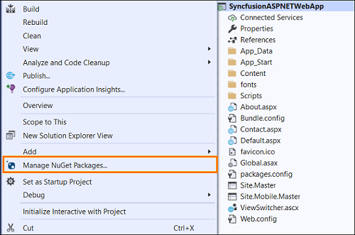
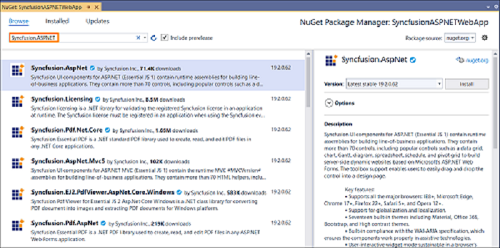
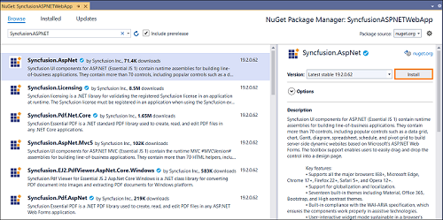
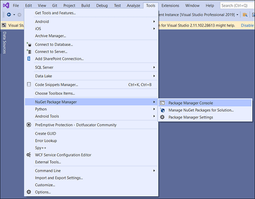

# Install Syncfusion ASP.NET Web Forms NuGet packages

[NuGet](https://www.nuget.org/) is a Package management system for Visual Studio. It makes it easy to add, update and remove external libraries in our application. Syncfusion publishing all ASP.NET Web Forms NuGet packages in [nuget.org](https://www.nuget.org/). The Syncfusion **ASP.NET Web Forms** NuGet packages can be used without installing the Syncfusion Essential Studio or ASP.NET Web Forms platform setup installation. You can simply exploit the Syncfusion ASP.NET Web Forms NuGet packages in your ASP.NET Web Forms application to develop with the Syncfusion ASP.NET Web Forms controls.

The Syncfusion ASP.NET Web Forms components are available as NuGet packages at [nuget.org](https://www.nuget.org/) beginning with v16.2.0.46 (2018 Volume 2 Service Pack 1).

Beginning with v16.2.0.46, you must include a license key in your projects if you reference Syncfusion assemblies from the trial setup or the NuGet package. Learn how to register a Syncfusion license key in your ASP.NET Web Forms application to use Syncfusion components by clicking on this [link](https://help.syncfusion.com/common/essential-studio/licensing/license-key).

N> Syncfusion will no longer publish NuGet packages at [nuget.syncfusion.com](https://nuget.syncfusion.com/) beginning with v17.1.0.32 (2018 Volume 1).


## Installation using Package Manager UI

The **NuGet Package Manager UI** allows you to search, install, uninstall, and update Syncfusion ASP.NET Web Forms NuGet packages in your projects and solutions. You can find and install the Syncfusion ASP.NET Web Forms NuGet packages in your Visual Studio ASP.NET Web Forms application and this process is easy with the steps below:

1. Right-click on the ASP.NET Web Forms project or solution in the Solution Explorer, and choose **Manage NuGet Packages...**

   
   
   As an alternative, after opening the ASP.NET Web Forms application in Visual Studio, go to the **Tools** menu and after hovering **NuGet Package Manager**, select **Manage NuGet Packages for Solution...**

2.	The Manage NuGet Packages window will open. Navigate to the **Browse** tab, then search for the Syncfusion ASP.NET Web Forms NuGet packages using a term like **"Syncfusion.ASPNET"** and select the appropriate Syncfusion ASP.NET Web Forms NuGet package for your development.

     

     N> The [nuget.org](https://api.nuget.org/v3/index.json) package source is selected by default in the Package source drop-down. If your Visual Studio does not have nuget.org configured, follow the instructions in the [Microsoft documents](https://docs.microsoft.com/en-us/nuget/tools/package-manager-ui#package-sources) to set up the nuget.org feed URL.

3. When you select a ASP.NET Web Forms package, the right panel will provide more information about it.

4. By default, the package selected with latest version. You can choose the required version and click the Install button and accept the license terms. The package will be added to your ASP.NET Web Forms application.

   

5. At this point, your application has all the required Syncfusion assemblies, and you will be ready to start building high-performance, responsive app with [Syncfusion ASP.NET Web Forms controls](https://www.syncfusion.com/jquery/aspnet-web-forms-ui-controls). Also, you can refer to the [Syncfusion ASP.NET Web Forms help document](https://help.syncfusion.com/aspnet/overview) for development.

## Installation using Package Manager Console

The **Package Manager Console** saves NuGet packages installation time since you don't have to search for the Syncfusion ASP.NET Web Forms NuGet package which you want to install, and you can just type the installation command to install the appropriate Syncfusion ASP.NET Web Forms NuGet package. Follow the instructions below to use the Package Manager Console to reference the Syncfusion ASP.NET Web Forms component as NuGet packages in your ASP.NET Web Forms application.

1. To show the Package Manager Console, open your ASP.NET Web Forms application in Visual Studio and navigate to **Tools** in the Visual Studio menu and after hovering **NuGet Package Manager**, select **Package Manager Console**.

   

2. The **Package Manager Console** will be shown at the bottom of the screen. You can install the Syncfusion ASP.NET Web Forms NuGet packages by enter the following NuGet installation commands.

   ***Install specified Syncfusion ASP.NET Web Forms NuGet package.***

   The below command will install the Syncfusion ASP.NET Web Forms NuGet package in the default ASP.NET Web Forms project of the application.

   ```Install-Package <Package Name>```
   **For example:** Install-Package Syncfusion.AspNet

   N> You can find the list of Syncfusion ASP.NET Web Forms NuGet packages which are published in nuget.org from here

   ***Install specified Syncfusion ASP.NET Web Forms NuGet package in specified ASP.NET Web Forms project***

   The below command will install the Syncfusion ASP.NET Web Forms NuGet package in the given ASP.NET Web Forms project of the application.

   ```Install-Package <Package Name> -ProjectName <Project Name>```
   **For example:** Install-Package Syncfusion.AspNet -ProjectName SyncfusionASPNETWebApp

3. By default, the package will be installed with latest version. You can give the required version with the -Version term like below to install the Syncfusion ASP.NET Web Forms NuGet packages in the appropriate version.

   ```Install-Package Syncfusion.AspNet -Version 19.2.0.62```

   

4. The NuGet package manager will install the Syncfusion ASP.NET Web Forms NuGet package as well as the dependencies it has. When the installation is complete, the console will show that your Syncfusion ASP.NET Web Forms package has been successfully added to the project.

5. At this point, your application has all the required Syncfusion assemblies, and you will be ready to start building high-performance, responsive app with [Syncfusion ASP.NET Web Forms controls](https://www.syncfusion.com/jquery/aspnet-web-forms-ui-controls). Also, you can refer to the [Syncfusion ASP.NET Web Forms help document](https://help.syncfusion.com/aspnet/overview) for development.