# Installation and Deployment

## Configuring Syncfusion Bower Packages

## Overview

[Bower](http://bower.io) is a package manager for the Web. Syncfusion Bower package allows you to use the Syncfusion JavaScript Widgets in an efficient way.

I>Syncfusion JavaScript Bower package is available as [public Git Repository](https://github.com/syncfusion/JavaScript-Widgets) and also registered as Syncfusion-JavaScript in the Bower registry.

### Bower Installation

To configure the Bower in your machine you need to install [node, npm](http://nodejs.org) and [git](http://git-scm.org). For more information about configuring the Bower package, please refer to the official site for [bower](http://bower.io/#install-bower).
Syncfusion JavaScript Bower package can be configured in the following ways.

1. Using command prompt

2. Using bower.json file

3. From local directory

### Using command prompt

Perform the following steps to install Syncfusion Bower Package via command prompt in your web application.

1. Open your web project’s location in a command prompt window.

2. Then run the command Bower install <package name>.

   ~~~
   bower install syncfusion-javascript
   ~~~
   
   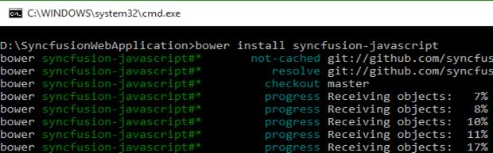

3. The Bower will install the Syncfusion JavaScript files into the project location to develop with Syncfusion controls.

N>To install a particular version of a Bower package, you need to provide the version as suffix of the package name while installing. For example, run the following command to install the package of version 13.3.0.18.
N>'bower install Syncfusion-javascript#13.3.0.18'

### Using bower.json file

In another way, you can add the packages to the bower.json file by simply specifying the package name. This will install/restore the packages to your project. Please refer to the following image.
 
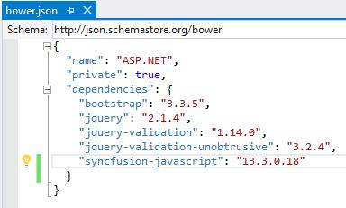

N>ASP.NET 5 (preview) projects have bower.json file by default. If your project does not have bower.json file, run the following command from your project directory by Command prompt.
N>'bower init'

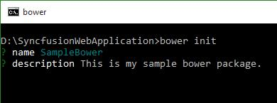

### From local directory

You can install the Syncfusion Bower package from a local directory. To perform this follow the below steps.

1. Navigate to the [Syncfusion JavaScript Bower repository](https://github.com/syncfusion/JavaScript-Widgets/) location on GitHub and download the repository as zip by clicking the “Download ZIP” button, and extract the contents to any of the local directory in your computer.

   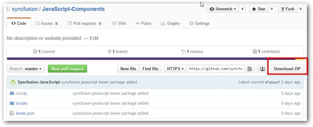

2. Then run the installed command by providing the package content’s location.

   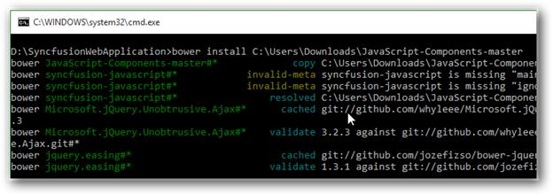

## Bower Update

To update the installed Bower packages, run the command Bower update <package name>.

~~~
bower update syncfusion-javascript
~~~

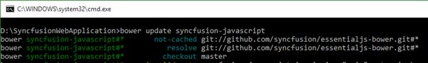

## Configuring Syncfusion npm Packages

## Overview

The npm is the Package Manager for JavaScript. It makes easy for JavaScript developers to share and reuse the code, and also to update the code that you have shared.

## Syncfusion npm package

Syncfusion JavaScript npm package is available in [public Git Repository](https://github.com/syncfusion/JavaScript-Widgets) and also registered as syncfusion-javaScript in the npm registry.

## Syncfusion npm Installation

To configure the npm, install the [Nodejs](http://nodejs.org/) and update the npm. For more information to configure the npm packages, refer to the official site of [npm](https://docs.npmjs.com/getting-started/installing-node).

syncfusion-javascript npm package can be configured in following ways.

1. Using Command prompt

2. Using package.json file

3. From local directory

### Using command prompt

Follow the below steps to install Syncfusion JavaScript npm package via command prompt in required web application location.

1. Open project’s location in command prompt window.

2. Run the installation command for npm.

   ~~~
   npm install syncfusion-javascript
   ~~~

   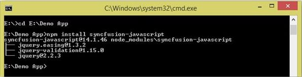

3. npm install the Syncfusion JavaScript assets into the project location to develop with Syncfusion controls.

N> As per standard Syncfusion uses the 3 digit version for npm packages. To install a particular version of npm package, provide the version as suffix of the package name while installing.
N>  For example, run the following command to install Syncfusion JavaScript package of version 14.1.0.46.
N> 'npm install Syncfusion-javascript@14.1.46'

### Using package.json file

Add the Syncfusion JavaScript packages to the package.json by simply specifying the package name. This will install/restore the package to the Visual Studio project. Refer to the following image.

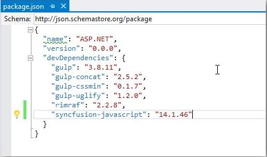

N> ASP.NET 5 (preview) projects have package.json file by default. Visual Studio project does not have package.json file, so run the following command using the project command prompt.
N> 'npm init'

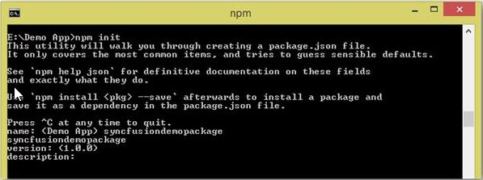

### From Local Directory

Install the Syncfusion JavaScript npm package from a local directory.

1. Navigate to the [Syncfusion JavaScript repository](https://github.com/syncfusion/JavaScript-Widgets) location on GitHub and download the repository as zip by clicking the “Download ZIP” button, and extract the contents to any of the local directory in your computer.

   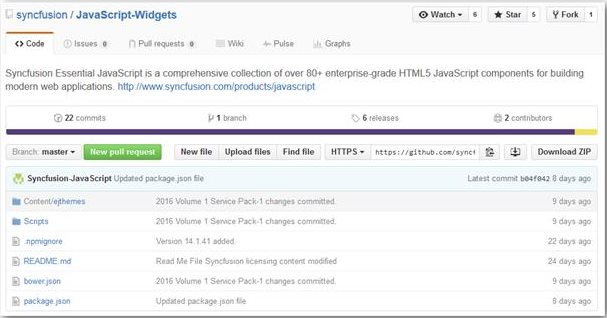

2. Run the install command by providing the package content location.

   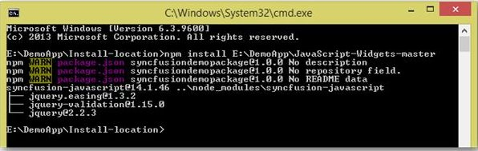

## npm Update

### Updating global packages

Run the following command to update the npm package globally.

~~~
npm install g- syncfusion-javascript
~~~

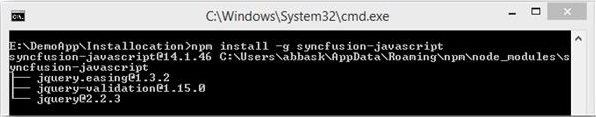

## Updating local packages

Run the following command to update the package by local location.

~~~
npm update
~~~

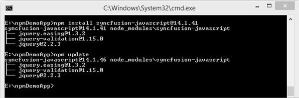

## Configuring Syncfusion JSPM Packages

## Overview

JSPM is a package manager for [SystemJS universal module loader](https://github.com/systemjs/systemjs), built on top of the dynamic [ES6 module loader](https://github.com/ModuleLoader/es6-module-loader). This can load any module format (ES6, AMD, CommonJS, and globals) directly from any registry such as npm and GitHub with flat versioned dependency management. Any custom registry endpoints can be created through the Registry API.

## Syncfusion JavaScript JSPM

Syncfusion JavaScript JSPM package is available in [public Git Repository](https://github.com/syncfusion/JavaScript-Widgets) and also registered as Syncfusion-JavaScript in the npm registry too.

## Syncfusion JSPM Installation

### Using Command prompt

Follow the below steps to install Syncfusion JavaScript JSPM package via command prompt in required web application location.

1. Open project’s location in command prompt window.

2. A) To install the Syncfusion JavaScript JSPM package via GitHub repository.

   ~~~
   jspm install syncfusion=github:syncfusion/Javascript-Widgets
   ~~~
   
   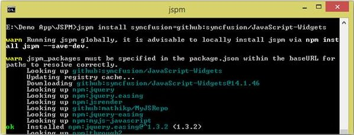

   B) To install the Syncfusion JavaScript JSPM package via npm repository.
   
   ~~~
   jspm install npm:syncfusion-javascript
   ~~~
   
N> As per standard Syncfusion uses the 3 digit version for JSPM packages. To install a particular version of JSPM package, need to provide the version as suffix of the package name while installing.
N> For example, run the following command to install Syncfusion JavaScript package of version 14.1.0.46.
N> 'JSPM install syncfusion=github:syncfusion/JavaScript-Widgets@14.1.46'

## JSPM Update

Update all the installed packages by using following command.

~~~
jspm update
~~~

Update specific package by using following commands.

~~~
jspm update npm:syncfusion-javascript
~~~

  (Or)
  
~~~
jspm update syncfusion=github:syncfusion/JavaScript-Widgets
~~~
