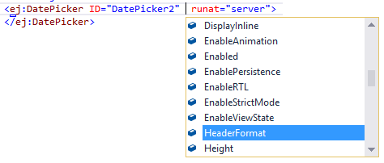

# IntelliSense

We have provided an IntelliSense support like the default ASP.NET Web Forms controls. It has the object list that holds the properties, public methods, and event arguments of the respective controls. On pressing the space bar it displays those properties, public methods, and event arguments of the corresponding control in the dropdown.

Refer to the following screenshot where our DatePicker control is used in the sample.

