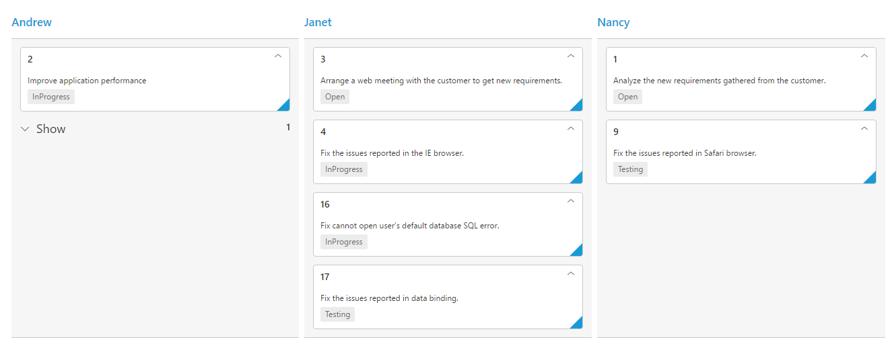

---
layout: post
title: Cards with Kanban widget for Syncfusion Essential ASP.NET
description: This section explains how to define the basic structure of cards and their features of the Syncfusion ASP.NET Web Forms Kanban component.
platform: aspnet
control: Kanban
documentation: ug
--- 
# Cards

## Customization

Cards can be customized with appropriate mapping fields from the database. The customizable mapping properties are listed as follows

<table>
<tr>
<th>
Mapping Fields </th><th>
Description</th></tr>
<tr>
<td>
Content</td><td>
Map the column name to use as content to cards.</td></tr>
<tr>
<td>
Tag</td><td>
Map the column name to use as tag. Multiple tags can be given with comma separated. E.g. "API","SQL, Database".</td></tr>
<tr>
<td>
Color</td><td>
Map the column name to use as colors to highlight cards left border.</td></tr>
<tr>
<td>
ColorMappings</td><td>
Map the colors to use with column values which is mapped with 
Fields.Color.
</td></tr>
<tr>
<td>
ImageUrl</td><td>
Map the column name to use as image to cards.
</td></tr>
<tr>
<td>
PrimaryKey</td><td>
Map the column name to use as primary key to cards.
</td></tr>
<tr>
<td>
PriorityKey</td><td>
Map the column name to use as priority key to cards.
</td></tr>
<tr>
<td>
Title</td><td>
Map the column name to use as title to cards. Default title is 
PrimaryKey.
</td></tr>
<tr>
<td>
AllowTitle</td><td>
Set as true to enable title for card.
</td></tr>
</table>

The following code example describes the above behavior.





  	<ej:Kanban ID="Kanban" runat="server" KeyField="Status" AllowTitle="true" AllowSelection="true">
                <Columns>
                    <ej:KanbanColumn HeaderText="Backlog" Key="Open" />
                    <ej:KanbanColumn HeaderText="In Progress" Key="InProgress" />
                    <ej:KanbanColumn HeaderText="Done" Key="Close" />
                </Columns>
                <CardSettings>
                    <ColorMappings>
                        <ej:KeyValue Key="#ee4e75" Value="Bug,Story" />
                        <ej:KeyValue Key="#57b94c" Value="Improvement" />
                        <ej:KeyValue Key="#edba3c" Value="Epic" />
                        <ej:KeyValue Key="#5187c6" Value="Others" />
                    </ColorMappings>
                </CardSettings>
                <Fields Content="Summary" Tag="Tags" Color="Type" ImageUrl="ImgUrl" PrimaryKey="Id" Priority="RankId" />
     </ej:Kanban>  





          List<Tasks> Task = new List<Tasks>();  
          protected void Page_Load(object sender, EventArgs e)
          {
            Task.Add(new Tasks(1, "Open", "Analyze the new requirements gathered from the customer.", "Story", "Low", "Analyze,Customer", 3.5, "Nancy", "../content/images/kanban/1.png", 1));
            Task.Add(new Tasks(2, "InProgress", "Improve application performance", "Improvement", "Normal", "Improvement", 6, "Andrew Fuller", "../content/images/kanban/2.png", 1));
            Task.Add(new Tasks(3, "Open", "Arrange a web meeting with the customer to get new requirements.", "Others", "Critical", "Meeting", 5.5, "Janet", "../content/images/kanban/3.png", 2));
            Task.Add(new Tasks(4, "InProgress", "Fix the issues reported in the IE browser.", "Bug", "Release Breaker", "IE", 2.5, "Janet", "../content/images/kanban/3.png", 2));
            Task.Add(new Tasks(5, "Testing", "Fix the issues reported by the customer.", "Bug", "Low", "Customer", 3.5, "Steven walker", "../content/images/kanban/5.png", 1));
            Task.Add(new Tasks(6, "Close", "Arrange a web meeting with the customer to get the login page requirements.", "Others", "Low", "Meeting", 2, "Michael", "../content/images/kanban/6.png", 1));
            Task.Add(new Tasks(7, "Validate", "Validate new requirements", "Improvement", "Low", "Validation", 1.5, "Robert King", "../content/images/kanban/7.png", 4));
            Task.Add(new Tasks(8, "Close", "Login page validation", "Story", "Release Breaker", "Validation,Fix", 2.5, "Laura Callahan", "../content/images/kanban/8.png", 2));
            Task.Add(new Tasks(9, "Testing", "Fix the issues reported in Safari browser.", "Bug", "Release Breaker", "Fix,Safari", 1.5, "Nancy", "../content/images/kanban/1.png", 2));
            Task.Add(new Tasks(10, "Close", "Test the application in the IE browser.", "Story", "Low", "Testing,IE", 5.5, "Margaret", "../content/images/kanban/4.png", 3));
            Task.Add(new Tasks(11, "Validate", "Validate the issues reported by the customer.", "Story", "High", "Validation,Fix", 1, "Steven walker", "../content/images/kanban/5.png", 5));
            Task.Add(new Tasks(12, "Testing", "Check Login page validation.", "Story", "Release Breaker", "Testing", 0.5, "Michael", "../content/images/kanban/6.png", 3));
            Task.Add(new Tasks(13, "Open", "API improvements.", "Improvement", "High", "Grid,API", 3.5, "Robert King", "../content/images/kanban/7.png", 3));
            Task.Add(new Tasks(14, "InProgress", "Add responsive support to application", "Epic", "Critical", "Responsive", 6, "Laura Callahan", "../content/images/kanban/8.png", 3));
            Task.Add(new Tasks(15, "Open", "Show the retrieved data from the server in grid control.", "Story", "High", "Database,SQL", 5.5, "Margaret", "../content/images/kanban/4.png", 4));
            this.Kanban.DataSource = Task;
            this.Kanban.DataBind();
           }



  

The following output is displayed as a result of the above code example.

## Template

Templates are used to create custom card layout as per the user convenient. HTML templates can be specified in the Template property of the CardSettings as an ID of the template’s HTML element.
You can use JsRender syntax in the template. For more information about JsRender syntax, please refer this [link](https://www.jsviews.com/).

The following code example describes the above behavior.



  	     





  	<!--CSS for card template-->
            







  	<ej:Kanban ID="Kanban" runat="server" KeyField="Status">
                <Columns>
                    <ej:KanbanColumn HeaderText="Backlog" Key="Open" />
                    <ej:KanbanColumn HeaderText="In Progress" Key="InProgress" />
                    <ej:KanbanColumn HeaderText="Done" Key="Close" />
                </Columns>
                <CardSettings Template="#cardtemplate">
                    <ColorMappings>
                        <ej:KeyValue Key="#ee4e75" Value="Bug,Story" />
                        <ej:KeyValue Key="#57b94c" Value="Improvement" />
                        <ej:KeyValue Key="#edba3c" Value="Epic" />
                        <ej:KeyValue Key="#5187c6" Value="Others" />
                    </ColorMappings>
                </CardSettings>
                <Fields Color="Type" PrimaryKey="Id" />
      </ej:Kanban>     





          List<Tasks> Task = new List<Tasks>();  
          protected void Page_Load(object sender, EventArgs e)
          {
            Task.Add(new Tasks(1, "Open", "Analyze the new requirements gathered from the customer.", "Story", "Low", "Analyze,Customer", 3.5, "Nancy", "../content/images/kanban/1.png", 1));
            Task.Add(new Tasks(2, "InProgress", "Improve application performance", "Improvement", "Normal", "Improvement", 6, "Andrew Fuller", "../content/images/kanban/2.png", 1));
            Task.Add(new Tasks(3, "Open", "Arrange a web meeting with the customer to get new requirements.", "Others", "Critical", "Meeting", 5.5, "Janet", "../content/images/kanban/3.png", 2));
            Task.Add(new Tasks(4, "InProgress", "Fix the issues reported in the IE browser.", "Bug", "Release Breaker", "IE", 2.5, "Janet", "../content/images/kanban/3.png", 2));
            Task.Add(new Tasks(5, "Testing", "Fix the issues reported by the customer.", "Bug", "Low", "Customer", 3.5, "Steven walker", "../content/images/kanban/5.png", 1));
            Task.Add(new Tasks(6, "Close", "Arrange a web meeting with the customer to get the login page requirements.", "Others", "Low", "Meeting", 2, "Michael", "../content/images/kanban/6.png", 1));
            Task.Add(new Tasks(7, "Validate", "Validate new requirements", "Improvement", "Low", "Validation", 1.5, "Robert King", "../content/images/kanban/7.png", 4));
            Task.Add(new Tasks(8, "Close", "Login page validation", "Story", "Release Breaker", "Validation,Fix", 2.5, "Laura Callahan", "../content/images/kanban/8.png", 2));
            Task.Add(new Tasks(9, "Testing", "Fix the issues reported in Safari browser.", "Bug", "Release Breaker", "Fix,Safari", 1.5, "Nancy", "../content/images/kanban/1.png", 2));
            Task.Add(new Tasks(10, "Close", "Test the application in the IE browser.", "Story", "Low", "Testing,IE", 5.5, "Margaret", "../content/images/kanban/4.png", 3));
            Task.Add(new Tasks(11, "Validate", "Validate the issues reported by the customer.", "Story", "High", "Validation,Fix", 1, "Steven walker", "../content/images/kanban/5.png", 5));
            Task.Add(new Tasks(12, "Testing", "Check Login page validation.", "Story", "Release Breaker", "Testing", 0.5, "Michael", "../content/images/kanban/6.png", 3));
            Task.Add(new Tasks(13, "Open", "API improvements.", "Improvement", "High", "Grid,API", 3.5, "Robert King", "../content/images/kanban/7.png", 3));
            Task.Add(new Tasks(14, "InProgress", "Add responsive support to application", "Epic", "Critical", "Responsive", 6, "Laura Callahan", "../content/images/kanban/8.png", 3));
            Task.Add(new Tasks(15, "Open", "Show the retrieved data from the server in grid control.", "Story", "High", "Database,SQL", 5.5, "Margaret", "../content/images/kanban/4.png", 4));
            this.Kanban.DataSource = Task;
            this.Kanban.DataBind();
           }



  

The following output is displayed as a result of the above code example.

## Tooltip

You can enable HTML tooltip for Kanban card elements by setting Enable property as true in `ToolTipSettings`.

The following code example describes the above behavior.





  	<ej:Kanban ID="Kanban" runat="server" KeyField="Status">
                <Columns>
                    <ej:KanbanColumn HeaderText="Backlog" Key="Open" />
                    <ej:KanbanColumn HeaderText="In Progress" Key="InProgress" />
                    <ej:KanbanColumn HeaderText="Done" Key="Close" />
                </Columns>
                <ToolTipSettings Enable="true" />
                <CardSettings>
                    <ColorMappings>
                        <ej:KeyValue Key="#ee4e75" Value="Bug,Story" />
                        <ej:KeyValue Key="#57b94c" Value="Improvement" />
                        <ej:KeyValue Key="#edba3c" Value="Epic" />
                        <ej:KeyValue Key="#5187c6" Value="Others" />
                    </ColorMappings>
                </CardSettings>
                <Fields Content="Summary" Tag="Tags" Color="Type" ImageUrl="ImgUrl" PrimaryKey="Id" />
     </ej:Kanban>     





          List<Tasks> Task = new List<Tasks>();  
          protected void Page_Load(object sender, EventArgs e)
          {
            Task.Add(new Tasks(1, "Open", "Analyze the new requirements gathered from the customer.", "Story", "Low", "Analyze,Customer", 3.5, "Nancy", "../content/images/kanban/1.png", 1));
            Task.Add(new Tasks(2, "InProgress", "Improve application performance", "Improvement", "Normal", "Improvement", 6, "Andrew Fuller", "../content/images/kanban/2.png", 1));
            Task.Add(new Tasks(3, "Open", "Arrange a web meeting with the customer to get new requirements.", "Others", "Critical", "Meeting", 5.5, "Janet", "../content/images/kanban/3.png", 2));
            Task.Add(new Tasks(4, "InProgress", "Fix the issues reported in the IE browser.", "Bug", "Release Breaker", "IE", 2.5, "Janet", "../content/images/kanban/3.png", 2));
            Task.Add(new Tasks(5, "Testing", "Fix the issues reported by the customer.", "Bug", "Low", "Customer", 3.5, "Steven walker", "../content/images/kanban/5.png", 1));
            Task.Add(new Tasks(6, "Close", "Arrange a web meeting with the customer to get the login page requirements.", "Others", "Low", "Meeting", 2, "Michael", "../content/images/kanban/6.png", 1));
            Task.Add(new Tasks(7, "Validate", "Validate new requirements", "Improvement", "Low", "Validation", 1.5, "Robert King", "../content/images/kanban/7.png", 4));
            Task.Add(new Tasks(8, "Close", "Login page validation", "Story", "Release Breaker", "Validation,Fix", 2.5, "Laura Callahan", "../content/images/kanban/8.png", 2));
            Task.Add(new Tasks(9, "Testing", "Fix the issues reported in Safari browser.", "Bug", "Release Breaker", "Fix,Safari", 1.5, "Nancy", "../content/images/kanban/1.png", 2));
            Task.Add(new Tasks(10, "Close", "Test the application in the IE browser.", "Story", "Low", "Testing,IE", 5.5, "Margaret", "../content/images/kanban/4.png", 3));
            Task.Add(new Tasks(11, "Validate", "Validate the issues reported by the customer.", "Story", "High", "Validation,Fix", 1, "Steven walker", "../content/images/kanban/5.png", 5));
            Task.Add(new Tasks(12, "Testing", "Check Login page validation.", "Story", "Release Breaker", "Testing", 0.5, "Michael", "../content/images/kanban/6.png", 3));
            Task.Add(new Tasks(13, "Open", "API improvements.", "Improvement", "High", "Grid,API", 3.5, "Robert King", "../content/images/kanban/7.png", 3));
            Task.Add(new Tasks(14, "InProgress", "Add responsive support to application", "Epic", "Critical", "Responsive", 6, "Laura Callahan", "../content/images/kanban/8.png", 3));
            Task.Add(new Tasks(15, "Open", "Show the retrieved data from the server in grid control.", "Story", "High", "Database,SQL", 5.5, "Margaret", "../content/images/kanban/4.png", 4));
            this.Kanban.DataSource = Task;
            this.Kanban.DataBind();
           }



  

The following output is displayed as a result of the above code example.

## Template

By making use of template feature with tooltip, all the field names that are mapped from the `DataSource` can be accessed to define the Template tooltip for card. The `ToolTipSettings.Enable` must be enabled first.

The following code example describes the tooltip template.



  	  





  	<!--toolTip template releated css -->
                 







  	<ej:Kanban ID="Kanban1" runat="server" KeyField="Status">
                <Columns>
                    <ej:KanbanColumn HeaderText="Backlog" Key="Open" />
                    <ej:KanbanColumn HeaderText="In Progress" Key="InProgress" />
                    <ej:KanbanColumn HeaderText="Done" Key="Close" />
                </Columns>
                <ToolTipSettings Enable="true" Template="#tooltipTemp" />
                <Fields Content="Summary" Tag="Tags" PrimaryKey="Id" />
    </ej:Kanban>     





          List<Tasks> Task = new List<Tasks>();  
          protected void Page_Load(object sender, EventArgs e)
          {
            Task.Add(new Tasks(1, "Open", "Analyze the new requirements gathered from the customer.", "Story", "Low", "Analyze,Customer", 3.5, "Nancy", "../content/images/kanban/1.png", 1));
            Task.Add(new Tasks(2, "InProgress", "Improve application performance", "Improvement", "Normal", "Improvement", 6, "Andrew Fuller", "../content/images/kanban/2.png", 1));
            Task.Add(new Tasks(3, "Open", "Arrange a web meeting with the customer to get new requirements.", "Others", "Critical", "Meeting", 5.5, "Janet", "../content/images/kanban/3.png", 2));
            Task.Add(new Tasks(4, "InProgress", "Fix the issues reported in the IE browser.", "Bug", "Release Breaker", "IE", 2.5, "Janet", "../content/images/kanban/3.png", 2));
            Task.Add(new Tasks(5, "Testing", "Fix the issues reported by the customer.", "Bug", "Low", "Customer", 3.5, "Steven walker", "../content/images/kanban/5.png", 1));
            Task.Add(new Tasks(6, "Close", "Arrange a web meeting with the customer to get the login page requirements.", "Others", "Low", "Meeting", 2, "Michael", "../content/images/kanban/6.png", 1));
            Task.Add(new Tasks(7, "Validate", "Validate new requirements", "Improvement", "Low", "Validation", 1.5, "Robert King", "../content/images/kanban/7.png", 4));
            Task.Add(new Tasks(8, "Close", "Login page validation", "Story", "Release Breaker", "Validation,Fix", 2.5, "Laura Callahan", "../content/images/kanban/8.png", 2));
            Task.Add(new Tasks(9, "Testing", "Fix the issues reported in Safari browser.", "Bug", "Release Breaker", "Fix,Safari", 1.5, "Nancy", "../content/images/kanban/1.png", 2));
            Task.Add(new Tasks(10, "Close", "Test the application in the IE browser.", "Story", "Low", "Testing,IE", 5.5, "Margaret", "../content/images/kanban/4.png", 3));
            Task.Add(new Tasks(11, "Validate", "Validate the issues reported by the customer.", "Story", "High", "Validation,Fix", 1, "Steven walker", "../content/images/kanban/5.png", 5));
            Task.Add(new Tasks(12, "Testing", "Check Login page validation.", "Story", "Release Breaker", "Testing", 0.5, "Michael", "../content/images/kanban/6.png", 3));
            Task.Add(new Tasks(13, "Open", "API improvements.", "Improvement", "High", "Grid,API", 3.5, "Robert King", "../content/images/kanban/7.png", 3));
            Task.Add(new Tasks(14, "InProgress", "Add responsive support to application", "Epic", "Critical", "Responsive", 6, "Laura Callahan", "../content/images/kanban/8.png", 3));
            Task.Add(new Tasks(15, "Open", "Show the retrieved data from the server in grid control.", "Story", "High", "Database,SQL", 5.5, "Margaret", "../content/images/kanban/4.png", 4));
            this.Kanban.DataSource = Task;
            this.Kanban.DataBind();
           }



  

The following output is displayed as a result of the above code example.

## Collapsible Cards

You can set particular cards collapsed state in Kanban by defining the `CollapsibleCards` property. Based on the `CollapsibleCards` object value, it maps the cards to the collapsible area. 

You can set `CollapsibleCards` as object which consists of `Field` and `Key` properties. The `Field` property map the datasource field to be used in `CollapsibleCards`. The `Key` property map the specific column key to be in collapsed state.

<table>
<tr>
<th>
Mapping Fields</th><th>
Description</th></tr>
<tr>
<td>
CollapsibleCards.Field</td><td>
 Map the collapsible card's field mapping.</td></tr>
<tr>
<td>
CollapsibleCards.Key</td><td>
Map the collapsible card's key mapping which is available in datasource value of field mapped in CollapsibleCards.Field.</td></tr>
</table>

N> 1. If the `CollapsibleCards` with `Field` is in the dataSource and `Key` values specified will available in column values, then the cards will be rendered inside the collapsible card's division.

The following code example describes the collapsible cards.





    <ej:Kanban ID="Kanban" runat="server" AllowSelection="false" KeyField="Assignee">
        <Columns>
            <ej:KanbanColumn HeaderText="Andrew" Key="Andrew Fuller" />
            <ej:KanbanColumn HeaderText="Janet" Key="Janet Leverling" />
            <ej:KanbanColumn HeaderText="Nancy" Key="Nancy Davloio" />
        </Columns>
        <Fields PrimaryKey="Id" Content="Summary" Tag="Status" >
            <CollapsibleCards Field ="Status" Key="Close" />
        </Fields>
    </ej:Kanban>





          List<Tasks> Task = new List<Tasks>();  
          protected void Page_Load(object sender, EventArgs e)
          {
            Task.Add(new Tasks(1, "Open", "Analyze the new requirements gathered from the customer.", "Story", "Low", "Analyze,Customer", 3.5, "Nancy", "../content/images/kanban/1.png", 1));
            Task.Add(new Tasks(2, "InProgress", "Improve application performance", "Improvement", "Normal", "Improvement", 6, "Andrew Fuller", "../content/images/kanban/2.png", 1));
            Task.Add(new Tasks(3, "Open", "Arrange a web meeting with the customer to get new requirements.", "Others", "Critical", "Meeting", 5.5, "Janet", "../content/images/kanban/3.png", 2));
            Task.Add(new Tasks(4, "InProgress", "Fix the issues reported in the IE browser.", "Bug", "Release Breaker", "IE", 2.5, "Janet", "../content/images/kanban/3.png", 2));
            Task.Add(new Tasks(5, "Testing", "Fix the issues reported by the customer.", "Bug", "Low", "Customer", 3.5, "Steven walker", "../content/images/kanban/5.png", 1));
            Task.Add(new Tasks(6, "Close", "Arrange a web meeting with the customer to get the login page requirements.", "Others", "Low", "Meeting", 2, "Michael", "../content/images/kanban/6.png", 1));
            Task.Add(new Tasks(7, "Validate", "Validate new requirements", "Improvement", "Low", "Validation", 1.5, "Robert King", "../content/images/kanban/7.png", 4));
            Task.Add(new Tasks(8, "Close", "Login page validation", "Story", "Release Breaker", "Validation,Fix", 2.5, "Laura Callahan", "../content/images/kanban/8.png", 2));
            Task.Add(new Tasks(9, "Testing", "Fix the issues reported in Safari browser.", "Bug", "Release Breaker", "Fix,Safari", 1.5, "Nancy", "../content/images/kanban/1.png", 2));
            Task.Add(new Tasks(10, "Close", "Test the application in the IE browser.", "Story", "Low", "Testing,IE", 5.5, "Margaret", "../content/images/kanban/4.png", 3));
            Task.Add(new Tasks(11, "Validate", "Validate the issues reported by the customer.", "Story", "High", "Validation,Fix", 1, "Steven walker", "../content/images/kanban/5.png", 5));
            Task.Add(new Tasks(12, "Testing", "Check Login page validation.", "Story", "Release Breaker", "Testing", 0.5, "Michael", "../content/images/kanban/6.png", 3));
            Task.Add(new Tasks(13, "Open", "API improvements.", "Improvement", "High", "Grid,API", 3.5, "Robert King", "../content/images/kanban/7.png", 3));
            Task.Add(new Tasks(14, "InProgress", "Add responsive support to application", "Epic", "Critical", "Responsive", 6, "Laura Callahan", "../content/images/kanban/8.png", 3));
            Task.Add(new Tasks(15, "Open", "Show the retrieved data from the server in grid control.", "Story", "High", "Database,SQL", 5.5, "Margaret", "../content/images/kanban/4.png", 4));
            this.Kanban.DataSource = Task;
            this.Kanban.DataBind();
           }





The following output is displayed as a result of the above code example.

