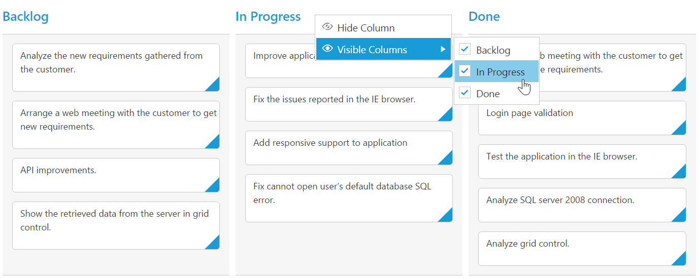
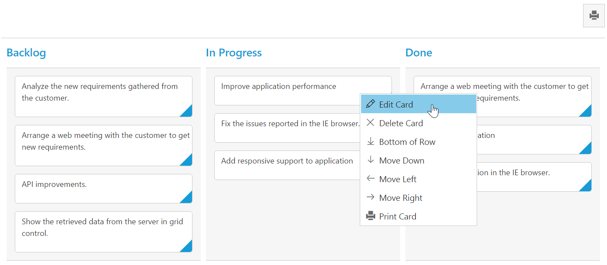
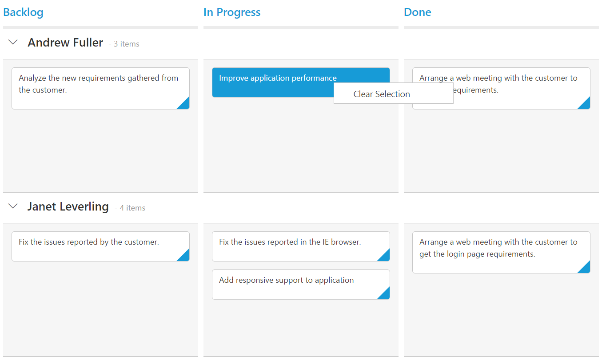
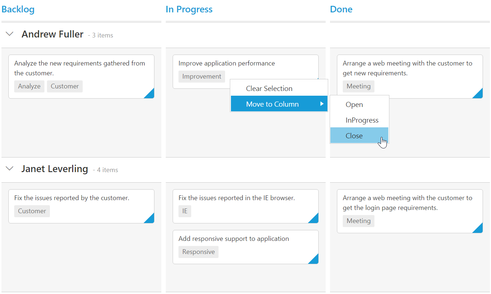

# Context Menu

Context menu is used to improve user action with Kanban using popup menu. It can be shown by defining `ContextMenuSettings.Enable` as true. Context menu has option to add default items in `ContextMenuSettings.MenuItems` and customized items in `ContextMenuSettings.CustomMenuItems`.

## Default Context Menu items

Please find the below table for default context menu items and its actions.

 <table>
        <tr>
            <th>
                Section
            </th>
            <th>
                Context menu items
            </th>
            <th>
                Action
            </th>
        </tr>
        <tr>
            <td rowspan="2">
                Header
            </td>
            <td>
                Hide Column
            </td>
            <td>
                Hide the current column
            </td>
        </tr>
        <tr>
            <td>
                Visible Columns
            </td>
            <td>
                Show the column if already hidden
            </td>
        </tr>
        <tr>
            <td>
                Content
            </td>
            <td>
                Add Card
            </td>
            <td>
                Start Add new card
            </td>
        </tr>
        <tr>
            <td rowspan="10">
                Card
            </td>
            <td>
                Edit Card
            </td>
            <td>
                Start Edit in current card
            </td>
        </tr>
        <tr>            
            <td>
                Delete Card
            </td>
            <td>
                Delete the current card
            </td>
        </tr>
        <tr>
            <td>
                Top of Row
            </td>
            <td>
                Move the card to Top of Row
            </td>
        </tr>
        <tr>
            <td>
                Bottom of Row
            </td>
            <td>
               Move the card to Bottom of Row
            </td>
        </tr>
        <tr>
            <td>
                Move Up
            </td>
            <td>
               Move the card in Up direction
            </td>
        </tr>
        <tr>
            <td>
                Move Down
            </td>
            <td>
               Move the card in Down direction
            </td>
        </tr>
        <tr>
            <td>
                Move Left
            </td>
            <td>
               Move the card in Left direction
            </td>
        </tr>
        <tr>
            <td>
               Move Right
            </td>
            <td>
               Move the card in Right direction
            </td>
        </tr>
        <tr>
            <td>
               Move to Swimlane
            </td>
            <td>
               Move the card to Swim lane which is chosen from given list
            </td>
        </tr>
        <tr>
            <td>
              Print Card
            </td>
            <td>
                Print the specific card
            </td>
        </tr>
 </table>
 
 The following code example describes the above behavior.
 




    <ej:Kanban ID="Kanban" runat="server" KeyField="Status">
                    <Columns>
                        <ej:KanbanColumn HeaderText="Backlog" Key="Open" />
                        <ej:KanbanColumn HeaderText="In Progress" Key="InProgress" />
                        <ej:KanbanColumn HeaderText="Done" Key="Close" />
                    </Columns>
                    <ContextMenuSettings Enable="true" />
                    <Fields Content="Summary" PrimaryKey="Id" Tag="Tags" SwimlaneKey="Assignee" />
    </ej:Kanban>





          List<Tasks> Task = new List<Tasks>();  
          protected void Page_Load(object sender, EventArgs e)
          {
            Task.Add(new Tasks(1, "Open", "Analyze the new requirements gathered from the customer.", "Story", "Low", "Analyze,Customer", 3.5, "Nancy", "../content/images/kanban/1.png", 1));
            Task.Add(new Tasks(2, "InProgress", "Improve application performance", "Improvement", "Normal", "Improvement", 6, "Andrew", "../content/images/kanban/2.png", 1));
            Task.Add(new Tasks(3, "Open", "Arrange a web meeting with the customer to get new requirements.", "Others", "Critical", "Meeting", 5.5, "Janet", "../content/images/kanban/3.png", 2));
            Task.Add(new Tasks(4, "InProgress", "Fix the issues reported in the IE browser.", "Bug", "Release Breaker", "IE", 2.5, "Janet", "../content/images/kanban/3.png", 2));
            Task.Add(new Tasks(5, "Testing", "Fix the issues reported by the customer.", "Bug", "Low", "Customer", 3.5, "Steven", "../content/images/kanban/5.png", 1));
            Task.Add(new Tasks(6, "Close", "Arrange a web meeting with the customer to get the login page requirements.", "Others", "Low", "Meeting", 2, "Michael", "../content/images/kanban/6.png", 1));
            Task.Add(new Tasks(7, "Validate", "Validate new requirements", "Improvement", "Low", "Validation", 1.5, "Robert", "../content/images/kanban/7.png", 4));
            Task.Add(new Tasks(8, "Close", "Login page validation", "Story", "Release Breaker", "Validation,Fix", 2.5, "Laura", "../content/images/kanban/8.png", 2));
            Task.Add(new Tasks(9, "Testing", "Fix the issues reported in Safari browser.", "Bug", "Release Breaker", "Fix,Safari", 1.5, "Nancy", "../content/images/kanban/1.png", 2));
            Task.Add(new Tasks(10, "Close", "Test the application in the IE browser.", "Story", "Low", "Testing,IE", 5.5, "Margaret", "../content/images/kanban/4.png", 3));
            Task.Add(new Tasks(11, "Validate", "Validate the issues reported by the customer.", "Story", "High", "Validation,Fix", 1, "Steven", "../content/images/kanban/5.png", 5));
            Task.Add(new Tasks(12, "Testing", "Check Login page validation.", "Story", "Release Breaker", "Testing", 0.5, "Michael", "../content/images/kanban/6.png", 3));
            Task.Add(new Tasks(13, "Open", "API improvements.", "Improvement", "High", "Grid,API", 3.5, "Robert", "../content/images/kanban/7.png", 3));
            Task.Add(new Tasks(14, "InProgress", "Add responsive support to application", "Epic", "Critical", "Responsive", 6, "Laura", "../content/images/kanban/8.png", 3));
            Task.Add(new Tasks(15, "Open", "Show the retrieved data from the server in grid control.", "Story", "High", "Database,SQL", 5.5, "Margaret", "../content/images/kanban/4.png", 4));
            this.Kanban.DataSource = Task;
            this.Kanban.DataBind();
           }


    
    

The following output is displayed as a result of the above code example
    

## Custom Context Menu

Custom context menu is used to create your own menu item and its action. To add customized context menu items, you need to use `ContextMenuSettings.CustomMenuItems` property and to bind required actions for this, use `ContextClick` event.

The following code example describes the above behavior.





      <ej:Kanban ID="Kanban" runat="server" KeyField="Status">
                <Columns>
                    <ej:KanbanColumn HeaderText="Backlog" Key="Open" />
                    <ej:KanbanColumn HeaderText="In Progress" Key="InProgress" />
                    <ej:KanbanColumn HeaderText="Done" Key="Close" />
                </Columns>
                <ContextMenuSettings Enable="true" MenuItems=" ">
                 <CustomMenuItems> 
                  <ej:CustomMenuItem Text="Clear Selection" />
                   </CustomMenuItems>
                  </ContextMenuSettings>
                <Fields Content="Summary" PrimaryKey="Id" Tag="Tags" SwimlaneKey="Assignee" />
        </ej:Kanban>
        




          List<Tasks> Task = new List<Tasks>();  
          protected void Page_Load(object sender, EventArgs e)
          {
            Task.Add(new Tasks(1, "Open", "Analyze the new requirements gathered from the customer.", "Story", "Low", "Analyze,Customer", 3.5, "Nancy", "../content/images/kanban/1.png", 1));
            Task.Add(new Tasks(2, "InProgress", "Improve application performance", "Improvement", "Normal", "Improvement", 6, "Andrew", "../content/images/kanban/2.png", 1));
            Task.Add(new Tasks(3, "Open", "Arrange a web meeting with the customer to get new requirements.", "Others", "Critical", "Meeting", 5.5, "Janet", "../content/images/kanban/3.png", 2));
            Task.Add(new Tasks(4, "InProgress", "Fix the issues reported in the IE browser.", "Bug", "Release Breaker", "IE", 2.5, "Janet", "../content/images/kanban/3.png", 2));
            Task.Add(new Tasks(5, "Testing", "Fix the issues reported by the customer.", "Bug", "Low", "Customer", 3.5, "Steven", "../content/images/kanban/5.png", 1));
            Task.Add(new Tasks(6, "Close", "Arrange a web meeting with the customer to get the login page requirements.", "Others", "Low", "Meeting", 2, "Michael", "../content/images/kanban/6.png", 1));
            Task.Add(new Tasks(7, "Validate", "Validate new requirements", "Improvement", "Low", "Validation", 1.5, "Robert", "../content/images/kanban/7.png", 4));
            Task.Add(new Tasks(8, "Close", "Login page validation", "Story", "Release Breaker", "Validation,Fix", 2.5, "Laura", "../content/images/kanban/8.png", 2));
            Task.Add(new Tasks(9, "Testing", "Fix the issues reported in Safari browser.", "Bug", "Release Breaker", "Fix,Safari", 1.5, "Nancy", "../content/images/kanban/1.png", 2));
            Task.Add(new Tasks(10, "Close", "Test the application in the IE browser.", "Story", "Low", "Testing,IE", 5.5, "Margaret", "../content/images/kanban/4.png", 3));
            Task.Add(new Tasks(11, "Validate", "Validate the issues reported by the customer.", "Story", "High", "Validation,Fix", 1, "Steven", "../content/images/kanban/5.png", 5));
            Task.Add(new Tasks(12, "Testing", "Check Login page validation.", "Story", "Release Breaker", "Testing", 0.5, "Michael", "../content/images/kanban/6.png", 3));
            Task.Add(new Tasks(13, "Open", "API improvements.", "Improvement", "High", "Grid,API", 3.5, "Robert", "../content/images/kanban/7.png", 3));
            Task.Add(new Tasks(14, "InProgress", "Add responsive support to application", "Epic", "Critical", "Responsive", 6, "Laura", "../content/images/kanban/8.png", 3));
            Task.Add(new Tasks(15, "Open", "Show the retrieved data from the server in grid control.", "Story", "High", "Database,SQL", 5.5, "Margaret", "../content/images/kanban/4.png", 4));
            this.Kanban.DataSource = Task;
            this.Kanban.DataBind();
           }


    
    

The following output is displayed as a result of the above code example.

## Sub Context Menu

Sub context menu is used to add customized sub menu to the custom context menu item. To add a sub context menu, you need to use `ContextMenuSettings.SubMenu` property and to bind required actions for this, use `ContextClick` event.

The following code example describes the above behavior.





      <ej:Kanban ID="Kanban" runat="server" KeyField="Status">
                <Columns>
                    <ej:KanbanColumn HeaderText="Backlog" Key="Open" />
                    <ej:KanbanColumn HeaderText="In Progress" Key="InProgress" />
                    <ej:KanbanColumn HeaderText="Done" Key="Close" />
                </Columns>
                <ContextMenuSettings Enable="true">
                    <MenuItems></MenuItems>
                    <CustomMenuItems>
                        <ej:CustomMenuItem Text="Clear Selection" Target="All" />
                        <ej:CustomMenuItem Text="Move to Column" Template="#template" />
                    </CustomMenuItems>
                </ContextMenuSettings>
                <ClientSideEvents ContextClick="context" />
                <Fields Content="Summary" PrimaryKey="Id" Tag="Tags" SwimlaneKey="Assignee" />
            </ej:Kanban>

            <ul id="template">
                <li><a>Open</a></li>
                <li><a>InProgress</a></li>
                <li><a>Close</a></li>
            </ul>
            





          List<Tasks> Task = new List<Tasks>();  
          protected void Page_Load(object sender, EventArgs e)
          {
            Task.Add(new Tasks(1, "Open", "Analyze the new requirements gathered from the customer.", "Story", "Low", "Analyze,Customer", 3.5, "Nancy", "../content/images/kanban/1.png", 1));
            Task.Add(new Tasks(2, "InProgress", "Improve application performance", "Improvement", "Normal", "Improvement", 6, "Andrew", "../content/images/kanban/2.png", 1));
            Task.Add(new Tasks(3, "Open", "Arrange a web meeting with the customer to get new requirements.", "Others", "Critical", "Meeting", 5.5, "Janet", "../content/images/kanban/3.png", 2));
            Task.Add(new Tasks(4, "InProgress", "Fix the issues reported in the IE browser.", "Bug", "Release Breaker", "IE", 2.5, "Janet", "../content/images/kanban/3.png", 2));
            Task.Add(new Tasks(5, "Testing", "Fix the issues reported by the customer.", "Bug", "Low", "Customer", 3.5, "Steven", "../content/images/kanban/5.png", 1));
            Task.Add(new Tasks(6, "Close", "Arrange a web meeting with the customer to get the login page requirements.", "Others", "Low", "Meeting", 2, "Michael", "../content/images/kanban/6.png", 1));
            Task.Add(new Tasks(7, "Validate", "Validate new requirements", "Improvement", "Low", "Validation", 1.5, "Robert", "../content/images/kanban/7.png", 4));
            Task.Add(new Tasks(8, "Close", "Login page validation", "Story", "Release Breaker", "Validation,Fix", 2.5, "Laura", "../content/images/kanban/8.png", 2));
            Task.Add(new Tasks(9, "Testing", "Fix the issues reported in Safari browser.", "Bug", "Release Breaker", "Fix,Safari", 1.5, "Nancy", "../content/images/kanban/1.png", 2));
            Task.Add(new Tasks(10, "Close", "Test the application in the IE browser.", "Story", "Low", "Testing,IE", 5.5, "Margaret", "../content/images/kanban/4.png", 3));
            Task.Add(new Tasks(11, "Validate", "Validate the issues reported by the customer.", "Story", "High", "Validation,Fix", 1, "Steven", "../content/images/kanban/5.png", 5));
            Task.Add(new Tasks(12, "Testing", "Check Login page validation.", "Story", "Release Breaker", "Testing", 0.5, "Michael", "../content/images/kanban/6.png", 3));
            Task.Add(new Tasks(13, "Open", "API improvements.", "Improvement", "High", "Grid,API", 3.5, "Robert", "../content/images/kanban/7.png", 3));
            Task.Add(new Tasks(14, "InProgress", "Add responsive support to application", "Epic", "Critical", "Responsive", 6, "Laura", "../content/images/kanban/8.png", 3));
            Task.Add(new Tasks(15, "Open", "Show the retrieved data from the server in grid control.", "Story", "High", "Database,SQL", 5.5, "Margaret", "../content/images/kanban/4.png", 4));
            this.Kanban.DataSource = Task;
            this.Kanban.DataBind();
           }


    
 

The following output is displayed as a result of the above code example. 

    

