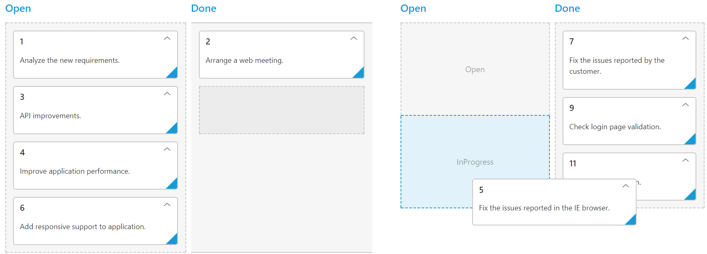
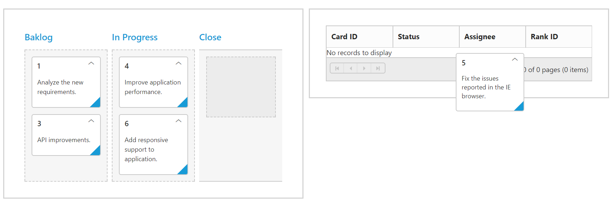

---
layout: post
title: Drag and Drop | Kanban | ASP.NET | Syncfusion
description: This section explains how to drag and drop Kanban cards and their features of the Syncfusion ASP.NET Web Forms Kanban component.
platform: aspnet
control: Kanban
documentation: ug
--- 
# Drag and Drop

By default, `AllowDragAndDrop` is true. Cards can be transited from one column to another column, by dragging and dropping. And it has drop position indicator which enables easier positioning of cards.

N> It is not possible transit cards to other swim lanes through Drag and Drop.

## Drag and Drop to external control

Kanban is now provided support to drag and drop cards to external controls, when `AllowExternalDragAndDrop` is set to true.  Along with that you need to specify the ID of the component to which the card must be dropped in `CardSettings` property `ExternalDropTarget`.

Here, in order to drag and drop cards between two Kanban, enable the Kanban property `AllowExternalDragAndDrop` and specify the target Kanban ID in `ExternalDropTarget`.

The following code example describes the above behavior. 





     <ej:Kanban ID="Kanban" runat="server" AllowTitle="true" KeyField="Status" AllowExternalDragAndDrop="true">
            <Columns>
                 <ej:KanbanColumn HeaderText="Open" Key="Open,InProgress" />
                 <ej:KanbanColumn HeaderText="Done" Key="Testing,Close" />
            </Columns>
            <Fields Content="Summary" PrimaryKey="Id"/>
    </ej:Kanban>

    <ej:Kanban ID="Kanban1" runat="server" AllowTitle="true" KeyField="Status" AllowExternalDragAndDrop="true">
            <Columns>
                 <ej:KanbanColumn HeaderText="Open" Key="Open,InProgress" />
                 <ej:KanbanColumn HeaderText="Done" Key="Testing,Close" />
            </Columns>
            <Fields Content="Summary" PrimaryKey="Id"/>
    </ej:Kanban>





 public partial class KanbanDefaultFunctionalities : System.Web.UI.Page
    {

        List<Tasks> Task = new List<Tasks>();
        List<Tasks> Task1 = new List<Tasks>();
        protected void Page_Load(object sender, EventArgs e)
        {
            this.Kanban.CardSettings.ExternalDropTarget = "#" + this.Kanban1.ClientID;
            this.Kanban1.CardSettings.ExternalDropTarget = "#" + this.Kanban.ClientID;
            BindDataSource();
        }
        private void BindDataSource()
        {
            Task.Add(new Tasks(1, "Open", "Analyze the new requirements gathered from the customer.", "Story", "Low", "Analyze,Customer", 3.5, "Nancy", "../content/images/kanban/1.png", 1));
            Task.Add(new Tasks(2, "InProgress", "Improve application performance", "Improvement", "Normal", "Improvement", 6, "Andrew Fuller", "../content/images/kanban/2.png", 1));
            Task.Add(new Tasks(3, "Open", "Arrange a web meeting with the customer to get new requirements.", "Others", "Critical", "Meeting", 5.5, "Janet Leverling", "../content/images/kanban/3.png", 2));
            Task.Add(new Tasks(4, "InProgress", "Fix the issues reported in the IE browser.", "Bug", "Release Breaker", "IE", 2.5, "Janet Leverling", "../content/images/kanban/3.png", 2));
            Task.Add(new Tasks(5, "Testing", "Fix the issues reported by the customer.", "Bug", "Low", "Customer", 3.5, "Steven walker", "../content/images/kanban/5.png", 1));
            Task.Add(new Tasks(6, "Close", "Arrange a web meeting with the customer to get the login page requirements.", "Others", "Low", "Meeting", 2, "Michael Suyama", "../content/images/kanban/6.png", 1));
            Task1.Add(new Tasks(7, "Open", "Validate new requirements", "Improvement", "Low", "Validation", 1.5, "Robert King", "../content/images/kanban/7.png",4));
            Task1.Add(new Tasks(8, "InProgress", "Login page validation", "Story", "Release Breaker", "Validation,Fix", 2.5, "Laura Callahan", "../content/images/kanban/8.png", 2));
            Task1.Add(new Tasks(9, "Testing", "Fix the issues reported in Safari browser.", "Bug", "Release Breaker", "Fix,Safari", 1.5, "Nancy", "../content/images/kanban/1.png", 2));
            Task1.Add(new Tasks(10, "Open", "Test the application in the IE browser.", "Story", "Low", "Testing,IE", 5.5, "Margaret", "../content/images/kanban/4.png", 3));
            Task1.Add(new Tasks(11, "Close", "Validate the issues reported by the customer.", "Story", "High", "Validation,Fix", 1, "Steven walker", "../content/images/kanban/5.png",5));
            Task1.Add(new Tasks(12, "Testing", "Check Login page validation.", "Story", "Release Breaker", "Testing", 0.5, "Michael Suyama", "../content/images/kanban/6.png", 3));
            this.Kanban.DataSource = Task;
            this.Kanban1.DataSource = Task1;
            this.Kanban.DataBind();
            this.Kanban1.DataBind();
        }
        [Serializable]
        public class Tasks
        {
            public Tasks()
            {
            }
            public Tasks(int Id, string Status, string Summary, string Type, string Priority, string Tags, double Estimate, string Assignee, string ImgUrl, int RankId)
            {
                this.Id = Id;
                this.Status = Status;
                this.Summary = Summary;
                this.Type = Type;
                this.Priority = Priority;
                this.Tags = Tags;
                this.Estimate = Estimate;
                this.Assignee = Assignee;
                this.ImgUrl = ImgUrl;
                this.RankId = RankId;

            }
            public int Id { get; set; }
            public string Status { get; set; }
            public string Summary { get; set; }
            public string Type { get; set; }
            public string Priority { get; set; }
            public string Tags { get; set; }
            public double Estimate { get; set; }
            public string Assignee { get; set; }
            public string ImgUrl { get; set; }
            public int RankId { get; set; }

        }
    }
 






    .e-kanban .e-draggedcard {
	     z-index:1;
	  }



The following output is displayed before dropping Kanban cards.

 

The following output is displayed after dropping Kanban cards.

 

### See Also

You can also drag and drop Kanban cards to any custom control. For instance, let it be a Grid control. Enable the Kanban property `AllowExternalDragAndDrop` and specify the target Grid element ID in `ExternalDropTarget`.

N> The target control must have droppable feature to handle the card dropped from Kanban and customize it based on corresponding control. 

The following code example describes the above behavior. 





     <ej:Kanban ID="Kanban" runat="server" AllowTitle="true" KeyField="Status" AllowExternalDragAndDrop="true">
            <Columns>
                 <ej:KanbanColumn HeaderText="Open" Key="Open,InProgress" />
                 <ej:KanbanColumn HeaderText="Done" Key="Testing,Close" />
            </Columns>
            <Fields Content="Summary" PrimaryKey="Id"/>
            <ClientSideEvents CardDragStop="cardDragStop" />
    </ej:Kanban>
    
    <ej:Grid ID="Grid" runat="server" AllowSorting="True" AllowPaging="true">
         <EditSettings AllowAdding="True"></EditSettings>
            <Columns>                
                <ej:Column Field="Id" HeaderText="Card ID" IsPrimaryKey="True"/>
                <ej:Column Field="Status" HeaderText="Status"/>
                <ej:Column Field="Assignee" HeaderText="Assignee"/>
                <ej:Column Field="RankId" HeaderText="Rank ID"/>
            </Columns>
    </ej:Grid>
        




  public partial class KanbanFeatures : System.Web.UI.Page
    {

        List<Tasks> Task = new List<Tasks>();
        List<Tasks> Task1 = new List<Tasks>();

        protected void Page_Load(object sender, EventArgs e)
        {
            this.Kanban.CardSettings.ExternalDropTarget = "#" + this.Grid.ClientID;
            BindDataSource();
        }

        private void BindDataSource()
        {
            Task.Add(new Tasks(1, "Open", "Analyze the new requirements gathered from the customer.", "Story", "Low", "Analyze,Customer", 3.5, "Nancy", "../content/images/kanban/1.png", 1));
            Task.Add(new Tasks(2, "InProgress", "Improve application performance", "Improvement", "Normal", "Improvement", 6, "Andrew Fuller", "../content/images/kanban/2.png", 1));
            Task.Add(new Tasks(3, "Open", "Arrange a web meeting with the customer to get new requirements.", "Others", "Critical", "Meeting", 5.5, "Janet Leverling", "../content/images/kanban/3.png", 2));
            Task.Add(new Tasks(4, "InProgress", "Fix the issues reported in the IE browser.", "Bug", "Release Breaker", "IE", 2.5, "Janet Leverling", "../content/images/kanban/3.png", 2));
            Task.Add(new Tasks(5, "Testing", "Fix the issues reported by the customer.", "Bug", "Low", "Customer", 3.5, "Steven walker", "../content/images/kanban/5.png", 1));
            Task.Add(new Tasks(6, "Close", "Arrange a web meeting with the customer to get the login page requirements.", "Others", "Low", "Meeting", 2, "Michael Suyama", "../content/images/kanban/6.png", 1));
            this.Kanban.DataSource = Task;
            this.Grid.DataSource = Task1;
            this.Kanban.DataBind();
            this.Grid.DataBind();
        }
        [Serializable]
        public class Tasks
        {
            public Tasks()
            {
            }
            public Tasks(int Id, string Status, string Summary, string Type, string Priority, string Tags, double Estimate, string Assignee, string ImgUrl, int RankId)
            {
                this.Id = Id;
                this.Status = Status;
                this.Summary = Summary;
                this.Type = Type;
                this.Priority = Priority;
                this.Tags = Tags;
                this.Estimate = Estimate;
                this.Assignee = Assignee;
                this.ImgUrl = ImgUrl;
                this.RankId = RankId;
            }
            public int Id { get; set; }
            public string Status { get; set; }
            public string Summary { get; set; }
            public string Type { get; set; }
            public string Priority { get; set; }
            public string Tags { get; set; }
            public double Estimate { get; set; }
            public string Assignee { get; set; }
            public string ImgUrl { get; set; }
            public int RankId { get; set; }
        }
    }







    function cardDragStop(args) {
        if ($(args.dropTarget).parents(".e-grid").length != 0) {
            var gridObj = $("#<%= Grid.ClientID %>").data("ejGrid");
            gridObj.addRecord(args.data[0][0]);
            gridObj.refreshContent();
        }
    }





    .e-kanban .e-draggedcard {
	     z-index:1;
	  }



The following output is displayed before dropping the cards on Grid.

The following output is displayed after dropping the cards on Grid.

