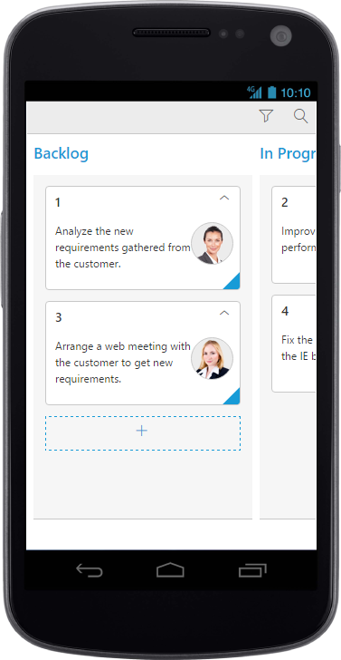
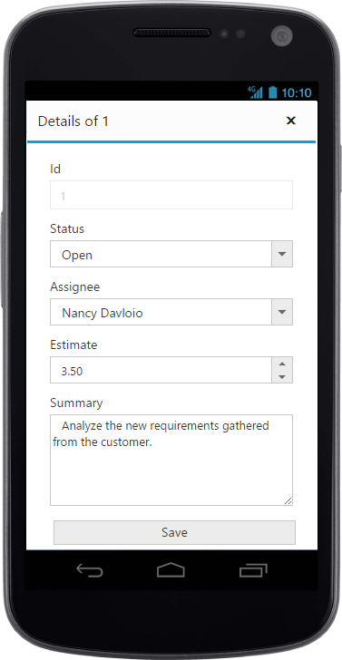
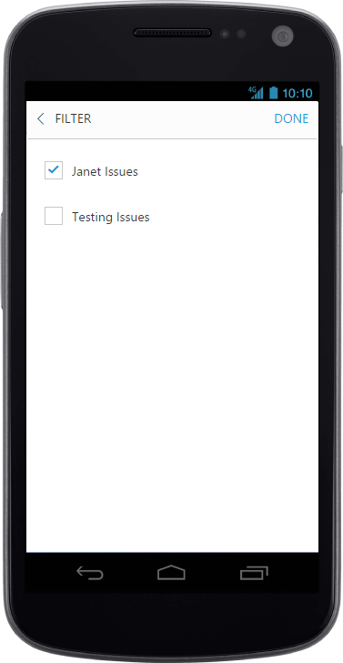
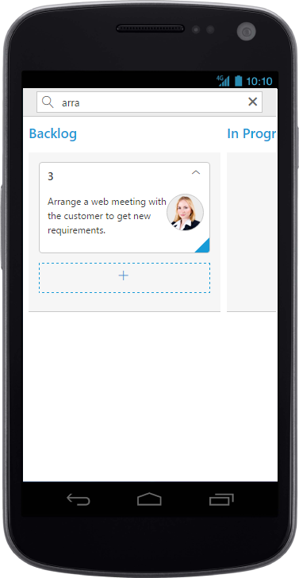
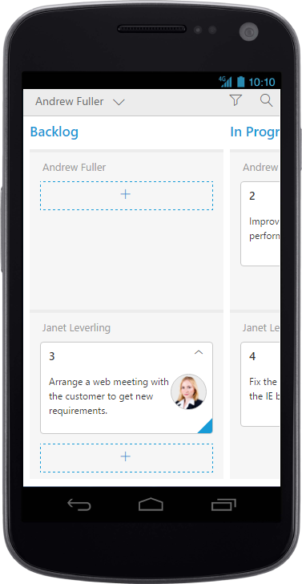
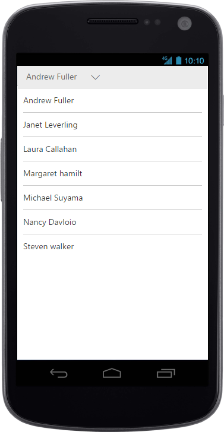

# Responsive

The Kanban control has support for responsive behavior based on client browser’s width and height. To enable responsive, `IsResponsive` property should be true.There are two modes of responsive layout is available in Kanban based on client width. They are,

* Mobile(<480px)
* Desktop(>480px)

You can check the image representation of touch actions from the below image.

## Mobile Layout

If client width is less than 480px, the Kanban will render in mobile mode. In which, you can see that kanban user interface is customized and redesigned for best view in small screens.To enable responsive, `isResponsive` property should be true.
 


  	 <ej:Kanban ID="Kanban" runat="server" AllowSelection="false" IsResponsive="true" AllowTitle="true" KeyField="Status" AllowKeyboardNavigation="true" AllowSearching="true">
            <Columns>
                <ej:KanbanColumn HeaderText="Backlog" Key="Open" ShowAddButton="true" />
                <ej:KanbanColumn HeaderText="In Progress" Key="InProgress" />
                <ej:KanbanColumn HeaderText="Testing" Key="Testing" />
                <ej:KanbanColumn HeaderText="Done" Key="Close" />
            </Columns>
            <Fields Content="Summary" ImageUrl="ImgUrl" PrimaryKey="Id" />
            <EditSettings AllowAdding="true" AllowEditing="true" EditMode="Dialog">
                <EditItems>
                    <ej:KanbanEditItem EditType="String" Field="Id">
                        <ValidationRules>
                            <ej:KeyValue Key="required" Value="true" />
                        </ValidationRules>
                    </ej:KanbanEditItem>
                    <ej:KanbanEditItem EditType="Dropdown" Field="Status"></ej:KanbanEditItem>
                    <ej:KanbanEditItem EditType="Dropdown" Field="Assignee"></ej:KanbanEditItem>
                    <ej:KanbanEditItem EditType="Numeric" Field="Estimate">
                        <NumericEditOptions DecimalPlaces="2" />
                        <ValidationRules>
                            <ej:KeyValue Key="range" Value="[0, 1000]" />
                        </ValidationRules>
                    </ej:KanbanEditItem>
                    <ej:KanbanEditItem EditType="TextArea" Field="Summary">
                        <ValidationRules>
                            <ej:KeyValue Key="required" Value="true" />
                        </ValidationRules>
                    </ej:KanbanEditItem>
                </EditItems>
            </EditSettings>
            <FilterSettings>
                <ej:KanbanFilterSetting Text="Janet Issues" Query="new ej.Query().where('Assignee', 'equal', 'Janet Leverling')" Description="Displays issues which matches the assignee as 'Janet Leverling" />
                <ej:KanbanFilterSetting Text="Testing" Query="new ej.Query().where('Status', 'equal', 'Testing')" Description="Display the issues of 'Testing'" />
            </FilterSettings>
        </ej:Kanban>


          List<Tasks> Task = new List<Tasks>();  
          protected void Page_Load(object sender, EventArgs e)
          {
            Task.Add(new Tasks(1, "Open", "Analyze the new requirements gathered from the customer.", "Story", "Low", "Analyze,Customer", 3.5, "Nancy", "../content/images/kanban/1.png", 1));
            Task.Add(new Tasks(2, "InProgress", "Improve application performance", "Improvement", "Normal", "Improvement", 6, "Andrew", "../content/images/kanban/2.png", 1));
            Task.Add(new Tasks(3, "Open", "Arrange a web meeting with the customer to get new requirements.", "Others", "Critical", "Meeting", 5.5, "Janet", "../content/images/kanban/3.png", 2));
            Task.Add(new Tasks(4, "InProgress", "Fix the issues reported in the IE browser.", "Bug", "Release Breaker", "IE", 2.5, "Janet", "../content/images/kanban/3.png", 2));
            Task.Add(new Tasks(5, "Testing", "Fix the issues reported by the customer.", "Bug", "Low", "Customer", 3.5, "Steven", "../content/images/kanban/5.png", 1));
            Task.Add(new Tasks(6, "Close", "Arrange a web meeting with the customer to get the login page requirements.", "Others", "Low", "Meeting", 2, "Michael", "../content/images/kanban/6.png", 1));
            Task.Add(new Tasks(7, "Validate", "Validate new requirements", "Improvement", "Low", "Validation", 1.5, "Robert", "../content/images/kanban/7.png", 4));
            Task.Add(new Tasks(8, "Close", "Login page validation", "Story", "Release Breaker", "Validation,Fix", 2.5, "Laura", "../content/images/kanban/8.png", 2));
            Task.Add(new Tasks(9, "Testing", "Fix the issues reported in Safari browser.", "Bug", "Release Breaker", "Fix,Safari", 1.5, "Nancy", "../content/images/kanban/1.png", 2));
            Task.Add(new Tasks(10, "Close", "Test the application in the IE browser.", "Story", "Low", "Testing,IE", 5.5, "Margaret", "../content/images/kanban/4.png", 3));
            Task.Add(new Tasks(11, "Validate", "Validate the issues reported by the customer.", "Story", "High", "Validation,Fix", 1, "Steven", "../content/images/kanban/5.png", 5));
            Task.Add(new Tasks(12, "Testing", "Check Login page validation.", "Story", "Release Breaker", "Testing", 0.5, "Michael", "../content/images/kanban/6.png", 3));
            Task.Add(new Tasks(13, "Open", "API improvements.", "Improvement", "High", "Grid,API", 3.5, "Robert", "../content/images/kanban/7.png", 3));
            Task.Add(new Tasks(14, "InProgress", "Add responsive support to application", "Epic", "Critical", "Responsive", 6, "Laura", "../content/images/kanban/8.png", 3));
            Task.Add(new Tasks(15, "Open", "Show the retrieved data from the server in grid control.", "Story", "High", "Database,SQL", 5.5, "Margaret", "../content/images/kanban/4.png", 4));
            this.Kanban.DataSource = Task;
            this.Kanban.DataBind();
           }

  

W> IE8 and IE9 does not support responsive kanban. `ej.responsive.css` should be referred to display Responsive Kanban.

{:caption}
CRUD in mobile layout

{:caption}
Filtering in mobile layout

{:caption}
Searching in mobile layout

{:caption}
Kanban with Swim-lanes

## Width

By default, the Kanban is adaptable to its parent container. It can adjust its width of columns based on parent container width. You can also assign width of `Columns` in percentage.

The following code example describes the above behavior.





  	 <ej:Kanban ID="Kanban" runat="server" KeyField="Status" IsResponsive="true">
                <Columns>
                    <ej:KanbanColumn HeaderText="Backlog" Key="Open" Width="10%" />
                    <ej:KanbanColumn HeaderText="In Progress" Key="InProgress" Width="10%" />
                    <ej:KanbanColumn HeaderText="Done" Key="Close" Width="10%" />
                </Columns>
                <Fields Content="Summary" PrimaryKey="Id" Tag="Tags" />
      </ej:Kanban>





          List<Tasks> Task = new List<Tasks>();  
          protected void Page_Load(object sender, EventArgs e)
          {
            Task.Add(new Tasks(1, "Open", "Analyze the new requirements gathered from the customer.", "Story", "Low", "Analyze,Customer", 3.5, "Nancy", "../content/images/kanban/1.png", 1));
            Task.Add(new Tasks(2, "InProgress", "Improve application performance", "Improvement", "Normal", "Improvement", 6, "Andrew", "../content/images/kanban/2.png", 1));
            Task.Add(new Tasks(3, "Open", "Arrange a web meeting with the customer to get new requirements.", "Others", "Critical", "Meeting", 5.5, "Janet", "../content/images/kanban/3.png", 2));
            Task.Add(new Tasks(4, "InProgress", "Fix the issues reported in the IE browser.", "Bug", "Release Breaker", "IE", 2.5, "Janet", "../content/images/kanban/3.png", 2));
            Task.Add(new Tasks(5, "Testing", "Fix the issues reported by the customer.", "Bug", "Low", "Customer", 3.5, "Steven", "../content/images/kanban/5.png", 1));
            Task.Add(new Tasks(6, "Close", "Arrange a web meeting with the customer to get the login page requirements.", "Others", "Low", "Meeting", 2, "Michael", "../content/images/kanban/6.png", 1));
            Task.Add(new Tasks(7, "Validate", "Validate new requirements", "Improvement", "Low", "Validation", 1.5, "Robert", "../content/images/kanban/7.png", 4));
            Task.Add(new Tasks(8, "Close", "Login page validation", "Story", "Release Breaker", "Validation,Fix", 2.5, "Laura", "../content/images/kanban/8.png", 2));
            Task.Add(new Tasks(9, "Testing", "Fix the issues reported in Safari browser.", "Bug", "Release Breaker", "Fix,Safari", 1.5, "Nancy", "../content/images/kanban/1.png", 2));
            Task.Add(new Tasks(10, "Close", "Test the application in the IE browser.", "Story", "Low", "Testing,IE", 5.5, "Margaret", "../content/images/kanban/4.png", 3));
            Task.Add(new Tasks(11, "Validate", "Validate the issues reported by the customer.", "Story", "High", "Validation,Fix", 1, "Steven", "../content/images/kanban/5.png", 5));
            Task.Add(new Tasks(12, "Testing", "Check Login page validation.", "Story", "Release Breaker", "Testing", 0.5, "Michael", "../content/images/kanban/6.png", 3));
            Task.Add(new Tasks(13, "Open", "API improvements.", "Improvement", "High", "Grid,API", 3.5, "Robert", "../content/images/kanban/7.png", 3));
            Task.Add(new Tasks(14, "InProgress", "Add responsive support to application", "Epic", "Critical", "Responsive", 6, "Laura", "../content/images/kanban/8.png", 3));
            Task.Add(new Tasks(15, "Open", "Show the retrieved data from the server in grid control.", "Story", "High", "Database,SQL", 5.5, "Margaret", "../content/images/kanban/4.png", 4));
            this.Kanban.DataSource = Task;
            this.Kanban.DataBind();
           }



  
 
N>AllowScrolling should be false while defining width in percentage.

## Min Width

Min Width is used to maintain minimum width for the Kanban. If the Kanban width is less than `MinWidth` then the scrollbar will be displayed to maintain minimum width.

The following code example describes the above behavior.





  	 <ej:Kanban ID="Kanban" runat="server" KeyField="Status" IsResponsive="true" MinWidth="500">
                <Columns>
                    <ej:KanbanColumn HeaderText="Backlog" Key="Open" Width="120" />
                    <ej:KanbanColumn HeaderText="In Progress" Key="InProgress" Width="110" />
                    <ej:KanbanColumn HeaderText="Done" Key="Close" Width="110" />
                </Columns>
                <Fields Content="Summary" PrimaryKey="Id" Tag="Tags" />
      </ej:Kanban>





          List<Tasks> Task = new List<Tasks>();  
          protected void Page_Load(object sender, EventArgs e)
          {
            Task.Add(new Tasks(1, "Open", "Analyze the new requirements gathered from the customer.", "Story", "Low", "Analyze,Customer", 3.5, "Nancy", "../content/images/kanban/1.png", 1));
            Task.Add(new Tasks(2, "InProgress", "Improve application performance", "Improvement", "Normal", "Improvement", 6, "Andrew", "../content/images/kanban/2.png", 1));
            Task.Add(new Tasks(3, "Open", "Arrange a web meeting with the customer to get new requirements.", "Others", "Critical", "Meeting", 5.5, "Janet", "../content/images/kanban/3.png", 2));
            Task.Add(new Tasks(4, "InProgress", "Fix the issues reported in the IE browser.", "Bug", "Release Breaker", "IE", 2.5, "Janet", "../content/images/kanban/3.png", 2));
            Task.Add(new Tasks(5, "Testing", "Fix the issues reported by the customer.", "Bug", "Low", "Customer", 3.5, "Steven", "../content/images/kanban/5.png", 1));
            Task.Add(new Tasks(6, "Close", "Arrange a web meeting with the customer to get the login page requirements.", "Others", "Low", "Meeting", 2, "Michael", "../content/images/kanban/6.png", 1));
            Task.Add(new Tasks(7, "Validate", "Validate new requirements", "Improvement", "Low", "Validation", 1.5, "Robert", "../content/images/kanban/7.png", 4));
            Task.Add(new Tasks(8, "Close", "Login page validation", "Story", "Release Breaker", "Validation,Fix", 2.5, "Laura", "../content/images/kanban/8.png", 2));
            Task.Add(new Tasks(9, "Testing", "Fix the issues reported in Safari browser.", "Bug", "Release Breaker", "Fix,Safari", 1.5, "Nancy", "../content/images/kanban/1.png", 2));
            Task.Add(new Tasks(10, "Close", "Test the application in the IE browser.", "Story", "Low", "Testing,IE", 5.5, "Margaret", "../content/images/kanban/4.png", 3));
            Task.Add(new Tasks(11, "Validate", "Validate the issues reported by the customer.", "Story", "High", "Validation,Fix", 1, "Steven", "../content/images/kanban/5.png", 5));
            Task.Add(new Tasks(12, "Testing", "Check Login page validation.", "Story", "Release Breaker", "Testing", 0.5, "Michael", "../content/images/kanban/6.png", 3));
            Task.Add(new Tasks(13, "Open", "API improvements.", "Improvement", "High", "Grid,API", 3.5, "Robert", "../content/images/kanban/7.png", 3));
            Task.Add(new Tasks(14, "InProgress", "Add responsive support to application", "Epic", "Critical", "Responsive", 6, "Laura", "../content/images/kanban/8.png", 3));
            Task.Add(new Tasks(15, "Open", "Show the retrieved data from the server in grid control.", "Story", "High", "Database,SQL", 5.5, "Margaret", "../content/images/kanban/4.png", 4));
            this.Kanban.DataSource = Task;
            this.Kanban.DataBind();
           }



  

The following output is displayed as a result of the above code example.

