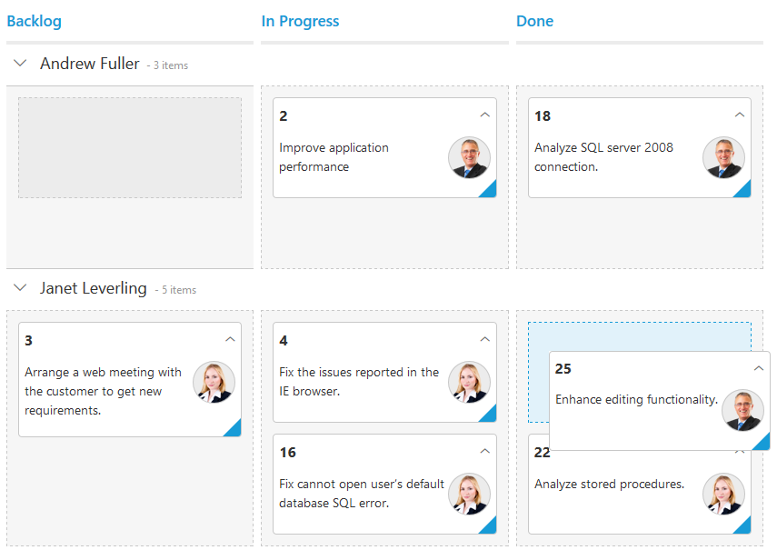

---
layout: post
title: Swimlanes with Kanban widget for Syncfusion Essential ASP.NET
description: This section explains the horizontal categorization of issues in the Syncfusion ASP.NET Web Forms Kanban component.
platform: aspnet
control: Kanban
documentation: ug
--- 
# Swim lanes

Swim lanes are a horizontal categorization of issues in the Kanban control which brings transparency to the workflow. This can be enabled by mapping the `SwimlaneKey` to appropriate column name in the `DataSource`.

The following code example describes the above behavior.





  	<ej:Kanban ID="Kanban" runat="server" KeyField="Status">
                <Columns>
                    <ej:KanbanColumn HeaderText="Backlog" Key="Open" />
                    <ej:KanbanColumn HeaderText="In Progress" Key="InProgress" />
                    <ej:KanbanColumn HeaderText="Testing" Key="Testing" />
                    <ej:KanbanColumn HeaderText="Done" Key="Close" />
                </Columns>
                <Fields Content="Summary" ImageUrl="ImgUrl" SwimlaneKey="Assignee" />
   </ej:Kanban>     





          List<Tasks> Task = new List<Tasks>();  
          protected void Page_Load(object sender, EventArgs e)
          {
            Task.Add(new Tasks(1, "Open", "Analyze the new requirements gathered from the customer.", "Story", "Low", "Analyze,Customer", 3.5, "Nancy", "../content/images/kanban/1.png", 1));
            Task.Add(new Tasks(2, "InProgress", "Improve application performance", "Improvement", "Normal", "Improvement", 6, "Andrew", "../content/images/kanban/2.png", 1));
            Task.Add(new Tasks(3, "Open", "Arrange a web meeting with the customer to get new requirements.", "Others", "Critical", "Meeting", 5.5, "Janet", "../content/images/kanban/3.png", 2));
            Task.Add(new Tasks(4, "InProgress", "Fix the issues reported in the IE browser.", "Bug", "Release Breaker", "IE", 2.5, "Janet", "../content/images/kanban/3.png", 2));
            Task.Add(new Tasks(5, "Testing", "Fix the issues reported by the customer.", "Bug", "Low", "Customer", 3.5, "Steven", "../content/images/kanban/5.png", 1));
            Task.Add(new Tasks(6, "Close", "Arrange a web meeting with the customer to get the login page requirements.", "Others", "Low", "Meeting", 2, "Michael", "../content/images/kanban/6.png", 1));
            Task.Add(new Tasks(7, "Validate", "Validate new requirements", "Improvement", "Low", "Validation", 1.5, "Robert", "../content/images/kanban/7.png", 4));
            Task.Add(new Tasks(8, "Close", "Login page validation", "Story", "Release Breaker", "Validation,Fix", 2.5, "Laura", "../content/images/kanban/8.png", 2));
            Task.Add(new Tasks(9, "Testing", "Fix the issues reported in Safari browser.", "Bug", "Release Breaker", "Fix,Safari", 1.5, "Nancy", "../content/images/kanban/1.png", 2));
            Task.Add(new Tasks(10, "Close", "Test the application in the IE browser.", "Story", "Low", "Testing,IE", 5.5, "Margaret", "../content/images/kanban/4.png", 3));
            Task.Add(new Tasks(11, "Validate", "Validate the issues reported by the customer.", "Story", "High", "Validation,Fix", 1, "Steven", "../content/images/kanban/5.png", 5));
            Task.Add(new Tasks(12, "Testing", "Check Login page validation.", "Story", "Release Breaker", "Testing", 0.5, "Michael", "../content/images/kanban/6.png", 3));
            Task.Add(new Tasks(13, "Open", "API improvements.", "Improvement", "High", "Grid,API", 3.5, "Robert", "../content/images/kanban/7.png", 3));
            Task.Add(new Tasks(14, "InProgress", "Add responsive support to application", "Epic", "Critical", "Responsive", 6, "Laura", "../content/images/kanban/8.png", 3));
            Task.Add(new Tasks(15, "Open", "Show the retrieved data from the server in grid control.", "Story", "High", "Database,SQL", 5.5, "Margaret", "../content/images/kanban/4.png", 4));
            this.Kanban.DataSource = Task;
            this.Kanban.DataBind();
           }



  

The following output is displayed as a result of the above code example.

## Customized swimlane header text

You can change the swimlane row header text using the swimlane `KanbanSwimlaneHeaders` property.  In this property, the text is changed using the `Text` property and the corresponding value is mapped into the `Key` property based on `SwimlaneKey` datasource mapping.

Refer to the following code example.





  <ej:Kanban ID="Kanban" runat="server" KeyField="Status" AllowTitle="true">
        <Columns>
            <ej:KanbanColumn HeaderText="Backlog" Key="Open" />
            <ej:KanbanColumn HeaderText="In Progress" Key="InProgress" />
            <ej:KanbanColumn HeaderText="Done" Key="Close" />
        </Columns>
        <Fields Content="Summary" SwimlaneKey="Assignee" PrimaryKey="Id" />
        <SwimlaneSettings>
            <Headers>
                <ej:KanbanSwimlaneHeaders Text="Andrew" Key="Andrew Fuller" />
                <ej:KanbanSwimlaneHeaders Text="Janet" Key="Janet" />
            </Headers>
        </SwimlaneSettings>
    </ej:Kanban>
  




    public partial class KanbanController : Controller
    {
        List<Tasks> Task = new List<Tasks>();
        
        // GET: /Kanban/
        public ActionResult KanbanFeatures()
        {
            Task.Add(new Tasks(6, "Close", "Arrange a web meeting with the customer to get the login page requirements.", "Others", "Low", "Meeting", 2, "Janet", "../content/images/kanban/3.png", 1));
            Task.Add(new Tasks(7, "Validate", "Validate new requirements", "Improvement", "Low", "Validation", 1.5, "Janet", "../content/images/kanban/3.png", 4));
            Task.Add(new Tasks(8, "Close", "Login page validation", "Story", "Release Breaker", "Validation,Fix", 2.5, "Andrew Fuller", "../content/images/kanban/1.png", 2));
            Task.Add(new Tasks(9, "Testing", "Fix the issues reported in Safari browser.", "Bug", "Release Breaker", "Fix,Safari", 1.5, "Janet", "../content/images/kanban/3.png", 2));
            Task.Add(new Tasks(10, "InProgress", "Test the application in the IE browser.", "Story", "Low", "Testing,IE", 5.5, "Andrew Fuller", "../content/images/kanban/1.png", 3));
            ViewBag.datasource = Task;
            return View();
        }
    }
    public class Tasks
    {
        public Tasks()
        {
        }
        public Tasks(int Id, string Status, string Summary, string Type, string Priority, string Tags, double Estimate, string Assignee, string Image, int RankId)
        {
            this.Id = Id;
            this.Status = Status;
            this.Summary = Summary;
            this.Type = Type;
            this.Priority = Priority;
            this.Tags = Tags;
            this.Estimate = Estimate;
            this.Assignee = Assignee;
            this.Image = Image;
            this.RankId = RankId;
        }
        public int Id { get; set; }
        public string Status { get; set; }
        public string Summary { get; set; }
        public string Type { get; set; }
        public string Priority { get; set; }
        public string Tags { get; set; }
        public double Estimate { get; set; }
        public string Assignee { get; set; }
        public string Image { get; set; }
        public int RankId { get; set; }
    }
              




The following output is displayed as a result of the above code example.

## Empty swimlane row on Kanban board

You can create an empty swimlane row by enabling the `ShowEmptySwimlane` property based on swimlane headers `Key` value mapping.  If no data is present, then the empty swimlane row is rendered on the Kanban board based on the specified swimlane headers `Key`.

Refer to the following code.





 <ej:Kanban ID="Kanban" runat="server" KeyField="Status" AllowTitle="true">
        <Columns>
            <ej:KanbanColumn HeaderText="Backlog" Key="Open" />
            <ej:KanbanColumn HeaderText="In Progress" Key="InProgress" />
            <ej:KanbanColumn HeaderText="Done" Key="Close" />
        </Columns>
        <Fields Content="Summary" SwimlaneKey="Assignee" PrimaryKey="Id" />
        <SwimlaneSettings ShowEmptySwimlane="true">
            <Headers>
                <ej:KanbanSwimlaneHeaders Text="Andrew" Key="Andrew Fuller" />
                <ej:KanbanSwimlaneHeaders Text="Janet" Key="Janet Leverling" />
            </Headers>
        </SwimlaneSettings>
    </ej:Kanban>





public partial class KanbanController : Controller
    {
        List<Tasks> Task = new List<Tasks>();
        
        // GET: /Kanban/
        public ActionResult KanbanFeatures()
        {
            Task.Add(new Tasks(8, "Close", "Login page validation", "Story", "Release Breaker", "Validation,Fix", 2.5, "Andrew Fuller", "../content/images/kanban/1.png", 2));
            Task.Add(new Tasks(9, "Testing", "Fix the issues reported in Safari browser.", "Bug", "Release Breaker", "Fix,Safari", 1.5, "Janet", "../content/images/kanban/3.png", 2));
            Task.Add(new Tasks(10, "InProgress", "Test the application in the IE browser.", "Story", "Low", "Testing,IE", 5.5, "Andrew Fuller", "../content/images/kanban/1.png", 3));
            ViewBag.datasource = Task;
            return View();
        }
    }
    public class Tasks
    {
        public Tasks()
        {
        }
        public Tasks(int Id, string Status, string Summary, string Type, string Priority, string Tags, double Estimate, string Assignee, string Image, int RankId)
        {
            this.Id = Id;
            this.Status = Status;
            this.Summary = Summary;
            this.Type = Type;
            this.Priority = Priority;
            this.Tags = Tags;
            this.Estimate = Estimate;
            this.Assignee = Assignee;
            this.Image = Image;
            this.RankId = RankId;
        }
        public int Id { get; set; }
        public string Status { get; set; }
        public string Summary { get; set; }
        public string Type { get; set; }
        public string Priority { get; set; }
        public string Tags { get; set; }
        public double Estimate { get; set; }
        public string Assignee { get; set; }
        public string Image { get; set; }
        public int RankId { get; set; }
    }





The following output is displayed as a result of the above code example.

## Drag And Drop between swim lanes

You can set `AllowDragAndDrop` property of `SwimlaneSettings` as true to enable Drag and Drop between the swim lanes.

If a card is to be dragged in the same swim lane, only a droppable target cell is added to the dotted line border. If a card is dragged from one swim lane to another, all the Kanban cells will be added to the dotted line borders, except the dragged card cell.

The following code example describes the above behavior.





     <ej:Kanban ID="KanbanBoard" runat="server" AllowSelection="false" AllowTitle="true" KeyField="Status">
        <Columns>
            <ej:KanbanColumn HeaderText="Backlog" Key="Open" />
            <ej:KanbanColumn HeaderText="In Progress" Key="InProgress" />
            <ej:KanbanColumn HeaderText="Testing" Key="Testing" />
            <ej:KanbanColumn HeaderText="Done" Key="Close" />
        </Columns>
        <Fields Content="Summary" ImageUrl="ImgUrl" PrimaryKey="Id" SwimlaneKey="Assignee" />
        <SwimlaneSettings AllowDragAndDrop="true" />
   </ej:Kanban>
  




      List<Tasks> Task = new List<Tasks>();  
          protected void Page_Load(object sender, EventArgs e)
          {
            Task.Add(new Tasks(1, "Open", "Analyze the new requirements gathered from the customer.", "Story", "Low", "Analyze,Customer", 3.5, "Nancy", "../content/images/kanban/1.png", 1));
            Task.Add(new Tasks(2, "InProgress", "Improve application performance", "Improvement", "Normal", "Improvement", 6, "Andrew", "../content/images/kanban/2.png", 1));
            Task.Add(new Tasks(3, "Open", "Arrange a web meeting with the customer to get new requirements.", "Others", "Critical", "Meeting", 5.5, "Janet", "../content/images/kanban/3.png", 2));
            Task.Add(new Tasks(4, "InProgress", "Fix the issues reported in the IE browser.", "Bug", "Release Breaker", "IE", 2.5, "Janet", "../content/images/kanban/3.png", 2));
            Task.Add(new Tasks(5, "Testing", "Fix the issues reported by the customer.", "Bug", "Low", "Customer", 3.5, "Steven", "../content/images/kanban/5.png", 1));
            Task.Add(new Tasks(6, "Close", "Arrange a web meeting with the customer to get the login page requirements.", "Others", "Low", "Meeting", 2, "Michael", "../content/images/kanban/6.png", 1));
            Task.Add(new Tasks(7, "Validate", "Validate new requirements", "Improvement", "Low", "Validation", 1.5, "Robert", "../content/images/kanban/7.png", 4));
            Task.Add(new Tasks(8, "Close", "Login page validation", "Story", "Release Breaker", "Validation,Fix", 2.5, "Laura", "../content/images/kanban/8.png", 2));
            Task.Add(new Tasks(9, "Testing", "Fix the issues reported in Safari browser.", "Bug", "Release Breaker", "Fix,Safari", 1.5, "Nancy", "../content/images/kanban/1.png", 2));
            Task.Add(new Tasks(10, "Close", "Test the application in the IE browser.", "Story", "Low", "Testing,IE", 5.5, "Margaret", "../content/images/kanban/4.png", 3));
            Task.Add(new Tasks(11, "Validate", "Validate the issues reported by the customer.", "Story", "High", "Validation,Fix", 1, "Steven", "../content/images/kanban/5.png", 5));
            Task.Add(new Tasks(12, "Testing", "Check Login page validation.", "Story", "Release Breaker", "Testing", 0.5, "Michael", "../content/images/kanban/6.png", 3));
            Task.Add(new Tasks(13, "Open", "API improvements.", "Improvement", "High", "Grid,API", 3.5, "Robert", "../content/images/kanban/7.png", 3));
            Task.Add(new Tasks(14, "InProgress", "Add responsive support to application", "Epic", "Critical", "Responsive", 6, "Laura", "../content/images/kanban/8.png", 3));
            Task.Add(new Tasks(15, "Open", "Show the retrieved data from the server in grid control.", "Story", "High", "Database,SQL", 5.5, "Margaret", "../content/images/kanban/4.png", 4));
            this.Kanban.DataSource = Task;
            this.Kanban.DataBind();
           }



  

The following output is displayed as a result of the above code example.

## Unassigned swim lane group

Unassigned swim lane feature provides option to group some common swim lane key values as separate swim lane group. You can enable and disable this behavior using the property `Enable`.
User can use default common key values or user defined key values. 

    *	Using default values
    * 	Using user defined values

N> By default, given common keys are grouped under the swim lane name `Unassigned`, user can customize the name using localization.

### Using default values

By default, the swim lane keys of card which is having null, undefined, empty string ("") values will be grouped as unassigned category when `Enable` property is set as true. 
Default values in the `Keys` collection are null, undefined, empty string ("").

The following code example describes the above behavior.





  	<ej:Kanban ID="Kanban" runat="server" KeyField="Status">
        <Columns>
            <ej:KanbanColumn HeaderText="Backlog" Key="Open" />
            <ej:KanbanColumn HeaderText="In Progress" Key="InProgress" />
            <ej:KanbanColumn HeaderText="Done" Key="Close" />
        </Columns>
        <Fields Content="Summary" ImageUrl="ImgUrl" SwimlaneKey="Assignee" />
    </ej:Kanban>





          List<Tasks> Task = new List<Tasks>();  
          protected void Page_Load(object sender, EventArgs e)
          {
            Task.Add(new Tasks(1, "Open", "Analyze the new requirements gathered from the customer.", "Story", "Low", "Analyze,Customer", 3.5, "Nancy", "../content/images/kanban/1.png", 1));
            Task.Add(new Tasks(2, "InProgress", "Improve application performance", "Improvement", "Normal", "Improvement", 6, "Andrew", "../content/images/kanban/2.png", 1));
            Task.Add(new Tasks(3, "Open", "Arrange a web meeting with the customer to get new requirements.", "Others", "Critical", "Meeting", 5.5, "", "", 2));
            Task.Add(new Tasks(4, "InProgress", "Fix the issues reported in the IE browser.", "Bug", "Release Breaker", "IE", 2.5, null, "", 2));
            Task.Add(new Tasks(5, "Close", "Fix the issues reported by the customer.", "Bug", "Low", "Customer", 3.5, "", "", 1));
            this.Kanban.DataSource = Task;
            this.Kanban.DataBind();
           }



  

The output of the above code example.

### Using user defined values

You can override default values for unassigned swim lane group using the property `Keys`.

The following code example describes the above behavior.





  	<ej:Kanban ID="Kanban" runat="server" KeyField="Status">
        <Columns>
            <ej:KanbanColumn HeaderText="Backlog" Key="Open" />
            <ej:KanbanColumn HeaderText="In Progress" Key="InProgress" />
            <ej:KanbanColumn HeaderText="Done" Key="Close" />
        </Columns>
        <SwimlaneSettings>
            <UnassignedGroup Keys="Andrew Fuller, ,null" />
        </SwimlaneSettings>
        <Fields Content="Summary" ImageUrl="ImgUrl" SwimlaneKey="Assignee" />
    </ej:Kanban>





          List<Tasks> Task = new List<Tasks>();  
          protected void Page_Load(object sender, EventArgs e)
          {
            Task.Add(new Tasks(1, "Open", "Analyze the new requirements gathered from the customer.", "Story", "Low", "Analyze,Customer", 3.5, "Nancy", "../content/images/kanban/1.png", 1));
            Task.Add(new Tasks(2, "InProgress", "Improve application performance", "Improvement", "Normal", "Improvement", 6, "Andrew", "../content/images/kanban/2.png", 1));
            Task.Add(new Tasks(3, "Open", "Arrange a web meeting with the customer to get new requirements.", "Others", "Critical", "Meeting", 5.5, "", "", 2));
            Task.Add(new Tasks(4, "InProgress", "Fix the issues reported in the IE browser.", "Bug", "Release Breaker", "IE", 2.5, null, "", 2));
            Task.Add(new Tasks(5, "Close", "Fix the issues reported by the customer.", "Bug", "Low", "Customer", 3.5, "", "", 1));
            this.Kanban.DataSource = Task;
            this.Kanban.DataBind();
           }



  

The output of the above code example.

