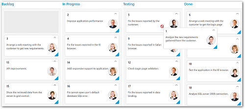

# Workflows 

Workflows can be defined to set the flow of card moving between the Kanban column statuses and it is applicable to drag and drop and context menu features.

You can set `WorkFlow` as array of Objects which consists of `Key` and `AllowedTransitions` properties. The `AllowedTransitions` accepts more than one transition of the specific column key mentioned in `Key` property.

If a card is to be dragged to not allowed transition columns , then not supported warning symbol will be displayed for denoting the error.
        
The following code example describes the above Workflow functionality.



    





    <ej:Kanban ID="KanbanBoard" runat="server" KeyField="Status">
       <WorkFlow>
            <ej:KanbanWorkFlow Key="Open"  AllowedTransitions="InProgress" />
            <ej:KanbanWorkFlow Key="InProgress"  AllowedTransitions="Testing,Close" />
        </WorkFlow>
        <Columns>
            <ej:KanbanColumn HeaderText="Backlog" Key="Open" />
            <ej:KanbanColumn HeaderText="In Progress" Key="InProgress" />
            <ej:KanbanColumn HeaderText="Testing" Key="Testing" />
            <ej:KanbanColumn HeaderText="Done" Key="Close" />
        </Columns>
        <Fields Content="Summary"/>
    </ej:Kanban>



The following output is displayed as a result of the above code example.

