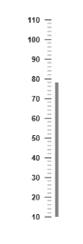
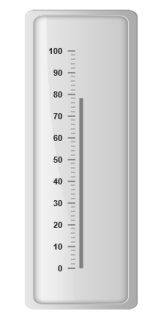
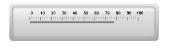

# Basic Settings

## Adding Dimension

* The basic customization for any control is setting the dimension. Here dimension refers the two major attributes, height and width. The height and width assigned in the control will render the canvas element in the given size. 
* The value attribute is used to set all pointer value in the Linear Gauge control. The attributes, minimum and maximum value are used to set the minimum value and maximum value for all the scales exist in the Linear Gauge control.



<%-- For Linear Gauge rendering-- %>

<%-- For setting Width, height and pointer value-- %>

<ej:LinearGauge runat="server" ID="PointerGauge" Value="78" Width="300" Height="500" >

<Scales>

<%-- For setting Minimum and Maximum value-- %>

<%-- Adding scale collection-- %>

<ej:Scales  Minimum="10" Maximum="110" BackgroundColor="transparent" ShowBarPointers="true" ShowMarkerPointers="false">

<Border Color="transparent" Width="0"></Border>

<%--Adding barpointer collection-- %>

<BarPointerCollection>

<ej:BarPointers Width="5" BarPointerBackgroundColor="grey"></ej:BarPointers>

</BarPointerCollection>

<%-- Adding Tick Collection-- %>

<TickCollection>

<ej:LinearTicks Type="MajorInterval" Width="2" Color="#8c8c8c">

<DistanceFromScale X="7" Y="0" />

</ej:LinearTicks>

<ej:LinearTicks Type="MinorInterval" Width="1" height="6" Color="#8c8c8c">

<DistanceFromScale X="7" Y="0" />

</ej:LinearTicks>

</TickCollection>

</ej:Scales>

</Scales></ej:LinearGauge>



Execute the above code to render the following output.

## Adding frame

* Frame is the element that decides the appearance of the Linear Gauge. You can customize it by using the object called frame. It contains frame inner width, frame outer width and frame background image URL properties. 
* The innerWidth of the frame defines the distance between the canvas element and the frame and the outerWidth refers to distance from the frame. backgroundUrl is used to set the background image for the frame.



<%-- For Linear Gauge rendering-- %>

<ej:LinearGauge runat="server" ID="PointerGauge" EnableAnimation="false" >

<Scales>

<ej:Scales  BackgroundColor="transparent" ShowBarPointers="true" ShowMarkerPointers="false">

<Border Color="transparent" Width="0"></Border>

<BarPointerCollection>

<ej:BarPointers BarPointerValue="78" Width="5" BarPointerBackgroundColor="grey"></ej:BarPointers>

</BarPointerCollection>

<TickCollection>

<ej:LinearTicks Type="MajorInterval" Width="2" Color="#8c8c8c">

<DistanceFromScale X="7" Y="0" />

</ej:LinearTicks>

<ej:LinearTicks Type="MinorInterval" Width="1" height="6" Color="#8c8c8c">

<DistanceFromScale X="7" Y="0" />

</ej:LinearTicks>

</TickCollection>

</ej:Scales>

</Scales>

<%-- setting Frame -- %>

<%-- For setting Frame innerwidth, outerwidth and background Image Url-- %>

<Frame InnerWidth="8" OuterWidth="10" BackgroundImageUrl="../Content/images/gauge/Gauge_linear_light.png" />

</ej:LinearGauge>



Execute the above code to render the following output. 

## Appearance

* The attribute orientation is used to render the Linear Gauges either in horizontal position or vertical position.You can set the background color for the Linear Gauge for better appearance using the backgroundColor property. borderColor specifies the border color of the Linear Gauge. You can also add gradient effects to Linear Gauge with the help of pointerGradient1 and pointerGradient2 attribute.
* Theme is the basic property of any control. It is used to set the theme for Linear Gauge. There are two types of themes used for Linear Gauge such as
* flatlight
* flatdark



<%-- For Linear Gauge rendering-- %>

<%-- For setting theme, orientation, labelcolor-- %>

<ej:LinearGauge runat="server" Orientation="Horizontal" LabelColor="black" ID="PointerGauge" Value="78" Width="400" Height="100" enableAnimation="false" Themes="flatLight" BackgroundColor="transparent">

<%-- For Adding Scales-- %>

<Scales>

<ej:Scales direction="Clockwise"  BackgroundColor="transparent" ShowBarPointers="true" ShowMarkerPointers="false" >

<Border Color="transparent" Width="0"></Border>

<%-- For Adding Bar Pointers-- %>

<BarPointerCollection>

<ej:BarPointers Width="5" BarPointerBackgroundColor="grey"></ej:BarPointers>

</BarPointerCollection>

<%-- For Adding Ticks-- %>

<TickCollection>

<ej:LinearTicks Type="MajorInterval" Width="2" Color="#8c8c8c">

<DistanceFromScale X="0" Y="0" />

</ej:LinearTicks>

<ej:LinearTicks Type="MinorInterval" Width="1" height="6" Color="#8c8c8c">

<DistanceFromScale X="0" Y="0" />

</ej:LinearTicks>

</TickCollection>

<%-- For Adding label pointers-- %>

<LabelCollection>

<ej:Labels Angle="90">

<DistanceFromScale X="5" Y="-5" />

</ej:Labels>

</LabelCollection>

</ej:Scales>

</Scales>

<Frame BackgroundImageUrl="../Content/images/gauge/Gauge_linear_light1.png" />

</ej:LinearGauge>



Execute the above code to render the following output.

## Responsive 

* For any display devices, the control is to be rendered based on the space in that device. The control must be responsive. For this purpose resizing property is present in Linear Gauge control. 
* The Linear Gauge renders with the specified value. When the browser changes its size, the canvas element checks the dimension with its parent element and if there are any changes in parent dimension, gauge control also changes the dimension based on its parent changes. You can enable this feature using IsResponsive property.



<%-- For Linear Gauge rendering-- %>

<%-- For enabling responsible layout-- %>

<ej:LinearGauge runat="server" Orientation="Horizontal" LabelColor="black" IsResponsive="true" ID="PointerGauge" Value="78" Width="400" Height="100" enableAnimation="false" Themes="flatLight" BackgroundColor="transparent">

<%-- For Adding Scale collection-- %>

<Scales>

<ej:Scales direction="Clockwise"  BackgroundColor="transparent" ShowBarPointers="true" ShowMarkerPointers="false" >

<Border Color="transparent" Width="0"></Border>

<%-- For Adding bar pointer collection-- %>

<BarPointerCollection>

<ej:BarPointers Width="5" BarPointerBackgroundColor="grey"></ej:BarPointers>

</BarPointerCollection>

<%-- For Adding tick collection-- %>

<TickCollection>

<ej:LinearTicks Type="MajorInterval" Width="2" Color="#8c8c8c">

<DistanceFromScale X="0" Y="0" />

</ej:LinearTicks>

<ej:LinearTicks Type="MinorInterval" Width="1" height="6" Color="#8c8c8c">

<DistanceFromScale X="0" Y="0" />

</ej:LinearTicks>

</TickCollection>

<%-- For Adding label collection-- %>

<LabelCollection>

<ej:Labels Angle="90">

<DistanceFromScale X="5" Y="-5" />

</ej:Labels>

</LabelCollection>

</ej:Scales>

</Scales>

<%-- For Adding Frame-- %>

<Frame BackgroundImageUrl="../Content/images/gauge/Gauge_linear_light1.png" />

</ej:LinearGauge>



Execute the above code to render the following output.

Responsiveness of the linear gauge is controlled by using `enableResize` property.



<%-- For Linear Gauge rendering-- %>

<%-- For enabling responsible layout-- %>

<ej:LinearGauge runat="server" Orientation="Horizontal" LabelColor="black" EnableResize="true" ID="PointerGauge" Value="78" Width="400" Height="100" enableAnimation="false" Themes="flatLight" BackgroundColor="transparent">

<%-- For Adding Scale collection-- %>

<Scales>

<ej:Scales direction="Clockwise"  BackgroundColor="transparent" ShowBarPointers="true" ShowMarkerPointers="false" >

<Border Color="transparent" Width="0"></Border>

<%-- For Adding bar pointer collection-- %>

<BarPointerCollection>

<ej:BarPointers Width="5" BarPointerBackgroundColor="grey"></ej:BarPointers>

</BarPointerCollection>

<%-- For Adding tick collection-- %>

<TickCollection>

<ej:LinearTicks Type="MajorInterval" Width="2" Color="#8c8c8c">

<DistanceFromScale X="0" Y="0" />

</ej:LinearTicks>

<ej:LinearTicks Type="MinorInterval" Width="1" height="6" Color="#8c8c8c">

<DistanceFromScale X="0" Y="0" />

</ej:LinearTicks>

</TickCollection>

<%-- For Adding label collection-- %>

<LabelCollection>

<ej:Labels Angle="90">

<DistanceFromScale X="5" Y="-5" />

</ej:Labels>

</LabelCollection>

</ej:Scales>

</Scales>

<%-- For Adding Frame-- %>

<Frame BackgroundImageUrl="../Content/images/gauge/Gauge_linear_light1.png" />

</ej:LinearGauge>



## Localization

**LinearGauge** supports localization for its axis labels and tooltip. To render the gauge with specific culture you have to refer the corresponding globalize culture script and need to specify the culture name in `locale` property of gauge.

**Enable Group Separator** is used to Convert the date object to string while using the locale settings, you can set `enableGroupSeparator` property as **true**.



<%-- For Linear Gauge rendering-- %>

<%-- For enabling responsible layout-- %>

<ej:LinearGauge runat="server" Locale="en-fr" Orientation="Horizontal" LabelColor="black" EnableGroupSeperator="true" ID="PointerGauge" Value="78" Width="400" Height="100" enableAnimation="false" Themes="flatLight" BackgroundColor="transparent">

</ej:LinearGauge>



