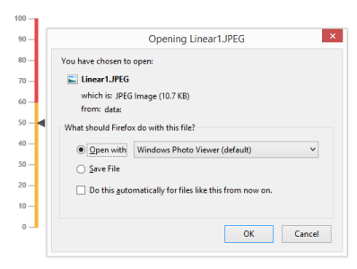

# Exporting

Linear Gauge has an exporting feature that converts Gauge control into image format and then export in client side. The method API exportImage is used to export the LinearGauge. It has two arguments such as file name and file format to specify the file name and file formats. For exporting refer the following code example.	





<asp:Button ID="Button1" runat="server" Text="Button" OnClientClick="buttonclickevent()" />

<ej:LinearGauge runat="server" ID="CoreExportGauge" Load="loadGaugeTheme" LabelColor="#8c8c8c">

<%-- For setting scales-- %>

<Scales>

<ej:Scales Width="4" ShowBarPointers="false" ShowRanges="true" Length="310">

<Border Color="transparent" Width="0"></Border>

<Position X="52" Y="50"/>

<%-- For setting Marker Pointers -- %>

<MarkerPointerCollection>

<ej:MarkerPointers Width="10" Length="10" Value="60" MarkerBackgroundColor="#4d4d4d">

<Border Color="#4d4d4d"></Border>

</ej:MarkerPointers>

</MarkerPointerCollection>

<%-- For setting labels-- %>

<LabelCollection>

<ej:Labels><DistanceFromScale X="-13"></DistanceFromScale>

</ej:Labels>

</LabelCollection>

<%-- For setting Ticks-- %>

<TickCollection>

<ej:LinearTicks Type="MajorInterval" Width="1" Color="#8c8c8c"/>

</TickCollection>

<%-- For setting range-- %>

<RangeCollection>

<ej:Ranges StartValue="0" EndValue="50" RangeBackgroundColor="#F6B53F" EndWidth="4" StartWidth="4"><Border Color="#F6B53F"></Border></ej:Ranges>

<ej:Ranges StartValue="50" EndValue="100" RangeBackgroundColor="#E94649" EndWidth="4" StartWidth="4"><Border Color="#E94649"></Border></ej:Ranges>

</RangeCollection>

</ej:Scales>

</Scales>

</ej:LinearGauge>









Execute the above code to render the following output.

