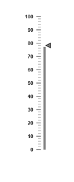

# Interaction and Animation

* Linear Gauge control contains Interaction feature. You can use this interaction feature to change the pointer values manually either by clicking or dragging the pointer over the Gauge. It dynamically changes the value of pointer when dragged. To Enable/Disable the user interaction you can use the readOnly Boolean property. The user interaction option is enabled when you set readOnly property as false. By default it holds the true value.
* Linear Gauge contains another attractive concept called Animation. The animation option enables the movement of the pointer from the minimum value to the current value. You can use animation option to change the pointer value dynamically. You can enable/ disable it using enableAnimation property. To enable animation, set enableAnimation to ‘true’. 
* By default it holds the true value. You can control the speed of the pointer during animating using animationSpeed. It is a numerical value that holds the time in milliseconds. That is when setting value is 1000, it is considered as 1 second.



<%-- For Linear Gauge rendering -- %>

<%-- For enable Animation, Animation speed and user interaction-- %>

<ej:LinearGauge runat="server" Value="78" ID="PointerGauge"  enableAnimation="true" AnimationSpeed="1000" ReadOnly="false">

<%-- For Adding Scale collection-- %>

<Scales>

<ej:Scales BackgroundColor="transparent" ShowBarPointers="true">

<Border Color="transparent" Width="0"></Border>

<%-- For Adding bar pointer collection-- %>

<BarPointerCollection>

<ej:BarPointers BarPointerValue="78" Width="5" BarPointerBackgroundColor="grey"></ej:BarPointers>

</BarPointerCollection>

<%-- For Adding Bar pointer Collection-- %>

<MarkerPointerCollection>

<ej:MarkerPointers width="10" Length="10"  MarkerBackgroundColor="grey" MarkerdistanceFromScale="-12"></ej:MarkerPointers>

</MarkerPointerCollection>

<%-- For Adding Tick collection-- %>

<TickCollection>

<ej:LinearTicks Type="MajorInterval" Width="2" Color="#8c8c8c">

<DistanceFromScale X="7" Y="0" />

</ej:LinearTicks>

<ej:LinearTicks Type="MinorInterval" Width="1" height="6" Color="#8c8c8c">

<DistanceFromScale X="7" Y="0" />

</ej:LinearTicks>

</TickCollection>

</ej:Scales>

</Scales>

</ej:LinearGauge>



Execute the above code to render the following output.

### Enable Marker Pointer Animation

Specifies the animate state for marker pointer, you can set `enableMarkerPointer`property as **true**



<%-- For Linear Gauge rendering -- %>

<%-- For enable Animation, Animation speed and user interaction-- %>

<ej:LinearGauge runat="server" Value="78" ID="PointerGauge"  enableAnimation="true" AnimationSpeed="1000" EnableMarkerPointer="true">

</ej:LinearGauge>

