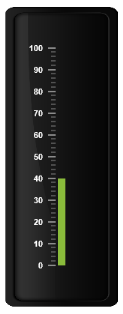
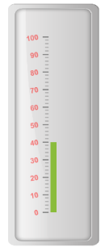
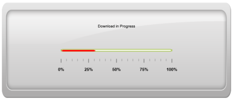

# Labels

Labels are units that are used to display the values in the scales. You can customize Labels with the properties like angle, color, font, opacity, etc.

## Adding label collection 

Label collection can be directly added to the scale object. Refer the following code example to add label collection in a gauge.



<%--For Setting Linear gauge-- %>

<ej:LinearGauge runat="server" ID="PointerGauge" Value="40" enableAnimation="false">

<Scales>

<ej:Scales BackgroundColor="transparent" ShowMarkerPointers="false" ShowCustomLabels="true" ShowBarPointers="true">

<Border Color="transparent" Width="0" />

<BarPointerCollection>

<ej:BarPointers Width="10"></ej:BarPointers>

</BarPointerCollection>

<%-- For Adding Label Collection-- %>

<%--Setting Label textcolor-- %>

<LabelCollection>

<ej:Labels TextColor="white"></ej:Labels>

</LabelCollection>

<TickCollection >

<ej:LinearTicks Type="MajorInterval" Width="2" Color="#8c8c8c" >

<DistanceFromScale X="7" Y="0" />

</ej:LinearTicks>

<ej:LinearTicks Type="MinorInterval" Width="1" height="6" Color="#8c8c8c" >

<DistanceFromScale X="7" Y="0" />

</ej:LinearTicks>

</TickCollection>

</ej:Scales>

</Scales>

<%-- For setting Frame Object-- %>

<Frame InnerWidth="8" OuterWidth="10" backgroundImageUrl="../Content/images/gauge/Gauge_linear_dark1.png" />

</ej:LinearGauge>



Execute the above code to render the following output.

## Label Customization

Appearance

* The attribute angle is used to display the labels in the specified angles and color attribute is used to display the labels in specified color. You can adjust the opacity of the label with the property opacity and the values of it lies between 0 and 1.The includeFirstValue is a special property by enabling this property, the first value of the label is not rendered.
* Font option is also available on the labels. The basic three properties of fonts such as size, family and style can be achieved by size, fontStyle and fontFamily. Labels are two types such as major and minor.Major type labels are for major interval values and minor type labels are for minor interval values.



<%--For Linear gauge rendering-- %>

<ej:LinearGauge runat="server" ID="PointerGauge" value="40" enableAnimation="false">

<Scales>

<ej:Scales BackgroundColor="transparent" ShowMarkerPointers="false" ShowCustomLabels="true" ShowBarPointers="true">

<Border Color="transparent" Width="0" />

<BarPointerCollection>

<ej:BarPointers Width="10"></ej:BarPointers>

</BarPointerCollection>

<%--Setting textcolor, angle, opacity and includeFirstValue-- %>

<LabelCollection>

<ej:Labels TextColor="red" Angle="10" Opacity="0.5" IncludeFirstValue="false">

</ej:Labels>

</LabelCollection>

<TickCollection >

<ej:LinearTicks Type="MajorInterval" Width="2" Color="#8c8c8c" >

<DistanceFromScale X="7" Y="0" />

</ej:LinearTicks>

<ej:LinearTicks Type="MinorInterval" Width="1" height="6" Color="#8c8c8c" >

<DistanceFromScale X="7" Y="0" />

</ej:LinearTicks>

</TickCollection>

</ej:Scales>

</Scales>

<%-- For adding frame object-- %>

<Frame InnerWidth="8" OuterWidth="10"

BackgroundImageUrl="../Content/images/gauge/Gauge_linear_light.png"/>

</ej:LinearGauge>



Execute the above code to render the following output.

## Unit text and Positioning

* The unitText property is used to add some text along with the labels. For example, in speedometer, you need to mention the units in kph. You can also add the unit text in front of the labels. To achieve this use the enumerable property unitTextPosition. 
* Labels can be positioned with the help of two properties such as distanceFromScale and placement. distanceFromScale property defines the distance between the scale and labels. Placement property is used to locate the labels with respect to scale either inside the scale or outside the scale or along the scale. It is an enumerable data type.



<%--For Linear Gauge rendering-- %>

<ej:LinearGauge runat="server" ID="PointerGauge" value="31" Width="600" height="250" enableAnimation="false" Themes="FlatLight" Orientation="Horizontal" labelColor="black" EnableResize="true">

<Scales>

<ej:Scales Width="5" Direction="Clockwise" Type="RoundedRectangle" MajorIntervalValue="25" MinorIntervalValue="5" BackgroundColor="white" ShowMarkerPointers="false" ShowCustomLabels="true" ShowBarPointers="true">

<Border Color="#AEC75F" Width="2" />

<BarPointerCollection>

<ej:BarPointers Width="4" BarPointerBackgroundColor="red"></ej:BarPointers>

</BarPointerCollection>

<%--Setting Label Collection-- %>

<LabelCollection>

<ej:Labels  Angle="90" UnitText="%">

<DistanceFromScale X="0" Y="60" />

</ej:Labels>

</LabelCollection>

<TickCollection >

<ej:LinearTicks Type="MajorInterval" Width="2" Color="#8c8c8c" >

<DistanceFromScale X="20" Y="0" />

</ej:LinearTicks>

<ej:LinearTicks Type="MinorInterval" Width="1" height="6" Color="#8c8c8c" >

<DistanceFromScale X="20" Y="0" />

</ej:LinearTicks>

</TickCollection>

<%-- For setting Custom label collection-- %>

<CustomLabelCollection>

<ej:CustomLabel Value="Download in Progress">

<Position X="49" Y="25" />

</ej:CustomLabel>

</CustomLabelCollection>

</ej:Scales>

</Scales>

<%-- For setting Frame Object-- %>

<Frame InnerWidth="8" OuterWidth="10"

BackgroundImageUrl="../Content/images/gauge/Gauge_linear_light1.png" />

</ej:LinearGauge>



Execute the above code to render the following output.

