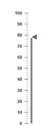
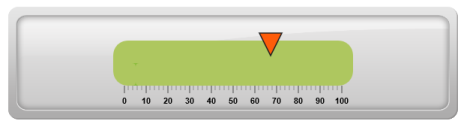
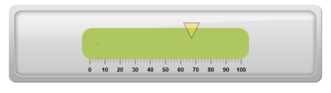
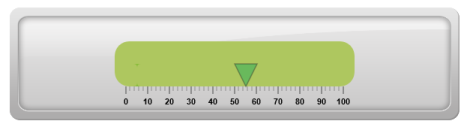
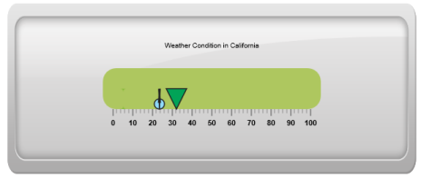

# Marker Pointers

Marker Pointer value points out the actual value set in the Linear Gauge. You can set values for various pointer attributes such as value, type, length, width, border and color in pointer collection. You can also customize the pointers to improve the appearance of gauge.__

## Adding marker pointer collection

You can add Marker Pointer collection directly to the scale object. To add pointer collection in a gauge control refer the following code example.  



<%-- For Linear Gauge rendering-- %>

<ej:LinearGauge runat="server" ID="PointerGauge" Value="78" EnableAnimation="false">

<%-- Adding Scale Collection-- %>

<Scales>

<ej:Scales  BackgroundColor="transparent" ShowBarPointers="true">

<Border Color="transparent" Width="0" />

<%-- Adding Bar Pointer Collection-- %>

<BarPointerCollection>

<ej:BarPointers Width="5" BarPointerBackgroundColor="grey" ></ej:BarPointers>

</BarPointerCollection>

<%-- Adding Marker Pointer Collection -- %>

<MarkerPointerCollection>

<ej:MarkerPointers Width="10" Length="10" MarkerBackgroundColor="grey" MarkerdistanceFromScale="-12"></ej:MarkerPointers>

</MarkerPointerCollection>

<TickCollection >

<ej:LinearTicks Type="MajorInterval" Width="2" Color="#8c8c8c" >

<DistanceFromScale X="7" Y="0" />

</ej:LinearTicks>

<ej:LinearTicks Type="MinorInterval" Width="1" height="6" Color="#8c8c8c" >

<DistanceFromScale X="7" Y="0" />

</ej:LinearTicks>

</TickCollection>

</ej:Scales>

</Scales>

</ej:LinearGauge>



Execute the above code to render the following output.

## Adding marker pointer value

The value property is the important element in the marker pointer collection which indicates the gauge value. Real purpose of the Linear Gauge is based on the pointer value. You can set the pointer value either directly during rendering the control or it can be achieved by public method.



<%-- For Linear Gauge rendering-- %>

<ej:LinearGauge runat="server" ID="PointerGauge" width="600" height="150" EnableAnimation="false" Orientation="Horizontal" LabelColor="black" IsResponsive="true">

<%-- Adding Scale Collection-- %>

<Scales>

<ej:Scales  Direction="Clockwise" Type="RoundedRectangle" BackgroundColor="#AEC75F" ShowBarPointers="true">

<Border Color="#AEC75F" Width="30" />

<BarPointerCollection>

<ej:BarPointers Width="5" BarPointerBackgroundColor="grey" >

</ej:BarPointers>

</BarPointerCollection>

<%-- Adding Marker Pointer Collection-- %>

<%-- For setting marker pointer value-- %>

<MarkerPointerCollection>

<ej:MarkerPointers Width="30" Value="67.5" MarkerBackgroundColor="#FE5C09" MarkerdistanceFromScale="20" Placement="near"></ej:MarkerPointers>

</MarkerPointerCollection>

<%-- For Adding Tick Collection-- %>

<TickCollection >

<ej:LinearTicks Type="MajorInterval" Width="2" Color="#8c8c8c" >

<DistanceFromScale X="-1" Y="45" />

</ej:LinearTicks>

<ej:LinearTicks Type="MinorInterval" Width="1" height="6" Color="#8c8c8c" >

<DistanceFromScale X="-1" Y="45" />

</ej:LinearTicks>

</TickCollection>

<%-- For Adding Label Collection-- %>

<LabelCollection>

<ej:Labels Angle="90">

<DistanceFromScale X="0" Y="100" />

</ej:Labels>

</LabelCollection>

</ej:Scales>

</Scales>

<%-- For Adding Frame Collection -- %>

<Frame BackgroundImageUrl="../Content/images/gauge/Gauge_linear_light1.png" />

</ej:LinearGauge>



Execute the above code to render the following output.

## Pointer Styles

Appearance

* Based on the value, the pointer points out the label value. You can set the pointer length and width using length and width property respectively. You can also adjust the opacity of the pointer using the opacity property which holds the value between 0 and 1. You can add the gradient effects to the pointer using gradient object. 
* The marker pointer border is modified with the border object. It contains two border property namely color and width which are used to customize the border color of the scale and border width of the marker pointer. The background color can be customized with attribute backgroundColor.



<%-- For Linear Gauge rendering-- %>

<ej:LinearGauge runat="server" ID="PointerGauge" width="600" height="150" EnableAnimation="false" Orientation="Horizontal" LabelColor="black" IsResponsive="true">

<Scales>

<ej:Scales  Direction="Clockwise" Type="RoundedRectangle" BackgroundColor="#AEC75F" ShowBarPointers="true">

<Border Color="#AEC75F" Width="30" />

<BarPointerCollection>

<ej:BarPointers Width="5" BarPointerBackgroundColor="grey" >

</ej:BarPointers>

</BarPointerCollection>

<%-- For setting Marker pointer length, width, opacity value and background Color-- %>

<MarkerPointerCollection>

<ej:MarkerPointers Width="30" Value="67.5" MarkerBackgroundColor="#FCDD34" MarkerdistanceFromScale="20" Placement="near" MarkerOpacity="0.4"></ej:MarkerPointers>

</MarkerPointerCollection>

<%-- For Adding Tick Collection-- %>

<TickCollection >

<ej:LinearTicks Type="MajorInterval" Width="2" Color="#8c8c8c" >

<DistanceFromScale X="-1" Y="45" />

</ej:LinearTicks>

<ej:LinearTicks Type="MinorInterval" Width="1" height="6" Color="#8c8c8c" >

<DistanceFromScale X="-1" Y="45" />

</ej:LinearTicks>

</TickCollection>

<%-- For Adding Label Collection-- %>

<LabelCollection>

<ej:Labels Angle="90">

<DistanceFromScale X="0" Y="100" />

</ej:Labels>

</LabelCollection>

</ej:Scales>

</Scales>

<%-- For Adding Frame Object-- %>

<Frame BackgroundImageUrl="../Content/images/gauge/Gauge_linear_light1.png" />

</ej:LinearGauge>



Execute the above code to render the following output.

## Positioning the pointer

* You can position the Pointer with two properties, distanceFromScale and placement. The distanceFromScale property defines the distance between the scale and pointer. 
* The Placement property is used to locate the pointer with respect to scale either inside or outside the scale or along the scale. It is an enumerable data type.



<%-- For Linear Gauge rendering-- %>

<ej:LinearGauge runat="server" ID="PointerGauge" width="600" height="150" EnableAnimation="false" Orientation="Horizontal" LabelColor="black" IsResponsive="true">

<%-- For Adding Scale Collection-- %>

<Scales>

<ej:Scales  Direction="Clockwise" Type="RoundedRectangle" BackgroundColor="#AEC75F" ShowBarPointers="true">

<Border Color="#AEC75F" Width="30" />

<%-- For Adding Bar Pointer Collection-- %>

<BarPointerCollection>

<ej:BarPointers Width="5" BarPointerBackgroundColor="grey" >

</ej:BarPointers>

</BarPointerCollection>

<%-- For Adding Marker Pointer Collection-- %>

<%-- For setting marker pointer placement and distance from scale-- %>

<MarkerPointerCollection>

<ej:MarkerPointers Width="30" Value="55.5" MarkerBackgroundColor="#01A357" MarkerdistanceFromScale="60" Placement="near" MarkerOpacity="0.4"></ej:MarkerPointers>

</MarkerPointerCollection>

<%-- For Adding Tick Collection-- %>

<TickCollection >

<ej:LinearTicks Type="MajorInterval" Width="2" Color="#8c8c8c" >

<DistanceFromScale X="-1" Y="45" />

</ej:LinearTicks>

<ej:LinearTicks Type="MinorInterval" Width="1" height="6" Color="#8c8c8c" >

<DistanceFromScale X="-1" Y="45" />

</ej:LinearTicks>

</TickCollection>

<%-- For Adding Label Collection-- %>

<LabelCollection>

<ej:Labels Angle="90">

<DistanceFromScale X="0" Y="100" />

</ej:Labels>

</LabelCollection>

</ej:Scales>

</Scales>

<%-- For Adding Frame Object-- %>

<Frame BackgroundImageUrl="../Content/images/gauge/Gauge_linear_light1.png" />

</ej:LinearGauge>



Execute the above code to render the following output.

## Types

It is possible to change the dimension of the marker pointer. Dimensions available for marker pointer are,

* Rectangle
* Triangle
* Ellipse
* Diamond
* Pentagon
* Circle
* Slider
* Pointer
* Wedge
* Trapezoid
* Rounded Rectangle

### Multiple Marker Pointers

Linear Gauge can contain multiple pointers on it. You can use any combination and any number of pointers in a gauge. That is, a gauge can contain any number of marker pointer and any number of bar pointers. Refer the following code example containing multiple marker pointers.



<%-- Render Linear Gauge-- %>

<ej:LinearGauge runat="server" ID="PointerGauge" width="600" height="250" EnableAnimation="false" Orientation="Horizontal" LabelColor="black" IsResponsive="true" Themes="FlatLight">

<%-- For setting Scale Collection-- %>

<Scales>

<ej:Scales  Direction="Clockwise" Type="RoundedRectangle" BackgroundColor="#AEC75F" ShowCustomLabels="true" ShowBarPointers="true">

<Border Color="#AEC75F" Width="30" />

<BarPointerCollection>

<ej:BarPointers Width="5" BarPointerBackgroundColor="grey" >

</ej:BarPointers>

</BarPointerCollection>

<%-- For setting marker pointer1 -- %>

<MarkerPointerCollection>

<ej:MarkerPointers Width="30" Value="32.2" MarkerBackgroundColor="#01A357" MarkerdistanceFromScale="60" Placement="near"></ej:MarkerPointers>

<%-- For setting marker pointer2 -- %>

<ej:MarkerPointers Width="3" Value="23.7" MarkerBackgroundColor="#90DAFB" Type="circle" MarkerdistanceFromScale="60" Placement="near"></ej:MarkerPointers>

<%-- For setting marker pointer3-- %>

<ej:MarkerPointers Width="3" Value="23.7" MarkerBackgroundColor="#90DAFB" Type="star" MarkerdistanceFromScale="60" Placement="near"></ej:MarkerPointers>

</MarkerPointerCollection>

<%-- For setting Tick Collection-- %>

<TickCollection >

<ej:LinearTicks Type="MajorInterval" Width="2" Color="#8c8c8c" >

<DistanceFromScale X="45" Y="0" />

</ej:LinearTicks>

<ej:LinearTicks Type="MinorInterval" Width="1" height="6" Color="#8c8c8c" >

<DistanceFromScale X="45" Y="0" />

</ej:LinearTicks>

</TickCollection>

<LabelCollection>

<ej:Labels Angle="90">

<DistanceFromScale X="0" Y="100" />

</ej:Labels>

</LabelCollection>

<%-- For setting Custom Label Collection-- %>

<CustomLabelCollection>

<ej:CustomLabel Value="Weather Condition in California">

<Position X="49" Y="20" />

</ej:CustomLabel>

</CustomLabelCollection>

</ej:Scales>

</Scales>

<Frame BackgroundImageUrl="../Content/images/gauge/Gauge_linear_light1.png" />

</ej:LinearGauge>



Execute the above code to render the following output.

