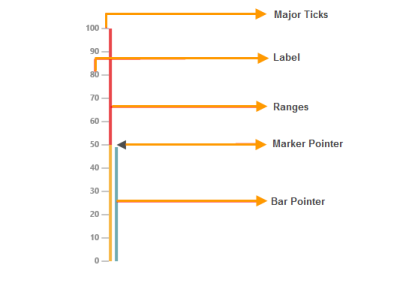

# Overview

The Gauge control for Essential Studio displays numerical information in the form of a scale that can be customized and oriented either vertically or horizontally. It comprises the following basic elements:

* Scales
* Pointers: bars and markers
* Ticks
* Labels
* Ranges

{:.image }

Three basic scale designs available are : rectangle, rounded rectangle, and thermometer.

Key Features

* Interaction: Allows you to directly interact with pointers on a gauge.
* Indicators: Indicate the state of a gauge either active or inactive.
* Ranges: Highlight the range of values on a gauge.
* Pointers: Allows you to add multiple pointers like bar pointers and marker pointers to a gauge.
* Scale Direction: Allows you to set scales direction either horizontally or vertically.
* Animation: Supports animation effects for pointers.
* Custom Labels: Allows you to add custom label text on any part of a gauge.
* Scale Styles: Three basic styles of scales are supported: rectangle, rounded rectangle, and thermometer.

