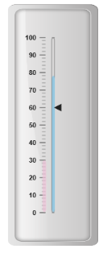
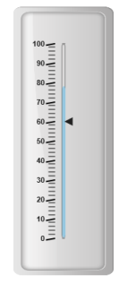
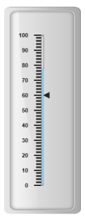
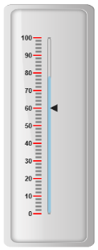

# Ticks

Ticks are used to mark some values on the scale. Based on the tick’s value you can set the labels on the required position.

## Adding tick collection 

Tick collection can be directly added to the scale object. Refer the following code example to add tick collection in a Linear Gauge control.



<%--For Linear Gauge rendering-- %>

<ej:LinearGauge runat="server" ID="PointerGauge" Value="78" EnableAnimation="false" ReadOnly="false">

<Scales>

<ej:Scales Width="5" BackgroundColor="transparent" Type="RoundedRectangle" ShowBarPointers="true">

<Border Color="grey" Width="1" />

<%-- For adding marker pointer collection-- %>

<MarkerPointerCollection>

<ej:MarkerPointers Width="10" length="10" Value="60"></ej:MarkerPointers>

</MarkerPointerCollection>

<%-- For adding bar pointer collection-- %>

<BarPointerCollection>

<ej:BarPointers Width="5" BarPointerBackgroundColor="#95C7E0">

</ej:BarPointers>

<ej:BarPointers Width="6" BarPointerBackgroundColor="#EDC1D7" BarPointerdistanceFromScale="-15" BarPointerValue="30" BarPointerOpacity="0.7">

</ej:BarPointers>

</BarPointerCollection>

<%--Setting Ticks type, width, color and placement-- %>

<TickCollection >

<ej:LinearTicks Type="MajorInterval" Width="2" Color="#8c8c8c" Placement="near" >

<DistanceFromScale X="-12" Y="0" />

</ej:LinearTicks>

<ej:LinearTicks Type="MinorInterval" Width="1" height="6" Color="#8c8c8c" Placement="near" >

<DistanceFromScale X="-12" Y="0" />

</ej:LinearTicks>

</TickCollection>

<LabelCollection>

<ej:Labels>

<DistanceFromScale X="-25" Y="0" />

</ej:Labels>

</LabelCollection>

</ej:Scales>

</Scales>

<%-- For setting Frame Object-- %>

<Frame BackgroundImageUrl="../Content/images/gauge/Gauge_linear_light.png" />

</ej:LinearGauge>



Execute the above code to render the following output.

## Tick Customization

### Appearance

* Height and width of the ticks can be applied by using the properties height and width. You can customize ticks with the properties like angle, color, etc. angle attribute is used to display the labels in the specified angles and color attribute is used to display the labels in specified color. 
* Ticks are two types such as major and minor. The opacity of the labels can be adjusted with the property opacity. The opacity values lies between 0 and 1.



<%--For Linear gauge rendering-- %>

<ej:LinearGauge runat="server" ID="PointerGauge" Value="78" EnableAnimation="false" ReadOnly="false">

<%-- For Adding scales-- %>

<Scales>

<ej:Scales Width="5" BackgroundColor="transparent" Type="RoundedRectangle" ShowBarPointers="true">

<Border Color="grey" Width="1" />

<MarkerPointerCollection>

<ej:MarkerPointers Width="10" length="10" Value="60"></ej:MarkerPointers>

</MarkerPointerCollection>

<BarPointerCollection>

<ej:BarPointers Width="5" BarPointerBackgroundColor="#95C7E0">

</ej:BarPointers>

</BarPointerCollection>

<%-- For Adding ticks-- %>

<%--Setting tick type, width, height, color and placement-- %>

<TickCollection >

<ej:LinearTicks Type="MajorInterval" Width="2" Height="14" Angle="10" Color="black" Placement="near" >

<DistanceFromScale X="-10" Y="0" />

</ej:LinearTicks>

<ej:LinearTicks Type="MinorInterval" Width="1" height="10" Opacity="0.5" Color="black" Placement="near" >

<DistanceFromScale X="-10" Y="0" />

</ej:LinearTicks>

</TickCollection>

<LabelCollection>

<ej:Labels>

<DistanceFromScale X="-25" Y="0" />

</ej:Labels>

</LabelCollection>

</ej:Scales>

</Scales>

<%-- For Adding frame object-- %>

<Frame InnerWidth="8" OuterWidth="10" BackgroundImageUrl="../Content/images/gauge/Gauge_linear_light.png" />

</ej:LinearGauge>



Execute the above code to render the following output.

## Types

Ticks are two types such as majorInterval and minorInterval. Major type ticks are for major interval values and minor type ticks are for minor interval values.



<%--For Setting Linear gauge-- %>

<ej:LinearGauge runat="server" ID="PointerGauge" Value="78" EnableAnimation="false" ReadOnly="false">

<Scales>

<ej:Scales Width="5" BackgroundColor="transparent" Type="RoundedRectangle" ShowBarPointers="true">

<Border Color="grey" Width="1" />

<%-- For setting Marker pointer collection-- %>

<MarkerPointerCollection>

<ej:MarkerPointers Width="10" length="10" Value="60"></ej:MarkerPointers>

</MarkerPointerCollection>

<%-- For setting Bar Pointer Collection-- %>

<BarPointerCollection>

<ej:BarPointers Width="5" BarPointerBackgroundColor="#95C7E0">

</ej:BarPointers>

</BarPointerCollection>

<%--Setting Tick type, width, color and placement-- %>

<TickCollection >

<ej:LinearTicks Type="MajorInterval" Width="2" Height="14" Color="black" Placement="near" >

</ej:LinearTicks>

<ej:LinearTicks Type="MinorInterval">

</ej:LinearTicks>

</TickCollection>

<LabelCollection>

<ej:Labels>

<DistanceFromScale X="-25" Y="0" />

</ej:Labels>

</LabelCollection>

</ej:Scales>

</Scales>

<Frame InnerWidth="8" OuterWidth="10"

BackgroundImageUrl="../Content/images/gauge/Gauge_linear_light.png" />

</ej:LinearGauge>



Execute the above code to render the following output.

## Positioning the ticks

* You can position ticks with the help of two properties such as distanceFromScale and placement. The property distanceFromScale defines the distance between the scale and ticks. 
* Placement property is used to locate the ticks with respect to scale either inside the scale or outside the scale or along the scale. It is an enumerable data type.



<%--For Linear Gauge rendering-- %>

<ej:LinearGauge runat="server" ID="PointerGauge" Value="78" EnableAnimation="false" ReadOnly="false">

<%-- For adding scale collection-- %>

<Scales>

<ej:Scales Width="5" BackgroundColor="transparent" Type="RoundedRectangle" ShowBarPointers="true">

<Border Color="grey" Width="1" />

<MarkerPointerCollection>

<ej:MarkerPointers Width="10" length="10" Value="60"></ej:MarkerPointers>

</MarkerPointerCollection>

<BarPointerCollection>

<ej:BarPointers Width="5" BarPointerBackgroundColor="#95C7E0">

</ej:BarPointers>

</BarPointerCollection>

<%--Setting tick placement-- %>

<TickCollection >

<ej:LinearTicks Type="MajorInterval" Width="2" Height="14" Color="red" Placement="near" >

<DistanceFromScale X="-10" Y="0" />

</ej:LinearTicks>

<ej:LinearTicks Type="MinorInterval" Color="grey">

<DistanceFromScale X="-10" Y="0" />

</ej:LinearTicks>

</TickCollection>

<%-- For Adding label collection-- %>

<LabelCollection>

<ej:Labels>

<DistanceFromScale X="-25" Y="0" />

</ej:Labels>

</LabelCollection>

</ej:Scales>

</Scales>

<Frame InnerWidth="8" OuterWidth="10" BackgroundImageUrl="../Content/images/gauge/Gauge_linear_light.png" />

</ej:LinearGauge>



Execute the above code to render the following output.

