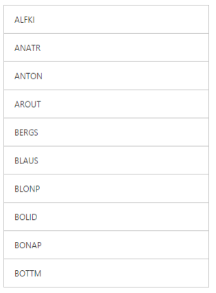
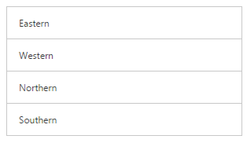
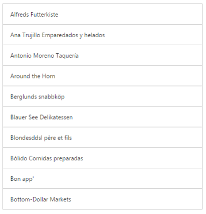

# Data Binding

### Local Data Binding

**Essential Studio Web ASP ListView** provides support for **Data Binding**. **Data Binding** provides a simple and consistent way for applications to present and interact with data. Elements can be bounded to data from a variety of data sources. In local data binding, the data source is written inside the program. Then it is handled by the **ListView** control. **DataSource** is used to get the **data source** that holds the list items.

You can use the following code example to give you the exact output.



<ej:ListView ID="ListView1"   Height="450" Width="400"  DataTextField="text" runat="server" >
  
 </ej:ListView>
 


In code behind:


protected void Page_Load(object sender, EventArgs e)
        {

            this.ListView1.DataSource = new LocalData().GetDataItems().ToList();

        }
        public class LocalData
        {
            public LocalData(string _text)
            {

                this.Text = _text;

            }

            public LocalData() { }

            public string Text
            {

                get;

                set;

            }

            public List<LocalData> GetDataItems()
            {

                List<LocalData> data = new List<LocalData>();
                data.Add(new LocalData("Algeria"));
                data.Add(new LocalData("Armenia"));
                data.Add(new LocalData("Bangladesh"));
                data.Add(new LocalData("Cuba"));
                data.Add(new LocalData("Denmark"));
                data.Add(new LocalData("Egypt"));
                data.Add(new LocalData("Finland"));
                data.Add(new LocalData("India"));
                data.Add(new LocalData("Malaysia"));
                data.Add(new LocalData("New Zealand"));
                data.Add(new LocalData("Norway"));
                data.Add(new LocalData("Poland"));
                data.Add(new LocalData("Romania"));
                data.Add(new LocalData("Singapore"));
                data.Add(new LocalData("Thailand"));
                data.Add(new LocalData("Ukraine"));

                return data;

            }
 }



Run the code to get the following output

 

## Remote Data Binding

**Essential Studio Web ASP ListView** provides support for **Remote Data Binding**.

### OData

OData is a standardized protocol for creating and consuming data. You can provide the [OData service](http://www.odata.org/) URL directly to the Datasource URL property or can give it in the DataManager.



  <ej:ListView ID="List" runat="server" ShowHeader="false" Width="400" Height="450" Query="ej.Query().from('Customers').take(10)" DataTextField="CustomerID" >
                <DataManager URL="http://js.syncfusion.com/ejservices/Wcf/Northwind.svc/" CrossDomain="true" />           
            </ej:ListView>



Run the code to get the following output

### OData4

ODataV4Adaptor is used for consuming data from OData V4 Service. To consume OData service, set the service link to the Url property and set adaptor type as **ODataAdaptor** to the Adaptor Property of DataManager and then you can assign it to ListView **DataSource**.



   <ej:ListView ID="ListView1" runat="server"  Width="400" Height="450" Query="ej.Query()" DataTextField="RegionDescription" >
                <DataManager URL="http://services.odata.org/V4/Northwind/Northwind.svc/Regions/" Adaptor="ODataV4Adaptor" CrossDomain="true" />           
            </ej:ListView>



Run the code to get the following output.

### WebAPI Adaptor

WebAPI Adaptor that is extended from ODataAdaptor, is used for consuming data from WebApi Service.To consume Web API service, set the service link to the Url property and set the adaptor type as **WebApiAdaptor** to the Adaptor Property of ListView **DataManager**.

You can use the following code example to use WebAPI adaptor.



<ej:ListView ID="ListView1" runat="server"  Width="400" Height="450" Query="ej.Query().from('Customers').take(10)" DataTextField="CompanyName" >
                <DataManager URL="http://js.syncfusion.com/ejServices/wcf/NorthWind.svc/" Adaptor="WebApiAdaptor" CrossDomain="true" />           
            </ej:ListView>


Run the code to get the following output.

## FieldSettings

The `FieldSettings` property is used to map the **DataSource** field with the list item fields. In addition to the list [item specific properties](/aspnet/listview/grouped-list), the following fields are available while mapping.

_FieldSettings_

<table>
<tr>
<td>
<b>Properties</b></td><td>
<b>Definition</b></td></tr>
<tr>
<td>
ParentPrimaryKey</td><td>
In DB, you can relate any child item to some other item. Set here is ‘<b>PrimaryKey’</b> for the parent item. Here ‘<b>ParentPrimaryKey’</b> defines the ‘<b>PrimaryKey’</b> of some parent item to identify its parent.</td></tr>
<tr>
<td>
Attributes</td><td>
In DB, you can define your desired class name or styles for the list item through the ‘<b>Attributes’</b> field.</td></tr>
</table>

Please refer the following code examples.



    <ej:ListView ID="ListView"   Height="450" Width="400" ShowHeader="true" HeaderTitle="Favourite" DataPrimaryKeyField="primaryKeys" DataTextField="text" DataParentPrimaryKeyField="parentPrimaryKeyss" DataChildHeaderTitleField="Title" DataChildHeaderBackButtonTextField="BackIconText"  runat="server" >
    
   </ej:ListView>
   
   


Run the code to get the following output

 

When you click on the parent item, it navigates to its corresponding child list item as follows.

 

