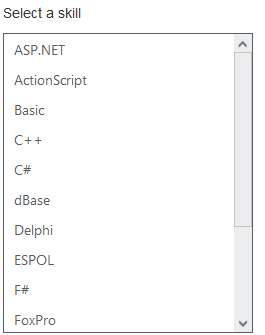
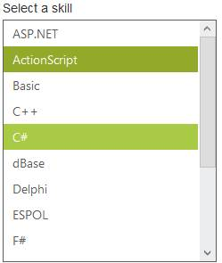
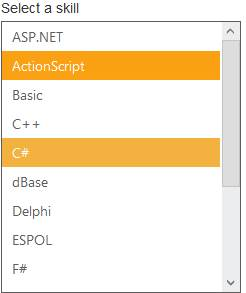
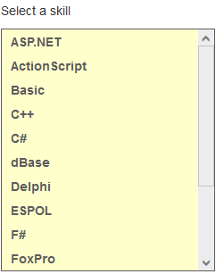

# Appearance and Styling

## Adjusting ListBox size

### Width

ListBox widget provides you support to customize the dimensions of the ListBox. By using Width property you can set the width of the ListBox. Its data type is string.

### Height

ListBox widget provides you support to customize the dimensions of the ListBox. By using Height property, you can set the height of the ListBox. Its data type is string.

### Defining the ListBox size properties

The following steps explains you the configuration of Height & Width properties in ListBox.

In an ASPX page, add an element to configure ListBox.



    

        Select a skill

    <ej:listbox id="listboxsample" Width="240" Height="302" DataTextField="Name" runat="server"></ej:listbox>





        protected void Page_Load(object sender, EventArgs e)

        {

            listboxsample.DataSource = GetData();

        }

        private List<Languages> GetData()

        {

            List<Languages> data = new List<Languages>();

            data.Add(new Languages() { Name = "ASP.NET" });

            data.Add(new Languages() { Name = "ActionScript" });

            data.Add(new Languages() { Name = "Basic" });

            data.Add(new Languages() { Name = "C++" });

            data.Add(new Languages() { Name = "C#" });

            data.Add(new Languages() { Name = "dBase" });

            data.Add(new Languages() { Name = "Delphi" });

            data.Add(new Languages() { Name = "ESPOL" });

            data.Add(new Languages() { Name = "F#" });

            data.Add(new Languages() { Name = "FoxPro" });

            data.Add(new Languages() { Name = "Java" });

            data.Add(new Languages() { Name = "J#" });

            data.Add(new Languages() { Name = "Lisp" });

            data.Add(new Languages() { Name = "Logo" });

            data.Add(new Languages() { Name = "PHP" });

            return data;

        }

        public class Languages

        {

            public string Name;

        }



Output of the above steps

 

### Enabling Rounded corner

ListBox widget provides you support to change the appearance of ListBox. By using ShowRoundedCorner,you can create a rounded corner on the ListBox. Its data type is Boolean.

The following steps explain you the configuration of Rounded corner of the ListBox.

In an ASPX page, add an elementto configure ListBox.



    

        Select a skill

    <ej:listbox id="listboxsample" ShowRoundedCorner="true" DataTextField=" Name" runat="server"></ej:listbox>





        protected void Page_Load(object sender, EventArgs e)

        {

            listboxsample.DataSource = GetData();

        }

        private List<Languages> GetData()

        {

            List<Languages> data = new List<Languages>();

            data.Add(new Languages() { Name = "ASP.NET" });

            data.Add(new Languages() { Name = "ActionScript" });

            data.Add(new Languages() { Name = "Basic" });

            data.Add(new Languages() { Name = "C++" });

            data.Add(new Languages() { Name = "C#" });

            data.Add(new Languages() { Name = "dBase" });

            data.Add(new Languages() { Name = "Delphi" });

            data.Add(new Languages() { Name = "ESPOL" });

            data.Add(new Languages() { Name = "F#" });

            data.Add(new Languages() { Name = "FoxPro" });

            data.Add(new Languages() { Name = "Java" });

            data.Add(new Languages() { Name = "J#" });

            data.Add(new Languages() { Name = "Lisp" });

            data.Add(new Languages() { Name = "Logo" });

            data.Add(new Languages() { Name = "PHP" });

            return data;

        }

        public class Languages

        {

            public string Name;

        }



Output of the above steps.

 

## Theme

ListBox control’s style and appearance can be controlled based on CSS classes. In order to apply styles to the ListBox control, you can refer to two files namely, ej.widgets.core.min.css and ej.theme.min.css. When you refer to the file ej.widgets.all.min.css, it is not necessary to include the files ej.widgets.core.min.css and ej.theme.min.css in your project, as ej.widgets.all.min.css is the combination of these two. 

By default, there are 13 themes support available for ListBox control namely,

* default-theme
* flat-azure-dark
* fat-lime
* flat-lime-dark
* flat-saffron
* flat-saffron-dark
* gradient-azure
* gradient-azure-dark
* gradient-lime
* gradient-lime-dark
* gradient-saffron
* gradient-saffron-dark
* bootstrap-theme

The following screenshot illustrates the ListBox with Flat-lime and Flat-Saffron built-in themes.

 

 

## Custom class with ListBox 

CSS class can be used to customize the ListBox control appearance. Define a CSS class as per your requirement and assign the class name to CssClass property. The data type of CssClass property is string. 

### Configuring the Custom CSS property

The following steps explains you the configuration of CssClassproperties in ListBox.

In an ASPX page, add an elementto configure ListBox.



    

        Select a skill

    <ej:listbox id="listboxsample" CssClass="customclass" DataTextField="Name" runat="server"></ej:listbox>





        protected void Page_Load(object sender, EventArgs e)

        {

            listboxsample.DataSource = GetData();

        }

        private List<Languages> GetData()

        {

            List<Languages> data = new List<Languages>();

            data.Add(new Languages() { Name = "ASP.NET" });

            data.Add(new Languages() { Name = "ActionScript" });

            data.Add(new Languages() { Name = "Basic" });

            data.Add(new Languages() { Name = "C++" });

            data.Add(new Languages() { Name = "C#" });

            data.Add(new Languages() { Name = "dBase" });

            data.Add(new Languages() { Name = "Delphi" });

            data.Add(new Languages() { Name = "ESPOL" });

            data.Add(new Languages() { Name = "F#" });

            data.Add(new Languages() { Name = "FoxPro" });

            data.Add(new Languages() { Name = "Java" });

            data.Add(new Languages() { Name = "J#" });

            data.Add(new Languages() { Name = "Lisp" });

            data.Add(new Languages() { Name = "Logo" });

            data.Add(new Languages() { Name = "PHP" });

            return data;

        }

        public class Languages

        {

            public string Name;

        }



Configure the CSS styles to apply on ListBox.



    .customclass {

        background-color: #FFFFCC;

        font-weight: bold;

        font-family: sans-serif;

    }



Output of the above steps.

 

