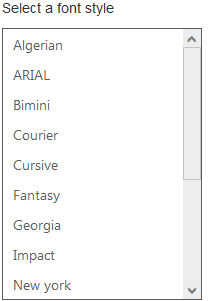
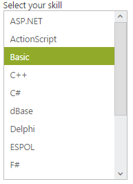

# Behaviour Settings

The following are some miscellaneous properties that helps you to change the behaviour of ListBox control.

## Target ID

You can append a list with ListBox by using targetId property. Define a <ul>, < li> tag that you want to display on ListBox and then set the id of parent <ul> tag to targetId property. And its data type is string. 

The following steps explains you the configuration of targetID property in ListBox.

In an ASPX page, add an element to configure ListBox.



        

            Select a font style

        <ej:listbox id="listboxsample" TargetID="targetlist" runat="server" Width="240"></ej:listbox>

        <ul id="targetlist">

            <li>Algerian</li>

            <li>ARIAL</li>

            <li>Bimini</li>

            <li>Courier</li>

            <li>Cursive</li>

            <li>Fantasy</li>

            <li>Georgia</li>

            <li>Impact</li>

            <li>New york</li>

            <li>Sans-Serif</li>

            <li>Scripts</li>

            <li>Times</li>

            <li>Times New Roman</li>

            <li>Verdana</li>

            <li>Western</li>

            <li>Zapfellipt bt</li>

        </ul>

    



Output of the above steps.

 

## Select the value by index 

ListBox widget provides you support to select an item by mentioning the index of the item. The SelectedItemIndex property helps you to select the particular item from the list. Its date type is number. 

The following steps explains you the configuration of SelectedItemIndex property in ListBox.

In an ASPX page, add an element to configure ListBox.



    protected void Page_Load(object sender, EventArgs e)

    {

        listboxsample.DataSource = GetData();

    }

    private List<Languages> GetData()

    {

        List<Languages> data = new List<Languages>();

        data.Add(new Languages() { Name = "ASP.NET" });

        data.Add(new Languages() { Name = "ActionScript" });

        data.Add(new Languages() { Name = "Basic" });

        data.Add(new Languages() { Name = "C++" });

        data.Add(new Languages() { Name = "C#" });

        data.Add(new Languages() { Name = "dBase" });

        data.Add(new Languages() { Name = "Delphi" });

        data.Add(new Languages() { Name = "ESPOL" });

        data.Add(new Languages() { Name = "F#" });

        data.Add(new Languages() { Name = "FoxPro" });

        data.Add(new Languages() { Name = "Java" });

        data.Add(new Languages() { Name = "J#" });

        data.Add(new Languages() { Name = "Lisp" });

        data.Add(new Languages() { Name = "Logo" });

        data.Add(new Languages() { Name = "PHP" });

        return data;

    }

    public class Languages

    {

        public string Name;

    }





    

        Select your skill

<ej:listbox id="listboxsample" DataTextField="Name" SelectedItemIndex="2" runat="server" Width="240"></ej:listbox>



Output of the above steps.

 

## Enable or Disable the ListBox Control

This features enables you to set the enable or disable options for ListBox by setting Boolean type value to Enabled property. 

The following steps explains you the configuration of Enabled property in ListBox.

In an ASPX page, add an element to configure ListBox.



    

        Select a skill

    <ej:listbox id="listboxsample" DataTextField="Name" Enabled="false" runat="server" Width="240"></ej:listbox>





protected void Page_Load(object sender, EventArgs e)

        {

            listboxsample.DataSource = GetData();

        }

        private List<Languages> GetData()

        {

            List<Languages> data = new List<Languages>();

            data.Add(new Languages() { Name = "ASP.NET" });

            data.Add(new Languages() { Name = "ActionScript" });

            data.Add(new Languages() { Name = "Basic" });

            data.Add(new Languages() { Name = "C++" });

            data.Add(new Languages() { Name = "C#" });

            data.Add(new Languages() { Name = "dBase" });

            data.Add(new Languages() { Name = "Delphi" });

            data.Add(new Languages() { Name = "ESPOL" });

            data.Add(new Languages() { Name = "F#" });

            data.Add(new Languages() { Name = "FoxPro" });

            data.Add(new Languages() { Name = "Java" });

            data.Add(new Languages() { Name = "J#" });

            data.Add(new Languages() { Name = "Lisp" });

            data.Add(new Languages() { Name = "Logo" });

            data.Add(new Languages() { Name = "PHP" });

            return data;

        }

        public class Languages

        {

            public string Name;

        }



Output of the above steps.

 

