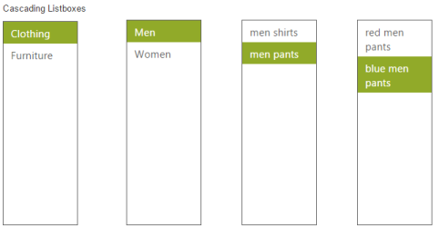

# Cascading Support 

By using cascade option, you can create a behaviour of cascade between ListBox controls. For this, create a database with single field that is common between two ListBox data fields and then mention that column id in value field. With this, you can set second ListBox id in CascadeTo property in first ListBox. 

In the following code example, in the first and second ListBox, "categoryid" is the common field. 

The "categoryid" value of the selected item in the First Listbox that matches with "categoryid" value in the second Listbox is retreived and the item is loaded.

N> In case the second ListBox is to be disabled, until the first one is selected, you can set enable property as false in second ListBox that enables automatically once the value is selected in first one. 

You can add any number of cascading ListBoxes. For this, create a Datasource with single field value that is common between the two consecutive cascading ListBoxes and cascading is achieved based on that common field.”  

The following steps explains you the behaviour of cascade ListBox. 

In an ASPX page, add an elementto configure ListBox.



    

        <h6>

            Cascading Listboxes</h6>

        <ej:ListBox ID="groupsList" DataValueField="CategoryId" DataTextField="Text" CascadeTo="MainContent_subcategoryList" runat="server">

        </ej:ListBox>

    

    

        <ej:ListBox ID="subcategoryList" CascadeTo="MainContent_productList" DataValueField="SubcategoryId" DataTextField="Text" Enabled="false" runat="server">

        </ej:ListBox>

    

    

        <ej:ListBox ID="productList" CascadeTo="MainContent_subproductList" DataValueField="ProductId" DataTextField="Text" Enabled="false" runat="server">

        </ej:ListBox>

    

    

        <ej:ListBox ID="subproductList" DataValueField="ProductId" DataTextField="Text" Enabled="false" runat="server">

        </ej:ListBox>

    





    protected void Page_Load(object sender, EventArgs e)

    {

        groupsList.DataSource = GetGroup();

        subcategoryList.DataSource = GetCategory();

        productList.DataSource = GetSubCategory();

        subproductList.DataSource = GetSubProduct();

    }

    private List<Groups> GetGroup()

    {

        List<Groups> datas = new List<Groups>();

        datas.Add(new Groups() { CategoryId = "a", Text = "Clothing" });

        datas.Add(new Groups() { CategoryId = "b", Text = "Furniture" });

        return datas;

    }

    private List<Category> GetCategory()

    {

        List<Category> datas = new List<Category>();

        datas.Add(new Category() { SubcategoryId = 11, CategoryId = "a", Text = "Men" });

        datas.Add(new Category() { SubcategoryId = 12, CategoryId = "a", Text = "Women" });

        datas.Add(new Category() { SubcategoryId = 13, CategoryId = "b", Text = "Home furniture" });

        datas.Add(new Category() { SubcategoryId = 14, CategoryId = "b", Text = "Bedding" });

        return datas;

    }

    private List<SubCategory> GetSubCategory()

    {

        List<SubCategory> datas = new List<SubCategory>();

        datas.Add(new SubCategory() { ProductId = 101, SubcategoryId = 11, Text = "men shirts" });

        datas.Add(new SubCategory() { ProductId = 102, SubcategoryId = 11, Text = "men pants" });

        datas.Add(new SubCategory() { ProductId = 103, SubcategoryId = 12, Text = "Women shirts" });

        datas.Add(new SubCategory() { ProductId = 104, SubcategoryId = 12, Text = "Women pants" });

        datas.Add(new SubCategory() { ProductId = 105, SubcategoryId = 13, Text = "sofa" });

        datas.Add(new SubCategory() { ProductId = 106, SubcategoryId = 13, Text = "chairs" });

        datas.Add(new SubCategory() { ProductId = 107, SubcategoryId = 14, Text = "bedsheets" });

        datas.Add(new SubCategory() { ProductId = 108, SubcategoryId = 14, Text = "pillows" });

        return datas;

    }

    private List<SubProduct> GetSubProduct()

    {

        List<SubProduct> datas = new List<SubProduct>();

        datas.Add(new SubProduct() { ProductId = 101, Text = "red men shirts" });

        datas.Add(new SubProduct() { ProductId = 101, Text = "blue men shirts" });

        datas.Add(new SubProduct() { ProductId = 102, Text = "red men pants" });

        datas.Add(new SubProduct() { ProductId = 102, Text = "blue men pants" });

        datas.Add(new SubProduct() { ProductId = 103, Text = "blueWomen shirts" });

        datas.Add(new SubProduct() { ProductId = 103, Text = "red Women shirts" });

        datas.Add(new SubProduct() { ProductId = 104, Text = "red women pants" });

        datas.Add(new SubProduct() { ProductId = 104, Text = "blue women pants" });

        datas.Add(new SubProduct() { ProductId = 105, Text = "red sofa" });

        datas.Add(new SubProduct() { ProductId = 105, Text = "blue sofa" });

        datas.Add(new SubProduct() { ProductId = 106, Text = "red chairs" });

        datas.Add(new SubProduct() { ProductId = 106, Text = "blue chairs" });

        datas.Add(new SubProduct() { ProductId = 107, Text = "red bedsheets" });

        datas.Add(new SubProduct() { ProductId = 107, Text = "blue bedsheets" });

        datas.Add(new SubProduct() { ProductId = 108, Text = "red pillows" });

        datas.Add(new SubProduct() { ProductId = 108, Text = "blue pillows" });

        return datas;

    }

    public class Groups

    {

        public string Text, CategoryId;

    }

    public class Category

    {

        public int SubcategoryId;

        public string Text, CategoryId;

    }

    public class SubCategory

    {

        public int ProductId, SubcategoryId;

        public string Text;

    }

    public class SubProduct

    {

        public int ProductId;

        public string Text;

    }



### Configure the styles as follows.



 

Output of the above steps.

