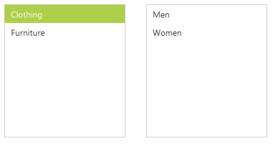

# Cascading 

We can dynamically populate data of a list box while selecting an item in another list box i.e. rendering child list box based on the item selection in parent list box. This can be achieved using “CascadeTo” property.

In the design page, add two list boxes and in code behind create data sources and assign it. The parent child relationship should be defined in data sources of both the list boxes. I.e. both data sources should contain a common field for mapping (just like [primary key and foreign key definitions](https://msdn.microsoft.com/en-IN/library/ms179610.aspx)).

The parent ListBox widget’s “CascadeTo” property should point to its child ListBox widget by specifying the id of the child ListBox widget. The child ListBox widget can be displayed with empty data on initialize by setting its “LoadDataOnInit” property as false.

N> In the above data source definition, the “CategoryId” column is act as a primary key to define the parent-child relationship.





        <!--parent listbox element-->
        <ej:ListBox ID="MainCategory" runat="server"></ej:ListBox>
    

    

        <!-- child listbox element-->
        <ej:ListBox ID="subCategoryList" runat="server"></ej:ListBox>
    

    





 protected void Page_Load(object sender, EventArgs e)
            {

                List<MainCategory> category = new List<MainCategory>();
                category.Add(new MainCategory { CategoryId = 'a', Text = "Clothing" });
                category.Add(new MainCategory { CategoryId = 'b', Text = "Furniture" });

                List<SubCategory> subCategory = new List<SubCategory>();
                subCategory.Add(new SubCategory { SubCategoryId = 11, CategoryId = 'a', Text = "Men" });
                subCategory.Add(new SubCategory { SubCategoryId = 12, CategoryId = 'a', Text = "Women" });
                subCategory.Add(new SubCategory { SubCategoryId = 13, CategoryId = 'b', Text = "Home furniture" });
                subCategory.Add(new SubCategory { SubCategoryId = 14, CategoryId = 'b', Text = "Bedding" });

                MainCategory.DataSource = category;
                MainCategory.DataValueField = "CategoryId";
                MainCategory.CascadeTo = "LayoutSection_subCategoryList";

                subcategoryList.DataSource = subCategory;
                subcategoryList.LoadDataOnInit = false;
            }
        }
        public class MainCategory
        {
            public string Text;
            public char CategoryId;
        }
        public class SubCategory
        {
            public string Text;
            public char CategoryId;
            public int SubCategoryId;
        }
   




## Multilevel cascading

Please refer the below code snippets which is expanded from the above example, to achieve multi-level (three level here) cascading of the ListBox widgets.

In the design page, add four list boxes and create the data sources for the list boxes and assign it.

In the code behind add the below codes.





        <!--parent listbox element-->
        <ej:ListBox ID="MainCategory" runat="server"></ej:ListBox>
    

    

        <!-- First level child listbox element-->
        <ej:ListBox ID="subCategoryList" runat="server"></ej:ListBox>
    

    

        <!-- second level child listbox element-->
        <ej:ListBox ID="productList" runat="server"></ej:ListBox>
    

    

        <!-- second level child listbox element-->
        <ej:ListBox ID="subProductList" runat="server"></ej:ListBox>
    

    





public partial class Cascading : System.Web.UI.Page
    {
        protected void Page_Load(object sender, EventArgs e)
        {

            List<MainCategory> category = new List<MainCategory>();

            category.Add(new MainCategory { CategoryId = 'a', Text = "Clothing" });
            category.Add(new MainCategory { CategoryId = 'b', Text = "Furniture" });

            List<SubCategory> subCategory = new List<SubCategory>();
            subCategory.Add(new SubCategory { SubCategoryId = 11, CategoryId = 'a', Text = "Men" });
            subCategory.Add(new SubCategory { SubCategoryId = 12, CategoryId = 'a', Text = "Women" });
            subCategory.Add(new SubCategory { SubCategoryId = 13, CategoryId = 'b', Text = "Home furniture" });
            subCategory.Add(new SubCategory { SubCategoryId = 14, CategoryId = 'b', Text = "Bedding" });

            List<ProductList> productList = new List<ProductList>();
            productList.Add(new ProductList { SubCategoryId = 11, ProductId = 101, Text = "men shirts" });
            productList.Add(new ProductList { SubCategoryId = 11, ProductId = 102, Text = "men pants" });
            productList.Add(new ProductList { SubCategoryId = 12, ProductId = 103, Text = "Women shirts" });
            productList.Add(new ProductList { SubCategoryId = 12, ProductId = 104, Text = "Women pants" });
            productList.Add(new ProductList { SubCategoryId = 13, ProductId = 105, Text = "sofa" });
            productList.Add(new ProductList { SubCategoryId = 13, ProductId = 106, Text = "chairs" });
            productList.Add(new ProductList { SubCategoryId = 14, ProductId = 107, Text = "bedsheets" });
            productList.Add(new ProductList { SubCategoryId = 14, ProductId = 108, Text = "pillows" });

            List<SubProductList> subProductList = new List<SubProductList>();
            subProductList.Add(new SubProductList { ProductId = 101, Text = "red men shirts" });
            subProductList.Add(new SubProductList { ProductId = 101, Text = "blue men shirts" });
            subProductList.Add(new SubProductList { ProductId = 102, Text = "red men pants" });
            subProductList.Add(new SubProductList { ProductId = 102, Text = "blue men pants" });
            subProductList.Add(new SubProductList { ProductId = 103, Text = "red Women shirts" });
            subProductList.Add(new SubProductList { ProductId = 103, Text = "blue Women shirts" });
            subProductList.Add(new SubProductList { ProductId = 104, Text = "red Women pants" });
            subProductList.Add(new SubProductList { ProductId = 104, Text = "blue Women pants" });
            subProductList.Add(new SubProductList { ProductId = 105, Text = "red sofa" });
            subProductList.Add(new SubProductList { ProductId = 105, Text = "blue sofa" });
            subProductList.Add(new SubProductList { ProductId = 106, Text = "red chairs" });
            subProductList.Add(new SubProductList { ProductId = 106, Text = "blue chairs" });
            subProductList.Add(new SubProductList { ProductId = 107, Text = "blue bedsheets" });
            subProductList.Add(new SubProductList { ProductId = 107, Text = "red bedsheets" });
            subProductList.Add(new SubProductList { ProductId = 108, Text = "red pillows" });
            subProductList.Add(new SubProductList { ProductId = 108, Text = "blue pillows" });

            MainCategory.DataSource = category;
            MainCategory.DataValueField = "CategoryId";
            MainCategory.CascadeTo = "LayoutSection_subCategoryList";

            subcategoryList.DataSource = subCategory;
            subcategoryList.LoadDataOnInit = false;
            subcategoryList.DataValueField = "SubCategoryId";
            subcategoryList.CascadeTo = "LayoutSection_productList";

            productList.DataSource = productList;
            productList.LoadDataOnInit = false;
            productList.DataValueField = "ProductId";
            productList.CascadeTo = "LayoutSection_subProductList";

            subProductList.DataSource = subProductList;
            subProductList.LoadDataOnInit = false;
        }
    }
    public class MainCategory
    {
        public string Text;
        public char CategoryId;
    }
    public class SubCategory
    {
        public string Text;
        public char CategoryId;
        public int SubCategoryId;
    }
    public class ProductList
    {
        public string Text;
        public int ProductId;
        public int SubCategoryId;
    }
    public class SubProductList
    {
        public string Text;
        public int ProductId;
    }





