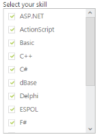

# Checkbox Support

## Show Checkbox 

You can enable the checkbox in the ListBox with this property. The data type of ShowCheckbox value is Boolean type. It maintains multiple selections and gets the checked items on its ListBox client side events.  

Defining the Checkbox support

The following steps explain you the configuration of checkbox options in ListBox.

In an ASPX page, add an element to configure ListBox.



    

        Select a skill

    <ej:listbox id="listboxsample" DataTextField="Name" ShowCheckbox="true" runat="server" Width="240"></ej:listbox>





protected void Page_Load(object sender, EventArgs e)

        {

            listboxsample.DataSource = GetData();

        }

        private List<Languages> GetData()

        {

            List<Languages> data = new List<Languages>();

            data.Add(new Languages() { Name = "ASP.NET" });

            data.Add(new Languages() { Name = "ActionScript" });

            data.Add(new Languages() { Name = "Basic" });

            data.Add(new Languages() { Name = "C++" });

            data.Add(new Languages() { Name = "C#" });

            data.Add(new Languages() { Name = "dBase" });

            data.Add(new Languages() { Name = "Delphi" });

            data.Add(new Languages() { Name = "ESPOL" });

            data.Add(new Languages() { Name = "F#" });

            data.Add(new Languages() { Name = "FoxPro" });

            data.Add(new Languages() { Name = "Java" });

            data.Add(new Languages() { Name = "J#" });

            data.Add(new Languages() { Name = "Lisp" });

            data.Add(new Languages() { Name = "Logo" });

            data.Add(new Languages() { Name = "PHP" });

            return data;

        }

        public class Languages

        {

            public string Name;

        }



Output of the above steps.

 

## Check All 

You can check all the check box in the list by using this property. The data type of CheckAll is Boolean type. To achieve this, set ShowCheckbox property as true.

The following steps explains you the configuration of checkbox options in ListBox.

In an ASPX page, add an element to configure ListBox.



     
Select Your skill

<ej:listbox id="listboxsample" DataTextField="Name" ShowCheckbox="true" CheckAll="true" runat="server" Width="240"></ej:listbox>





protected void Page_Load(object sender, EventArgs e)

        {

            listboxsample.DataSource = GetData();

        }

        private List<Languages> GetData()

        {

            List<Languages> data = new List<Languages>();

            data.Add(new Languages() { Name = "ASP.NET" });

            data.Add(new Languages() { Name = "ActionScript" });

            data.Add(new Languages() { Name = "Basic" });

            data.Add(new Languages() { Name = "C++" });

            data.Add(new Languages() { Name = "C#" });

            data.Add(new Languages() { Name = "dBase" });

            data.Add(new Languages() { Name = "Delphi" });

            data.Add(new Languages() { Name = "ESPOL" });

            data.Add(new Languages() { Name = "F#" });

            data.Add(new Languages() { Name = "FoxPro" });

            data.Add(new Languages() { Name = "Java" });

            data.Add(new Languages() { Name = "J#" });

            data.Add(new Languages() { Name = "Lisp" });

            data.Add(new Languages() { Name = "Logo" });

            data.Add(new Languages() { Name = "PHP" });

            return data;

        }

        public class Languages

        {

            public string Name;

        }



Output of the above steps.

 

## Uncheck All

You can uncheck all the check box in the list by using this property. The data type of UnCheckAll is Boolean type. To achieve this, set ShowCheckbox property as true.

